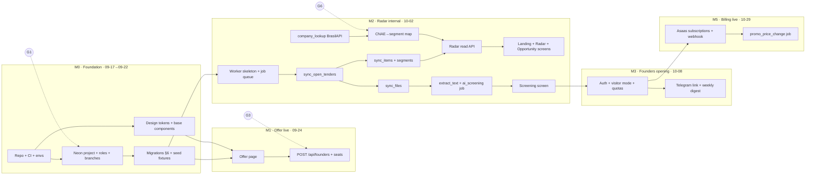

# LicitaQui · Development Plan

> Version 0.3 · 2026-09-17 · companion to `TECHNICAL_SPEC.md` (v0.4) and the viability study (v10)
> Team: **one developer (Sci) + Claude Code agents**, 40+ h/week. Dates follow the Phase 0 schedule in the study.

---

## 1. Are we ready to start?

**Yes — development can start today.** Architecture, data model, UI, brand, prices and the core logic (PNCP collection, AI reading with answer keys) already exist. What is missing is a short list of decisions, accounts and one real product gap. None blocks day 1, but each blocks a specific milestone, so each has a due date.

### 1.1 What we already have

| Area | Artifact | Status |
|---|---|---|
| Architecture, data model, API, cache, security | `TECHNICAL_SPEC.md` | ✅ ready |
| UI (9 mobile screens + 5 web boards + design system) | "Wireframes LicitaQui" canvas | ✅ approved |
| Brand (symbol, wordmark, PWA icons, bot avatar) | `Marca/assest/` | ✅ ready |
| Offer and Landing (copy + layout) | `paginas/oferta_fundadores.html`, `paginas/landing_radar.html` | ✅ preview, to port to Next.js |
| PNCP search, items, files, download, circuit breaker | `poc1_licitacoes.py` | ✅ validated on real data |
| Awards (winners) and discount bands | `poc3_resultados.py`, `poc3_categorias.py` | ✅ validated |
| Keyword/NCM segmentation (14 segments) + false positives | `poc1_licitacoes.py` | ✅ validated |
| AI screening (lite) and deep analysis, citation check, rules in code | `poc4_ia_edital.py` | ✅ 57/58 and 68/69 on answer keys |
| Evaluation harness + 3 answer keys | `poc4_avaliar.py`, `gabaritos/` | ✅ ready for CI |
| Prices, quotas, unit economics, Phase 0 gates | viability study v10 | ✅ decided |

### 1.2 Decisions and gaps (status on 09-17)

**Decided today:** Neon through the Vercel Marketplace, as a new project (new Vercel database resource) · EC2/Easypanel unchanged, no new cost · Resend test sender during development · WhatsApp via Evolution API and Telegram connected during development · Vercel URL for now (no domain) · GitHub/Vercel org `scintechn`, Sentry, OpenRouter and Asaas (sandbox + production) already exist · existing Telegram bot used temporarily · login by email link + Google · 5 screenings/month on Básico · visitor limit counted per device and per CNPJ · customer invoices (NF) decided later.

| # | Item | Type | Blocks | Status / default | Due |
|---|---|---|---|---|---|
| G1 | Neon via Vercel: Storage → Create database → Neon, **Free** plan, region closest to users and functions (São Paulo if offered, else N. Virginia; cannot be changed later); roles `app` and `migrator` | account | M0 foundation | ✅ decided · create | **09-18** |
| G2 | Email: Resend. **The sending domain is verified** (legal brief §1, 21/09), which was the one condition U1 gated magic-link sign-in on — so the gap is closed and the flag was never flipped | account | email to real users (magic link, welcome, opening) | ✅ domain verified. **Magic link is built and switched off**: see card U2 | **now** — without it, "I do not want a Google account" means "I cannot have an account" |
| G3 | Privacy policy + Terms of use, incl. LGPD consent and the **Promocional price-change clause** (R$ 26 → R$ 57 in month 7, 30-day notice) | legal | M1 Offer live | Open — no default | **09-23** |
| G4 | Accounts: new OpenRouter API key with spend cap; new Sentry projects (`licitaqui-web`, `licitaqui-worker`); Vercel project in `scintechn` (Pro); GitHub repo `scintechn/licitaqui`; Asaas sandbox keys in Vercel preview, production keys only in production | accounts | M0–M1 | Mostly ✅ (accounts exist) · create keys/projects | **09-19** |
| G5 | **Rotate** the Mercado Livre and SearchApi keys exposed in earlier sessions | security | before any production deploy | Open | **09-21** |
| G6 | **CNAE → segment map does not exist.** POCs classify *items* into 14 segments by NCM/keywords; nothing maps a company's CNAEs to those segments, so "Compatível / Verificar" cannot be computed yet | product gap | M2 Radar | Task B6 (seed table + review) | **10-01** |
| G7 | Spike: PNCP period endpoints (`/v1/contratacoes/publicacao`, `/atualizacao`) vs. the search API used in the POCs | technical | M2 sync design | ✅ **Resolved 09-17 — default overturned.** B2 builds on `/v1/contratacoes/atualizacao`, search sweep as fallback behind the §7.2 breaker. Rationale and measurements: `docs/adr/0001-pncp-incremental-sync-endpoint.md` | done |
| G8 | Spike: BrasilAPI CNPJ (fields, rate limits, failure rate) | technical | M2 CNPJ entry | ✅ **Resolved 09-17.** Use BrasilAPI; keep manual CNAE entry as a tested fallback, not a rescue. 45 real supplier CNPJs, 0 failures, 0.52 s median, CNAE 45/45. Rate limit **unmeasured** (the burst hit Vercel's edge cache) → keep lookups single-threaded. `docs/adr/0002-cnpj-lookup-via-brasilapi.md` | done |
| G9 | Telegram (existing bot, temporary) and WhatsApp (**Evolution API** on Easypanel): connected during development. A Telegram bot has a single webhook URL, so check the bot is not serving another system when connecting it | integration | M1 WhatsApp welcome, M3 Telegram linking | ✅ decided · tasks E1, E2 | E2 by 09-26 · E1 by 10-07 |
| G10 | Message texts: founders welcome, founders opening (email + WhatsApp), Telegram `/start` flow, weekly digest, 30-day price notice, payment confirmation | content | M1, M3, M5 | Open — task E0: Claude drafts, Sci approves | **10-05** |
| G11 | Screens not in the canvas: magic-link sent, error/"PNCP unavailable", cancel subscription, `/admin` (gates, founders list, concierge digest builder) | design | M3–M5 | Build from design-system components without a new canvas round | as built |
| G12 | Asaas production: company data, bank account, webhook URL (Vercel URL), production API key | account | M5 billing live | ✅ account exists · configure | **10-20** |
| G13 | Customer invoices (NF) | legal/tax | not blocking Phase 0 | Later, with the accountant; no invoice promise in the product | — |
| G14 | Stay inside Neon Free (0.5 GB, 100 CU-hours): worker polls every 2 min + `/wake`, files in S3, usage shown in `/admin` with 80% alerts | technical | none (no cost change expected) | ✅ built into A2, B1, O1 | ongoing |

---

## 2. How one person + Claude Code runs parallel work

1. **Contracts first.** Parallel agents only work if they share fixed contracts: the DB schema (migrations), the job table, and TypeScript types for API responses. Milestone M0 delivers these before any feature work.
2. **One stream = one git worktree = one Claude Code agent.** Each agent gets a task card (section 5) with inputs, acceptance criteria and the files it owns. Agents never edit files owned by another stream in the same cycle.
3. **Max 3 agents at a time.** The bottleneck is your review, not code generation. Queue the rest.
4. **Trunk-based, small PRs.** Every PR: CI green (lint, types, tests), preview deploy checked on a phone, merged the same day. No long-lived branches.
5. **Shared fixtures.** The 3 answer-key tenders (`gabaritos/`) plus 20 cached PNCP responses become the seed data for local dev, tests and previews, so web work never waits for the worker.
6. **You own:** decisions (section 1.2), reviews, production deploys, secrets, anything with money or legal text, and the non-dev track (influencers, interviews, concierge).

### Suggested `CLAUDE.md` for the repo

```markdown
# LicitaQui — agent guide
- Read docs/TECHNICAL_SPEC.md and docs/DEVELOPMENT_PLAN.md before any task. The task card is the scope; do not widen it.
- Code, identifiers, tables, commits: English. User-facing copy: Brazilian Portuguese in apps/web/messages/pt-BR.json.
- Never read PNCP/BrasilAPI/OpenRouter inside a web request; enqueue a job (spec §3).
- Never commit secrets. Use .env.example. Never log CPF, emails or tokens.
- Every change: tests for new logic, `pnpm lint && pnpm typecheck && pnpm test` (web) or `ruff && pytest` (worker) green.
- Schema changes only via db/migrations, in their own PR.
- AI prompt or extraction changes must run `worker/evaluation` and report the score diff.
- Design: use tokens from apps/web/styles/tokens.css (Ivory/Graphite/Blue, Archivo/IBM Plex). Brand name is always "LicitaQui".
```

---

## 3. Critical path and dependencies



**Critical path (anything late here moves 10-08):** A1 → A2 → A3 → B1 → B2 → B3 + B6 → R1 → D3 → C1 → D4 → U1 → E1.

**Safe to run in parallel with the critical path:** design tokens/components (D1), Offer page (D2/F1), BrasilAPI + CNAE map (B5/B6), AI job port (C1, against fixtures), email/Telegram texts (G10), `/admin` events (O1), and — from October — the awards backfill (B8), which needs weeks of collection before the Essencial price bands are meaningful.

---

## 4. Milestones

| Milestone | Date | Ships | Exit criteria |
|---|---|---|---|
| **M0 Foundation** | Tue 09-22 | Monorepo, CI, Vercel preview + prod on the `vercel.app` URL, Neon project with `main`/`dev` and preview branches, all migrations from spec §6, seed fixtures, design tokens | `pnpm dev` runs locally against the Neon `dev` branch with seeded tenders; a PR gets a preview URL with its own Neon branch; point-in-time restore tested on a branch |
| **M1 Offer live** | Thu 09-24 | Founders page on the Vercel URL, seat counter (48), consent, on-screen confirmation, events `offer_viewed`/`founder_signed_up`; WhatsApp welcome via Evolution API by 09-26 (E2) | 48-seat race test passes; privacy policy linked; signup lands in DB; welcome delivered to opted-in founders |
| **M2 Radar (internal)** | Fri 10-02 | Worker in production syncing open tenders every 30 min; CNPJ → CNAE → segments; Landing, Radar (Compatível/Verificar/Palavra-chave), Opportunity, AI Screening (visitor, 2 free) | Real CNPJs return plausible lists; screening of the 3 answer-key tenders scores ≥ 95% in CI; no request waits on PNCP |
| **M3 Founders opening** | Thu 10-08, 19:00 | Opening notice by WhatsApp (Evolution API); accounts (Google **and** magic link — the domain is verified, so **U2** turns it on; without it there is no account for anyone who refuses Google), visitor 3-day/2-screening limits, files unlocked with account, Telegram linking (**E3** — the journey is a launch blocker: linking silently fails for anyone who already has a chat with the bot), weekly digest job, `/admin` gate dashboard | Founders receive access email; Telegram `/start` links in one tap; quotas enforced server-side |
| **M4 Public Landing** | Tue 10-13 | Hardening: rate limits, error states, SEO for public pages, PWA install, uptime monitors | Load test (100 concurrent visitors) without errors; Lighthouse mobile ≥ 90 |
| **M5 Billing live** | Thu 10-29 (sandbox done 10-23) | Asaas subscriptions (Promocional R$ 26, Essencial R$ 57) on sandbox then production, checkout link, idempotent webhook, `promo_ends_on` + 30-day notice + automatic change to R$ 57, 1-click cancel, **every billing message ours** (F4): reminder 3 days before each charge, payment-failed and suspension notices — Asaas customer notifications stay off | Full sandbox cycle incl. repeated webhooks and price change simulated with a clock override; exactly one reminder per charge cycle and none for a cancelled subscription; subscription link sent to the 48 founders |
| **M6 Gate 0** | Fri 11-06 | Numbers from `/admin` | See study: ≥ 150 founders signed up, ≥ 300 CNPJs, ≥ 100 Telegram, ≥ 6/20 concierge paying, ≥ 15/48 seats paid, ≥ 50% digest opens |
| **v1 Essencial** | build 11-09 → 01-08 · release **Mon 2027-01-11** | Winning price band by state, target purchase price + margin calculator, daily alerts (10 keywords + CNAE), ME/EPP and value filters, deep analysis with quota, billing: plan management and invoices list (the 3-day charge reminder ships earlier, in M5 — task F4) | Gate 1: ≥ 15 paying Essencial-equivalents, month-1 churn < 10% |
| **v2 Pro** | build 01-11 → 02-26 · release **Mon 2027-03-01** | Competitors (name, CNPJ), market price (SearchApi), opportunity score, WhatsApp alerts + triggers, OCR | Gate 2: ≥ 25% of base on Pro, AI cost ≤ R$ 11 per Pro user |

---

## 5. Task cards (Phase 0)

Legend — **Stream**: A Platform · B Data/worker · C AI · D Web · E Messaging · F Billing · O Ops/admin · S Sci only.
**Size** is agent-days of focused work including your review. **∥** = can run in parallel with the other ∥ tasks of the same week.

### Week 0–1 · 09-17 → 09-24 (M0, M1)

| ID | Stream | Task | Depends on | ∥ | Size | Acceptance criteria |
|---|---|---|---|---|---|---|
| S1 | S | Close G1 (EC2 region → Neon project), G4, G5, G9; start G2 and G3 | — | ∥ | — | Neon project in the right region; new keys created; old keys revoked |
| A1 | A | Repo `scintechn/licitaqui`: monorepo (`apps/web`, `worker`, `db`, `docs`), pnpm, ruff, CI workflows, `.env.example`, `CLAUDE.md`, secret scanning; Vercel project (Root Directory `apps/web`), Sentry DSNs | — | ∥ | 1 | CI green on an empty PR; preview deploy URL on `vercel.app` |
| A2 | A | Neon via Vercel Storage: database `licitaqui` (region per G1, Free plan), roles `app`/`migrator`, extensions (`unaccent`, `pg_trgm`, `citext`); `DATABASE_URL` in Vercel, `DATABASE_URL_UNPOOLED` in Easypanel and GitHub secrets; preview branching + GitHub Action deleting the branch on PR close (or one shared `preview` branch); `dev` branch; weekly `pg_dump` to S3 job stub | G1 | | 0.5 | Preview deploy uses a preview branch that disappears when the PR closes; restore of a test table on a branch works |
| A3 | A | Migrations for spec §6.1–6.3 (tenders, items, files, awards, companies, visitors, users, plan_limits, usage, ai_analyses, telegram_links, alerts, subscriptions incl. `promo_ends_on`, founders_list, jobs, events) + seed from `gabaritos/` and 20 cached PNCP responses | A2 | | 1.5 | `db:migrate` + `db:seed` idempotent; seed shows 20 tenders with items |
| D1 | D | Tailwind tokens from the design system, fonts (Archivo with width axis, IBM Plex), base components (Button, Field, Status, Tag, Card, AppBar, locked block, analyzing/empty states), logo component | A1 | ∥ | 1.5 | Storybook-like `/dev/components` page matches the canvas Design System board |
| D2 | D | Port Offer page to Next.js (`/fundadores`), static + ISR, remove preview banner | D1 | | 1 | Matches `paginas/oferta_fundadores.html` on 390 px and 1280 px |
| F1 | D | `POST /api/founders` (Zod, rate limit, seat assignment in a transaction), `GET /api/founders/seats`, confirmation screen with seat number, enqueue WhatsApp welcome (E2), events | A3, D2, G3 | | 1 | Concurrency test: 60 parallel signups → seats 1..48 unique, 12 on waitlist |
| O1 | O | `events` writer + `/admin` shell (auth by allowlist), founders table view, Neon usage card (storage, CU-hours, 80% alert) | A3 | ∥ | 0.5 | Sci can see signups and export CSV; usage card shows real numbers |
| E2 | E | WhatsApp via Evolution API: worker client, `send_whatsapp` job (opt-in only, ≈ 1 message / 20–30 s, retries, delivery log, "SAIR" opt-out), founders welcome template; `/admin` button for the opening broadcast | B1 (or a minimal job runner), E0 welcome text | ∥ | 1 | Welcome reaches 3 test numbers; opt-out stops further messages; no message without consent |
| S2 | S | Approve Offer copy; start influencer outreach and community posts once live | M1 | ∥ | — | — |

### Week 1–2 · 09-21 → 10-02 (M2)

| ID | Stream | Task | Depends on | ∥ | Size | Acceptance criteria |
|---|---|---|---|---|---|---|
| B0 | B | Spikes G7 (PNCP period endpoints) and G8 (BrasilAPI) with a short written result in `docs/adr/` | — | ∥ | 0.5 | ADR with recommendation and measured error rates |
| B1 | B | Worker skeleton: Dockerfile, psycopg, job consumer (`FOR UPDATE SKIP LOCKED`, idle poll every 2 min), authenticated `POST /wake`, scheduler, retries/backoff, circuit breaker, health endpoint, Sentry; deploy to Easypanel via GHCR | A3 | | 1.5 | Two consumers never run the same job; failing job retries 4× then `failed`; Neon compute suspends when idle; `/wake` picks a priority-1 job in < 5 s |
| B2 | B | `sync_open_tenders` ported from POC 1 (search by state × modality, upsert, change detection by `pncp_updated_at`) | B1, B0 | | 1.5 | Full SP sweep < 30 min; rerun creates 0 duplicates |
| B3 | B | `sync_items` + segments + false positives + ME/EPP summary + favored-treatment rule | B2 | ∥ | 1 | Unit tests reproduce POC 1 classification on fixtures |
| B4 | B | `sync_files` (list only; download on demand) | B2 | ∥ | 0.5 | Amendment adds a file and invalidates text/screening |
| B5 | B | `company_lookup` (BrasilAPI, 30-day cache, failure → manual CNAE flag) | B1, B0 | ∥ | 0.5 | 50 real CNPJs; failures surface the manual path |
| B6 | B | **CNAE → segment map (G6):** table `cnae_segments(cnae, segment, fit: compatible\|check)`; seed by Claude from the CNAE list (IBGE) against the 14 segments; Sci reviews the top 150 CNAEs used by MEI/ME retail and services | B5 | ∥ | 1.5 | 20 hand-picked CNPJs (papelaria, limpeza, TI, hospitalar…) classified as expected |
| C1 | C | Port POC 4 to `worker/licitaqui/ai_tender.py`: `extract_text`, page selection, lite prompt v2, citation check, rules; `ai_screening` job; cost logging; `evaluate-ai.yml` in CI | B1 (fixtures OK before B4) | ∥ | 2 | CI evaluation on 3 answer keys ≥ 95%; scanned PDF → `no_text`, no AI call |
| R1 | D | Read APIs: `POST /api/radar/cnpj`, `GET /api/radar/tenders`, `GET /api/tenders/:id`, `POST /api/tenders/:id/screening`, `GET /api/jobs/:id`; `readOrEnqueue()` with TTLs | A3, B3, B6 | | 1.5 | Contract tests on seed data; stale data served + refresh job enqueued |
| D3 | D | Landing (`/`), Radar, Opportunity screens (canvas 01–03) on seed data first, then real data | D1, R1 | | 2 | Visual match on 390 px; empty and analyzing states work |
| D4 | D | Screening screen (canvas 04) + locked price block (05) + visitor banner | D3, C1 | | 1 | Screening of a real tender renders with page references |
| D5 | D | **Canvas 09, the menu — designed, never carded, never built.** `docs/design/wireframes/Menu.dc.html` has existed since the design set was drawn and `grep -in 'menu\|navega\|hamburg' docs/DEVELOPMENT_PLAN.md` returns **nothing**: not a "later" left in a comment like `short_title`, but a whole screen that never became a task. `AppBar` takes `leading`, `title`, `actions` and renders nothing else — there is no drawer, no nav, no plan strip. **The cost is not cosmetic.** A signed-in person today cannot see, from any screen they actually use, what plan they are on, how many triagens are left this month, how many alerts they get, or even that they are signed in: that state lives only on `/conta`, which nothing links to from the Radar except a bare person icon. Canvas 09 puts all of it where people look — `PRINCIPAL` (Radar · Alertas · Minha empresa · Plano e pagamento), `CONTA` (Perfil · Ajuda), and a footer card reading `Plano Básico · 3 de 5 triagens usadas no mês · 1 alerta semanal` over a progress bar with `Conhecer o Essencial →`. The numbers are already computable — `readLimit` + `countUsage` per `quota.ts`, the same pair the triagem screen uses. **Sci asked to bring this forward (2026-09-24), ahead of the rest of the founders-page work, because it is the fix for a real gap rather than a polish item.** Watch three things the rest of the repo has already been bitten by: the drawer is a modal surface, so the dialog acceptance criteria written for B16 (focus trap, focus restoration, Escape, background inertness, scroll position restored on close) apply here **first** and should be built once and shared; the plan strip must render for a visitor as well, saying what a visitor has rather than nothing; and `components/tabs.tsx`'s `role="tablist"` problem is a warning about half-implemented ARIA patterns, not a precedent to copy | — | ∥ | 1 | The drawer opens from every app screen, keyboard and screen-reader complete against B16's dialog criteria; the footer card shows plan, triagens used of the limit, and alert cadence, for a signed-in user **and** for a visitor; every number comes from `plan_limits` rather than a literal; nothing in it is a second copy of a string that already exists in `pt-BR.json` |
| D6 | D | **`/fundadores` sells daily Telegram alerts that do not exist and that no plan entitles.** The page says *"toda semana no Básico, **todo dia no Essencial**"*. The scheduler holds exactly one digest — `ScheduleEntry(kind="weekly_digest", daily_at="07:00", weekday=0)`, Monday only — and there is no daily job of any kind in `worker/licitaqui/`. Worse, `plan_limits` carries an `alert` row for **`basico` alone** (`('basico','alert','week',1)`), and `readLimit`'s own comment says *"No row: the plan does not include the feature. Not 'unlimited'."* — so an Essencial subscriber resolves to **zero** alerts **in the web**. **Correction, 2026-09-24 — the original card overstated this and the migration records why:** the worker reads the same absence the *other* way. `telegram_alerts.py:50-57` treats a missing cap as **uncapped** for the weekly digest, deliberately, "because reading a missing row as zero would silence every founder on `promocional` on opening week", and logs `plan has no alert limit` so the gap stays visible. So **no paid subscriber has ever been silenced** — what broke is that the *web* displays zero, which canvas 09's plan strip printed as "sem alertas neste plano" the moment `FEATURES.alert` gave it a row to read. **And the page was not inventing the cadence.** §10 line 382 defines a `daily_alerts` job (every day 07:00 BRT, Essencial) and line 455 gives Essencial "daily, 10 keywords + CNAE" — marked **new**, listed under a later phase at line 570, while Phase 0's scope at line 563 is "Telegram linking, **weekly alert**. Founders opening 10-08". So `/fundadores` was describing the roadmap while selling Phase 0 access. CDC art. 30 still binds an advertised feature, which is why the copy moves to what a founder actually receives on 08/10 — not because the claim was invented. Two halves, and the copy half is the urgent one: (a) the sentence must describe what exists — drafted for Sci 2026-09-24, and it is his under legal brief §5; (b) `plan_limits` needs `alert` rows for `promocional`, `essencial` and `pro` whatever the cadence turns out to be, or a paid subscriber silently gets nothing. Do **not** ship a daily digest to satisfy the sentence without deciding the cadence deliberately: a daily message is a different product promise from a weekly one, and §7.1 wrote the weekly one on purpose | — | ∥ | 0.5 | The page describes the cadence the scheduler actually runs; `plan_limits` has an `alert` row for every paid plan; a test reads the page's cadence claim against `plan_limits` rather than against a literal, so the two cannot drift again |
| D7 | D | **"Acesso antes de todos" points at the wrong feature.** `/fundadores` says *"Você usa o Radar **antes da abertura pública**"* — but the Radar is public right now at `/radar`, with no account, two free triagens and a three-day window. Whatever a founder is buying, early access to the Radar is not it. **Sci, 2026-09-24: the real prime feature is the price range — the band the winners actually closed at, and the maximum to pay a supplier to keep a margin.** That is `Preco.dc.html` / `price-view.tsx`, it is Essencial, and today it renders entirely as `LockedValue` bars. So the benefit the page should name is the one the founder price unlocks, not a screen anyone can already open. Copy is Sci's (§5); draft supplied 2026-09-24. Note the related finding from the persona walkthrough: the price screen promises three numbers in its intro and shows none of them, with the one genuinely useful thing — the papel A4 worked example — below both locked cards | D6 | ∥ | 0.25 | No sentence on `/fundadores` offers early access to something already public; the founder benefit names the price range; the claim matches what Essencial actually unlocks |
| D8 | D | **Two promises on `/fundadores` with no machinery: "cancela em 1 clique" and "aviso 3 dias antes de cada cobrança".** Both sit in the comparison table as differentiators against competitors charging from R$ 397/mês. Neither exists: there is no cancel flow under `apps/web/app/conta`, no billing-reminder job kind in the worker, and no scheduler entry for one. **Sci, 2026-09-24: not built yet, and it belongs in the next phase, before the paid moment starts.** So this is a build-before-the-date item rather than a live falsehood — billing does not open until 08/10 — but the page is taking sign-ups on those two sentences today, and CDC art. 30 binds from the moment the claim is published, not from the moment money moves. The cancel path is also the other half of a promise already made in `billing.cancel.body` ("Sua conta volta para o plano Básico"), which describes a flow nothing implements. Sequence it with F-stream billing, not after it | F2 | | 1 | Cancelling is one action from `/conta`, with no confirmation maze, and moves the account to Básico exactly as `billing.cancel.body` says; a reminder reaches the subscriber three days before each charge; both are live before the first real charge, not before the first sign-up |
| E0 | E | Draft all email, WhatsApp and Telegram texts (G10) in `messages/pt-BR.json` and `worker/templates/` (welcome and opening first) | — | ∥ | 0.5 | Sci approves |
| D9 | D | **Three `foundersPage.ruler.*` strings no longer render, and only Sci can delete them.** The price example on `/fundadores` was a bar with four marks on a R$ 10 – R$ 40 scale; it is now a chain of four labelled steps, because at 390px the green "still profitable" zone measured **47px of 308** and `R$ 14,60` — the number the product exists to produce — was set at 16px against a competitor's 34px. The chain renders `tender`, `winner`, `retail` and `maxPurchase` with their values, and the verdict keeps `verdictLead`/`verdictBody`. What it has no place for is the three strings that described the *ruler*: **`alt`** ("Régua de preço: …", the `aria-label` of a `role="img"` that no longer exists — the chain is real text and reads in order without it), and **`scaleStart`** / **`scaleEnd`** ("R$ 10" and "R$ 40", the endpoints of an axis that is gone). They are left in the catalogue deliberately: copy on this page is the founder's under the legal brief (§5), and deleting a string is not a rendering change. This is the same shape as `radar.list.changeCompany` — approved copy rendered nowhere — so it gets a card rather than a sentence in a comment. Nothing is broken while they sit there; the cost is a catalogue that overstates what ships | — | ∥ | 0.1 | Sci confirms the three strings are no longer wanted and they leave `pt-BR.json`, or says to keep them and the reason is recorded here |
| D10 | D | **(a) is delivered** by `feat/founders-layout` (the commit *"say whose price each column holds when the table stops being one"*): the `<thead>` goes to `display:none` below 560px and the two inline labels lose `aria-hidden`, so each value is announced with the name of its column; asserted by a journey at 390px that reads the accessibility tree, not the markup. **(b) and (c) remain open.** **Three accessibility defects in the brand panel shipped by PR #99, found by review afterwards.** All three are on `main` now; the founders-structure PR (#101) touches none of them, which is why they are a card and not a fix there. **(a) The comparison table loses its column headers below 559px.** `page.tsx` sets `display:block` on `table`/`tbody`/`tr`/`td` to stack it, which strips the implicit table roles in every major browser, so the `<th scope="col">` ↔ `<td>` association does not survive — and the visible substitutes that replace them are `aria-hidden`. Measured in Chromium at 390px. A screen-reader user at phone width therefore hears *"Preço de entrada / a partir de R$ 397/mês / R$ 26/mês"* with **nothing saying which is the competitor and which is ours**, on the block whose entire purpose is that comparison, on a page taking money. It is a regression: before #99 the table kept its semantics at every width. The guarding test asserts only that the two stacking classes are present — the classes that *cause* it — so it cannot fail for this. Fix: explicit `role="table"/"rowgroup"/"row"/"cell"/"columnheader"` on the stacked elements, or drop `aria-hidden` from the inline labels so they carry the association. **(b) Three contrast justifications name pairs nothing paints.** Recomputed with the formula `styles/contrast.test.ts` uses: the comment says the graphite faint tier is "3.22:1" on the panel (it is **5.51:1**) and that `blue-on-ink` is "2.71:1 and invisible" (it is **5.69:1** — *higher* than the 5.06:1 replacement). Those two figures are the `#2457d6` arithmetic from a different background. And `--color-icon-on-brand` is annotated `5.06:1`, which is against the panel, while the icon is painted on `brand-raised`, where it measures **3.82:1** — exactly the mistake `contrast.test.ts`'s own header exists to prevent. The swap is still right on the numbers; the recorded reasons are wrong. **(c) `contrast.test.ts` never saw this ramp.** `PAIRS` still guards `on-ink`/`on-ink-muted` against `ink`, which nothing paints any more, and none of the four live `on-brand*` pairs — nor `icon-on-brand` on `brand-raised` — is in any test. Also worth a decision, not a default: the global focus ring is `--color-blue`, which was 2.91:1 on the old graphite panel and is **1.87:1** on `brand-panel`, and the panel's CTA is the only focusable thing on it | — | ∥ | 0.5 | The stacked comparison table announces which column each value belongs to, verified with a screen reader at 390px; every contrast figure in a comment or token annotation names the surface the colour is actually painted on; `contrast.test.ts` guards the four `on-brand*` pairs and `icon-on-brand` on `brand-raised`; the focus ring on the brand panel is measured and either changed or accepted in writing |
| D11 | D | **The Landing's example goes stale on 30/09.** *(Scope changed 2026-09-24: `ExampleRadar` was removed from `/fundadores` when the hero took the product shot, so this is now the Landing's alone — `app/(public)/page.tsx:241`. The date is unchanged.)* **The example goes stale eight days before the founders page's own opening.** `lib/radar/landing-example.ts` freezes `EXAMPLE_NOW` at 2026-09-17 and all three tenders close on **2026-09-30** (BRT), so every card renders `13 dias` and `Proposta até 30/09 · 08:30` permanently. From **01/10** the hero of the page taking founder sign-ups shows three tenders whose stated deadline has passed, each under a countdown — and the founders list opens to the product on 08/10, so the whole final week runs in that state. Pre-existing `ExampleRadar` behaviour, and the caption does disclose *como estavam em 17/09/2026* (verified rendered and visible at every width); PR #101 promoted it into the hero of the conversion page and this PR removed it from there again, so the exposure is back to the Landing only — where it is still the first product a visitor sees. Refreeze the example on later tenders, or pick ones already closed so the caption and the cards agree. **Has a hard date: do it before 30/09.** | D10 | ∥ | 0.5 | On 01/10 the `/fundadores` hero shows no tender whose stated proposal deadline has passed while a countdown says days remain |
| D12 | D | **The page now makes the same claims three times, and the trust row drops half of two approved sentences.** `hero.promises` (four bullets) → the new `Trust` row (the same first three, longer bodies) → `Pillars` (all four again) — the first two are both within the first screen and a half at 900px. Worse than the repetition: `Trust` renders `item.title` + `item.body` and **omits `item.plan`**, so the first product claims a visitor meets carry no plan attribution — the AI reading loses **`Básico com limite`** and the price band loses **`Essencial`**. A founder is not over-promised (the offer is "tudo do Essencial"), but the page is public and the strings are approved copy under the legal brief, so dropping half of a sentence is a copy decision, not a rendering one. Nothing asserts either presence or absence. **Sci decides** which of the two sections carries these sentences and whether the plan tag travels with them; §5 means the wording itself is his either way. | D10 | ∥ | 0.25 | Each approved pillar sentence appears once on the page, with whatever plan attribution Sci decides, and a test holds it there |
| D13 | D | **`/fundadores` layout pass — five sections, against an approved design draft.** Layout only; no user-facing string written, changed or moved between sections, and `messages/pt-BR.json` untouched. `SectionHead` gains an opt-in `aside` (heading left at ~45%, the section's supporting material right, one column below 900px) with the 720px stack unchanged as the default. `Pain` becomes a numbered `<ol>` with an icon per item and `01/02/03` in mono, and its two market figures move into the heading's second column. `Pillars` becomes one bordered band with hairline dividers instead of four cards, keeping all four items and their plan labels. `Timeline` gets the icon box, the numeral and `arrowRight` between consecutive steps (decorative, absent below 900px); `clock` and `link` added to `icon.tsx`. `FounderValue` raises the price benefit to `--text-stat`, gives the rest check glyphs and moves the full-width CTA under the offer. **The draft's dark green is not taken** — green is `success` in this product — and no type token is added or changed: `--text-section` stays 26→38px and only the measure narrows. | D2, D9, D12 | | 1 | No string added, removed or relocated (asserted by diffing the rendered catalogue references against the base). `scrollWidth == clientWidth` at 390, 440, 560, 700, 900 and 1280 with nothing crossing either edge. The pillars band draws the right dividers at all three tiers, asserted from computed style at 390/700/1280 — the 560–899 tier is where the first attempt was wrong. Keyboard focus reaches the panel's CTA; the FAQ accordion and the skip link still work. **Open for Sci:** the draft shows `R$ 57` struck through under the price and `founderValue` has no standalone string for it (the R$ 57 is inside `benefits[0].body`), so it was not built — it needs a catalogue decision, not a layout one. |
| D14 | D | **Approved copy that stopped rendering when `/fundadores` took the draft's shape — none of it deleted, because §5 makes the wording Sci's.** Seven keys, by path. **(a) `foundersPage.pillars.title`** — *"Da busca à proposta, com a conta feita."* — was the `<h2>` of the four-card *O que você vai usar* section. That section is gone: its four claims are the band under the hero, which carries no heading of its own because it sits above the page's first `<h2>` (an `<h3>` per cell would take the outline from `h1` straight to `h3`). `pillars.label` still renders, in the header's anchor nav, and `#tool` now points at the band. **(b) `foundersPage.pillars.items[0..3].title`** — *Encontrar*, *Entender*, *Ofertar com lucro*, *Antes do prazo* — the band titles each cell with `hero.promises[i]` instead, which is the descriptive line the draft shows (*"Editais compatíveis com o seu CNAE"*) against a bare verb. Their bodies and plan labels do still render, in that band. Note that *Encontrar* and *Entender* reappear on the page from **`pain.items[0..1].title`**, which Sci rewrote the same day: the strings are on screen, the `pillars` keys are not. **(c) `foundersPage.pain.facts[0..1]`** (value + label) **and `foundersPage.pain.source`** — the heading's second column now holds `pain.standfirst`, which Sci wrote for that position. **`R$ 272,6 bi` was the page's only statement of market size and it is sourced**; after this it appears nowhere. The competitor anchor is not lost — `R$ 397/mês` survives in `founderValue.comparisonRows` (*"Preço de entrada · a partir de R$ 397/mês"*), rendered in the offer panel; `pain.source` names both provenances, so if the figures come back the source line comes with them. Nothing here is a rendering bug: each string is intact in `messages/pt-BR.json` and a decision is owed on each — delete, or give it another home. `lib/messages.test.ts`'s alert-cadence guard used to borrow `pain.title` as its live proof that the `DAILY` sweep is narrow; it now states that directly (`DAILY.test('Alertas todo dia no Essencial')`), so no test depends on the wording of a sentence Sci may edit again. | D13 | | 0.25 | Each of the seven keys is either deleted from `messages/pt-BR.json` or rendered somewhere a reader reaches, and a test holds whichever Sci chooses. The market-size figure, if it returns, returns with `pain.source` |

### Week 3 · 10-05 → 10-08 (M3)

| ID | Stream | Task | Depends on | ∥ | Size | Acceptance criteria |
|---|---|---|---|---|---|---|
| U1 | D | Auth.js (Google; magic link behind a flag until G2), visitor cookie + CNPJ counting for the 3-day/2-screening rules, `plan_limits` (Básico 5/month) + `usage` checks, files unlocked with account | D4 | | 2 | Quota tests (visitor, Básico) pass; incognito + same CNPJ still limited |
| U2 | D | **Launch blocker.** Turn on magic-link sign-in. U1 built it and gated it behind `AUTH_MAGIC_LINK` because G2 had not verified a sending domain; brief §1 records the domain as verified on 21/09, so the gate outlived its reason and nobody noticed. Until it is on, someone who will not use a Google account **cannot create one at all** — `/conta/criar` offers Google or nothing. Mostly configuration, but not only: confirm in the Resend dashboard that the domain really is verified (the repo's key is send-only and cannot list domains, so this cannot be checked from code), set `AUTH_MAGIC_LINK=1`, `RESEND_API_KEY` and `AUTH_EMAIL_FROM=noreply@licitaquiapp.com.br` in Vercel Production, redeploy, then walk a real sign-in from an address that is **not** the Resend account owner — the test sender silently drops everyone else, which is the failure this card exists to rule out. Reply-to is `contato@` per brief §1 | U1, G2 | ∥ | 0.5 | A person with no Google account signs in from a real inbox that is not the account owner's; the link is single-use and expires; `/conta/criar` offers both methods; a bounce is visible somewhere other than Resend's dashboard |
| E1 | E | Telegram (existing bot, G9): webhook with secret, `/start <token>` linking, weekly digest job (up to 3 compatible tenders + screening link) | U1, B3, B6 | ∥ | 1.5 | Link in one tap from phone; digest renders for 5 test users |
| E3 | E/D | **Launch blocker.** The account → Telegram linking journey, end to end. Observed on production 22/09: the token was minted and the user was sent to the bot, but `telegram_links.chat_id` stayed null and no `telegram_linked` event was written — the `/start` never reached the webhook. **Suspected cause, to confirm first:** `t.me/<bot>?start=<token>` only auto-sends the payload for a *first-ever* conversation; a chat that already has history just opens, so anyone who has touched the bot before silently fails. Scope: handle the returning-chat case; a waiting state on `/conta/alertas` that knows the link is pending; a visible failure path instead of silence; a manual fallback (show the token to paste); and decide whether a confirmation reaches the user anywhere other than Telegram — today the only confirmation is *in* Telegram, which is the wrong channel when Telegram is what failed. **Also the CNPJ detour:** `rememberUserCnpj` is the only way a CNPJ ever reaches an account and it fires as a side effect of a Radar search, so setting up alerts means leaving the account, using a different feature and coming back. Ask for it where it is needed. And it only ever fills a `null` — deliberately, because "changing a company is an account setting, not a side effect of one search" — but that setting does not exist, so the first company you happen to search is permanent | E1, U1 | | 1.5 | A user who already has a chat with the bot can link; `/conta/alertas` shows pending, linked and failed distinctly; a link that never completes is recoverable without support; `telegram_links.chat_id` and a `telegram_linked` event both land; alerts can be set up without leaving the account area; and the CNPJ on an account can be changed |
| O2 | O | `/admin` gate dashboard (spec §14 queries) + concierge digest builder (pick tenders per founder, send via bot) | O1, E1 | ∥ | 1 | All 6 gate numbers visible; digest sent to a test chat |
| S3 | S | Founders opening email/WhatsApp at 19:00 on 10-08; pick 20 concierge users; interviews | M3 | ∥ | — | — |

### Week 4–6 · 10-12 → 10-29 (M4, M5)

| ID | Stream | Task | Depends on | ∥ | Size | Acceptance criteria |
|---|---|---|---|---|---|---|
| H1 | A/D | Hardening for public launch: rate limits, error/PNCP-down states, SEO metadata, PWA manifest + icons from `Marca/assest/`, uptime monitors, load test | M3 | ∥ | 1.5 | Exit criteria of M4 |
| B8 | B | `sync_awards` + awards backfill for concierge segments (starts collecting data for v1 price bands) | B3 | ∥ | 1.5 | ≥ 5k awarded items stored; CPF masked on write. **Framing rule 3 (brief §2.2):** the moment the winning band unlocks and real figures appear, every price on screen carries "estimativa a partir dos dados do edital" and the ceiling is labelled "teto para manter a margem que você informou", with its inputs visible. Locked bars are why this is not yet a defect |
| B9 | B | **Tender status as a first-class state** (see `TENDER_STATUS_AND_WATCH.md` §3). Store `situacao_id`, `situacao_nome`, `situacao_changed_at` on `tenders`; banner above the title when `situacao_id != 1`; suppress every urgency element (no "último dia", no countdown, no "ainda dá tempo"); status chip in the badge row and in the Radar list; non-Divulgada tenders sort below; same banner on AI result screens | B3, D3 | | 1 | The HUPE-RJ suspended tender renders with the banner and **zero** urgency copy; a Divulgada tender is unchanged; copy approved by Sci |
| B10 | B | **`watch_tender` diff job + change alerts** (see `TENDER_STATUS_AND_WATCH.md` §4). Table `tender_watches`; daily refresh, twice daily in the last 3 days before `dataEncerramentoProposta`; diff status, `dataEncerramentoProposta` and the file list (match by **title**, not `tipoDocumento`); one alert per change signature | B9, E1 | | 2 | Replaying the HUPE-RJ fixture 1 → 4 fires exactly one "edital suspenso" alert; replaying it twice fires none; a date change and a new "retificação" file each fire once; muted watch stays silent |
| B11 | B | **`CircuitOpen` must not burn a job's attempts.** Observed 2026-09-23: 59 `sync_tender_awards` jobs `failed` with `CircuitOpen: circuit 'pncp-resultados' is open` — dequeued, failed and charged one of their four attempts each **without a request ever leaving the process**. The breaker raises *before* the call, so `attempts` records an attempt that never happened, and a long enough PNCP outage exhausts a job permanently for a reason that has nothing to do with that job — the same shape as the 404 bug in #54: a transient condition made terminal. Fix in the consumer's error handling, not the claim statement: treat `CircuitOpen` as a **deferral** — re-queue without incrementing `attempts`, and set `run_after` from **the breaker's own reset clock** (the health endpoint already reports `retry_in_s`), not the generic 2/8/30 ladder. The `run_after` half is not optional: skipping only the increment leaves `next_backoff(attempts)` stuck on its first tier, so the job wakes every 2 minutes for the whole outage — ~90 pointless `UPDATE`s over three hours instead of ~12, which §14.1 says to design out. **Not** deferring the dequeue by kind: a kind→breaker map does not exist and is not clean (`sync_items` reads `pncp-itens` *and* reaches `pncp-consulta` via `absence.py`), and refusing to dequeue blocks work that would have succeeded — circuits are per-endpoint, job kinds are not. **Caveat to build in:** free deferral trades a visible wrong state for an invisible one, so record the deferral count and fail the job after a generous threshold (many hours of continuous deferral, not 4 attempts). The goal is "PNCP's weather must not kill a job", not "never give up" | B2 | ∥ | 0.5 | A job deferred by an open circuit keeps its `attempts`; its `run_after` matches the breaker's reset rather than the ladder; a three-hour simulated outage produces ~12 wake-ups, not ~90; a job deferred past the threshold fails visibly with the deferral count in `jobs.error` |
| B12 | B | **Breaker policy: count failures in a window, not consecutively** (ADR-0001 re-measurement). Measured 2026-09-22 over 50 minute-spaced probes of `/api/consulta`: **31×200, 3×502, 1×503, 15×timeout — 62% success, failing in runs of two to four minutes**. The ADR describes PNCP as *down* or *degraded*; neither fits. The run structure is the load-bearing part, not the percentage: a consecutive-failure breaker trips on a run of two, so a service that is **mostly up** trips it repeatedly, and a 15-minute reset means one bad minute costs fifteen good ones. On 2026-09-23 at 07:48 that had five of seven breakers open or half-open against endpoints answering most requests, stalling `sync_items` and `sync_files` for hours. The consequence worth stating plainly: **a 62%-success service can be less available to us than a 40%-success one**, if the first fails in runs and the second fails independently — which two-mode framing structurally cannot express. Evaluate a windowed policy (failures per N requests or per T seconds) against the recorded probe data before changing production, and add *flapping* to ADR-0001 as a third failure mode with its own response | B11 | | 1 | The recorded 50-probe trace is replayed against both policies and the window policy keeps the endpoint usable where the consecutive policy does not; ADR-0001 documents the third mode; no change ships without that replay |
| B13 | B | **`confidential_budget` must be able to say "we do not know".** The column is `boolean default false`, but `tenders._confidential()` deliberately returns `None` when PNCP sent neither `orcamentoSigilosoCodigo` nor `orcamentoSigiloso` — its own comment reads *"absence of evidence is not 'public'"*. **The schema collapses unknown into not-confidential before anything reads it**, so no screen can tell the two apart however carefully it is written. Every search-sourced row is affected: measured 2026-09-23, **108 tenders hold `estimated_value = 0` and 0 of them have `confidential_budget = true`**, while PNCP's consulta detail answers `orcamentoSigilosoCodigo: 3` for at least one of them. Same shape as the `refund_reason` CHECK in migration 0004: careful code undone by a schema default. Drop the default and allow NULL, then let #65's consulta upgrade write the real value; the three-state UI shipped in #72 already renders NULL correctly as "Valor não informado", so this only unlocks the truthful **"Valor sigiloso"** where PNCP actually said so. Backfill is not needed — the upgrade job resolves each row when it next reads it | B2 | ∥ | 0.5 | `confidential_budget` is nullable with no default; a tender ingested from the search index stores NULL rather than false; one whose consulta detail returns code 2 or 3 stores true and renders "Valor sigiloso"; code 1 stores false |
| B14 | D | **The searched CNPJ leaves the product in the URL.** `/radar/edital/…?cnpj=36955612000185&q=papel` is a real address and GA4 sends `page_location` verbatim, so since 2026-09-23 Google receives the CNPJ and the keyword of every visitor. §3 of our own privacy policy calls an MEI's CNPJ personal data *"porque costuma conter o nome da pessoa"*, and §7 promises we never send the CNPJ to the model — we were sending it somewhere else instead. **Storing and leaking are different problems and only the second is in scope here.** `visitors.cnpj` is load-bearing: `windowStartedAt` (`visitor.ts:177`) runs the 3-day free window per CNPJ, not per device, so dropping the column makes the free tier unlimited to anyone who clears cookies. It is disclosed (§4a), has a legal basis (§5, legítimo interesse) and expires in 30 days (§11). What is *not* justified is the value reaching a third party, the browser history and every `Referer`. **Step one is a GTM `page_location` override stripping `cnpj` and `q` — no deploy, five minutes, and it is what makes the policy's two "não enviamos ao Google" sentences true.** Step two, only if Sci still wants the address bar clean afterwards: an opaque search id. Cost it honestly before building — the server needs the real CNPJ, so a hash needs a mapping table that stores it anyway (zero storage gain), every existing link breaks, and it touches `listKey`, the code that produced #75 | — | ∥ | 0.5 | GA4 receives no `cnpj` or `q` parameter, verified on a live page view; the two policy sentences are true; the opaque-id option is costed in writing before any code |
| B15 | D | **A FAQ entry for what we do with the searched CNPJ.** Sci's own instinct, 2026-09-23: *"some users could be afraid of inserting their CNPJ."* The answer must not be the reassuring one — we **do** keep it, §4(a) says so, and CDC art. 30 makes a published claim binding, so *"não coletamos o CNPJ da busca"* would be false. The true version is stronger anyway: kept up to 30 days, only to apply the 3-day limit for people without an account, never sold, never used for advertising, **and never sent to the AI** — which §7 already promises and nobody reading the search box knows. Draft written 2026-09-23; **the wording is Sci's** (legal brief §5). Place it in the FAQ and consider one line near the search box, where the hesitation actually happens | B14 | ∥ | 0.25 | The FAQ answers what is kept, for how long, why, and what is never done with it; every sentence is true against `visitors.cnpj` and the retention table; Sci approved the wording |
| B16 | D | **The quota wall is the highest-intent moment in the funnel and it leaks.** Someone who leaves the landing costs nothing — they proved no intent. Someone who searched, got compatible editais, opened one, read the public data and asked for the triagem has made five correct choices in a row and proved the product fits them: if conversion does not happen here it does not happen. **Diagnosed 2026-09-24 before building, and the premise was half wrong — write the fix against this, not against the assumption.** The quota path is *not* a dead click: the API answers **402 `quota_exceeded`** with the quota payload, `screening-screen.tsx` branches to `{kind:'quota'}`, and `screening-view.tsx` renders "Suas triagens acabaram / Sem conta são 2 triagens. Crie a conta grátis para ler 5 editais por mês." over a CTA carrying `?next=<triagem url>` — covered by a passing journey (`screening.spec.ts:188`). **The real dead end is `visitor_expired`**: the 403 has no branch of its own and falls to `default:` (`screening-view.tsx:396`), which renders a *generic error title* above text that says "Crie a conta grátis para continuar" beside a button that says "Abrir o edital" — the sentence and the button contradict each other, and the quota branch two cases above it already does this right. **And requirement 5 is already built:** `ScreeningScreen`'s `useEffect` POSTs on mount, so returning after sign-in re-runs the triagem by itself — which means the promise sentence *"a triagem começa assim que você entrar"* may ship (brief §2.1) **once the `?next=` round-trip is verified end to end**, and #77 found a redirect defect in exactly this area, so verify rather than assume. **What is actually missing, in order:** (a) give `visitor_expired` its own branch with the quota branch's shape; (b) the wall appears **over** the tender rather than replacing it — `StateCard` today takes the page and she loses what she was reading; (c) show a **slice of the real triagem** with the rest locked — proof of something on the other side beats any benefit list, and note the API returns 402 with **no result at all**, so this needs a server answer first, not a CSS blur; (d) keep **"Ver no PNCP · registro oficial"** on the wall — the honest escape, and it reinforces that we are the reading of the data and not its owner; (e) fire **`locked_block_clicked`** — it is in the closed catalogue (`lib/events/index.ts:45`) and fired **nowhere** — with `reason` and the tender id, plus a counterpart when the post-sign-in triagem runs, or the highest-intent step in the product has no numbers during founders week. **Copy is drafted and waits on Sci (brief §5).** Vocabulary decided 2026-09-24: the product says **triagens**, not leituras — the wall is the worst place to introduce a second word for the same thing. Three agents (persona walkthrough, UX architecture, accessibility) were run over the same funnel on 2026-09-24; fold their findings in before building (b) | — | ∥ | 1 | `visitor_expired` renders a wall, never a generic error; the wall overlays the tender and the tender is still visible and reachable behind it; a slice of a real triagem is on screen with the rest locked; "Ver no PNCP" is present; `locked_block_clicked` fires with reason and tender id, and a counterpart event fires when the triagem runs after sign-in; the `?next=` round-trip is verified end to end on production before the promise sentence ships |
| C2 | C | `ai_deep_analysis` job (deep prompt v3, fallback model) + quota; used by concierge first | C1, U1 | ∥ | 1 | Deep score ≥ 95% on answer keys; quota counted even when shared |
| F2 | F | Asaas: customer + subscription creation, checkout link, webhook (idempotent), plan updates, 1-click cancel — sandbox keys in preview, production keys in production | U1, G12 (sandbox first) | | 2 | Sandbox: create → pay → repeat webhook → cancel, no double effects |
| F3 | F | `promo_price_change` job: 30-day notice email, change value R$ 26 → R$ 57 on `promo_ends_on`, never before notice | F2 | | 1 | Clock-override test covers notice, change and cancelled-before-change |
| F4 | F | `charge_reminder` + billing messages. Asaas customer notifications stay **off** (charged per message), so every billing message is ours: reminder **3 days before each charge** (date + amount), payment-failed notice, suspension notice. E-mail is the baseline channel; WhatsApp/Telegram only as extra when the user opted in. Needs `subscriptions.next_charge_on` kept in sync from the Asaas webhook and a `billing_reminders` table with a unique index on (subscription_id, due_on) | F2, E1, E2 | | 1 | Sandbox: exactly one reminder per charge cycle; shows R$ 57 after the promo change; nothing sent for a cancelled subscription; e-mail failure is logged and does not block the charge |
| S4 | S | Weekly concierge digests (10-13, 10-19, 10-26); send subscription link to the 48 on 10-29 | O2, F2 | ∥ | — | — |

---

## 6. Weekly lanes (what runs at the same time)

Max 3 agents in parallel; Sci reviews and owns S-tasks.

| Week | Agent 1 (critical path) | Agent 2 | Agent 3 | Sci |
|---|---|---|---|---|
| 09-17 → 09-20 | A1 → A2 | D1 | E0 (welcome + opening texts) | G1 (create Neon via Vercel), G4, G5; start G3 |
| 09-21 → 09-27 | A3 → B1 | D2 → F1 → E2 | B0 → B5 | Approve Offer copy and welcome text; **Offer live 09-24**; connect Evolution API instance; outreach |
| 09-28 → 10-04 | B2 → B3 → R1 | B6 (CNAE map) | C1 (AI port) → D3 | Review CNAE map; interviews; approve G10 texts |
| 10-05 → 10-11 | D4 → U1 | E1 | O2 | **Founders opening 10-08**; choose 20 concierge |
| 10-12 → 10-18 | H1 | B8 (awards backfill) | C2 | **Public Landing 10-13**; 1st digest |
| 10-19 → 10-25 | F2 (sandbox by 10-23) | B8 cont. | Bug fixes from founders | 2nd digest; G12 |
| 10-26 → 11-01 | F3 → billing prod | v1 prep: price-band queries on awards | — | 3rd digest; **subscription link 10-29** |
| 11-02 → 11-06 | Stabilize | v1 backlog grooming | — | **Gate 0 on 11-06** |

---

## 7. After Phase 0 (outline, detailed after Gate 0)

**v1 Essencial · 11-09 → 01-08 (8 weeks, release 2027-01-11)**
- Data: price bands (P25–P75 of winners by state and segment) from `awards`; target purchase price and margin calculator (POC `poc_margem_papel.py`).
- Alerts: `daily_alerts` (10 keywords + compatible CNAE), alert settings screen, filters (ME/EPP, max value, closing date).
- Web: Painel, Edital price/margin, Alertas boards from the canvas; deep analysis UI with quota counter.
- Billing: 3-day charge reminder, plan management, invoices list.
- Parallel lanes: (1) price bands + calculator, (2) alerts, (3) web boards. Holiday buffer: 12-21 → 01-01 reserved for fixes only.

**v2 Pro · 01-11 → 02-26 (7 weeks, release 2027-03-01)**
- Competitors (name, CNPJ, share, discounts), SearchApi market price with normalization, opportunity score, WhatsApp via Evolution API + triggers, OCR for scanned PDFs, new answer keys (construction, continuous services).

---

## 8. Cut lines if M3 (10-08) slips

Cut in this order, without touching the promise:
1. Magic link (keep Google login only) — already the default until a sending domain exists.
2. SSE (keep 3 s polling).
3. "Verificar" group in the Radar (show Compatível + Palavra-chave only).
4. PWA offline shell.
5. Deep analysis before billing (concierge does it manually with the POC script).

**Never cut:** LGPD consent and privacy policy, server-side quota checks, founders seat transaction, webhook idempotency, backups, the "confira no edital" disclaimer on AI output.

---

## 9. Definition of done (every task)

- Acceptance criteria in the task card met and demonstrated on a preview URL (phone for UI tasks).
- Tests for new logic; CI green; no new Sentry errors in preview.
- Copy in `pt-BR.json`, brand spelled "LicitaQui".
- No secrets or personal data in code, logs or fixtures (CPF masked).
- Docs updated when behavior differs from `TECHNICAL_SPEC.md` (and the spec updated in the same PR).
