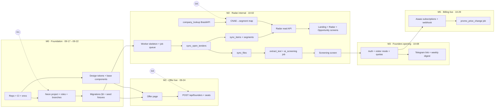

# LicitaQui · Development Plan

> **Claims:** a card that exists because the product already promised something
> has a row in [`CLAIMS.md`](CLAIMS.md) as well — currently **D8**, **E5**, **E6**,
> **B8** and **D11b**. The card says what to build; the register says what was
> promised, where it renders and when it comes due. Close the row with evidence
> per recipient, never with a deploy.

> Version 0.3 · 2026-09-17 · companion to `TECHNICAL_SPEC.md` (v0.4) and the viability study (v10)
> Team: **one developer (Sci) + Claude Code agents**, 40+ h/week. Dates follow the Phase 0 schedule in the study.

---

## 1. Are we ready to start?

**Yes — development can start today.** Architecture, data model, UI, brand, prices and the core logic (PNCP collection, AI reading with answer keys) already exist. What is missing is a short list of decisions, accounts and one real product gap. None blocks day 1, but each blocks a specific milestone, so each has a due date.

### 1.1 What we already have

| Area | Artifact | Status |
|---|---|---|
| Architecture, data model, API, cache, security | `TECHNICAL_SPEC.md` | ✅ ready |
| UI (9 mobile screens + 5 web boards + design system) | "Wireframes LicitaQui" canvas | ✅ approved |
| Brand (symbol, wordmark, PWA icons, bot avatar) | `Marca/assest/` | ✅ ready |
| Offer and Landing (copy + layout) | `paginas/oferta_fundadores.html`, `paginas/landing_radar.html` | ✅ preview, to port to Next.js |
| PNCP search, items, files, download, circuit breaker | `poc1_licitacoes.py` | ✅ validated on real data |
| Awards (winners) and discount bands | `poc3_resultados.py`, `poc3_categorias.py` | ✅ validated |
| Keyword/NCM segmentation (14 segments) + false positives | `poc1_licitacoes.py` | ✅ validated |
| AI screening (lite) and deep analysis, citation check, rules in code | `poc4_ia_edital.py` | ✅ 57/58 and 68/69 on answer keys |
| Evaluation harness + 3 answer keys | `poc4_avaliar.py`, `gabaritos/` | ✅ ready for CI |
| Prices, quotas, unit economics, Phase 0 gates | viability study v10 | ✅ decided |

### 1.2 Decisions and gaps (status on 09-17)

**Decided today:** Neon through the Vercel Marketplace, as a new project (new Vercel database resource) · EC2/Easypanel unchanged, no new cost · Resend test sender during development · WhatsApp via Evolution API and Telegram connected during development · Vercel URL for now (no domain) · GitHub/Vercel org `scintechn`, Sentry, OpenRouter and Asaas (sandbox + production) already exist · existing Telegram bot used temporarily · login by email link + Google · 5 screenings/month on Básico · visitor limit counted per device and per CNPJ · customer invoices (NF) decided later.

| # | Item | Type | Blocks | Status / default | Due |
|---|---|---|---|---|---|
| G1 | Neon via Vercel: Storage → Create database → Neon, **Free** plan, region closest to users and functions (São Paulo if offered, else N. Virginia; cannot be changed later); roles `app` and `migrator` | account | M0 foundation | ✅ decided · create | **09-18** |
| G2 | Email: Resend. **The sending domain is verified** (legal brief §1, 21/09), which was the one condition U1 gated magic-link sign-in on — so the gap is closed and the flag was never flipped | account | email to real users (magic link, welcome, opening) | ✅ domain verified. **Magic link is built and switched off**: see card U2 | **now** — without it, "I do not want a Google account" means "I cannot have an account" |
| G3 | Privacy policy + Terms of use, incl. LGPD consent and the **Promocional price-change clause** (the founder price → the Essencial price in the month after `plans.promocional.months`, with `notice.priceChangeDays` of notice — **the figures are in `docs/product.json` and are deliberately not restated here**: this row said R$ 26 → R$ 57 in month 7 until 2026-10-08, wrong on both prices and on the month, on the acceptance criterion for a *legal* gate) | legal | M1 Offer live | Open — no default | **09-23** |
| G4 | Accounts: new OpenRouter API key with spend cap; new Sentry projects (`licitaqui-web`, `licitaqui-worker`); Vercel project in `scintechn` (Pro); GitHub repo `scintechn/licitaqui`; Asaas sandbox keys in Vercel preview, production keys only in production | accounts | M0–M1 | Mostly ✅ (accounts exist) · create keys/projects | **09-19** |
| G5 | **Rotate** the Mercado Livre and SearchApi keys exposed in earlier sessions | security | before any production deploy | Open | **09-21** |
| G6 | **CNAE → segment map does not exist.** POCs classify *items* into 14 segments by NCM/keywords; nothing maps a company's CNAEs to those segments, so "Compatível / Verificar" cannot be computed yet | product gap | M2 Radar | Task B6 (seed table + review) | **10-01** |
| G7 | Spike: PNCP period endpoints (`/v1/contratacoes/publicacao`, `/atualizacao`) vs. the search API used in the POCs | technical | M2 sync design | ✅ **Resolved 09-17 — default overturned.** B2 builds on `/v1/contratacoes/atualizacao`, search sweep as fallback behind the §7.2 breaker. Rationale and measurements: `docs/adr/0001-pncp-incremental-sync-endpoint.md` | done |
| G8 | Spike: BrasilAPI CNPJ (fields, rate limits, failure rate) | technical | M2 CNPJ entry | ✅ **Resolved 09-17.** Use BrasilAPI; keep manual CNAE entry as a tested fallback, not a rescue. 45 real supplier CNPJs, 0 failures, 0.52 s median, CNAE 45/45. Rate limit **unmeasured** (the burst hit Vercel's edge cache) → keep lookups single-threaded. `docs/adr/0002-cnpj-lookup-via-brasilapi.md` | done |
| G9 | Telegram (existing bot, temporary) and WhatsApp (**Evolution API** on Easypanel): connected during development. A Telegram bot has a single webhook URL, so check the bot is not serving another system when connecting it | integration | M1 WhatsApp welcome, M3 Telegram linking | ✅ decided · tasks E1, E2 | E2 by 09-26 · E1 by 10-07 |
| G10 | Message texts: founders welcome, founders opening (email + WhatsApp), Telegram `/start` flow, weekly digest, 30-day price notice, payment confirmation | content | M1, M3, M5 | Open — task E0: Claude drafts, Sci approves | **10-05** |
| G11 | Screens not in the canvas: magic-link sent, error/"PNCP unavailable", cancel subscription, `/admin` (gates, founders list, concierge digest builder) | design | M3–M5 | Build from design-system components without a new canvas round | as built |
| G12 | Asaas production: company data, bank account, webhook URL (Vercel URL), production API key, **and the four environment variables below** | account | M5 billing live | ✅ account exists · configure | **10-20** |
| G13 | Customer invoices (NF) | legal/tax | not blocking Phase 0 | Later, with the accountant; no invoice promise in the product | — |
| G14 | Stay inside Neon Free (0.5 GB, 100 CU-hours): worker polls every 2 min + `/wake`, files in S3, usage shown in `/admin` with 80% alerts | technical | none (no cost change expected) | ✅ built into A2, B1, O1 | ongoing |

---

## 2. How one person + Claude Code runs parallel work

1. **Contracts first.** Parallel agents only work if they share fixed contracts: the DB schema (migrations), the job table, and TypeScript types for API responses. Milestone M0 delivers these before any feature work.
2. **One stream = one git worktree = one Claude Code agent.** Each agent gets a task card (section 5) with inputs, acceptance criteria and the files it owns. Agents never edit files owned by another stream in the same cycle.
3. **Max 3 agents at a time.** The bottleneck is your review, not code generation. Queue the rest.
4. **Trunk-based, small PRs.** Every PR: CI green (lint, types, tests), preview deploy checked on a phone, merged the same day. No long-lived branches.
5. **Shared fixtures.** The 3 answer-key tenders (`gabaritos/`) plus 20 cached PNCP responses become the seed data for local dev, tests and previews, so web work never waits for the worker.
6. **You own:** decisions (section 1.2), reviews, production deploys, secrets, anything with money or legal text, and the non-dev track (influencers, interviews, concierge).

### Suggested `CLAUDE.md` for the repo

```markdown
# LicitaQui — agent guide
- Read docs/TECHNICAL_SPEC.md and docs/DEVELOPMENT_PLAN.md before any task. The task card is the scope; do not widen it.
- Code, identifiers, tables, commits: English. User-facing copy: Brazilian Portuguese in apps/web/messages/pt-BR.json.
- Never read PNCP/BrasilAPI/OpenRouter inside a web request; enqueue a job (spec §3).
- Never commit secrets. Use .env.example. Never log CPF, emails or tokens.
- Every change: tests for new logic, `pnpm lint && pnpm typecheck && pnpm test` (web) or `ruff && pytest` (worker) green.
- Schema changes only via db/migrations, in their own PR.
- AI prompt or extraction changes must run `worker/evaluation` and report the score diff.
- Design: use tokens from apps/web/styles/tokens.css (Ivory/Graphite/Blue, Archivo/IBM Plex). Brand name is always "LicitaQui".
```

---

## 3. Critical path and dependencies


```mermaid
flowchart LR
  subgraph M0["M0 · Foundation · 09-17→09-22"]
    A1[Repo + CI + envs] --> A2[Neon project + roles + branches]
    A2 --> A3[Migrations §6 + seed fixtures]
    A1 --> D1[Design tokens + base components]
  end
  subgraph M1["M1 · Offer live · 09-24"]
    D2[Offer page] --> F1[POST /api/founders + seats]
  end
  subgraph M2["M2 · Radar internal · 10-02"]
    B1[Worker skeleton + job queue] --> B2[sync_open_tenders]
    B2 --> B3[sync_items + segments]
    B2 --> B4[sync_files]
    B5[company_lookup BrasilAPI] --> B6[CNAE→segment map]
    B3 --> R1[Radar read API]
    B6 --> R1
    R1 --> D3[Landing + Radar + Opportunity screens]
    B4 --> C1[extract_text + ai_screening job]
    C1 --> D4[Screening screen]
  end
  subgraph M3["M3 · Founders opening · 10-08"]
    U1[Auth + visitor mode + quotas] --> E1[Telegram link + weekly digest]
  end
  subgraph M5["M5 · Billing live · 10-29"]
    P1[Asaas subscriptions + webhook] --> P2[promo_price_change job]
  end
  A3 --> D2
  A3 --> B1
  D1 --> D2
  D4 --> U1
  U1 --> P1
  G1((G1)) -.-> A2
  G3((G3)) -.-> F1
  G6((G6)) -.-> B6
```

**Critical path (anything late here moves 10-08):** A1 → A2 → A3 → B1 → B2 → B3 + B6 → R1 → D3 → C1 → D4 → U1 → E1.

**Safe to run in parallel with the critical path:** design tokens/components (D1), Offer page (D2/F1), BrasilAPI + CNAE map (B5/B6), AI job port (C1, against fixtures), email/Telegram texts (G10), `/admin` events (O1), and — from October — the awards backfill (B8), which needs weeks of collection before the Essencial price bands are meaningful.

---

## 4. Milestones

| Milestone | Date | Ships | Exit criteria |
|---|---|---|---|
| **M0 Foundation** | Tue 09-22 | Monorepo, CI, Vercel preview + prod on the `vercel.app` URL, Neon project with `main`/`dev` and preview branches, all migrations from spec §6, seed fixtures, design tokens | `pnpm dev` runs locally against the Neon `dev` branch with seeded tenders; a PR gets a preview URL with its own Neon branch; point-in-time restore tested on a branch |
| **M1 Offer live** | Thu 09-24 | Founders page on the Vercel URL, seat counter (25 sold, 17 open), consent, on-screen confirmation, events `offer_viewed`/`founder_signed_up`; WhatsApp welcome via Evolution API by 09-26 (E2) | seat race test passes at the open cap; privacy policy linked; signup lands in DB; welcome delivered to opted-in founders |
| **M2 Radar (internal)** | Fri 10-02 | Worker in production syncing open tenders every 30 min; CNPJ → CNAE → segments; Landing, Radar (Compatível/Verificar/Palavra-chave), Opportunity, AI Screening (visitor, 2 free) | Real CNPJs return plausible lists; screening of the 3 answer-key tenders scores ≥ 95% in CI; no request waits on PNCP |
| **M3 Founders opening** | Thu 10-08, 19:00 | Opening notice by WhatsApp (Evolution API); accounts (Google **and** magic link — the domain is verified, so **U2** turns it on; without it there is no account for anyone who refuses Google), visitor 3-day/2-screening limits, files unlocked with account, Telegram linking (**E3** — the journey is a launch blocker: linking silently fails for anyone who already has a chat with the bot), weekly digest job, `/admin` gate dashboard | Founders receive access email; Telegram `/start` links in one tap; quotas enforced server-side |
| **M4 Public Landing** | Tue 10-13 | Hardening: rate limits, error states, SEO for public pages, PWA install, uptime monitors | Load test (100 concurrent visitors) without errors; Lighthouse mobile ≥ 90 |
| **M5 Billing live** | Thu 10-29 (sandbox done 10-23) | Asaas subscriptions (Promocional R$ 57, Essencial R$ 75) on sandbox then production, checkout link, idempotent webhook, `promo_ends_on` + 30-day notice + automatic change to R$ 75, 1-click cancel, **every billing message ours** (F4): reminder 3 days before each charge, payment-failed and suspension notices — Asaas customer notifications stay off | Full sandbox cycle incl. repeated webhooks and price change simulated with a clock override; exactly one reminder per charge cycle and none for a cancelled subscription; subscription link sent to the founders |
| **M6 Gate 0** | Fri 11-06 | Numbers from `/admin` | See study: ≥ 150 founders signed up, ≥ 300 CNPJs, ≥ 100 Telegram, ≥ 6/20 concierge paying, ≥ 15/25 seats paid, ≥ 50% digest opens |
| **v1 Essencial** | build 11-09 → 01-08 · release **Mon 2027-01-11** | Winning price band by state, target purchase price + margin calculator, daily alerts (10 keywords + CNAE), ME/EPP and value filters, deep analysis with quota, billing: plan management and invoices list (the 3-day charge reminder ships earlier, in M5 — task F4) | Gate 1: ≥ 15 paying Essencial-equivalents, month-1 churn < 10% |
| **v2 Pro** | build 01-11 → 02-26 · release **Mon 2027-03-01** | Competitors (name, CNPJ), market price (SearchApi), opportunity score, WhatsApp alerts + triggers, OCR | Gate 2: ≥ 25% of base on Pro, AI cost ≤ R$ 11 per Pro user |

---

### 4.1 Next actions — revisited 2026-10-09

**Eight days to the founders opening (Sat 17/10, 12:00 BRT — `docs/product.json`),
and that date carries two things at once:** the opening notice *and* Essencial
going on sale. Ordered by consequence, not by size.

| # | Next | Owner | Why it is next | Unblocks |
|---|---|---|---|---|
| 1 | **G12** — Asaas production: company data, bank account, webhook URL, production key, **and four environment variables Sci must type** | **Sci** | The only item on the board whose duration we do not control. §1.2 dates it **10-20**, three days *after* the product starts charging. **The four variables are the half that was written down nowhere.** An agent cannot write `.env*` here — the permission layer refuses, the same deny rule that left `S3_BUCKET` and the AWS keys undocumented (see B4B's `STATUS.md` row) — so these are Sci's lines and they were living in a code comment that asserted G12 carried them when G12 did not: `ASAAS_API_KEY` (`$aact_prod_…`), `ASAAS_WEBHOOK_TOKEN` (the value set when the webhook is registered), `ASAAS_ENV=production`, and **`ASAAS_BILLING=live`** — which is the kill switch, defaults to a dry run on any other value *including unset*, and is therefore the one variable whose absence charges nobody and says nothing. On 17/10 at 12:00 BRT a deploy missing it serves every founder `billing.subscribe.error` with one `console.error` explaining why. **`ASAAS_ENV` and `ASAAS_API_KEY` must move together**: `configFault()` refuses a `$aact_prod_` key while `ASAAS_ENV` is anything but `production`, which is deliberate and is what stops a preview deployment charging real money | the production half of F2 |
| 2 | **The opening send** — re-queue the broadcast, land the rehearsal, alarm E20 | agent | Hours of work, and the only item whose failure mode is **nothing happening on the day while every signal stays green**. The sender is registered and correctly dated (`product.py:65` is `date(2026, 10, 17)`), but it is **not in `DEFAULT_SCHEDULE`** — its only production caller is `worker/scripts/schedule_founders_opening.py`, the queued row was deleted on 2026-10-03 (**E20**), and the rehearsal `c882236` (+1 039 lines, `task/e5-founders-opening`) is still **not an ancestor of `origin/main`**. `CLAIMS.md:60` still offers the deleted job as live evidence | **E5**, **E6**, **E12**, **E20** |
| 3 | **F2 baseline** — do its 4 test failures reproduce on `main`? | agent | 45 minutes, and it decides whether `task/f2-asaas-subscriptions` (4 commits, 7 720 lines, **unpushed**) is nearly reviewable or carries a real bug in cancellation. The lane spent 65 minutes on those failures without ever asking this | **F2**, **F3**, **F4**, **D8**, and **B44**'s measurement |
| 4 | **D77** — rule on the collapsed rail and the hamburger | **Sci** | D22's remaining half waits on it: while a collapsed rail unmounts the nav and the drawer is `lg:hidden`, `/conta`'s four duplicate buttons are most of the navigation such a reader has, so they cannot be removed first | **D22**'s buttons half |
| 5 | **E10 · D40 · B17** — the 17/10 copy-or-build calls | **Sci** | `CLAIMS.md` rows due 17/10 with no code scheduled against them. Each closes by being built **or** by the sentence changing, and the sentence is Sci's (legal brief §5) | the publicity |

**Landed 08–09/10:** **#259** — D22's acceptance held as an invariant (the rail's
entries derived from the rendered rail, not a typed list), and the
`/conta/favoritos` marking bug it found: for nine days the rail marked *Perfil*
while the reader stood on their own favourites, and the unit suite passed
throughout because its path table was written when it was complete. **D77**
carded. **In flight:** D22's e-mail half (committed, in §4b review) and
`task/f2-asaas-subscriptions` (unpushed, blocked on row 3).

---

## 5. Task cards (Phase 0)

Legend — **Stream**: A Platform · B Data/worker · C AI · D Web · E Messaging · F Billing · O Ops/admin · S Sci only.
**Size** is agent-days of focused work including your review. **∥** = can run in parallel with the other ∥ tasks of the same week.

> **AUDIT 2026-10-05 — the week headers below and every `08/10` in these cards
> are against a date that moved.** Sci confirmed the opening as **Saturday
> 2026-10-17 at 12:00 BRT** (15:00 UTC) on 2026-10-03; `docs/product.json:28-29`
> carries it (`opensOn`, `opensAtBrt`) and the nine `CLAIMS.md` rows were re-dated
> with it (`STATUS.md:479`). **The cards were not.** Nothing below was re-dated by
> this audit either — the prose `08/10`s are history and the week headers are the
> milestone they belong to — but read every `08/10` in §5 as **17/10**, and see
> **E5**: the move never reached `worker/licitaqui/`, where the opening date is still
> `date(2026, 10, 8)`.

### Week 0–1 · 09-17 → 09-24 (M0, M1)

| ID | Stream | Task | Depends on | ∥ | Size | Acceptance criteria |
|---|---|---|---|---|---|---|
| S1 | S | Close G1 (EC2 region → Neon project), G4, G5, G9; start G2 and G3 | — | ∥ | — | Neon project in the right region; new keys created; old keys revoked |
| A1 | A | Repo `scintechn/licitaqui`: monorepo (`apps/web`, `worker`, `db`, `docs`), pnpm, ruff, CI workflows, `.env.example`, `CLAUDE.md`, secret scanning; Vercel project (Root Directory `apps/web`), Sentry DSNs | — | ∥ | 1 | CI green on an empty PR; preview deploy URL on `vercel.app` |
| A2 | A | Neon via Vercel Storage: database `licitaqui` (region per G1, Free plan), roles `app`/`migrator`, extensions (`unaccent`, `pg_trgm`, `citext`); `DATABASE_URL` in Vercel, `DATABASE_URL_UNPOOLED` in Easypanel and GitHub secrets; preview branching + GitHub Action deleting the branch on PR close (or one shared `preview` branch); `dev` branch; weekly `pg_dump` to S3 job stub | G1 | | 0.5 | Preview deploy uses a preview branch that disappears when the PR closes; restore of a test table on a branch works |
| A3 | A | Migrations for spec §6.1–6.3 (tenders, items, files, awards, companies, visitors, users, plan_limits, usage, ai_analyses, telegram_links, alerts, subscriptions incl. `promo_ends_on`, founders_list, jobs, events) + seed from `gabaritos/` and 20 cached PNCP responses | A2 | | 1.5 | `db:migrate` + `db:seed` idempotent; seed shows 20 tenders with items |
| D1 | D | Tailwind tokens from the design system, fonts (Archivo with width axis, IBM Plex), base components (Button, Field, Status, Tag, Card, AppBar, locked block, analyzing/empty states), logo component | A1 | ∥ | 1.5 | Storybook-like `/dev/components` page matches the canvas Design System board |
| D2 | D | Port Offer page to Next.js (`/fundadores`), static + ISR, remove preview banner | D1 | | 1 | Matches `paginas/oferta_fundadores.html` on 390 px and 1280 px |
| F1 | D | `POST /api/founders` (Zod, rate limit, seat assignment in a transaction), `GET /api/founders/seats`, confirmation screen with seat number, enqueue WhatsApp welcome (E2), events | A3, D2, G3 | | 1 | Concurrency test: 60 parallel signups → seats 1..48 unique, 12 on waitlist |
| O1 | O | `events` writer + `/admin` shell (auth by allowlist), founders table view, Neon usage card (storage, CU-hours, 80% alert) | A3 | ∥ | 0.5 | Sci can see signups and export CSV; usage card shows real numbers |
| E2 | E | WhatsApp via Evolution API: worker client, `send_whatsapp` job (opt-in only, ≈ 1 message / 20–30 s, retries, delivery log, "SAIR" opt-out), founders welcome template; `/admin` button for the opening broadcast | B1 (or a minimal job runner), E0 welcome text | ∥ | 1 | Welcome reaches 3 test numbers; opt-out stops further messages; no message without consent |
| S2 | S | Approve Offer copy; start influencer outreach and community posts once live | M1 | ∥ | — | — |

### Week 1–2 · 09-21 → 10-02 (M2)

> **B17 and B18 gate this milestone's exit criteria, though their rows sit in the
> Week 4–6 table.** M2 exits on *"real CNPJs return plausible lists"*, and the Radar
> holds 44% of the editais PNCP calls open (#140). A list missing 37 editais that close
> within three days is not plausible, so B17 is an M2 blocker and not an M4/M5 task —
> resolving the priority question #140 left open. Their rows are left where they are;
> the dates in them are correct.

| ID | Stream | Task | Depends on | ∥ | Size | Acceptance criteria |
|---|---|---|---|---|---|---|
| B0 | B | Spikes G7 (PNCP period endpoints) and G8 (BrasilAPI) with a short written result in `docs/adr/` | — | ∥ | 0.5 | ADR with recommendation and measured error rates |
| B1 | B | Worker skeleton: Dockerfile, psycopg, job consumer (`FOR UPDATE SKIP LOCKED`, idle poll every 2 min), authenticated `POST /wake`, scheduler, retries/backoff, circuit breaker, health endpoint, Sentry; deploy to Easypanel via GHCR | A3 | | 1.5 | Two consumers never run the same job; failing job retries 4× then `failed`; Neon compute suspends when idle; `/wake` picks a priority-1 job in < 5 s |
| B2 | B | `sync_open_tenders` ported from POC 1 (search by state × modality, upsert, change detection by `pncp_updated_at`) | B1, B0 | | 1.5 | Full SP sweep < 30 min; rerun creates 0 duplicates |
| B3 | B | `sync_items` + segments + false positives + ME/EPP summary + favored-treatment rule | B2 | ∥ | 1 | Unit tests reproduce POC 1 classification on fixtures |
| B4 | B | `sync_files` (list only; download on demand) | B2 | ∥ | 0.5 | Amendment adds a file and invalidates text/screening |
| B5 | B | `company_lookup` (BrasilAPI, 30-day cache, failure → manual CNAE flag) | B1, B0 | ∥ | 0.5 | 50 real CNPJs; failures surface the manual path |
| B6 | B | **CNAE → segment map (G6):** table `cnae_segments(cnae, segment, fit: compatible\|check)`; seed by Claude from the CNAE list (IBGE) against the 14 segments; Sci reviews the top 150 CNAEs used by MEI/ME retail and services | B5 | ∥ | 1.5 | 20 hand-picked CNPJs (papelaria, limpeza, TI, hospitalar…) classified as expected |
| C1 | C | ~~**Built — this is the `ai_screening` that produces every triagem in production; the card was never marked.** D26 depends on it and is therefore not blocked.~~ Port POC 4 to `worker/licitaqui/ai_tender.py`: `extract_text`, page selection, lite prompt v2, citation check, rules; `ai_screening` job; cost logging; `evaluate-ai.yml` in CI | B1 (fixtures OK before B4) | ∥ | 2 | CI evaluation on 3 answer keys ≥ 95%; scanned PDF → `no_text`, no AI call |
| R1 | D | Read APIs: `POST /api/radar/cnpj`, `GET /api/radar/tenders`, `GET /api/tenders/:id`, `POST /api/tenders/:id/screening`, `GET /api/jobs/:id`; `readOrEnqueue()` with TTLs | A3, B3, B6 | | 1.5 | Contract tests on seed data; stale data served + refresh job enqueued |
| D3 | D | Landing (`/`), Radar, Opportunity screens (canvas 01–03) on seed data first, then real data | D1, R1 | | 2 | Visual match on 390 px; empty and analyzing states work |
| D4 | D | Screening screen (canvas 04) + locked price block (05) + visitor banner | D3, C1 | | 1 | Screening of a real tender renders with page references |
| D5 | D | **Canvas 09, the menu — designed, never carded, never built.** `docs/design/wireframes/Menu.dc.html` has existed since the design set was drawn and `grep -in 'menu\|navega\|hamburg' docs/DEVELOPMENT_PLAN.md` returns **nothing**: not a "later" left in a comment like `short_title`, but a whole screen that never became a task. `AppBar` takes `leading`, `title`, `actions` and renders nothing else — there is no drawer, no nav, no plan strip. **The cost is not cosmetic.** A signed-in person today cannot see, from any screen they actually use, what plan they are on, how many triagens are left this month, how many alerts they get, or even that they are signed in: that state lives only on `/conta`, which nothing links to from the Radar except a bare person icon. Canvas 09 puts all of it where people look — `PRINCIPAL` (Radar · Alertas · Minha empresa · Plano e pagamento), `CONTA` (Perfil · Ajuda), and a footer card reading `Plano Básico · 3 de 5 triagens usadas no mês · 1 alerta semanal` over a progress bar with `Conhecer o Essencial →`. The numbers are already computable — `readLimit` + `countUsage` per `quota.ts`, the same pair the triagem screen uses. **Sci asked to bring this forward (2026-09-24), ahead of the rest of the founders-page work, because it is the fix for a real gap rather than a polish item.** Watch three things the rest of the repo has already been bitten by: the drawer is a modal surface, so the dialog acceptance criteria written for B16 (focus trap, focus restoration, Escape, background inertness, scroll position restored on close) apply here **first** and should be built once and shared; the plan strip must render for a visitor as well, saying what a visitor has rather than nothing; and `components/tabs.tsx`'s `role="tablist"` problem is a warning about half-implemented ARIA patterns, not a precedent to copy | — | ∥ | 1 | The drawer opens from every app screen, keyboard and screen-reader complete against B16's dialog criteria; the footer card shows plan, triagens used of the limit, and alert cadence, for a signed-in user **and** for a visitor; every number comes from `plan_limits` rather than a literal; nothing in it is a second copy of a string that already exists in `pt-BR.json` |
| D6 | D | ~~**Cadence half done 2026-09-29**, and the entitlement half was already done — `plan_limits` now carries `alert · week · 1` for all four plans, verified against the database, so the menu correctly reads *"1 alerta semanal"*. `plans.essential.feature2` moved from *"Avisos diários"* to *"Avisos semanais"*, Sci's decision over building a daily job. **What is left is not this card**: the same sentence promises 10 keywords and the product delivers one — **E18**. Original card:~~ **`/fundadores` sells daily Telegram alerts that do not exist and that no plan entitles.** The page says *"toda semana no Básico, **todo dia no Essencial**"*. The scheduler holds exactly one digest — `ScheduleEntry(kind="weekly_digest", daily_at="07:00", weekday=0)`, Monday only — and there is no daily job of any kind in `worker/licitaqui/`. Worse, `plan_limits` carries an `alert` row for **`basico` alone** (`('basico','alert','week',1)`), and `readLimit`'s own comment says *"No row: the plan does not include the feature. Not 'unlimited'."* — so an Essencial subscriber resolves to **zero** alerts **in the web**. **Correction, 2026-09-24 — the original card overstated this and the migration records why:** the worker reads the same absence the *other* way. `telegram_alerts.py:50-57` treats a missing cap as **uncapped** for the weekly digest, deliberately, "because reading a missing row as zero would silence every founder on `promocional` on opening week", and logs `plan has no alert limit` so the gap stays visible. So **no paid subscriber has ever been silenced** — what broke is that the *web* displays zero, which canvas 09's plan strip printed as "sem alertas neste plano" the moment `FEATURES.alert` gave it a row to read. **And the page was not inventing the cadence.** §10 line 382 defines a `daily_alerts` job (every day 07:00 BRT, Essencial) and line 455 gives Essencial "daily, 10 keywords + CNAE" — marked **new**, listed under a later phase at line 570, while Phase 0's scope at line 563 is "Telegram linking, **weekly alert**. Founders opening 10-08". So `/fundadores` was describing the roadmap while selling Phase 0 access. CDC art. 30 still binds an advertised feature, which is why the copy moves to what a founder actually receives on 08/10 — not because the claim was invented. Two halves, and the copy half is the urgent one: (a) the sentence must describe what exists — drafted for Sci 2026-09-24, and it is his under legal brief §5; (b) `plan_limits` needs `alert` rows for `promocional`, `essencial` and `pro` whatever the cadence turns out to be, or a paid subscriber silently gets nothing. Do **not** ship a daily digest to satisfy the sentence without deciding the cadence deliberately: a daily message is a different product promise from a weekly one, and §7.1 wrote the weekly one on purpose | — | ∥ | 0.5 | The page describes the cadence the scheduler actually runs; `plan_limits` has an `alert` row for every paid plan; a test reads the page's cadence claim against `plan_limits` rather than against a literal, so the two cannot drift again |
| D7 | D | **"Acesso antes de todos" points at the wrong feature.** `/fundadores` says *"Você usa o Radar **antes da abertura pública**"* — but the Radar is public right now at `/radar`, with no account, two free triagens and a three-day window. Whatever a founder is buying, early access to the Radar is not it. **Sci, 2026-09-24: the real prime feature is the price range — the band the winners actually closed at, and the maximum to pay a supplier to keep a margin.** That is `Preco.dc.html` / `price-view.tsx`, it is Essencial, and today it renders entirely as `LockedValue` bars. So the benefit the page should name is the one the founder price unlocks, not a screen anyone can already open. Copy is Sci's (§5); draft supplied 2026-09-24. Note the related finding from the persona walkthrough: the price screen promises three numbers in its intro and shows none of them, with the one genuinely useful thing — the papel A4 worked example — below both locked cards | D6 | ∥ | 0.25 | No sentence on `/fundadores` offers early access to something already public; the founder benefit names the price range; the claim matches what Essencial actually unlocks |
| D8 | D | **2026-10-08 — the cancel is DONE; the reminder is built and CANNOT SEND, because its two sentences are Sci's.** Said at a glance on purpose: F5's row read as open while its prose said done, and this one would read as closed while half of it is blocked on copy. Cancel: `confirmCancel` on `/conta/plano`, one confirmation step because the approved copy has one (`billing.cancel.title` with `confirm` and `keep`), Asaas's `DELETE /v3/subscriptions/{id}` **before** our row so a refusal changes nothing, `subscriptions.ends_on` set to the day before the next charge (terms §8's Prime model), and `expire_subscriptions` in `worker/licitaqui/billing.py` is the daily job `0004_subscription_refunds.sql` promised would read that column and never existed. Reminder: `charge_reminder` sweeps three days before each charge, claims a `billing_reminders` row per (subscription, due date) — the primary key **is** spec §10's idempotency — and enqueues `send_billing_email`; **it cannot send yet**, because `worker/templates/email/charge-reminder.md` is a draft carrying a `TODO(Sci):` for the two sentences, so the sweep refuses before it claims anything and writes `billing.reminder_blocked` with the number of subscribers it would have written to. `nextChargeOn` is read as `subscription.nextDueDate`, never derived from a cycle length. The four comments saying billing opens **10-29** are corrected: `lib/routes.ts:80`/`:88`, `app/conta/plano/page.tsx` and `plan-view.tsx` now say 17/10 or say nothing. Original card:~~ **AUDITED 2026-10-05: STILL OPEN on both promises — one clause of the text below is now stale, and a new contradiction sits beside it.** Neither mechanism exists. No cancel flow: `app/conta/actions.ts` exports `safeNext`, `signInWithGoogle`, `signInWithEmail`, `saveCompany`, `signOutEverywhere` (`:28/37/42/85/110`) and no subscription write; `cancelSubscription\|cancel_subscription\|cancelPlan\|cancelarAssinatura` is zero repo-wide. No reminder job: searched `charge_reminder`, `chargeReminder`, `charge`, `reminder`, `cobranca`, `cobrança`, `renewal`, `dunning`, `invoice`, `three_days` across `worker/licitaqui` and `apps/web/lib` — the only reminder-*mechanism* hit is the fact `chargeReminderDays` at `lib/product.ts:56` (the sweep returns 41 hits in all, so "the only hit" was wrong) — **and one of the others is a card in its own right**: `lib/db/schema.ts:287` declares `nextChargeOn: date('next_charge_on')` (`0001_initial.sql:287`), the `subscriptions` column a reminder job would read, and **nothing reads it**. That is CLAUDE.md's column-nothing-reads shape, surfaced by this sweep and worth its own row; `scheduler.py:116-224` has **ten** entries and none is billing; there is **no 3-days-before template at all**, and `templates/email/payment-confirmation.md` and `price-change-30-days.md` are referenced by `lib/product.test.ts:52-53` (and `:57`), `worker/templates/README.md:128-130` and a `TODO(Sci)` at `pt-BR.json:10` — not "only" by the test, as the first version said — two **draft** templates nothing sends — `payment-confirmation.md:6` and `price-change-30-days.md:6` both read `status: draft`, which the first version of this row called approved. The work is **F2** and **F4**, both unstarted. **Stale clause, in this card and in `CLAIMS.md:63`:** *"The terms name the location — 'Conta → Plano' — and **that screen does not exist**"*. It does, shipped as D22 (`44b087a`): `app/conta/plano/page.tsx`, `plan-view.tsx`, `plan-view.test.tsx`, rendering plan, screenings left and founder seat. Its only button is `PLAN_HREF` to the offer and it carries **no cancel control**, so the promise's *address* now exists and the *flow* still does not — which is a worse shape than before, because the terms now name a screen a subscriber can reach and be refused on. **New and needing a decision rather than code:** four comments across three files say billing opens **10-29** (`lib/routes.ts:80`, `:88` *"M5 (10-29)"*; `app/conta/plano/page.tsx:12`; `plan-view.tsx:14`) while `docs/product.json:50` says the charge starts **17/10** — two numbers chosen in different cards that never met, the same shape as D29. Original card:~~ **Two promises on `/fundadores` with no machinery: "cancela em 1 clique" and "aviso 3 dias antes de cada cobrança".** Both sit in the comparison table as differentiators against competitors charging from R$ 397/mês. Neither exists: there is no cancel flow under `apps/web/app/conta`, no billing-reminder job kind in the worker, and no scheduler entry for one. **Sci, 2026-09-24: not built yet, and it belongs in the next phase, before the paid moment starts.** So this is a build-before-the-date item rather than a live falsehood — billing does not open until 08/10 — but the page is taking sign-ups on those two sentences today, and CDC art. 30 binds from the moment the claim is published, not from the moment money moves. The cancel path is also the other half of a promise already made in `billing.cancel.body` ("Sua conta volta para o plano Básico"), which describes a flow nothing implements. Sequence it with F-stream billing, not after it | F2 | | 1 | Cancelling is one action from `/conta`, with no confirmation maze, and moves the account to Básico exactly as `billing.cancel.body` says; a reminder reaches the subscriber three days before each charge; both are live before the first real charge, not before the first sign-up  **Escalated 2026-09-25.** The founders welcome e-mail was promoted from draft to approved that day and says *"Sem fidelidade. Você cancela quando quiser, em um clique."* Sci's decision: the one-click cancel is in the plan to be developed, so the claim stays. That makes this card a **hard dependency on 08/10** rather than a tidy-up — an e-mail cannot be corrected after it is delivered, and billing opens on the same date the claim comes due. The sibling promise, *"aviso 3 dias antes de cada cobrança"*, has the same shape and the same date. |
| E0 | E | Draft all email, WhatsApp and Telegram texts (G10) in `messages/pt-BR.json` and `worker/templates/` (welcome and opening first) | — | ∥ | 0.5 | Sci approves |
| D9 | D | **Three `foundersPage.ruler.*` strings no longer render, and only Sci can delete them.** The price example on `/fundadores` was a bar with four marks on a R$ 10 – R$ 40 scale; it is now a chain of four labelled steps, because at 390px the green "still profitable" zone measured **47px of 308** and `R$ 14,60` — the number the product exists to produce — was set at 16px against a competitor's 34px. The chain renders `tender`, `winner`, `retail` and `maxPurchase` with their values, and the verdict keeps `verdictLead`/`verdictBody`. What it has no place for is the three strings that described the *ruler*: **`alt`** ("Régua de preço: …", the `aria-label` of a `role="img"` that no longer exists — the chain is real text and reads in order without it), and **`scaleStart`** / **`scaleEnd`** ("R$ 10" and "R$ 40", the endpoints of an axis that is gone). They are left in the catalogue deliberately: copy on this page is the founder's under the legal brief (§5), and deleting a string is not a rendering change. This is the same shape as `radar.list.changeCompany` — approved copy rendered nowhere — so it gets a card rather than a sentence in a comment. Nothing is broken while they sit there; the cost is a catalogue that overstates what ships | — | ∥ | 0.1 | Sci confirms the three strings are no longer wanted and they leave `pt-BR.json`, or says to keep them and the reason is recorded here |
| D10 | D | **(a) is delivered** by `feat/founders-layout` (the commit *"say whose price each column holds when the table stops being one"*): the `<thead>` goes to `display:none` below 560px and the two inline labels lose `aria-hidden`, so each value is announced with the name of its column; asserted by a journey at 390px that reads the accessibility tree, not the markup. **(b) and (c) remain open.** **Three accessibility defects in the brand panel shipped by PR #99, found by review afterwards.** All three are on `main` now; the founders-structure PR (#101) touches none of them, which is why they are a card and not a fix there. **(a) The comparison table loses its column headers below 559px.** `page.tsx` sets `display:block` on `table`/`tbody`/`tr`/`td` to stack it, which strips the implicit table roles in every major browser, so the `<th scope="col">` ↔ `<td>` association does not survive — and the visible substitutes that replace them are `aria-hidden`. Measured in Chromium at 390px. A screen-reader user at phone width therefore hears *"Preço de entrada / a partir de R$ 397/mês / R$ 26/mês"* with **nothing saying which is the competitor and which is ours**, on the block whose entire purpose is that comparison, on a page taking money. It is a regression: before #99 the table kept its semantics at every width. The guarding test asserts only that the two stacking classes are present — the classes that *cause* it — so it cannot fail for this. Fix: explicit `role="table"/"rowgroup"/"row"/"cell"/"columnheader"` on the stacked elements, or drop `aria-hidden` from the inline labels so they carry the association. **(b) Three contrast justifications name pairs nothing paints.** Recomputed with the formula `styles/contrast.test.ts` uses: the comment says the graphite faint tier is "3.22:1" on the panel (it is **5.51:1**) and that `blue-on-ink` is "2.71:1 and invisible" (it is **5.69:1** — *higher* than the 5.06:1 replacement). Those two figures are the `#2457d6` arithmetic from a different background. And `--color-icon-on-brand` is annotated `5.06:1`, which is against the panel, while the icon is painted on `brand-raised`, where it measures **3.82:1** — exactly the mistake `contrast.test.ts`'s own header exists to prevent. The swap is still right on the numbers; the recorded reasons are wrong. **(c) `contrast.test.ts` never saw this ramp.** `PAIRS` still guards `on-ink`/`on-ink-muted` against `ink`, which nothing paints any more, and none of the four live `on-brand*` pairs — nor `icon-on-brand` on `brand-raised` — is in any test. Also worth a decision, not a default: the global focus ring is `--color-blue`, which was 2.91:1 on the old graphite panel and is **1.87:1** on `brand-panel`, and the panel's CTA is the only focusable thing on it | — | ∥ | 0.5 | The stacked comparison table announces which column each value belongs to, verified with a screen reader at 390px; every contrast figure in a comment or token annotation names the surface the colour is actually painted on; `contrast.test.ts` guards the four `on-brand*` pairs and `icon-on-brand` on `brand-raised`; the focus ring on the brand panel is measured and either changed or accepted in writing |
| D11 | D | **The Landing's example goes stale on 30/09.** *(Scope changed 2026-09-24: `ExampleRadar` was removed from `/fundadores` when the hero took the product shot, so this is now the Landing's alone — `app/(public)/page.tsx:241`. The date is unchanged.)* **The example goes stale eight days before the founders page's own opening.** `lib/radar/landing-example.ts` freezes `EXAMPLE_NOW` at 2026-09-17 and all three tenders close on **2026-09-30** (BRT), so every card renders `13 dias` and `Proposta até 30/09 · 08:30` permanently. From **01/10** the hero of the page taking founder sign-ups shows three tenders whose stated deadline has passed, each under a countdown — and the founders list opens to the product on 08/10, so the whole final week runs in that state. Pre-existing `ExampleRadar` behaviour, and the caption does disclose *como estavam em 17/09/2026* (verified rendered and visible at every width); PR #101 promoted it into the hero of the conversion page and this PR removed it from there again, so the exposure is back to the Landing only — where it is still the first product a visitor sees. Refreeze the example on later tenders, or pick ones already closed so the caption and the cards agree. **Has a hard date: do it before 30/09.** *(Done 2026-09-24, `fix/landing-example-stale`, and by neither of those two routes — both re-date the defect or need database credentials nobody in that session had. The third answer: **the example's facts stay frozen and its clock stops being one.** `EXAMPLE_NOW` is deleted, the panel renders against the real clock at build and at every revalidation, and the card's own gate — `mayShowUrgency`, §2.2 rule 6, already shipped — drops the countdown and relabels the line *"Data anterior 30/09"* once that card's session hour has passed — at the first revalidation after it, so up to ten minutes later on a busy page and longer on a quiet one (`revalidate = 600`, stale-while-revalidate), where the frozen clock was permanent. Real days count down until 30/09; after it the panel is three dated examples that no longer claim to be open, which is what the caption has always said. **No new copy**: `card.previousDeadline` already existed for exactly this. Re-freezing on a later constant now fails a test instead of shipping: `app/(public)/example-radar.test.tsx` renders the whole Landing at five moved clocks — 24/09, 29/09 23:00 BRT, 30/09 08:00 BRT, 01/10/2026 and 01/01/2030 — and the acceptance criterion is checked at the clock it names rather than waited for. **Not done, and Sci's:** refreshing *which* editais the example shows. That needs real PNCP rows and would move three approved strings (`landing.alerts.items`, `landing.opportunity.tender`/`.deadlineValue`) that name these same three tenders at 30/09 — see D11b.)* | D10 | ∥ | 0.5 | On 01/10 the `/fundadores` hero shows no tender whose stated proposal deadline has passed while a countdown says days remain — and, since this card's own scope note moves `ExampleRadar` off that page, the same of `/`, checked at a moved clock rather than waited for |
| D12 | D | **The page now makes the same claims three times, and the trust row drops half of two approved sentences.** `hero.promises` (four bullets) → the new `Trust` row (the same first three, longer bodies) → `Pillars` (all four again) — the first two are both within the first screen and a half at 900px. Worse than the repetition: `Trust` renders `item.title` + `item.body` and **omits `item.plan`**, so the first product claims a visitor meets carry no plan attribution — the AI reading loses **`Básico com limite`** and the price band loses **`Essencial`**. A founder is not over-promised (the offer is "tudo do Essencial"), but the page is public and the strings are approved copy under the legal brief, so dropping half of a sentence is a copy decision, not a rendering one. Nothing asserts either presence or absence. **Sci decides** which of the two sections carries these sentences and whether the plan tag travels with them; §5 means the wording itself is his either way. | D10 | ∥ | 0.25 | Each approved pillar sentence appears once on the page, with whatever plan attribution Sci decides, and a test holds it there |
| D13 | D | **`/fundadores` layout pass — five sections, against an approved design draft.** Layout only; no user-facing string written, changed or moved between sections, and `messages/pt-BR.json` untouched. `SectionHead` gains an opt-in `aside` (heading left at ~45%, the section's supporting material right, one column below 900px) with the 720px stack unchanged as the default. `Pain` becomes a numbered `<ol>` with an icon per item and `01/02/03` in mono, and its two market figures move into the heading's second column. `Pillars` becomes one bordered band with hairline dividers instead of four cards, keeping all four items and their plan labels. `Timeline` gets the icon box, the numeral and `arrowRight` between consecutive steps (decorative, absent below 900px); `clock` and `link` added to `icon.tsx`. `FounderValue` raises the price benefit to `--text-stat`, gives the rest check glyphs and moves the full-width CTA under the offer. **The draft's dark green is not taken** — green is `success` in this product — and no type token is added or changed: `--text-section` stays 26→38px and only the measure narrows. | D2, D9, D12 | | 1 | No string added, removed or relocated (asserted by diffing the rendered catalogue references against the base). `scrollWidth == clientWidth` at 390, 440, 560, 700, 900 and 1280 with nothing crossing either edge. The pillars band draws the right dividers at all three tiers, asserted from computed style at 390/700/1280 — the 560–899 tier is where the first attempt was wrong. Keyboard focus reaches the panel's CTA; the FAQ accordion and the skip link still work. **Open for Sci:** the draft shows `R$ 57` struck through under the price and `founderValue` has no standalone string for it (the R$ 57 is inside `benefits[0].body`), so it was not built — it needs a catalogue decision, not a layout one. |
| D14 | D | **Approved copy that stopped rendering when `/fundadores` took the draft's shape — none of it deleted, because §5 makes the wording Sci's.** Seven keys, by path. **(a) `foundersPage.pillars.title`** — *"Da busca à proposta, com a conta feita."* — was the `<h2>` of the four-card *O que você vai usar* section. That section is gone: its four claims are the band under the hero, which carries no heading of its own because it sits above the page's first `<h2>` (an `<h3>` per cell would take the outline from `h1` straight to `h3`). `pillars.label` still renders, in the header's anchor nav, and `#tool` now points at the band. **(b) `foundersPage.pillars.items[0..3].title`** — *Encontrar*, *Entender*, *Ofertar com lucro*, *Antes do prazo* — the band titles each cell with `hero.promises[i]` instead, which is the descriptive line the draft shows (*"Editais compatíveis com o seu CNAE"*) against a bare verb. Their bodies and plan labels do still render, in that band. Note that *Encontrar* and *Entender* reappear on the page from **`pain.items[0..1].title`**, which Sci rewrote the same day: the strings are on screen, the `pillars` keys are not. **(c) `foundersPage.pain.facts[0..1]`** (value + label) **and `foundersPage.pain.source`** — the heading's second column now holds `pain.standfirst`, which Sci wrote for that position. **`R$ 272,6 bi` was the page's only statement of market size and it is sourced**; after this it appears nowhere. The competitor anchor is not lost — `R$ 397/mês` survives in `founderValue.comparisonRows` (*"Preço de entrada · a partir de R$ 397/mês"*), rendered in the offer panel; `pain.source` names both provenances, so if the figures come back the source line comes with them. Nothing here is a rendering bug: each string is intact in `messages/pt-BR.json` and a decision is owed on each — delete, or give it another home. **(d) Added 2026-09-24, from the founders finish pass — eight more keys, same shape.** **`foundersPage.hero.promises[0..3]`**: the band used to title each cell with these and take only the body from `pillars.items[i]`. Sci rewrote `pillars.items[0..3]` into four shorter title/body pairs that day, so the band now takes both halves from one array and these four descriptive lines (*"Editais compatíveis com o seu CNAE"*, *"Triagem do edital por IA, com a página"*, *"Faixa em que os vencedores fecharam na sua região"*, *"Alertas no Telegram antes do prazo"*) render nowhere. A test in `page.test.tsx` asserts exactly that, so the day one is rendered again this card is re-read rather than forgotten. **`foundersPage.pillars.items[0..3].plan`** — *Básico*, *Básico com limite*, *Essencial*, *Básico e Essencial* — stopped being drawn on Sci's instruction the same day. Note what that costs, because it is the half of card D12 that was argued the other way three days ago: the page no longer says anywhere in the band which paid plan each capability belongs to, so the AI reading loses *"Básico com limite"* and the price band loses *"Essencial"*. `founderValue.comparisonRows` still names the plan the offer is; the per-capability attribution is gone. That is Sci's call and it is recorded here, not reversed. **(e) Three keys in the `ruler` namespace, found by a review of the finish pass and belonging on this card rather than on a new one:** **`foundersPage.ruler.alt`** (the `role="img"` description of the price ruler that `PriceChain` replaced), **`foundersPage.ruler.scaleStart`** (*R$ 10*) and **`foundersPage.ruler.scaleEnd`** (*R$ 40*) — the old bar's axis ends. They were orphaned by the price-chain commit earlier on this branch and missed when this card was extended; the same PR edits `ruler.label`, so the namespace was open in front of us. **And `ruler.label` itself is now a different problem, not an orphan:** Sci shortened it from *"Exemplo real · papel sulfite A4, por resma"* to *"Exemplo real"* on 2026-09-24, and that suffix was the only thing on `/fundadores` naming the commodity its four figures describe. After the edit `≈ R$ 36`, `≈ R$ 20`, `≈ R$ 29` and `R$ 14,60` sit under *"Medianas de 8 editais encerrados"* with nothing saying what was bought — `papel A4` survives only in `radar.landing.opportunity.body`, `radar.price.example` and `radar.price.exampleLead`, all other pages. Not a false claim, so not a blocker, but it is unattributed figures on the page taking money, in the section that already carried a CDC art. 30 finding three days earlier. Sci decides: restore the suffix, write a caption, or accept it. `lib/messages.test.ts`'s alert-cadence guard used to borrow `pain.title` as its live proof that the `DAILY` sweep is narrow; it now states that directly (`DAILY.test('Alertas todo dia no Essencial')`), so no test depends on the wording of a sentence Sci may edit again. | D13 | | 0.25 | Each of the seven keys is either deleted from `messages/pt-BR.json` or rendered somewhere a reader reaches, and a test holds whichever Sci chooses. The market-size figure, if it returns, returns with `pain.source` |

### Week 3 · 10-05 → 10-08 (M3)

| ID | Stream | Task | Depends on | ∥ | Size | Acceptance criteria |
|---|---|---|---|---|---|---|
| U1 | D | Auth.js (Google; magic link behind a flag until G2), visitor cookie + CNPJ counting for the 3-day/2-screening rules, `plan_limits` (Básico 5/month) + `usage` checks, files unlocked with account | D4 | | 2 | Quota tests (visitor, Básico) pass; incognito + same CNPJ still limited |
| U2 | D | ~~**Launch blocker.**~~ **AUDITED 2026-10-05: not a blocker — magic-link sign-in has been live in production since 2026-09-23, and the clause below is false.** `events` holds `account_created {'provider': 'resend'}` for user **5** (2026-09-23 12:55 UTC) and user **6** (2026-09-24 06:42 UTC); `accounts` holds exactly one row (`4 \| oidc \| google`), and the e-mail provider writes no `accounts` row (`lib/auth/adapter.ts:171` runs `linkAccount` for OAuth only), so both are magic-link sign-ins — and **neither is Sci's own address** (checked without printing any), so the two sign-ins did not land in the inbox that would mask a broken sender — which was this card's whole point. That the Resend *account owner* is nobody else is **INFERRED**, not measured: this card itself records that the repo's key cannot list domains. Current liveness is inferred too — the two events are 09-23 and 09-24 with none since, out of three `account_created` rows in all. `/conta/criar` offers both methods (`sign-in-view.tsx:135` Google, `:149-178` the e-mail field, `:141-147` the divider drawn only when both are available), and single-use expiry is real: `lib/auth/adapter.ts:244-252` deletes the token *as* the read. **One acceptance criterion is open, and it was already a recorded decision rather than an oversight:** a bounce is visible nowhere but Resend's dashboard — none of the 13 routes under `apps/web/app/api` is a bounce or payment webhook — the first version said there was *no* webhook route at all, which is false and which **this same diff contradicts three rows down**, where E3 quotes `app/api/telegram/webhook/route.ts:105`, `grep -rni bounce` over `*.ts\|*.tsx\|*.py\|*.sql` finds no delivery handling, and `webhook_events` (`0001_initial.sql:297-303`) is read and written by **no code at all**. `docs/NOTIFICATION_JOURNEY.md:264` accepted that explicitly — *"Until then a bounce is invisible — accepted. Revisit when e-mail carries billing (F4, M5)"* — **for "the week of the launch", a week that has since moved, so re-confirming it is Sci's call rather than something to inherit.** Smaller and real: `AUTH_MAGIC_LINK` and `AUTH_EMAIL_FROM` are still absent from `.env.example` (`RESEND_API_KEY` is there at line 14), which U1's own handoff asked for (`STATUS.md:333`). Whether the three Vercel Production variables are set is **INFERRED** from the two `provider: 'resend'` accounts — all four conditions at `lib/auth/config.ts:122-127` must hold for the provider to exist — not read from Vercel. ~~Turn on magic-link sign-in.~~ U1 built it and gated it behind `AUTH_MAGIC_LINK` because G2 had not verified a sending domain; brief §1 records the domain as verified on 21/09, so the gate outlived its reason and nobody noticed. Until it is on, someone who will not use a Google account **cannot create one at all** — `/conta/criar` offers Google or nothing. Mostly configuration, but not only: confirm in the Resend dashboard that the domain really is verified (the repo's key is send-only and cannot list domains, so this cannot be checked from code), set `AUTH_MAGIC_LINK=1`, `RESEND_API_KEY` and `AUTH_EMAIL_FROM=noreply@licitaquiapp.com.br` in Vercel Production, redeploy, then walk a real sign-in from an address that is **not** the Resend account owner — the test sender silently drops everyone else, which is the failure this card exists to rule out. Reply-to is `contato@` per brief §1 | U1, G2 | ∥ | 0.5 | A person with no Google account signs in from a real inbox that is not the account owner's; the link is single-use and expires; `/conta/criar` offers both methods; a bounce is visible somewhere other than Resend's dashboard |
| E1 | E | Telegram (existing bot, G9): webhook with secret, `/start <token>` linking, weekly digest job (up to 3 compatible tenders + screening link) | U1, B3, B6 | ∥ | 1.5 | Link in one tap from phone; digest renders for 5 test users |
| E3 | E/D | ~~**Launch blocker.** The account → Telegram linking journey, end to end.~~ **Done — AUDITED 2026-10-05. Five of its six acceptance criteria are evidenced directly; the sixth is satisfied by design rather than by a measurement, and that is said here rather than rounded up.** `telegram_links` holds `chat_id` + `linked_at` for users 4 and 5, each paired with a `telegram_linked` event **18–23 ms** later (user 5: `linked_at 12:57:19.951082`, event `12:57:19.969213`, **18.1 ms**; user 4: `18:14:17.896760` / `18:14:17.919377`, **22.6 ms**). The first version of this row gave user 5 `.896` — user 4's digit group — and a range of "23–73 ms" that was entirely an artefact of that transposition, and all three `telegram_linked` events post-date PR #52 — so the webhook-secret mismatch `STATUS.md:340` identified as *the* blocker was fixed and real `/start`s have been accepted since. The channel works end to end today: `alert_sent {'channel': 'telegram', 'tenders': 3}` for user 4 at **2026-10-05 10:00 UTC**, and no `send_telegram` job has failed since 2026-09-23 16:02 UTC. Four states, not three: `lib/telegram/handoff.ts:73-89` (`linked\|waiting\|failed\|idle`), rendered at `alerts-view.tsx:176/221/251/266`; the manual `/start <token>` fallback is `alerts-view.tsx:113-124`; the CNPJ is asked for inline at `:203-220` and is changeable at `/conta/empresa` (`company-view.tsx:70`, `submitLabel={cnpj ? copy.companyChange : copy.companySave}`). **The one criterion not directly measured is the first** — *"a user who already has a chat with the bot can link"*. Nothing special-cases a returning chat, deliberately; the manual `/start` fallback covers it and every other cause without asserting one. User 4 linked on 2026-09-28 and had touched the bot before, which would be that case — but that history is **INFERRED** from `STATUS.md:338`, not read, so treat the criterion as covered by the fallback's design and not as proven. **Four clauses of the text below are stale:** the `/start` *did* reach the webhook (~72 POSTs, every one `401 bad_secret` — `STATUS.md:340`), the returning-chat hypothesis is unproven and deliberately not coded against (`handoff.ts:21-28`), `rememberUserCnpj` is no longer the only way a CNPJ reaches an account, and the account setting it deferred to now exists. **And a live instance of that follow-up, which the "users 4 and 5" framing above hides:** user 6 has a `telegram_linked` event (2026-09-24 06:51 UTC), a `start-linked`, a `start-already-linked`, and a `weekly-digest` + `alert_sent` on 09-28 — and today `chat_id` and `linked_at` are both **NULL**, with **no unlink event of any name** (nothing in `events` matches `%unlink%` or `%disconnect%`). A completed link disappeared and the product recorded nothing, so nobody can tell a user who chose to disconnect from one whose link broke. **One follow-up it left behind is still true and is not in its acceptance:** a denied Telegram webhook is only a `console.warn` nobody watches (`app/api/telegram/webhook/route.ts:105`) and `/admin` shows a *count* of links (`lib/admin/gates.ts:107-111`) and no failure. That is the same defect as U2's missing bounce visibility — **a delivery failure in an outside channel that no operator surface shows** — and it wants one card across both, not two. Original card:~~ **Launch blocker.** The account → Telegram linking journey, end to end. Observed on production 22/09: the token was minted and the user was sent to the bot, but `telegram_links.chat_id` stayed null and no `telegram_linked` event was written — the `/start` never reached the webhook. **Suspected cause, to confirm first:** `t.me/<bot>?start=<token>` only auto-sends the payload for a *first-ever* conversation; a chat that already has history just opens, so anyone who has touched the bot before silently fails. Scope: handle the returning-chat case; a waiting state on `/conta/alertas` that knows the link is pending; a visible failure path instead of silence; a manual fallback (show the token to paste); and decide whether a confirmation reaches the user anywhere other than Telegram — today the only confirmation is *in* Telegram, which is the wrong channel when Telegram is what failed. **Also the CNPJ detour:** `rememberUserCnpj` is the only way a CNPJ ever reaches an account and it fires as a side effect of a Radar search, so setting up alerts means leaving the account, using a different feature and coming back. Ask for it where it is needed. And it only ever fills a `null` — deliberately, because "changing a company is an account setting, not a side effect of one search" — but that setting does not exist, so the first company you happen to search is permanent | E1, U1 | | 1.5 | A user who already has a chat with the bot can link; `/conta/alertas` shows pending, linked and failed distinctly; a link that never completes is recoverable without support; `telegram_links.chat_id` and a `telegram_linked` event both land; alerts can be set up without leaving the account area; and the CNPJ on an account can be changed |
| O2 | O | `/admin` gate dashboard (spec §14 queries) + concierge digest builder (pick tenders per founder, send via bot) | O1, E1 | ∥ | 1 | All 6 gate numbers visible; digest sent to a test chat |
| S3 | S | Founders opening email/WhatsApp at 19:00 on 10-08; pick 20 concierge users; interviews | M3 | ∥ | — | — |
| E4 | E | ~~**Launch blocker. The founders welcome is queued, runs, and sends nothing — and every signal says it worked.**~~ **The blocker is closed, 2026-09-28 — AUDITED 2026-10-05, per recipient, exactly as this card demanded.** The one seated founder (`founders_list` id 5, seat 1, 2026-09-28 18:09 UTC) has both deliveries: `events` row `whatsapp.sent` at 18:10:26 UTC with `{'job_id': 206882, 'status': 201, 'template': 'founders-welcome', 'message_id': '3EB0D3B33C8EB818DD72AE'}` and `email.sent` at 18:10:24 UTC with `{'job_id': 206881, 'status': 200, 'template': 'founders-welcome', 'message_id': '01a0e935-face-7573-8b19-1fe2742031dc'}`. **No `whatsapp.dry_run` or `email.dry_run` row exists anywhere in `events`**, so these are not the dry-run week this card was named for. The confirmation says so again: `WHATSAPP_WELCOME_IS_DELIVERED = true` (`signup-form.tsx:600`) and `fundadores.spec.ts:939` asserts `nextWhatsapp` is **present**. **One acceptance criterion is open and it is not a blocker:** *"`/admin` can tell a dry-run week from a delivered one without reading SQL"* — it cannot. Searched both spellings (`dry_run`, `dryRun`) across `apps/web/app/admin` and `apps/web/lib`: zero hits; the only delivery-adjacent thing on `/admin` is a phone-number formatter (`founders-table.tsx:85`). **One caveat on this kind of evidence, recorded because it bit this audit:** `CLAIMS.md` closes this row on job `84044` and `message_id 3EB008D19200C77C23A850` from 2026-09-24 — **neither that `events` row nor that `jobs` row exists today** (`events` holds ids 1…281 312 for 142 005 rows; `jobs` ids 23…416 855 for 391 647). Rows from that week are gone or the sequences have very large gaps and I could not tell which, so in this repo the **presence** of an event is strong evidence and its **absence** is weak. Original card:~~ **Launch blocker. The founders welcome is queued, runs, and sends nothing — and every signal says it worked.** Observed on production 2026-09-24: Sci signed up with his own details and received no WhatsApp and no e-mail. Nothing is broken in the sense of erroring. F1 enqueues `send_whatsapp` keyed `founders:<id>` inside the seat transaction; `handlers.py:47` imports `whatsapp.py` so the kind **is** registered; `WORKER_JOB_KINDS` unset means the container claims every kind. What stops it is the kill switch: `evolution.send_text` returns a dry run unless `WHATSAPP_DELIVERY` is the exact word `send`, and on that path the job runs all four consent gates, renders the message, writes a **`whatsapp.dry_run`** event and finishes **`done`**. So `jobs` shows success, the delivery log has a row, and no socket was ever opened — a dry-run founders week and a delivered one are distinguishable only by an event *name*. The switch is off **deliberately**: `worker/README.md` records that the only Evolution instance on the server is `flowdeski-scn-real-estate`, another product, so turning it on today would send LicitaQui's founders welcome from that product's WhatsApp number. **So this card is not "set a variable".** It is: stand up a LicitaQui Evolution instance, set `EVOLUTION_API_URL` / `EVOLUTION_API_KEY` / `EVOLUTION_INSTANCE`, verify one message to Sci's own number, *then* `WHATSAPP_DELIVERY=send`. Note two things when doing it: enabling the switch is **not retroactive** — the already-`done` jobs never run again, so every founder who signed up before it must be re-enqueued (`jobs_dedupe` is partial, `where status in ('queued','running')`, so re-inserting the same `(kind, key)` is allowed); and a prior `whatsapp.dry_run` does **not** block the later real send, because `_already_sent` matches only `whatsapp.sent`. Finally flip `WHATSAPP_WELCOME_IS_DELIVERED` in `apps/web/app/(public)/fundadores/signup-form.tsx` back to `true`, which restores `founders.confirmation.nextWhatsapp` to the confirmation — it is suppressed today because the sentence is past tense on a page taking money (CDC art. 30) | E2 | | 0.5 | A real WhatsApp message from a LicitaQui number reaches a founder who signed up before the switch was turned on; `events` holds `whatsapp.sent` and not `whatsapp.dry_run`; the confirmation says so again and `fundadores.spec.ts` asserts the sentence is present rather than absent; `/admin` can tell a dry-run week from a delivered one without reading SQL |
| E5 | E | **REOPENED, AUDITED 2026-10-05 — and on the evidence this is the most urgent card in the plan.** Three independent facts, any one of which alone stops the opening. **(1) Nothing is queued.** `select kind, key, status from jobs where kind = 'founders_opening_broadcast' or key like 'founders%'` returns the two 2026-09-28 welcome rows and **nothing else**: job 103288 was deleted on 2026-10-03, recorded by `events` row `founders_opening_broadcast_cancelled` — `{'key': 'founders-opening-broadcast:2026-10-08', 'job_id': 103288, 'was_status': 'queued', 'reason': 'Sci moved the founders opening off 2026-10-08; new date pending. Re-queue with worker/scripts/schedule_founders_opening.py.'}`. Twelve days out, nothing is scheduled, and nothing will schedule it: re-queueing is a human running that script. **(2) The 17/10 move never reached the worker.** `docs/product.json:28-29` says `opensOn: 2026-10-17`, `opensAtBrt: 12:00`; the commit that did that touched **zero files under `worker/licitaqui/`** — it did update both `founders-opening` templates' `notes:`, so the narrower statement is the true one — and `grep -rn "opensOn\|2026-10-17" worker/` returns nothing (the templates say `17/10`, not the ISO form). `worker/licitaqui/whatsapp.py:119` is still `DEFAULT_OPENING_DATE = date(2026, 10, 8)` and `:647` still `DEFAULT_BROADCAST_HOUR = "19:00"`. Run today with no env override, `broadcast_at()` returns **2026-10-08 22:00 UTC**, which is **3 days 3 h in the future** — measured 2026-10-05 18:55:54 UTC, both sides from the same clock. So a re-queued row would sit `queued` and inert for three days and then **fire on 08/10 19:00 BRT, nine days before the product opens**, sending every seated founder an access link to something that is not open. **The first version of this card said that instant was "already past" and "claimable immediately". It is neither** — that was a shell clock read against a UTC timestamp, which is the mistake `CLAUDE.md`'s Clocks section exists for, made inside the card that is supposed to be about this date. The conclusion survives and the mechanism does not: it fires **early**, not immediately. `worker/licitaqui/product.py` duplicates `docs/product.json` deliberately and `tests/test_product.py` proves the duplication for prices, promo terms, seats and notice days — **the opening date and hour are copied in `whatsapp.py` instead, outside that file and outside its guard, and no test compares them to `docs/product.json`**, and the one test that touches the default compares it only to the stale constant — `test_whatsapp.py:105`, `assert whatsapp.opening_date() == whatsapp.DEFAULT_OPENING_DATE`, which passes whatever that constant says, while `:257` monkeypatches it first, so the stale default is invisible to the suite by construction. **(3) `{{data_abertura}}` is bound from that default and renders to live recipients now**, **four times**: `templates/email/founders-welcome.md:24,30` and `templates/whatsapp/founders-welcome.md:14,18` — `:5` is the `preheader:` front-matter line and is **not** a render site, because `templates.py:191` splits front matter off and consumes only `subject`, `placeholders`, `flags` and `partials`; nothing in `worker/licitaqui/` reads `preheader` — *"No dia {{data_abertura}} eu mando aqui o link de acesso"*. **Whether the deployed container sets `FOUNDERS_OPENING_DATE` is UNVERIFIABLE from here** (nothing in `.github/`, the `Dockerfile` or `docker-compose.yml` sets it; `worker/README.md:405` documents the default as `2026-10-08`). If it is unset, every founder signing up between now and the opening is told on both channels that the link arrives on a date nine days before the product opens — a CDC art. 30 exposure on the page taking sign-ups. **(4) The dry-run half of this card is not on `main`.** The text below credits `worker/scripts/preview_founders_opening.py` and `check_gates()`; `worker/scripts/` holds 14 files and that is not one of them, and `grep -rn "check_gates\|preview_founders\|scheduled_broadcast" --include=*.py .` returns **zero hits in code** — the only matches in the repository are these card texts. It exists as `c882236` (*"rehearse the 08/10 opening send before the date (E5)"*, +1039 lines over 7 files, 2026-09-29) on `task/e5-founders-opening`, and `git merge-base --is-ancestor c882236 HEAD` is **false** on `HEAD`, `main` and `origin/main`. That is CLAUDE.md's *"a merge can silently drop your card"* with the code dropped instead of the row. **Recover it rather than rebuild it** — and check the lane is idle first. **Why that matters beyond the lost work (INFERRED):** with no read-only preview, the only rehearsal is to enqueue and run the real sweep, and both kill switches are live on the deployed worker (`status: 201` and `200` on 2026-09-28), so a rehearsal against production would **send for real**. Order of work: fix `whatsapp.py:119`/`:647` and extend `test_product.py` to prove them against `docs/product.json` **first**, because E20's check would otherwise inherit the wrong date; then recover `c882236`; then re-queue; then correct `docs/CLAIMS.md:60`, which offers deleted job 103288 as live evidence for a launch-blocking promise. Still open and unchanged: what a **waitlisted** person receives on the day — `SEATED_FOUNDERS_SQL` filters `seat is not null`, both waitlist templates promise them a message when the product opens, and no opening-day waitlist template exists. Moot in production today (0 waitlisted) and live for anyone who signs up before 17/10. ~~**Card text was stale, corrected 2026-09-29.**~~ It claimed `grep -rn 'founders-opening' worker/licitaqui apps/web/lib` returns nothing. It returns plenty: `whatsapp.py` carries the whole opening broadcast — `BROADCAST_JOB_KIND`, the registered handler, `enqueue_opening_broadcast`, `broadcast_at()` converting 19:00 BRT to UTC — merged in `3db95b0`, `14be1dd`, `26a8c9b`, with the production row already queued (CLAIMS.md:60). **The sender exists.** What had nothing behind it was this card's *second* criterion, a dry run before the date, and that is what the E5 lane built: `worker/scripts/preview_founders_opening.py`, read-only, sharing `check_gates()` with the real send so the rehearsal cannot drift from it. Two defects fixed on the way — a founder with an undialable number read as *would send*, and `scheduled_broadcast` could report a dead row beside a live one because `jobs_dedupe` is a **partial** unique index. Still open and now **E20**: nothing alarms if the queued row disappears. Original card:~~ **Launch blocker, 08/10. The founders welcome promises a message that nothing will send.** The WhatsApp delivered to Sci on 2026-09-24 at 21:51 BRT says, verbatim: *"Agora você não precisa fazer nada. No dia 8 de outubro de 2026 eu mando aqui o link de acesso."* That is a dated commitment, already in the hands of a real recipient, and **there is no sender behind it.** `worker/templates/whatsapp/founders-opening.md` exists; `grep -rn 'founders-opening' worker/licitaqui apps/web/lib` returns **nothing**, and the worker's own live log lists five scheduler entries — `sync_open_tenders`, `sync_awards`, `sweep_titles`, `weekly_digest`, `sweep_tender_values` — none of which is this. So the template is the sixth recorded instance of the shape `CLAUDE.md` names: an artefact with no code path, except this one has already been promised to someone. The same sentence renders on `/fundadores` as `founders.confirmation.nextOpening` and is in the terms as the access commitment, so it binds under CDC art. 30 three times over. **Needs:** a job kind that renders `founders-opening` for every seated founder, a scheduler entry or a one-off dated run at 08/10 19:00 BRT, and the same `whatsapp.sent` verification E4 established — plus a decision on what a **waitlisted** person receives that day, which no template covers. Do not discover this on the morning of the 8th | E4 | → | 0.5 | Every seated founder receives the access link on 08/10, verified by a `whatsapp.sent` event per recipient rather than by a job status; a dry run of the whole send is possible before the date |
| E12 | E | ~~**`email/founders-opening.md`'s own front matter says "Pairs with whatsapp/founders-opening" — nothing pairs them.**~~ **Done as code, 2026-09-25 in #128 — AUDITED 2026-10-05; the text below reads as an open defect and would be rebuilt.** One loop fans out both kinds per seated founder: `whatsapp.py:731` `cur.execute(SEATED_FOUNDERS_SQL)`, `:734-741` `enqueue(... 'send_whatsapp', key=opening_key(id))`, `:742-749` `email.enqueue(... 'send_email', same key)`, with `opening_key()` at `:683` deliberately distinct from the welcome's `founders:<id>` — which matters because `jobs_dedupe` (`0001_initial.sql:336-337`) is unique on `(kind, key)` where status is queued or running, so the opening e-mail under the welcome's key would have been deduped away silently. Seven tests pin it, including `test_the_broadcast_enqueues_the_opening_email_beside_the_whatsapp` and `test_the_opening_key_does_not_collide_with_the_welcome_key` (`tests/test_integration_whatsapp.py:602`, `:656`). Also stale: *"Depends on the footer TODO being resolved first (E6)"* — `templates/email/partial-footer.md` is `status: approved` with no `TODO(Sci)`. **Its acceptance is still unmet, and not by anything this card owns:** no `email.*` opening event can exist while **E5** has no queued row. Original card:~~ **`email/founders-opening.md`'s own front matter says "Pairs with whatsapp/founders-opening" — nothing pairs them.** Found reviewing E5/E6 (2026-09-25): `whatsapp.founders_opening_broadcast` (E5's sweep) fans out one `send_whatsapp` per seated founder on 08/10; nothing fans out a matching `send_email`. The e-mail template exists, is `status: approved`, and is blocked today only by the shared footer partial (see E6) — once that is fixed, the WhatsApp opening message ships on 08/10 and the e-mail with the identical promise does not, silently, unless this card also lands. Same shape `CLAUDE.md` names five other instances of: a template with no code path, this time with a comment claiming one exists. **Needs:** either extend `founders_opening_broadcast` to enqueue both kinds per seated founder (mirroring how F1's signup transaction already queues both `send_whatsapp` and `send_email` together), or a second sweep; either way, one `email.sent`/`email.dry_run` event per recipient, the same verification E4/E5 established. Depends on the footer TODO being resolved first (E6) or this ships dry-run-only until then | E5, E6 | ∥ | 0.25 | Every seated founder who consented gets the opening e-mail on 08/10, verified per recipient by an `email.*` delivery event; a dry run of the whole send is possible before the date |
| E6 | E | **AUDITED 2026-10-05: PARTLY DONE — the content, the caller and the architectural decision the text below leaves open have all landed; what is left is the one message the consent actually names.** The footer blocker is resolved: `templates/email/partial-footer.md` is `status: approved` with no `TODO(Sci)`, and the only remaining `TODO(Sci):` markers in `worker/templates/` are in `price-change-30-days.md:40-42` and `payment-confirmation.md:35-36`, neither on the opening path. The decision was taken the way this card said the architecture asks for — the worker enqueues the e-mail beside `send_whatsapp` (`whatsapp.py:742`) — and both transports are proven per recipient (`email.sent` job 206881 status 200, `whatsapp.sent` job 206882 status 201, 2026-09-28 18:10 UTC, both `template: founders-welcome`), with the event machinery in place on both channels (`email.py:96-97`, chosen at `:423`; the independent `EMAIL_DELIVERY` switch at `resend.py:82-86`). **What remains is the *abertura* notice itself** — `consent.founders` promises *"receber por e-mail e WhatsApp o aviso de abertura das vagas"*, and that message is not queued; it is **E5**'s row, not new work here. Note a contradiction inside one row of the register: `docs/CLAIMS.md:61`'s Due column reads **17/10** while its body still says the claim *"becomes true on **08/10** when that message lands"*. Original card:~~ **The founders e-mail needs content and a caller, not a transport — the transport already works.** Sci, 2026-09-24: *"I already received an email when I create an account."* He is right, and this card's first version was wrong to say there was no sender. `apps/web/lib/auth/magic-link-email.ts` talks to **Resend's REST API directly** from the web app (Auth.js's `sendVerificationRequest` hook), the sending domain is live, and the magic link arrives. What misled me is that the *worker* has no mail transport beside `whatsapp.py` and `telegram.py`, and `worker/templates/email/founders-*.md` sit next to the WhatsApp templates as though the worker were meant to send them — it is not, and nothing renders them. **So the work is: the founders e-mail content, and a decision about where it is sent from.** Two options with different costs: send from the **web app** at signup time, reusing the Resend call the magic link already makes (simplest, but it happens inside the request and a Resend failure is then in the signup's path); or give the **worker** a mail transport and enqueue it beside `send_whatsapp` (matches §3's rule that a web request never calls a third party, and inherits the `*.sent` event discipline E4 established). The second is the one the architecture asks for. **The copy is Sci's under legal brief §5** — `consent.founders` promises *"por e-mail e WhatsApp"*, so the words in the e-mail are his to write, and the templates in `worker/templates/email/` should be treated as drafts until he says otherwise. Relates to **E5**: if the 08/10 access link is WhatsApp-only, anyone who replies SAIR loses the thing they paid for with no second channel | E4 | ∥ | 0.5 | A founder receives the e-mail the consent promises, verified per recipient by a delivery event rather than by a job status; the channel the consent names and the channels that exist are the same set |
| E7 | E | ~~**Launch blocker, overdue.**~~ **AUDITED 2026-10-05: the acceptance is met on both limbs — and the closure missed one live sentence, so the claim is not fully shut.** Not a blocker and not overdue. **Limb 1, the copy:** `timeline.steps[2].body` is now *"Com a conta grátis, você recebe 1 aviso por semana no Telegram, com 1 palavra-chave e 1 estado."* — account-gated, per Sci's rule (`a290a3f`, 2026-09-25). **Limb 2, and it is also true:** the digest runs and reaches the only founder there is. `jobs` holds `weekly_digest` `done` for `2026-09-28T07:00` and `2026-10-05T07:00`; `events` holds `telegram.sent {'template': 'weekly-digest', 'tenders': 3, 'status': 200}` for user 4 at **2026-10-05 10:00:21 UTC = 07:00 BRT, today**, with `alert_sent {'channel': 'telegram', 'tenders': 3}` beside it. And the founder *is* that user: joining `founders_list` to `users` on lower(email) gives founder 5 → user 4, with `telegram_links.chat_id` set and an active `alerts` row (`telegram`, `weekly`). So all four things `ELIGIBLE_SQL` requires exist — **four, not the three this card lists**: it also requires `u.cnpj is not null` (`telegram_alerts.py:365`), which the original text omitted and user 4 happens to satisfy for the one seated founder. **What the closure missed, and this is the part to act on:** `foundersPage.founderValue.benefits[1].body` ends *"Você também recebe os primeiros resumos semanais de editais."* — on the live `/fundadores`, with **no account condition**. `git log -S "primeiros resumos semanais"` returns one commit, `34db7bc` (the original D2 port); `a290a3f`, the commit that closed this card, changed `timeline.steps[2].body` and nothing else about weekly digests. `CLAIMS.md` asserts *"Every other weekly-Telegram promise in the catalogue was already account-gated — checked, this was the only one that was not"*; that check was a sweep for **Telegram**, and this sentence says *resumos semanais de editais* without the word, which is exactly why it survived — the same narrow-surface failure the register was built to prevent, for the third time. **Needs:** Sci either gates that sentence on the account the way `timeline.steps[2]` is gated, or rules it covered by the step above it; and the `CLAIMS.md` E7 row comes back out of *Closed* until he does. Copy is his. Original card:~~ **Launch blocker, overdue. `/fundadores` promises founders a weekly Telegram digest they cannot receive.** `timeline.steps[2]` says *"Resumo toda segunda — até 3 editais que combinam com você, já triados, no Telegram"* and `founderValue.benefits[1].body` repeats it. `telegram_alerts.py`'s `ELIGIBLE_SQL` requires a `users` row, a `telegram_links` row with `chat_id` and `linked_at`, **and** an `alerts` row with `channel='telegram'`, `frequency='weekly'`, active. A founder has submitted a public form: they have none of the three, and `founders_list` is read nowhere in that file. Nothing in the funnel asks them to link Telegram. **The first Monday this describes is 28/09 07:00 BRT** — it is the only claim already overdue rather than due on 08/10. Either a path from `founders_list` into the digest (which needs an account and a link, i.e. a funnel step nobody has designed) or the sentence changes. Copy is Sci's | E5 | → | 0.5 | A founder either receives the Monday digest, verified by a delivery event per recipient, or the page does not promise it |
| E8 | E | **DONE 2026-10-08 by F2 — the machinery, not the claim.** A founder can reach `/conta/plano`, press `billing.subscribe.cta` and be redirected to an Asaas invoice. **29 of the 32 `billing.*` keys render**, the three that do not are carded (F3's notice line, F11's two), and `plan-view.test.tsx` asserts that list exactly — an earlier version of this row said "the 32" when 23 did. **This row closes on evidence, not on a deploy** (`docs/CLAIMS.md`'s own standard): no Asaas call has ever been made from this code, G12 is not done, and the claim is *"você recebe o link de assinatura"* — which needs the opening e-mail's `link_acesso` to lead there. That template is E5's and its wording is Sci's. Original card:~~ **Launch blocker — AUDITED 2026-10-05, STILL OPEN and confirmed in every particular; the date is 17/10, not 08/10.** Re-verified on `origin/main` at `5d601c6`: case-insensitive `asaas` across `apps`, `worker`, `db`, `contracts` gives **ten** hits (six in `apps`/`db` and four more in `worker/templates/`; the first version said six) and **not one is an implementation** — two column names (`lib/db/schema.ts:282-283`, `0001_initial.sql:282-283`), a comment that defers to F2 (`lib/admin/gates.ts:121`) and a copy string (`pt-BR.json:782`). No client, no SDK, no webhook route (`apps/web/app/api` has no payment path). No write to `subscriptions`: `grep -ni "into subscriptions\|update subscriptions\|insert(subscriptions)"` is zero, the only reader is the admin gate at `lib/admin/gates.ts:130`, and `select count(*) from subscriptions` is **0**. The 32 `billing.*` keys render nowhere — every `billing` hit in `apps/web/**/*.tsx` is the unrelated `radar.menu.billing`. `'checkout_opened'` sits in the closed catalogue at `lib/events/index.ts:46` and is fired nowhere, which is `locked_block_clicked`'s shape again. **All four promises are live**, three of them rendered: `pt-BR.json:169`, `:402`, `:1307` (via `plan-view.tsx:62`), `:782` (via `sections.tsx:339`). **And no implementation exists on any ref**, which settles that nothing was ever **committed** — it cannot settle the parked-worktree question, because `git log -S` and `--diff-filter=A` cannot see uncommitted files, and `memory: e8-parked-worktree` records exactly that shape: `git log --all -S"asaas" -i` returns only docs, spec and copy commits, and `git log --all --name-only --diff-filter=A \| grep -i asaas` adds no file. **Stale clause:** *"Launch blocker, 08/10"* — `docs/product.json:28` is `2026-10-17` and `CLAIMS.md:62` was re-dated with it. Original card:~~ **Launch blocker, 08/10. The subscription link is promised and there is no payment integration.** `foundersPage.signup.note` — *"Quando o plano abrir, você recebe o link de assinatura"* — plus `faq.columns[0][0]`, `account.screen.founderNote`, and `radar.landing.plans.essentialPaymentNote` naming *"o checkout seguro do Asaas"*. There is **no Asaas code** in `apps/web` or `worker/licitaqui`, no write path to `subscriptions` (the table exists; its only reader is the admin gate query), and the whole `billing.*` string tree renders nowhere. **Distinct from E5**: `founders-opening.md` carries `link_acesso`, not a payment link, so E5 can be fully satisfied and this sentence still be false on the day | E5 | ∥ | 2 | A founder receives a working subscription link on 08/10, or the copy does not promise one |
| E9 | E | ~~**Done 2026-09-29** — shipped in #151 and #152; the copy half closed in this PR (`radar.price.intro` drops *"o preço de mercado"*, which `plan_limits` grants to `pro` alone behind a permanent lock, so it was shown to nobody; `radar.landing.opportunity.body` and `plans.locked.priceBand` now carry the *"nos editais em que já temos dados de vencedores"* condition Sci approved on 28/09 for the other two sites). Remainder is **E16** (browser spec), **E17** (the sub-centavo ceiling string, approved 29/09) and **B21** (the index). Original card:~~ **Phase 1 of the price band: build it, gate it on confidence, and show nothing where the data cannot carry it.** Sci's decision, 2026-09-28: *"This promise is the main goal of the application, and we have the data… only show the information when we have more 90% of sure… Im ok for items we dont have the correct information."* So the promise stays and becomes **conditional at the item level** — it is true wherever it appears because it only appears where it is backed.

**Measured before designing it** (2026-09-28, 200 random items from open editais): comparables are found by segment + unit + description similarity, and the funnel is `segment only 57 429 pairs → + unit 4 065 → + similarity ≥0.3 186`. Two findings. **`unit` is not normalised** — `Unidade`, `UNIDADE`, `UN`, `UND`, `unidade` are the same unit and match none of each other, which alone discards 93% of candidates; normalising is inside this card. **Product identity is the real constraint, not award volume**: after normalising, **7% of items reach ≥3 comparables, 5% reach ≥5, and 1% pass ≥5 with a tight spread**. Two councils buying the same printer describe it completely differently, and `ncm` — which would settle it — is **7.4% populated**. Raising that is **C3**, not this card.

**So phase 1 ships mostly blank and that is the point.** ~1% of items show a band today, and the figure rises on its own as `sync_awards` accumulates (931 tenders so far, days not months). What must not happen is a band shown where it is not earned. **The gate is a stated rule, not a claimed probability** — see C4: "90% sure" cannot be asserted without a back-test, and asserting it would be the exact defect `CLAIMS.md` collects. Until C4 measures it, the rule is spelled out (≥ N comparables, inter-quartile spread within X of the median, awards no older than Y) and the screen says what it is rather than naming a confidence.

~~**The 08/10 half of B8: `timeline.steps[3]` promises the price math on opening day.**~~ The original diagnosis still holds and is the rest of the work: *"Saiba quanto pagar para manter sua margem"*, added 2026-09-25. Not a data-depth question: `price-view.tsx:217-227` renders the band, the market price and the ceiling as `LockedValue` **unconditionally** — no plan check, no awards check, no prop, no branch, so a paying subscriber sees exactly what an anonymous visitor sees. `TenderDetail` has no field to carry a band, nothing in `apps/web` reads the `awards` table, `radar.price.ceilingLabel` and `radar.price.inputsLabel` render nowhere, and there is no margin input although `radar.price.maxNote` promises *"a margem que você escolher"* | B8 | → | 1.5 | **Sci chose the first branch: the band ships, gated.** A founder opening an edital on 08/10 sees a real band and a real ceiling **wherever the rule passes**, and sees neither — with no locked bar implying one is being withheld — wherever it does not; `unit` is normalised and the normalisation is tested against the real spellings in `tender_items` (`Unidade`/`UNIDADE`/`UN`/`UND`); the gate is one function with the rule in its docstring and a test per branch; `radar.price.ceilingLabel` and `radar.price.inputsLabel` render or are deleted; a margin input exists or `maxNote` stops promising *"a margem que você escolher"*; the screen carries the framing from brief §2.2 (*"estimativa a partir dos dados do edital"*, the ceiling labelled and its inputs visible); **no screen states a confidence percentage until C4 has measured one**; and the coverage figure — what share of open items show a band — is recorded in `docs/STATUS.md` on the day it ships, so C3's effect is measurable against it |

> **These rows are the same Week 3 table as above.** Four paragraphs of prose
> after **E9** end the table in every Markdown renderer, so from 2026-09-29 until
> 2026-10-09 the 59 rows below drew as literal pipe-text. The header is repeated
> here rather than the prose moved, because the prose belongs to E9.

| ID | Stream | Task | Depends on | ∥ | Size | Acceptance criteria |
|---|---|---|---|---|---|---|
| E10 | E | **AUDITED 2026-10-05: STILL OPEN, card accurate, due date superseded.** Every hit for `deep_analysis\|deepAnalysis\|ai_deep\|deep-analysis` repo-wide: `lib/radar/quota.ts:38` (`deepAnalysis: 'deep_analysis'` in the `FEATURES` map, and **nothing reads it** — all **ten** `readLimit(…, FEATURES.X, …)` call sites use `screening`, `days`, `alert` or `priceBand`; the eleventh in production code is its own definition at `quota.ts:123`), `0002_plan_limits.sql:20,25,30` (quota rows, confirmed live: `promocional`/`essencial` `deep_analysis month 10`, `pro` 60), and otherwise documentation only. No route (`apps/web/app/api/tenders/[id]/` holds `band`, `favorito`, `screening`), no worker job kind against the **25** kinds `handlers.registered_kinds()` returns and the **21** distinct kinds `jobs` has ever held. **Stale clause:** *"Due when Essencial goes on sale rather than 08/10"* — both dates are superseded, and since `0002` grants `promocional` the same 10 a month, it comes due **on the 17/10 opening**, not after it; `CLAIMS.md:87` already says 17/10. Original card:~~ **`deep_analysis` is sold on the public landing and implemented nowhere.** `plans.essential.feature4` — *"10 análises completas por mês, com trechos citados do edital"* — renders on `/`. The feature has `plan_limits` rows (`0002`, 10/month for essencial) and a name in `quota.ts`'s constants map, and **nothing else in the repository reads it**: no route, no handler, no worker job. `plans.pro.*` is fenced by *"Ainda não está à venda"*; `essencial` is not. Due when Essencial goes on sale rather than 08/10 — Sci, 2026-09-25 | — | ∥ | 2 | The feature exists and is metered, or the plan card does not sell it |
| E11 | E | **The 30-day price-change notice is a contractual obligation with no job behind it.** Six copy sites promise *"avisamos por e-mail 30 dias antes"*, and so do the terms (`termos-de-uso.md:71, :138, :200`) and `faq-cobranca.md:30`. The template `price-change-30-days.md` is `status: draft`, and its own front matter reads: *"Legal obligation. Job `promo_price_change`, 30 days before `promo_ends_on`. The value may **NEVER** change before this email is confirmed as sent."* That job is not a registered kind, has no scheduler entry, and there is no mail sender. **It is a gate on revenue recorded only in a template's front matter** — which is why it needs a card now and not a discovery in March | E6 | ∥ | 0.5 | Every founder is e-mailed 30 days before the first price change, verified per recipient, before any price changes |
| E13 | E | **The founders e-mail unsubscribe is a `mailto:`, not a link.** `partial-footer` promises *"Para parar de receber, use {{link_preferencias}}"*, and `email.py` binds that to `mailto:contato@licitaquiapp.com.br?subject=SAIR` — the e-mail counterpart of the *"responda SAIR"* the WhatsApp templates end with. That is a real revocation route a founder can use, and LGPD art. 8 §5 asks that withdrawing consent be as easy as giving it, not that it be one click. **What it is not is the screen the sentence implies.** `telegram_alerts.py` binds the same placeholder to the alerts screen, which requires a session; a founder has no account, so pointing there would put a link they cannot open under a sentence promising they can stop. The proper answer is a tokenised page — `/preferencias?token=…`, resolved against a column on `founders_list`, no login — which is a route **and a migration**, so it is its own PR and not a binding fix. Until it exists, every unsubscribe arrives as an e-mail somebody has to action by hand, which is fine at the current seat count and is not fine later | E6 | ∥ | 0.5 | A founder can stop receiving from the footer link without an account and without anyone reading an inbox; the revocation is recorded against their row; `contact_consent` is what the sender re-checks, so a revoked founder is skipped with a delivery event naming why |
| H3 | H | ~~**Done 2026-10-01 — by removing Neon from CI entirely, which was the better answer.** Both workflows now run `postgres:18` as a service container (`db/ci_databases.py` creates and migrates every database from `db/migrations` on each run), so no CI job touches the production endpoint. Measured on the same suite, same tests: `integration` **38 min → 1 min**, `ci-web` ~3 min → **1 min**. The workflow's own diagnosis was right — *"1.8 s each against Neon in sa-east-1 where a round trip is ~200 ms"* — it was never the tests. It also **restores safety that had been traded away**: integration stopped running on pull requests because it was slow and expensive, and now runs on every PR for zero Neon compute. **The 16 databases are still on Neon and are no longer read by anything** — see B31 for dropping them.~~ Original card: **The 15 test databases share production's compute, so CI wakes the live endpoint.** Verified 2026-09-27: all 18 DSNs resolve to the single Neon endpoint `ep-flat-firefly-acai77cp` — `neondb` and `licitaqui_test*` alike, one branch, one compute. **This is the exact topology `TECHNICAL_SPEC.md:181` rejected** ("same compute; the other app can never scale to zero while LicitaQui runs — ❌"); the test databases are that other app. It cost nothing while the idle poll kept the compute awake 24/7, and it **started costing the day that was fixed** (#134): each integration run now wakes production's endpoint for ~28 minutes that it would otherwise have slept through. At ~22 runs/week after the PR→nightly change that is roughly **2.5 CU-hrs/week**. The fix is a Neon branch for CI — copy-on-write, so storage is nearly free — but it means recreating 15 databases and re-entering **16 GitHub secrets**, each a chance to break CI in a way that looks like a test failure. **Deliberately deferred past 08/10** on that risk, not on the merit. Also a real coupling worth naming: a hung or runaway test competes with the live site for one compute **Costed 2026-09-30, and it is no longer only tidiness.** The compute those 17 databases share is billed at **6,96 CU-h/day** and is awake **61% of the day** (B28). Every CI run therefore wakes **production's** endpoint and holds it for the run plus a **five-minute tail that cannot be shortened** — 300 s is the floor on Launch, verified by API refusal at 60/90/120/180/240 s. B22 made this worse on purpose and correctly: the 12 web database suites now run on **every pull request**, so the number of CI-driven wakes on the production endpoint went up by design. Separating them is now a cost change with a number attached, not housekeeping. Launch allows 100 projects, so a dedicated test project is available; it needs its own DSNs in the GitHub secrets and in `.env.local`, which is Sci's to do. **Prepared 2026-09-30: `worker/scripts/move_test_databases.py`.** Plan-only by default; `--create-project` makes a `licitaqui-tests` project in `aws-sa-east-1` with its own 300 s suspend, `--project-id <id> --commit` creates the databases in it. It **refuses to run against the production project id** and **never touches the existing databases** — a bad DSN is then a red CI run against an empty database, not lost fixtures. Dropping the originals is a separate, later act, once CI has been green against the new project for a few days. The DSNs are written to `.env.test-project.local` (gitignored) rather than printed: twenty-one connection strings in terminal scrollback is how they reach a paste buffer or a screenshot. **The list is read from `pg_database`, not written down**, and that is deliberate, because the names have already drifted: **21** `TEST_DATABASE_URL*` variables are read by code, CI sets **15**, and there are **16** databases. `D4`, `EV`, `IG`, `PNCP` and `R2` have no database of their own and silently fall back to `TEST_DATABASE_URL`; `U1` has a database and no CI secret. A constant here would have been wrong the first time somebody added a suite, and wrong silently — which is B25's shape. **Left to Sci**: creating the project, filling the DSNs and setting the secrets. | — | ∥ | 1 | `licitaqui_test*` resolve to a different `ep-` than `neondb`; a full CI run leaves production's endpoint suspended throughout; the 16 secrets are rotated in one sitting and a deliberate PR proves the suite still runs |
| H4 | H | **Nothing deletes the Neon branch a Vercel preview creates.** `TECHNICAL_SPEC.md:193` specifies it — *"cleanup follows Vercel's deployment retention (can take months) … add a GitHub Action that deletes the branch when the PR closes, or disable per-deployment branching"* — and it was never built: `.github/workflows/` has six files and none mentions a Neon branch. 134 PRs have closed since. **Whether this is costing anything is unverified**, and that is the first task: the Neon console's Branches list says in one screen whether orphans have piled up, and Free allows ten. If they have, the choice is the cleanup action or turning per-deployment branching off in the Vercel integration and using one shared `preview` branch, which is what `migrate.yml:5-7` assumes anyway ("Neon preview branches are not wired up yet"). Found while investigating the 2026-09-27 cost spike; **not on the critical path for 08/10** | — | ∥ | 0.5 | The Branches list holds no orphaned preview branch older than its PR; whichever mechanism is chosen is documented in `db/README.md` so the next person does not rediscover the gap |
| E14 | E | **`queue.enqueue` is the one real per-row write loop left, and it is not urgent.** Audited 2026-09-27 while investigating the Neon bill. Everything else is already batched: `tenders`, `tender_items`, `tender_files` and `awards` all go through `cur.executemany`, and `tenders.py:399` even harvests `returning=True` through `nextset()` — the docstring puts it at ~4 vs ~250 tenders/s against Neon sa-east-1. `ai_analyses` has nothing to batch at all, because one job is one analysis by design. **`queue.enqueue` (`queue.py:82`) is one INSERT + one `fetchone` per job**, and five sweeps call it in a loop: `sync_tenders._enqueue_followups` (up to **400** per 200-tender flush, twice per changed tender), `tender_value.enqueue_refreshes` (**400** per half-hourly sweep), `title_tender.enqueue_pending` (**500** hourly), `sync_awards` (200 nightly), `telegram_alerts.weekly_digest` (one per user). **Explicitly not a cost fix** — the compute runs at 0.02 of 0.25 vCPU, so round trips are not what the bill is made of; this is throughput, and it is carded so the finding is not lost rather than because it is due. The constraint on any rewrite: the partial unique index means `on conflict (kind, key) where status in ('queued','running') do nothing`, and **every caller counts which rows were rejected**, so a multi-row version must `returning kind, key` and the caller must diff against its input rather than count rows. Copy `tenders.py:399`'s `executemany(..., returning=True)` + `nextset()` loop rather than inventing a placeholder builder; the repo has no `unnest` insert helper and no `COPY` anywhere. **Do not start this without a measurement attached** | — | ∥ | 0.5 | A sweep that enqueues 500 jobs issues a bounded number of statements instead of 500; the dedupe count each caller reports is identical to today's, proven against the real database; `sweep_titles` wall time measured before and after |
| D15 | D | **A WhatsApp share on the founders confirmation.** The confirmation now carries a copy-the-link control behind `founders.confirmation.share` (it previously asked the reader to tell another business owner and offered no mechanism at all — the sixth instance of the shape named in `CLAUDE.md`). A WhatsApp share was deliberately **not** built with it, because it needs two strings the catalogue does not have: a control label, and a message body written **to the person receiving it**. `founders.confirmation.share` is addressed to the reader ("Conhece outro dono de empresa pequena…?"), so reusing it as the outgoing message would put approved words in a context they were not approved for, and `common.*` has no share label — only `copy`/`copied`, which is what the copy control uses. **The wording is Sci's** (legal brief §5): he writes the label and the one-line message, they go in `pt-BR.json`, and the control is a `wa.me/?text=` link beside the existing copy button. Worth doing before 08/10 — the confirmation is the one moment a founder is pleased and holding their phone | — | ∥ | 0.25 | Sci approved both strings and they live in `pt-BR.json`; the link opens WhatsApp with the message and the `/fundadores` address already in it; the copy control still works beside it; asserted in `fundadores.spec.ts` at 390px |
| D16 | D | **`viewport.interactiveWidget = 'resizes-content'` in `app/layout.tsx`.** One line, and it is the Android half of the keyboard problem the founders dialog fixed by hand on 2026-09-24: with it, an Android keyboard resizes the *layout* viewport, so `100dvh` and every `position: fixed` panel in the product shrink to what is left above the keyboard without any JavaScript. The dialog now reads `window.visualViewport` itself (`components/sheet.tsx`), which is the only thing that works on **iOS** — where the keyboard resizes neither the layout viewport nor `dvh` — so this is not a replacement for that code; it is the cheaper, browser-native half, and having both is how the two platforms end up behaving alike. **Deliberately not done in the dialog PR**: `layout.tsx` is the root layout of every screen, `interactiveWidget` changes how *every* fixed element on Android behaves (the Radar filter sheet, the app bar, any future action bar), and a site-wide change has no business riding along with a fix scoped to one dialog. Confirmed present in Next 16.3.5's `Viewport` type, so it is a one-line typed change, not a meta tag written by hand | — | ∥ | 0.25 | `interactiveWidget` is set in `app/layout.tsx`; on a real Android handset the founders dialog **and** one other fixed panel keep their submit above the keyboard; nothing on iOS regresses (the `visualViewport` path still runs); a browser test pins the value, since nothing else can |
| D17 | D | **The signup sheet forgets what was typed whenever it closes**, and after 2026-09-24 Back is one of the ways to close it. `SignupForm` is unmounted by `Sheet` (which returns `null` when closed), so name, e-mail, WhatsApp and the two consent boxes are gone on re-open — Escape and the close button have always done this, and the Back fix made the gesture people actually use on a phone behave the same way rather than leaving the page. The **confirmation** is already safe: it was lifted into `SignupSheet` in the same PR, so a finished signup survives a close. What is not decided is whether a *half-filled* form should: it is either "lift the field values too" (state in `SignupSheet`, same shape as `done`) or "ask before discarding", and the second writes new user-facing copy, which is **Sci's** (legal brief §5). Worth costing against the funnel before 08/10: the sheet is the only place on the page where anything is typed | — | ∥ | 0.5 | Somebody who closes the sheet with three fields filled and re-opens it finds them still filled, or is asked before losing them in wording Sci approved; asserted at 390px in `fundadores.spec.ts` for each way out — Escape, the close button, the scrim and Back |
| D11b | D | **AUDITED 2026-10-05: STILL OPEN, and the deadline it names passed five days ago on a public page.** `radar.landing.opportunity.deadlineValue` is **"30/09"** with `.deadlineNote` **"08:30"**, rendered as a `Figure` at `app/(public)/sections.tsx:122-124` under `.deadlineLabel` *"Proposta até"* — so `/` has said *"Proposta até 30/09 08:30"* about an edital that closed on 2026-09-30 for every visitor since. Mitigated, as the card reasons, by `opportunity.source` (*"como estava em {data}"*) and by the word *exemplo*; not fixed. **And this row is disagreeing with a recorded decision, which it should say out loud:** `CLAIMS.md`'s *Closed* section already ruled this exact figure *"never a defect"* on 2026-09-25, because `opportunity` carries an as-of line bound to `EXAMPLE_AS_OF`. That reasoning is sound and I am not overturning it — the point here is narrower: the as-of line dates the *panel*, while `deadlineLabel`/`.deadlineValue` draw *"Proposta até 30/09 08:30"* as a `Figure`, in the present tense, about a deadline that has now passed. Whether that is covered by the dating is Sci's reading, not mine. **One clause is stale:** `alerts.items[0].note` no longer says *"encerra 30/09"* — it is now *"R$ 48 mil · exclusivo ME/EPP"*, closed by deletion on 2026-09-25 (`a290a3f`), which is what `CLAIMS.md`'s Closed section records. The three named editais are unchanged (`alerts.items` still names Baterias e pilhas · Campinas/SP, Materiais hospitalares, Sistema web SaaS; `opportunity.tender` still "Baterias e pilhas · Campinas/SP"), so the content task below is untouched. Still **not a launch blocker** — but it is a dated claim that is now wrong rather than merely stale, and it has been since 30/09. Original card:~~ **The Landing's example is dated 17/09/2026, and only Sci can refresh it.** D11 removed the *false* part — the frozen countdown — and the panel is honest at every instant from now on: after 30/09/2026 the three cards read *"Data anterior 30/09"* under the caption *como estavam em 17/09/2026*. What it cannot do is make them recent. Refreshing the example needs two things this lane had neither of: **real PNCP rows** (the caption says *editais reais*, so inventing a later deadline on a real control number would make it false, and `.env.local` is deny-listed to agents — no database credentials), and **Sci's copy approval**, because the same three tenders are named in approved strings the panel does not own: `radar.landing.alerts.items` ("Baterias e pilhas · Campinas/SP — encerra 30/09", "Materiais hospitalares", "Sistema web SaaS") and `radar.landing.opportunity.tender`/`.deadlineValue` ("Baterias e pilhas · Campinas/SP", "30/09"). Change the panel alone and the page shows live editais above a Telegram example and an Oportunidade card still quoting the old three — two worlds on one page, which is worse than one dated one. So this is a content task, not a code one: pick three current editais from the database with their answer keys, and approve the three strings that move with them. **And one claim D11 did not reach, found by review:** two sections below the panel quote the *same* Baterias e pilhas edital with its window still open and no clock at all — `radar.landing.opportunity.deadlineLabel`/`.deadlineValue`/`.deadlineNote` render "Proposta até · 30/09 · 08:30" as a `Figure` (`sections.tsx`), and `alerts.items[0].note` says "encerra 30/09". From 30/09/2026 08:30 BRT the hero says *"Data anterior 30/09"* about the tender the Oportunidade card still says is open. Both are approved strings whose label/value/note split has no honest substitute among the strings that exist (`card.previousDeadline` is one sentence, not a three-part figure), and both are dated by `opportunity.source` (*"como estava em {data}"*) and by "exemplo" — so this is a weaker exposure than the countdown D11 removed, not a false countdown. It is **not** nothing, though: fix it with the editais, or ask Sci for a relabelled figure. Not a launch blocker. | D11 | ∥ | 0.5 | The panel, the Telegram example and the Oportunidade card name the same editais, with a deadline that has not passed, and every figure is traceable to a PNCP response |
| D18 | D | **The founders page prints two different seat counts in one line.** `signup-form.tsx:482` renders `` `${seatsLeftLabel(taken)} · ${copy.seatsNote}` `` — the first from `FOUNDER_SEATS` (**17**, the open lot), the second from `{$vagas}` (**25**, the contractual total), so a visitor reads *"Restam 17 vagas · Depois das 25 vagas, o Essencial custa R$ 75 por mês desde o início."* The sold-out state says it twice over: *"As 17 vagas acabaram"* (line 649) beside `waitlist.body`'s *"As 25 vagas de fundador acabaram"*. **Thirteen catalogue strings carry `{$vagas}` and every one renders 25**; there is no `{$vagasAbertas}` token. Seven of them are read as availability (`offer.title`, `hero.badge`, `signup.seatsGroup`, `founderValue.cta`, `final.title`, `radar.landing.founders`, `meta.description`), four are genuinely contractual and must stay 25 (`offer.why`, `plans.promo.badge`, and the two FAQ answers), and two are ambiguous because they are the price cliff sitting next to the live counter (`signup.seatsNote`, `waitlist.body`). **Recommended resolution: print no number in the availability strings** — the live counter already tells the truth and updates itself, and choosing 17 would mean opening lot 2 needs a copy change *and* a cap change, i.e. a deploy, which is exactly what `seatsOpenDefault`'s design note exists to prevent. **Copy is Sci's**: this card carries the defect and the options, not the wording. | — | ∥ | 0.5 | No screen shows two different seat totals at once, asserted by a test that renders the signup form with a live count and fails on a second distinct number; the sold-out state quotes one figure; opening lot 2 changes one `app_settings` row and no catalogue string; wording approved by Sci |
| O6 | O | **Ten comments in `lib/founders/` still say 48 after the 48→25 change.** Behaviour is correct — every path reads `FOUNDER_SEATS` — but the prose around it is stale and one line is now actively misleading: `seat-count.test.ts:13` reads *"`17` was well below 48"* when 17 **is** the cap. `product.test.ts` keys on copy and legal files, so code comments are outside every guard, which is why this survived the change that renamed everything else. **`SEAT_LOCK = { namespace: 19537, key: 48 }` in `signup.ts:65` is an advisory-lock coordinate, not a seat count, and must not be touched** — a blanket `\b48\b` replacement over this tree already corrupted string literals inside test names once. | — | ∥ | 0.25 | No comment in `apps/web/lib/founders/` states a seat count that disagrees with `docs/product.json`; `SEAT_LOCK.key` unchanged; the full web suite green and the diff touches no executable line |
| B19 | B | **A `false` that a consulta read never actually contradicted.** `0009` drops the default, which fixes every row written from now on. It deliberately backfills nothing, and the measurement behind that decision leaves one question open. Of the 7 418 rows holding `false` on 2026-09-28, **5 508 carry a `tender_value:` marker** — consulta was read for them — **3** do not, and 1 907 have consulta-shaped `raw`. So a blanket backfill is actively wrong: keying on `raw ? 'valorTotalEstimado'` looks like the discriminator and is not one, because `tender_value.py:85-95` deliberately *"writes the four columns it came for and leaves `raw` alone"*, so `raw` records which sweep **ingested** a row, never whether consulta later answered. That key would have nulled 5 508 resolved rows. **What is still unknown:** `tender_value.py:295` merges with `coalesce(%(confidential_budget)s, confidential_budget)`, so a consulta read that returned *no* sigiloso field leaves the legacy `false` standing untouched. The marker proves consulta was read; it does not prove consulta answered **this** question. How many of the 5 508 are in that position is unmeasured and cannot be measured from the column — it needs the marker payloads. Until then those rows hold a positive claim that the budget is public, made on no evidence. **Nobody sees it today** — `headline.ts:147` branches on truthiness, so `false` and NULL both render *"Valor não informado"* — which is why this is a card and not a hotfix; it bites the first reader that treats `false` as evidence, which is the reader B13 exists to make possible. | B13 | ∥ | 0.5 | The number of `false` rows whose `tender_value:` marker shows consulta returned no sigiloso field is measured and written down; those rows are set to NULL and no others are touched; a rerun changes 0 rows; the 1 907 consulta-shaped rows and every row carrying an answered marker are provably untouched, asserted rather than eyeballed |
| B20 | B | **A partition narrower than UF × modality, if one is ever needed.** B17 sweeps the open set partitioned by UF, splitting a UF by modality past 60% of PNCP's 10 000-record window, and **raises** `PartitionTooLarge` if a single modality slice is still over — because past the window PNCP does not error, it silently stops answering, and a sweep that discovers the limit by reaching it has already returned an incomplete set. Nothing narrower exists, so today that raise stops the whole cycle. **It cannot fire on current data**: measured 2026-09-28 the largest UF is SP at 5 227 (52% of the window) and its largest modality is Pregão Eletrônico at 3 909. **B18 is what makes it reachable** — Credenciamento adds 11 811 open editais nationally, a 46% increase on the corpus, concentrated in the same big states. This card is the next split (by month of `data_publicacao_pncp`, which the index sorts on, or by município for the two or three UFs that need it) **and** the decision about what a cycle does when one partition is unsweepable: today it loses the other 26 UFs, and sweeping what fits while recording `complete: false` is probably the better trade for a launch blocker. Carded rather than left in the exception message, which named B18 — a card whose own acceptance says the partitions *still clear* the window, so it does not own this. | B17, B18 | ∥ | 1 | `PartitionTooLarge` names a partitioning this repo can actually perform; a cycle with one unsweepable partition still sweeps every other and records `complete: false` with that partition named; the largest partition under B18's modality set is measured and written down |
| E15 | E | **AUDITED 2026-10-05: STILL OPEN, card accurate, line numbers moved.** `telegram_alerts.py:435` selects `t.object` with no `short_title` join, `:695` binds `"objeto": tender.object`, and `templates/telegram/partial-digest-item.md` prints `*{{objeto}}*` as the title line. The fallback the card calls for is genuinely needed and small: `short_title` is populated for **24 293 of 24 859** open tenders (97.7%, measured 2026-10-05) — that denominator is `proposals_close_at > now()` with **no status predicate**, so it is 391 larger than the 24 468 **B17** reports, which excludes the suspended, revoked and annulled; 24 859 − 24 468 = 391 exactly, and the share holds either way (23 901/24 466 = 97.7% on the stricter set), so 2.3% would still need the objeto. Its *"not cosmetic for the 08/10 opening"* now reads **17/10**, and the digest that shipped today at 07:00 BRT (`telegram.sent`, `tenders: 3`) printed raw objetos. Original card:~~ **The Telegram digest prints the raw objeto, and `short_title` exists for every row it sends.** Sci, 2026-09-28, on the real Monday digest: *"we received the message on Telegram with the Tenders related to the CNPJ, however, the title were not optimize"*. `telegram_alerts.py:433` selects `t.object` and `:677` passes it to the template as `objeto`; `short_title` is never joined. The three editais in that message were **380, 171 and 143 characters**, and all three already had a good AI title stored — 55, 70 and 60 characters (*"Aquisição de dispositivos de retenção infantil veicular"* for the 380-char one). Across the table the gap is structural, not anecdotal: **objeto averages 210 characters, `short_title` 52**. **This is the same column and the same defect shape CLAUDE.md already records** — `tenders.short_title`, 8 712 rows read by no screen for days. It is now read by the Radar and not by the digest, which is worse in one specific way: the **weekly digest is the free plan's one message of the week**, so the surface with the worst formatting is the only one a Básico user ever sees, and it lands on a phone where a 380-character paragraph is most of the screen. **The fix is a join, not new work** — `coalesce(t.short_title, t.object)`, with the fallback genuinely needed: a tender ingested minutes before the digest may not be titled yet (`sweep_titles` is hourly, capped at 500). Check the e-mail and WhatsApp senders for the same omission in the same PR rather than finding it a third time. **Not cosmetic for the 08/10 opening**: `founders-welcome` and the queued opening message both carry tender lists. Two smaller things visible in the same screenshot and deliberately **not** in scope: PNCP's own typo (*"Mulhereres"*), which we render faithfully and should, and ALL-CAPS objetos, which `short_title` already normalises as a side effect of this fix | — | ∥ | 0.5 | The digest renders `short_title` where one exists and the objeto only where it does not; a tender with a 380-character objeto and a 55-character title renders the title, asserted on that exact row; the e-mail and WhatsApp tender lists are checked and either fixed or shown already correct; no message renders a title longer than `MAX_TITLE_CHARS`; the template's placeholder name says which of the two it is |
| E16 | E | **AUDITED 2026-10-05: PARTLY DONE — the card's premise is stale and its acceptance is still almost entirely unmet.** *"`apps/web/e2e/` has eight Playwright specs and **not one of them opens an edital's price screen**"* is false: there are now **18** specs in that directory (16 under `journeys/`, 2 under `accounts/`; `playwright.config.ts` collects all of them from `testDir: './e2e'`), four of which open it (`price-description.spec.ts`, `price-evidence-ladder.spec.ts`, `price-item-list.spec.ts`, `service-evidence.spec.ts`). **But nothing types into the margin field.** `grep -rn "margem\|margin\|marginBlank\|teto\|ceiling"` across `apps/web/e2e/` returns five hits and only two are the control: `service-evidence.spec.ts:138-139` assert *"Teto para manter a margem que você informou"* and *"Sua margem"* have `toHaveCount(0)` — its **absence** on the service rung. So every criterion below still stands: clearing the field showing `marginBlank` rather than the full median, typing `30` and blurring, an out-of-range entry restoring the default, and the entitled/unentitled split. The defect this card exists for is exactly the one a presence-only sweep cannot see. Original card:~~ **The price screen's only interactive control has no browser test, and vitest cannot give it one.** E9's worst defect was that the margin field held a number: `Number('')` is `0` and finite, so clearing the field snapped the margin to zero and the headline jumped to the full median under a label reading *"Teto para manter a margem que você informou"* — a wrong figure substituted for a blank one, and backspace-then-retype was impossible. It is fixed (`margin-ceiling.tsx` holds raw text; `parseMargin` answers `null`; the value commits on blur) and **`parseMargin` is unit-tested**, but the *component* is not, because `vitest.config.mts` sets `environment: 'node'` — there is no DOM, nothing mounts, `useEffect` never runs, and no test in this repo can type into that input, blur it, or read what the card renders afterwards. The same blindness covers `price-screen.tsx`'s `loaded` key and both error paths. `apps/web/e2e/` has eight Playwright specs and **not one of them opens an edital's price screen**; `grep` for `preco`, `margem` or `band` across `e2e/` matches only a CSS class in `fundadores.spec.ts`. This is CLAUDE.md §4b's rule turned on E9 itself — *"the test exercised the unit, not the path"* — and the path in question is the one the whole card exists to deliver on 08/10. Needs a seeded edital whose item clears the band gate, which B23's fixture work is the natural place to produce | E9, B23 | → | 0.5 | A Playwright spec opens a real edital's price screen as an entitled account and asserts: the band and ceiling render; clearing the margin field shows `marginBlank` (*"Informe a margem"*, approved 2026-09-29) with no orphaned `R$`, rather than the full median; typing `30` and blurring moves the ceiling to 70% of the median; an out-of-range entry restores the default on blur; and an unentitled visitor on the same item sees the upsell while an entitled one does not |
| D19 | D | ~~**The Radar header says "sem CNAE lido" while the list beside it groups 62 editais by that company's CNAE.**~~ **Done 2026-10-06 — and the card's first cause had moved, so read this before trusting the diagnosis below.** The fix is one field: `GET /api/radar/tenders` now answers with `groupedBy` — the CNPJ it resolved, the company it read for it and how many **CNAEs** that company has — and `RadarView` takes a single `grouping` prop in place of `company`, so the header, its CNAE count and the tab help are all functions of the one field the route filled. **Correction to cause (1):** `app/radar/page.tsx`'s literal `company={null}` is the **Suspense fallback** today, not the live screen — it renders for one server frame before `RadarScreen` mounts, and `CompanyLine` now reads that frame as *unknown* rather than *no company*. The live defect was entirely in `radar-screen.tsx`, which resolved the company only inside `if (cnpj)` — i.e. only when the URL carried `?cnpj=` — while the route resolved `params.cnpj ?? visitor.cnpj`. The visitor cookie is `httpOnly`, so the browser could not have fixed this by looking harder: it had to be told. **`cnaeCount` now counts CNAEs** (`main_cnae` plus `secondary_cnaes`, deduplicated, in `readCompany`'s own query) instead of `company.segments.length`, which counts the 14 POC-1 segments those CNAEs reach — different numbers in both directions, since one CNAE can reach three segments and B6 leaves 777 codes reaching none. **Two strings are drafts awaiting Sci** (legal brief §5): `radar.list.noCompany` *"Sem empresa informada"* and `radar.list.groupHintNoCnae` *"sem CNAE lido para comparar"*, the second replacing *"seu CNAE atende"* / *"pode haver exigências"* on the two tabs that assert a CNAE match when none was read. The grouping itself was untouched, as the card asked. Tests: `app/radar/radar-header.test.tsx` holds the header and the tab help against each other across four states × three tabs; `e2e/journeys/radar-header.spec.ts` drives the cookie path a unit test cannot reach (no `?cnpj=`, CNPJ behind the cookie); `radar.db.test.ts` proves the route reports the cookie CNPJ and that a company-less keyword search groups everything as `keyword`. Both were run against the old behaviour and failed — six of seven unit assertions, and the cookie journey — before being run against the new one. **An independent review of the diff found three defects the green suite did not** (CLAUDE.md §4b), all fixed before the PR: the first fix passed `grouping?.cnaeCount ?? 0` to the tab help, which collapses *unknown* into *zero* — so while the header carefully withheld, the hint asserted *"sem CNAE lido para comparar"* on the server frame, for the whole of `waitForData`'s 60-second window and on every timeout, and the invariant test watched it go past because it forbade two named pairs instead of requiring agreement; a `sessionStorage` snapshot written by the **previous build** passed `valid()` and restored a grouped list with no grouping, re-creating this very defect at deploy time with the company's name lost; and the database assertion on `cnaeCount` could not fail under the old implementation, because `soleCnaeFor` builds a fixture whose CNAE and segment counts happen to be equal. `GroupedBy.cnpj` was also **removed**: nothing read it, and it was the one place an `httpOnly` cookie's CNPJ reached page JavaScript and `sessionStorage` (§12). **Follow-ups carded, not fixed here:** **D53** — `manualCnae` and `noSegments` are still decided from the `?cnpj=` company alone; **D55** — bare `/radar` still refuses the cookie CNPJ the route would have resolved, which is the entry point nearly every link uses; **D54** — a db test whose assertions read rows the suite does not own. The two draft strings have a row in `docs/TO_VALIDATE.md` (#13). Original card:~~ **The Radar header says "sem CNAE lido" while the list beside it groups 62 editais by that company's CNAE.** Found by Sci, 2026-09-28, on `/radar?q=saas`: *"I didnt enter my CNPJ, so how those tenders can be compatible with a null CNPJ?"* — the right question. Two causes, and they compound. **(1) `app/radar/page.tsx:37` passes `company={null}` as a literal**, so `CompanyLine` computes `cnaes = company ? company.segments.length : 0` → 0 → *"sem CNAE lido"* **always**, whatever the visitor actually has. **(2) The list does not use that null**: `GET /api/radar/tenders` resolves the CNPJ as `params.cnpj ?? visitor.cnpj` — **from the visitor cookie** — then reads the company, splits its segments with `segmentsByFit` and groups on them. So the header and the list answer from different sources and the header is the one that is wrong. **Why it is a claim and not only a bug:** the selected tab renders `radar.list.tabHelp.compatible` = *"seu CNAE atende"* directly beneath a line saying no CNAE was read. A user cannot tell which to believe, and the one that is false is the one asserting a match — the same shape `CLAIMS.md` exists for. Note the counter is also mislabelled independently of this: `cnaeCount` renders *"N CNAEs"* but counts **segments**, which are derived from the CNAE and are a different number. **Not a grouping bug** — `labels([])` correctly yields `array[]::text[]` and `&&` against it is false, so a genuinely company-less visitor groups everything as `keyword`; that path is right and should stay. Decide also what the header should say when a cookie CNPJ is driving the list but no company has been read yet, which is a real state and currently renders as a confident falsehood | — | ∥ | 0.5 | The header reports the company the list is actually grouping by, from one source; with no company at all it says so and every tender lands in `keyword`; with a cookie CNPJ it names that company; `cnaeCount` counts what its string says it counts, or the string changes; a test renders the header and the tab help together and fails if one claims a CNAE match while the other reports none |
| D20 | D | ~~**Done 2026-09-29.** One `components/app-shell.tsx`, rendered by `app/radar/layout.tsx` and `app/conta/layout.tsx` — Sci's choice over an `app/(app)/` route group, which would have meant moving two directories nine days before the opening. Mobile first: the drawer is unchanged (`Sheet`, focus trap, Escape, scroll lock) and the rail is `hidden lg:block` beside the content, in the layout flow, so it cannot dim what it describes. The summary is read **on the server** by `readShellSummary()` and arrives as a prop, so the plan and the remaining triagens are right on first paint instead of after a `/api/conta/resumo` round trip. `radar-screen.tsx` no longer owns the drawer or that fetch. `/conta` gained the trigger it never had, via `useAppMenu()` — the state lives with the drawer in the shell and the button lives in each screen's own `AppBar`, which are siblings. **Two things this turned up.** `PlanStrip` showed "Carregando…" for a null summary, honest while the drawer fetched and a permanent lie once the read is server-side and `null` can only mean *it threw*; the strip is now absent and the links still work. And the account layout wraps **signed-in routes only**, because `/conta/criar` is the sign-in page and a rail of gated links is the opposite of what belongs there. `app-shell.test.tsx` asserts the *reachable path* rather than the component — all 1 306 tests passed before it existed, which said nothing about whether either route could reach a menu; mutation-checked by deleting `/conta`'s trigger. Original card:~~ **The app has no shell: the plan strip is a drawer, on some routes, and nothing says you are signed in.** `menu-view.tsx` (D5) already renders everything the design asks for — plan name, `"3 de 5 triagens usadas no mês"`, alerts per week, upgrade link — all from `plan_limits`, never from literals. Three things are wrong with *where* it lives. **(1) It is a modal drawer with a scrim**, which is right on a phone and wrong at 1440px, where it dims the page it is describing; Sci, 2026-09-29: *"the side panel didnt should block the main page"*. **(2) It is not on every route.** There is one `app/layout.tsx` and the drawer is wired per screen, so a signed-in person loses it as they move. **(3) Nothing shows a signed-in state at all** — the header is a bell, a person glyph and a hamburger whether or not you have an account, so the only way to learn your plan is to open something. **Mobile first** (Sci, 2026-09-29): the drawer is the primary form and already exists; the desktop rail is the enhancement above it, in the layout flow rather than over it, at `lg` and up. A route group — `app/(app)/layout.tsx` over `radar` and `conta` — gives it to every signed-in screen once. Public routes keep the marketing header: a rail offering *"Ver planos"* on the page whose job is selling plans would be absurd. **Needs no new service and no mock**: `lib/account/summary.ts` already returns the real `AccountSummary`, which is why this can run beside the backend lane without touching a file it touches. **Do not auto-open the panel after sign-in** — that is a workaround for it being invisible, and a persistent rail removes the problem it solves | D5 | ∥ | 1 | The strip is reachable from every signed-in route without opening anything at `lg` and up, and from one tap below it; the desktop rail never overlays or dims the content; a signed-in person can see their plan and remaining triagens without clicking; the drawer keeps its focus trap, Escape and scroll lock (`components/sheet.tsx`); public routes are unchanged; every number still comes from `plan_limits` via `AccountSummary`; and a Playwright spec asserts the rail at desktop width and the drawer at phone width, because `environment: 'node'` cannot |
| D21 | D | **Signed in, the Landing still says "Entrar".** `licitaquiapp.com.br` renders the marketing header for everybody, so a person with a live session is invited to sign in again and has, in Sci's words, *"no clue if I still logged"*. D20 deliberately left public routes alone — a rail offering *"Ver planos"* on the page whose job is selling plans would be absurd — but the button is a different question from the rail. The fix is one server read, the same `readShellSummary()` the shell already uses, and one conditional label: **"Ir para o Radar"** when a session exists, *"Entrar"* when it does not. Wording approved by Sci 2026-09-29. Applies to `/`, `/planos` and `/fundadores`, which share that header. Nothing else about the marketing chrome changes, and a visitor sees exactly what they see today | D20 | ∥ | 0.3 | The header names the session it can see, on all three public pages; a signed-out visitor is unchanged; the read is server-side so the label is right on first paint rather than after hydration; and a test asserts both states, because the only thing that would catch this is a test that renders the header **with** a session and there is none today |
| D22 | D | **The *e-mail* half shipped 2026-10-09; the *buttons* half stays open on purpose, waiting on D77.** **The first version of this row said the #259 assertion *"is now green"*, and that was false** — #259 planted it as `test.fail(…)`, which Playwright reports as a **failure** when its body passes, beside a counterpart asserting the address appears **zero** times. Shipping the e-mail without touching either would have left the suite asserting that `/conta` still does not name the account, while the only project CI runs stayed green. Caught by review before the PR opened. Both are corrected here: the annotation is gone and the count is now `1`. `/conta` renders the signed-in address: `account-data.ts` selects `email` beside `plan` and `AccountView` draws it under the heading **with no label**, because the wording there is Sci's (legal brief §5) and an address needs no sentence to be read as one. Read out of `users` rather than `session.user.email`, so the address agrees with the plan beside it — a session outlives an LGPD erasure of the row, and the existing redirect is what decides that case. **The four in-page buttons were deliberately left alone**: while a collapsed rail unmounts the nav and the drawer is `lg:hidden` (D77), they are most of the navigation such a reader has, so removing them first takes the workaround away before the defect it works around is fixed. Previously: **Half done, and 2026-10-08 put the other half under a failing assertion rather than a sentence.** The split shipped (`44b087a`): `/conta/empresa` and `/conta/plano` are real routes, `currentItem` has no tie-break, and the acceptance's first clause is true. Its **unmet half is Sci's two questions**, and each is now a test Playwright *runs and requires to fail*, so the day it is fixed the suite goes red and says so. *"Who is me?"* — `app/conta/account-data.ts:63` selects `plan, cnpj, founder_seat` and never `email`, and `page.tsx` passes the view only `plan`/`planName`, so nothing on the one screen whose subject is the account names the account; `lib/auth/session.ts`'s own LGPD note claims the e-mail *"is fetched only where a screen actually shows it, which is `/conta`"*, which is true of the intent and false of the code. *"Why are these links here if they are in the side panel?"* — `account-view.tsx:72-83` draws four buttons to `/radar`, `ALERTS_HREF`, `COMPANY_PATH` and `PLAN_PATH`, three of them using the rail's own message keys, measured at 1024px with the rail 264px to their left and in the layout flow. Neither is patched here: the first is a column, a prop and a node plus whichever word Sci wants beside it, and the second is coupled to **D77** — while a collapsed rail unmounts the nav, those four buttons are the only navigation a reader in that state has. **What the new specs found on the way:** `/conta/favoritos` had **no branch in `currentItem` at all** — D23 added the rail entry and nobody added the match — so it fell through the `/conta` prefix and the rail marked **Perfil** while the reader stood on their own favourites. Exactly one item *was* marked, which is why `app-shell.test.tsx`'s *"never marks more than one"* passed on the wrong one — for **nine days**, dated from `72bd84d` (2026-09-29), not a vague "for a while": its path table was written when it was complete and nobody added a row, the same shape as the defect D22 itself was carded from. Fixed, and the guard replaced with one that reads its paths **out of the rendered rail**, so the next entry added without a branch fails with nobody editing a list. Tests: result in `e2e/journeys/rail-destinations.spec.ts` (hermetic, in CI — the rail is not a signed-in feature, `app/radar/layout.tsx` wraps everybody) and `e2e/accounts/conta-destinations.spec.ts` (signed in, needs `E2E_SESSION_COOKIE`, never runs in CI); mechanism in `app-shell.test.tsx`. Five mutations, each asserted as code and each restore proved by a byte-identical `md5`, named one by one in the PR body; an independent review then ran four of its own, found the derived guard held against every shape of drift it could construct, and returned **six should-fixes, all applied here** — the sharpest being that a `test.fail` cannot assert *why* it failed, which is why each of the three now has a positive counterpart that pins the behaviour as a number. **The card below is not struck through, because it is not done** — every sentence of it still describes something true. Original card: **Sci's decision, 2026-09-29: split into real pages.** `/conta/empresa` (CNPJ and trocar empresa) and `/conta/plano` (plano, triagens, vaga de fundador) become their own routes; `/conta` keeps the profile — e-mail and sair. Every menu entry then leads somewhere different, which is what a menu is for, and `/conta/plano` is the natural home for billing when Asaas lands. The alternatives were collapsing the menu to one "Conta" entry, which stops advertising that billing exists just as founders start paying, and leaving it, which ships the confusion on opening day. **Three menu labels, one page.** "Minha empresa", "Plano e pagamento" and "Perfil" all point at `/conta`, because those sections have no routes of their own. That is why marking the current item by `href` lit all three at once the moment D20 put the menu on `/conta` — fixed there by giving each item an `id`, which makes exactly one markable but does not make the other two go anywhere different. A reader who taps "Plano e pagamento" expecting billing lands on a page whose heading is "Sua conta", and the two tabs are indistinguishable. Either the sections become real destinations — `/conta/empresa`, `/conta/plano` — or the menu stops offering three doors into one room. **Not urgent for 08/10** and listed so the `id` workaround is not mistaken for the answer | D20 | ∥ | 0.5 | Each nav entry leads somewhere that differs from the others, or the menu has as many entries as it has destinations; `currentItem` needs no special case for a tie; and the choice between splitting the page and collapsing the menu is made deliberately rather than by whichever is easier |
| D23 | D | **Done 2026-10-06 — the *Favoritar* star is on the Radar card, which was the one thing left.** Sci, from a screenshot of `/radar?q=canvas&group=compatible`: *"The favourite button should be able to mark the Tenders from the page 1, and see if we already marked as Favourite"* — both halves of that sentence, and the second is the harder one. **The marked ids come back in the list envelope** (`TenderListOk.favourites`), from one `exists` projected over the page in `listTenders`, and not from thirteen `GET /api/tenders/:id/favorito`: this card's own rule — the badge and the list are **one read** — applied one level up. It is also why the star never paints the wrong state and never leaves a hole on the card while it asks. **Placement, which is what this card deferred:** the card is one `<a>` and a `<button>` cannot live inside an anchor, so `TenderCardView` gained an optional `action` slot rendered **outside** the anchor in a `relative` wrapper, and the top row reserves `pr-9` and `min-h-9` — both 36px, derived in the file from the card's 14px padding (`p-3.5`), the control's 44px box (`size-touch`) and its 6px inset, so the star cannot land on the countdown or the title. One keyboard stop for the tender, exactly one more for the star. **The snapshot carries the marked ids** (`ListSnapshot.favourites`), without which Back restores the list with every star empty: inside `REVALIDATE_AFTER_MS` the restore asks for **nothing at all**, so there is no second chance to learn them — and `valid()` now rejects an entry written before the field existed rather than drawing hollow stars over tenders somebody had marked. A background refresh of page 1 is authoritative about page 1 and **silent** about pages 2–3 (`refreshFavourites`), because taking its answer whole would empty most of a scrolled list. A visitor sees the star, presses it and is told (401 → `radar.favourites.signedOut`); what a list card has no room for is saying it *loudly*, which is **D56** and not this card — and D56 now also covers the 429, 500 and dropped connection, which revert in the same silence for the same reason. Two more presses of the same shape are closed here rather than carded, because both end with the screen and the row disagreeing: a second press while a `POST` is open is **ignored** (two open toggles answer in whatever order the network returns them, and the loser is written into the snapshot), and a refresh already in flight **cannot speak for a tender pressed since its request left** — `revalidate` carries a picture of the server from before the press, and it runs at mount, which is exactly when somebody is tapping the card they came back from. What is left is carded: the accessible name is the same on all twenty stars (**D57**), the snapshot keys a per-identity fact under a search (**D58**), and two *tabs* toggling at once still lose one intent because a toggle endpoint cannot be idempotent (**D59**). One thing changed that the card did not ask for and is named here rather than left in a comment: `GET /api/radar/tenders` never read an identity — its fallback CNPJ came from `loadVisitor` — so it now reads `readViewer` once and takes the fallback from `cnpjOf`, which for a signed-in caller prefers `users.cnpj` over a leftover visitor row. Mechanism in `app/radar/favourite-on-card.test.tsx` and `lib/radar/list-cache-favourites.test.ts`; the path in `lib/radar/favourites-on-list.db.test.ts`, route included; the result in `e2e/journeys/favourite-on-card.spec.ts`, which measures the boxes because `environment: 'node'` has none, proves a tap does not open the edital and proves the reload asks for nothing. Seven mutations checked, each restored byte-identically — and the `explain (analyze)` in `tenders.ts` settles two things that were assumptions: the target-list subqueries run **after** the sort and the limit (`loops=21` for a page of 21, not 2 155), and the `favourites` scan is `loops=1` with the correlation gone from its `Recheck Cond`, so this account's rows are read once and hashed rather than probed per row. ~~**Done 2026-09-29.**~~ Storage, data layer, endpoint, section and the *Favoritar* control. **And it turned up a sixth instance of the pattern**: the edital screen carried an `AppBarActionLink` labelled *"Seguir edital"* (`radar.opportunity.follow`) pointing at `ALERTS_HREF` — the alerts **preferences** page. Alerts are weekly, keyword- and CNAE-based, and know nothing about the tender on screen, so that control could not follow this edital and never did. D23's own survey missed it because it grepped *acompanhar* and *favorit*, and this one says *seguir*. The slot now holds the control that keeps the promise; the string stays in the catalogue for whoever decides what should link to the alerts screen from here. **Nothing failed when I replaced it** — the whole suite passed before and after, because nothing asserted that a label and its destination agree, which is now `favourite-button.test.tsx`'s job and is mutation-checked. ~~Remaining: the same control on the **Radar card**, which is its own placement question and is not blocking.~~ **Done 2026-10-06 — see the top of this cell.** Original card:~~ **Storage, data layer, endpoint and section done 2026-09-29; the *Favoritar* control itself is what remains.** `0011_favourites` is applied to production. `lib/favourites/store.ts` holds mark, unmark, toggle, `isFavourite` and `listFavourites` — **no `countFavourites`, deliberately**, because the badge and the section must be one read and a second query is a second answer free to disagree. `POST|GET /api/tenders/:id/favorito` toggles and reads; it is the **only Radar route that refuses a visitor outright** (401), because a favourite is keyed on `users.id` and there is nowhere to put one otherwise. `/conta/favoritos` renders the list newest-first with the nav badge beside it, and zero draws no badge. **The rule the card asks for is now guarded rather than merely written**: deleting the shell's `listFavourites` call left all 22 tests passing while the badge silently vanished, so `one-query.test.ts` asserts the count is derived from the list and that no separate counting function exists — both mutation-checked. ~~**What is left**: the *Favoritar* button on the opportunity screen and the Radar card, which is what actually creates the rows.~~ **Both shipped — the opportunity screen 2026-09-29, the Radar card 2026-10-06.** Copy drafted and awaiting Sci: `radar.favourites.{added,title,intro,emptyTitle,emptyBody,signedOut}` — *Favoritar* and *Favoritos* are his from 29/09; the rest are mine. Original card:~~ **Sci's decision, 2026-09-29: the tender gesture is "Favoritar" and the section is "Favoritos".** *Acompanhar* stays with the competitor feature it already names in `Concorrentes.dc.html`, so `Alertas.dc.html`'s approved *"quando quem você acompanha ganha"* keeps meaning what it says and no approved sentence has to be rewritten. **Favourites: a section for the tenders a person marked to follow.** **Card corrected 2026-09-29 — the first version got its central fact wrong.** It said *"the Radar already has an Acompanhar control on the opportunity screen and the Radar list… so the gesture exists in the design and the destination does not"*, and told whoever picked it up to check whether that control persists anything. **It does not exist.** Verified: no `Acompanhar` string in `pt-BR.json` — the only two `acompanh*` matches are unrelated prose — no follow or favourite table in any migration, and no `Acompanhando` anywhere in `apps/web`. I had read Sci's mockup as if it were the shipped product, which is the same mistake as the stale E5 brief, on the same day. **What does exist in the design is a different feature.** `Concorrentes.dc.html` has an *Acompanhar* button for following a **competitor company**, and `Alertas.dc.html` promises *"Aviso 48 h antes e quando quem você acompanha ganha"* — following a rival, not a tender. Sci's request is tenders: *"when the user marked a tenders as Favorite and we have this section with all followers Tenders"*. **So this is built from nothing**, and the two senses of *acompanhar* need different words before either ships, or the copy collides on the same screen. Needs a table, so a migration and its own PR | D20 | → | 2 | The two meanings have distinct strings in `pt-BR.json`, decided before anything renders; marking a tender persists per account and is idempotent; the section lists exactly what was marked, newest first, and survives a sign-out; the nav count comes from the **same query** as the list rather than a second one that can disagree; and unmarking removes it from both without a reload | Sci, 2026-09-29: *"I plan to have another section 'Favorites' when the user marked a tenders as Favorite and we have this section with all followers Tenders"*. The Radar already has an *Acompanhar* control on the opportunity screen and the Radar list, and canvas 01 shows an **"Acompanhando"** nav entry with a count — so the gesture exists in the design and the destination does not. **Check before building**: whether *Acompanhar* writes anything today, or is one more approved control that fires nowhere, which this repo has shipped five times. If it does not persist, that is the first half of this card and the list is the second. A nav entry with a count also needs a number that is read rather than assumed | D20 | → | 1.5 | *Acompanhar* persists per account and is idempotent; the section lists exactly what was marked, newest first, and survives a sign-out and back; the nav count comes from the same query as the list rather than a second one that can disagree; and unmarking removes it from both without a page reload |
| C3 | C | **A canonical product key per item, because free text is why the band is blank.** E9 measured the constraint: same-segment candidates are plentiful (~574 per item) and description similarity collapses them to ~2, so **1% of open items can be priced**. The cause is that PNCP item descriptions are written by each órgão in its own words — *"CADEIRA GIRATORIA COM BRACOS"* and *"Cadeira de escritório giratória, com apoio de braço"* are the same product and share almost no trigrams. `ncm` would settle it and is **7.4% populated** (31 367 of 421 202 items), so it cannot be the key. **The fix is extraction, the same shape as `short_title`**: one AI call per item producing a normalised product key — noun phrase, material, capacity, unit — stored beside the item and matched exactly. **The cost is the decision, not the code**: 421 202 items at the ~R$ 0.0001 per call `title_tender` measures is ~R$ 42 one-off, but the throughput matters more than the money — `sweep_titles` drains 500/hour, so the full corpus is **35 days** at that cadence, and a dedicated sweep needs its own rate and its own budget line. **Measure on a sample first** and record the number before the full run — B18's card already requires that discipline and B17's did not, which is why this says so. Start with the items that can pay for themselves: awarded items (6 094) and items on currently-open editais, not the whole history **2026-09-30: C3 is now load-bearing for the band existing at all, not for it being good.** The trigram matcher was pricing a cast-iron desk punch from cadernos and a *compatível* toner from *original* cartridges — measured over 103 open items, the median share of comparables that were even the same product was **0%**. `lib/radar/product-key.ts` now requires the same product and the same grade, which is correct and costs nearly all the remaining coverage: over one 400-item sample across every segment the items keeping any comparable fell **62 → 14**, and the bands were **0 → 0**, because a band is already rare enough that 400 items find none either way. A canonical product key is what brings the number back; until it exists the feature is true and almost never renders. | E9 | ∥ | 2 | A sample of ≥ 500 items is keyed, the cost per item and the projected total are recorded in `docs/STATUS.md` **before** any full run; two items a person judges to be the same product receive the same key, asserted on a hand-built set; the share of open items reaching ≥ 5 comparables is re-measured against E9's 5% baseline and the improvement stated as a number; no full-corpus run happens without that number in front of Sci |
| C4 | C | **Measure the band's accuracy before any screen claims one.** Sci asked for *"more 90% of sure"*; that number cannot currently be produced, only asserted — there is no model and no back-test, and asserting it would be precisely the defect `CLAIMS.md` exists to collect. **It is measurable, and cheaply**, because the answer is already in the table: take editais that have **already closed and been awarded**, compute the band from awards that existed **before** that award date, and compare the prediction to what actually won. That is a real hit rate — *"the winning price fell inside the band in N% of cases"* — over a held-out set rather than a number chosen because it sounds confident. **Design notes that decide whether the figure means anything:** the comparable set must exclude the tender being predicted and anything awarded after it, or the measurement leaks the answer into itself; report by segment, because 6 segments carry awards and 5 carry none, and a national average would hide that; and report coverage beside accuracy, since a rule that fires on 1% of items and is right every time is a different product from one that fires on 40% and is right four times in five. Only once this exists may a percentage appear on screen, and the screen must say what it is a percentage **of** **2026-10-03 — B35 stores two columns for this card and C4's text never mentioned them.** `catalog_prices.supply_unit` and `catalog_prices.catalog_item_code` are written by the ingest, read by no screen, and justified in the migration as *"C4's"* — the offline re-tuning that storing rows rather than band summaries exists to allow. Named here so the handoff is a card rather than a comment: `supply_unit` is how *"the PDM mixes units"* can be told from *"the market disagrees"* when re-tuning `MAX_SPREAD`, and `catalog_item_code` makes the CATMAT regrouping repeatable at zero API cost. **It must not become a band key**: measured 2026-10-03, a CATMAT-level band gives 2.7× the coverage at a 33% hit rate, p<0.001 below the ~50% a correct quartile band scores, against PDM-level's 47%. | E9 | ∥ | 1 | A back-test over closed awarded editais reports hit rate and coverage per segment, with the comparable set provably excluding the target tender and any award dated after it — asserted by a test, not by inspection; the figure is written into `docs/STATUS.md` with its date and sample size; `docs/CLAIMS.md` gains a row for any percentage that reaches a user-facing screen; and E9's gate thresholds are re-tuned against the result rather than left at their initial guess |
| O7 | O | **Every `apps/web` database test is dead, and nothing says so.** Measured 2026-09-28: `TEST_DATABASE_URL`, `_D3`, `_R1` and `_B2` hold **0 tenders**; `_B3` holds 80, all with `proposals_close_at` in the past. So `d3.db.test.ts` and `radar.db.test.ts` fail locally — `openTenderStats` correctly returns `null` when no tender is open, and the assertions expect a number. **And CI never runs them**: `ci-web.yml`'s header states the workflow *"must stay green on a fork PR and on a repository with zero Actions secrets configured"*, so `testDatabaseUrl()` finds nothing and every `*.db.test.ts` suite skips. The result is a set of tests that fail on the machine where they run and skip on the machine that gates merges — the worst of both, and invisible from either side. **This is the exact blind spot the worker already closed**: `ci-worker.yml` has a "fail fast if the test databases are not configured" step whose comment reads *"a missing secret makes these tests skip rather than fail, which is the blind spot this job exists to close"*. The web has no equivalent. **Three things to decide, and they are separable**: whether the web test databases get seeded (and by what — `db/seed.py` exists and its fixtures have simply aged out, so a re-seed with relative dates may be the whole fix); whether `ci-web` gains a database job with the secrets, which would also have caught this; and whether a suite that cannot find its database should skip or fail. **Not discovered by a failure** — found while running the full web suite for E9, which is itself the point: nothing reported this, it had to be noticed | — | ∥ | 1 | Running `pnpm vitest run` in `apps/web` on a developer machine either passes or fails for a reason that is about the code; a suite whose database is unreachable says so loudly rather than skipping silently; if the databases are seeded, the fixtures use dates relative to `now()` so they cannot age out again; and the decision about `ci-web` and secrets is written down whichever way it goes |
| F5 | F | ~~**Do this first of the three (Sci, 2026-09-29): one answer to "what does this plan include".**~~ **Done 2026-10-01 — AUDITED 2026-10-05 and struck through, because the row below said "Done" in prose and still read as open at a glance.** Both PRs are merged and present: `6f694c1` (#200, `06589f9 db: the price band becomes a plan_limits row (F5)`) and `3443c81` (#201, `83e864a feat(web): hasPriceBand reads plan_limits, and the frozen list is gone (F5)`). Criterion by criterion: `0012_price_band_entitlement.sql` is **applied live** — all five rows present (`visitor 0`, `basico 0`, `essencial/pro/promocional` null); `hasPriceBand` reads it (`lib/radar/quota.ts:86-89`); `PRICE_BAND_PLANS` is **gone, not merely unused** — it survives only in prose and in `entitlement.db.test.ts`'s comments, with no declaration anywhere; and changing it needs no deploy, demonstrated by `entitlement.db.test.ts` flipping `quantity` both ways plus a deployment-order test. **F6 still owes the single documented rule for a missing row** (web reads zero, worker reads uncapped: `lib/telegram/quota.ts:22-33` against `telegram_alerts.py:592`), which is F6's row and not this one. `docs/STATUS.md:459` still reads *"PRs abertos"* for this and is stale; left for that lane to correct rather than edited here. Original card:~~ **Do this first of the three (Sci, 2026-09-29): one answer to "what does this plan include".** **The price band's entitlement lives in code, and every other entitlement lives in the database.** E9 gates the band on `hasPriceBand(plan)` — a frozen list in `lib/radar/quota.ts` naming `promocional`, `essencial`, `pro`. Everything else a plan includes is a `plan_limits` row, seeded by `0002_plan_limits.sql`, *precisely so a plan change is one UPDATE rather than a deploy* — the same argument the founders' seat cap makes. A band is a **capability, not a quota**, so it has no natural `quantity` and `readLimit` would invent a number to compare against; `plan_limits` would need either a null-quantity convention or a companion table. **Why it shipped in code anyway**: a schema change is its own PR (CLAUDE.md) and 08/10 was ten days out when E9 landed. The cost is small and specific — changing who gets a band is a deploy, and the one place a person would look to find out (the `plan_limits` seed) does not mention it. Decide the convention for capability-shaped entitlements, then move it. **Done 2026-10-01 in #200 (migration) and #201 (code).** **No convention had to be decided** — `quantity` already carries one, documented at `readLimit` and on `Limit.quantity`: *`null` is unlimited, `0` is "the plan does not include this"*. A capability is a feature that is only ever one of those two, so `quantity !== 0` is the whole rule and there is no companion table. **Every plan gets a row, including `0` for `visitor` and `basico`**, and that is the load-bearing decision: absence is the one thing this table cannot currently say unambiguously — the web reads a missing row as zero and the worker reads the same absence as *uncapped* (`telegram_alerts.py`: *"reading a missing row as 'zero' … would silence every founder on promocional on opening week"*), both deliberately, and **F6 exists to settle which wins**. Leaning on absence would have baked one side of that into a new feature a week before launch. The criterion *"demonstrated by changing it"* is a database test that flips `quantity` in both directions with no deploy, and a second test **asserts the deployment order itself**: once `0012` is applied every real plan must carry a row, and until it is there must be none, so a half-applied state fails rather than silently denying the band to a paying founder. `PRICE_BAND_PLANS` is deleted, not merely unused. The band route's test now stubs `plan_limits` as a table rather than stubbing `hasPriceBand`, so what is under test is still *does this plan include the band* | E9 | ∥ | 0.5 | `plan_limits` (or its companion) carries the band entitlement and `hasPriceBand` reads it; the constant in `quota.ts` is gone, not merely unused; changing which plans include the band requires no deploy, demonstrated by changing it; the null-quantity convention is written down wherever `readLimit` documents itself |
| F6 | F | **Nothing asserts that the code reads the source of truth it already has.** Every defect found on 2026-09-29 was this shape, and none of them was a missing source: `/conta` rendered `MAX_SEAT` (48, a database CHECK bound) as the number of seats on sale while `product.json` said 25 and the landing banner said 17; `clampPreferences` read `plan_limits`' keyword **count** as a boolean (`limits.keywords !== 0`) and kept one of the ten Essencial is granted (**E18**); `hasPriceBand` froze the band's entitlement into a list in `quota.ts` while every other entitlement is a row (**F5**); and the web read a missing `plan_limits` row as **zero** while the worker read the same absence as **uncapped**, which is why the menu said *"sem alertas neste plano"* to subscribers the worker was happily messaging. **`product.json` does not work because it is a file — it works because of `product.test.ts`**, which fails when any `R$` anywhere in the repo is neither a plan price nor explicitly classified. It caught two things in one afternoon that review had not: an unclassified `R$ 0,01`, and a second live copy of the *"preço de mercado"* promise on `/fundadores`. The file is inert; the guard is the mechanism. So this card is the guards, not a file, and it is **first** because it is the only part that pays off before 08/10 | — | ∥ | 1 | A test asserts the alerts form offers as many keyword fields as `plan_limits` grants, and fails if the two drift; a test asserts no `plan_limits` feature is also hardcoded as a list or a boolean in application code; **one** documented rule for a missing row, asserted identically in `lib/telegram/quota.ts` and `worker/licitaqui/telegram_alerts.py`, so web and worker can never again disagree about the same absence; and each guard is mutation-checked by breaking the thing it guards |
| F7 | F | **The thresholds that decide whether a founder sees a price at all are four numbers nobody outside the code can see.** `MIN_SAMPLE = 5`, `MAX_SPREAD = 0.5`, `MAX_AGE_MONTHS = 18` (`price-band.ts`) and `SIMILARITY_FLOOR = 0.3` (`comparables.ts`) are the whole confidence gate — the promise the product rests on, per Sci: *"This promise is the main goal of the application"*. They are product decisions, they are the reason coverage is ~1% rather than 40%, and changing one is a deploy. Same category, elsewhere: `MAX_COMPARABLES = 200`, `VISITOR_DAYS_FALLBACK = 3`, `MAX_KEYWORD_CHARS = 60`, and two `RATE_LIMIT` literals (6/60 s on signup, 120/60 s on the band). **What this card is not:** a home for entitlements. Those belong in `plan_limits`, deliberately — *"precisely so a plan change is one row rather than a deploy"* — and a JSON competing with that table would be a **third** answer to "what does this plan include", which is the disease rather than the cure. Sci's instinct, 2026-09-29, was right about the category and the file is the narrow form of it: per-product decisions that are not per-plan. **Ships after F6 or not at all**, because a rules file without a guard proving the code reads it is simply a fourth number | F6 | → | 0.5 | `docs/rules.json` holds the thresholds above and nothing that `plan_limits` could hold; each constant is derived from it rather than duplicated; a guard fails when application code declares a threshold the file does not name — mutation-checked by adding one; and the confidence gate's four numbers are readable, and changeable, without opening a `.ts` file |
| B21 | B | **MEASURED 2026-10-05: the prescribed index cannot work, and the problem is worse than when this card was written.** `explain (analyze, buffers)` on production shows `similarity()` running as a **join filter over two columns** (`j.description` vs the subject's), applied *after* rows are fetched — and a `gin (… gin_trgm_ops)` index probes **one column against a constant**, so the planner has nothing to use it for. The query also does not drive from `tender_items.description` at all: it **seq-scans all 26 425 OK `awards`**, does 26 275 primary-key lookups into `tender_items` (Memoize: 150 hits, 26 275 misses), and only then filters by segment in the hash join, where 9 168 rows are removed. `tender_items` **already has a segment index**. Fresh numbers over 20 random open items: **median 494.5 ms, p90 620.4, worst 913.8** — against this card's original 412 ms, because `tender_items` grew from 421 202 rows to **784 875**. So the diagnosis stands and the remedy was inferred rather than measured (§4d): building it would have added a large GIN index to a database where ~95% of the bill is compute and changed nothing. **This is a query-restructure card now**, not an index card — drive from the subject's segment through the existing index and join `awards` after, rather than the reverse — and a restructure needs its own before/after, so it is explicitly **not** for the twelve days before 17/10. The original text is kept below because its framing of *why* it matters is still right. ~~**The price band's comparables query has no index and is measured at 412 ms.** `comparablesForItem` joins `tender_items` on segment and canonical unit, then filters and orders by `similarity(description, description)` — **twice per candidate row** — across 421 202 items with no `gin (description gin_trgm_ops)` index. Measured 2026-09-28 on production over 8 random open items: **median 412 ms, worst 2 715 ms**, per item view. Two things make that worse than it sounds. **It is paid by everyone**: E9 computes the band *before* consulting the plan, on Sci's decision, so that `locked` only ever means a number really exists — which is right, and means an anonymous visitor's item view costs 412 ms of database. **And the route is `force-dynamic` with `PRIVATE_NO_STORE`**, so nothing is reused: at the route's own 120/min rate limit a single IP can hold the compute busy indefinitely, on a database whose whole cost model (#134) depends on being allowed to sleep. **The index could not be measured** — `create index` needs the `migrator` role, so the improvement is unquantified and the first step of this card is to quantify it on a branch rather than assume. If it is not enough, the second lever is caching: awards land on a daily sweep, so a few minutes of reuse costs nothing in freshness, and the response now carries `entitled`, so it must be private-cached per viewer and never shared. **Schema change, so its own PR** (CLAUDE.md) | E9~~ | E9 | ∥ | 0.5 | An `explain (analyze, buffers)` before and after is recorded in `docs/STATUS.md`; the median band request is under 150 ms on production data; the worst case over a 20-item sample is stated rather than hoped; and if caching is added, a response carrying `entitled: true` can never be served to a caller entitled to nothing |
| B22 | B | ~~**The web's database suites have never run in CI.**~~ **Done 2026-09-29.** `ci-web.yml` now passes `TEST_DATABASE_URL` and the five per-task secrets the suites name, plus `REQUIRE_TEST_DATABASE`, which is `'1'` only when the secrets exist — so a fork's pull request still skips and everything else fails. The list is **derived from the suites** in `lib/db/database-suites.test.ts` rather than hardcoded in the workflow, so a new suite whose secret nobody added fails by name; verified by adding one, which failed with *"lib/radar/__mutation.db.test.ts would skip: none of TEST_DATABASE_URL_NOBODY_WIRED is set"*. `vitest.config.mts` also gained `testTimeout: 30_000` — measured, two of the d3 tests were within a few hundred milliseconds of the 5 s default and were passing on timing. Result: **80 files, 1 298 tests, 0 skipped**, where before twelve suites never ran. Original diagnosis: `ci-web.yml` runs `pnpm test` with no `TEST_DATABASE_URL*` in its environment, and `lib/db/test-url.ts` is built to make that skip rather than fail — "how CI runs (no secrets on a fork's pull request)". The result is that **twelve** `.db.test.ts` suites are silently absent from every pull request: `radar`, `d3`, `screening`, `pagination`, `plan-limits`, `quota-spent`, `rate-limit`, `u1`, `admin`, `e1`, `e3` and **`founders/signup`**. That last one is not a coincidence: CLAUDE.md §4b records "a 500 on the founders signup shipped hours earlier by the change meant to fix that exact path", with "every one had a green suite" — and this is why the suite was green. `ci-worker.yml` already does it correctly, passing eight per-task secrets at lines 165-171, so the pattern exists and only the web workflow lacks it. A skip that reports success is the same defect as a query that returns nothing and is read as an absence. The guard is the harder half: the job must **fail** when a suite it expected to run skipped, or the next missing secret is invisible again | — | ∥ | 0.5 | `ci-web.yml` passes each `TEST_DATABASE_URL_*` that an `apps/web` `.db.test.ts` asks for; a run with a secret removed **fails** rather than skipping; the count of executed database suites is asserted, not assumed; and removing a suite's secret is shown to turn the job red before the fix is called done |
| B23 | B | ~~**The seeded PNCP fixtures expire with the calendar.**~~ **Done 2026-09-29.** `loadFixtures()` shifts every `dataEncerramentoProposta` and `dataAberturaProposta` by `now() − CAPTURED_AT` (2026-09-17), in the payload as well as the column, so each fixture keeps the open/closed character it had at capture: **seven open, nine closed, four without a deadline, permanently**. `fixture-dates.test.ts` asserts that under a fake clock at capture, on the day main went red, on 08/10, six months on and three years on; removing the re-dating fails four of its eight tests. The suites no longer index blindly — `radar.db.test.ts` asserts it has the five open fixtures it destructures, and `d3.db.test.ts` **seeds its own baseline** instead of inheriting an open tender it never created. The timezone test was rewritten to assert the rule rather than a literal instant, so it cannot be a hostage of the calendar either. Original diagnosis: `loadFixtures()` reads 20 captured PNCP payloads from `db/seed/fixtures/pncp` and the suites split them by `dataEncerramentoProposta > now()`. That date is **fixed in the payload** and now is not, so the open set shrinks every day. Measured 2026-09-28 15:35 BRT: **3 of 20 are still open**, and **four expired that same morning** (08:30–09:00 BRT) — which is when `main` went red. `radar.db.test.ts:613` takes `openTenders.slice(2)` and destructures three fixtures from it, so with three open it reads index 3 as `undefined` and throws; `d3.db.test.ts` fails one level up, because its `openTenderStats` baseline is taken before it inserts anything and the committed fixtures are no longer open, so the count is legitimately 0 and the function correctly answers `null`. **This gets worse on a known schedule**: one more fixture expires 2026-09-30 and another 2026-10-01, leaving **one**. `radar.db.test.ts:351` asserts `openTenders.length > 2` inside the `GET /api/radar/tenders` `beforeAll`, so that whole block goes red on **30/09**; the blocks that index `openTenders[1]` follow on **01/10**. Both dates fall before the 08/10 opening. It is invisible today only because B22 means CI never runs it. The fix is to stop storing absolute deadlines: rewrite `closeAt` to an offset from `now()` at seed time, so a fixture captured as "open" stays open, and assert the open count the suite needs rather than slicing blindly into it | B22 | ∥ | 0.5 | The radar and d3 database suites are green on a machine with the env files, and stay green when the system clock is moved six months forward; no assertion indexes into `openTenders` without first asserting its length; and a fixture's open/closed character is a property of the fixture rather than of the date it is run |
| B24 | B | ~~**Done 2026-10-01 — by removing Neon from CI entirely, which was the better answer.** Both workflows now run `postgres:18` as a service container (`db/ci_databases.py` creates and migrates every database from `db/migrations` on each run), so no CI job touches the production endpoint. Measured on the same suite, same tests: `integration` **38 min → 1 min**, `ci-web` ~3 min → **1 min**. The workflow's own diagnosis was right — *"1.8 s each against Neon in sa-east-1 where a round trip is ~200 ms"* — it was never the tests. It also **restores safety that had been traded away**: integration stopped running on pull requests because it was slow and expensive, and now runs on every PR for zero Neon compute. **The 16 databases are still on Neon and are no longer read by anything** — see B31 for dropping them.~~ Original card: **Five database suites share one database, and two of them cannot survive running twice at once.** `u1`, `pagination`, `quota-spent`, `rate-limit` and `founders/signup` have no per-task secret, so they fall through `?? testDatabaseUrl()` onto the shared `TEST_DATABASE_URL`. Three scope their rows by a per-run id. **Two do not.** `rate-limit.db.test.ts` deletes `bucket like 'rl-db-test:%'` in `beforeEach`, keyed on a **per-task constant** — the shape CLAUDE.md names verbatim: *"a task-scoped prefix looks isolated and is not"*. `founders/signup.db.test.ts` asserts a **global** `select count(*) from founders_list` is 0, seven times, and its `DOMAIN` is a literal shared by every run. Two runs on one database delete each other's rows mid-test, and the failure message names the wrong cause — *"is TEST_DATABASE_URL pointing at a real database?"*. This was harmless while the suites only ever ran on one laptop, one at a time; **B22 is what makes two runs concurrent**, and it shipped with the `quality` job serialised repo-wide (`concurrency: ci-web-shared-database`, queued not cancelled) precisely so this could not bite before it was fixed. That serialisation is the stopgap and it costs wall-clock on every pull request. The sharp irony to record: `founders/signup` is the suite B22 singles out as the one that never ran, and it is one of the two that cannot run twice. **Seat numbers in `founders_list` are globally sequential**, so re-prefixing is not enough for it — the seat assertions assume an empty table, which is a property of the database and not of the run. That is the argument for giving it its own, rather than for scoping it. **Two more things measured while wiring B22, both in this suite.** Its 60-parallel test sets `DATABASE_POOL_MAX=60` and opens sixty connections at once; run repeatedly against the free-tier Neon it starts answering `500 server_error` — so it is not only sharing a database, it is the heaviest thing on it, and CI will run it on every pull request touching `apps/web/**`. And its burst test was **flaky by construction**: `rate-limit.ts` uses a tumbling window aligned to the wall clock (`Math.floor(now / windowMs) * windowMs`) and the test fires eight sequential requests expecting the last two to be refused, so a burst straddling a minute boundary resets the counter. Failure probability is `burst duration / 60 s`, measured at 11–16 s — **about one run in four**. Fixed here by starting only when the window has room, but it is the same root cause: a suite whose correctness depends on what else is happening | B22 | ∥ | 0.5 | `rate-limit` and `founders/signup` each own their data — their own `TEST_DATABASE_URL_*` (needs Sci: a Neon branch and a repository secret each) or a per-run scope that the seat assertions actually survive; the `quality` job's repo-wide `concurrency` group is **removed** in the same PR and two pull requests are shown running at once without interfering; and no suite asserts on a global `count(*)` of a table another run can write to |
| B25 | B | ~~**Done 2026-10-01 — by removing Neon from CI entirely, which was the better answer.** Both workflows now run `postgres:18` as a service container (`db/ci_databases.py` creates and migrates every database from `db/migrations` on each run), so no CI job touches the production endpoint. Measured on the same suite, same tests: `integration` **38 min → 1 min**, `ci-web` ~3 min → **1 min**. The workflow's own diagnosis was right — *"1.8 s each against Neon in sa-east-1 where a round trip is ~200 ms"* — it was never the tests. It also **restores safety that had been traded away**: integration stopped running on pull requests because it was slow and expensive, and now runs on every PR for zero Neon compute. **The 16 databases are still on Neon and are no longer read by anything** — see B31 for dropping them.~~ Original card: **The test databases had drifted three to six migrations behind `db/migrations`, and nothing noticed.** Found on 2026-09-29 while building E18: `alerts.keywords` did not exist in `TEST_DATABASE_URL_E1`, and applying `db/migrate.py` to each configured test database reported *3, 4, 5, 5, 5, 5 and 6 applied* — so every one of them was stale, not just for the new column. **B22 is what makes this matter.** Until 29/09 those suites had never run in CI at all; now they run on every pull request, against databases whose schema nothing keeps current. A suite that passes against a stale schema is worse than one that skips, because it reports success about a shape production does not have — and the failure it will eventually produce names a column, not a missing migration. `migrate.yml` applies migrations to Neon `main` on push and knows nothing about the test databases. The fix is either to migrate them in the same job, or to have `database-suites.test.ts` assert that each one's `schema_migrations` matches `db/migrations/` and fail by name when it does not. **Asserting is the better half**: migrating silently would hide the drift again, and the point of B22's guard is that a skip, a stale schema and a pass must not look alike | B22 | ∥ | 0.5 | Every configured test database is verified current against `db/migrations/` before the suites run; a database one migration behind fails with the migration's name rather than with a column error; the check is mutation-tested by rolling one back; and whether CI migrates them or merely refuses to run is decided deliberately rather than by whichever is easier |
| B26 | B | **Nothing may bulk-download PNCP's PDFs, and today only a convention stops it.** Measured 2026-09-29: `tender_files` lists **90 762** documents and exactly **28** have ever been fetched — 0,03 %. `sync_files` is list-only by design (its own docstring: *"**List only.** No PDF is downloaded here"*), and the download lives *inside* `ai_screening`, which is enqueued only when a person presses the button. 15 screening jobs have ever run and they pulled 1,9 files each, averaging 58 pages. The bill is bounded by *editais somebody actually read*, not by the catalogue, and `ai_analyses` has no `user_id` (§3.2), so a hundred subscribers opening the same edital cost one download and one model call. **The exposure is one line of config.** The `extract_text` job kind exists, is registered, and has run **zero** times — it is the warm-the-cache path. A single `ScheduleEntry` for it in `scheduler.py` turns 28 downloads into 90 762, plus S3 and extraction, and nothing in the repo would fail: no test asserts that the schedule contains no downloading kind, and the job would look like it was working. Sci, 2026-09-29: *"if we download every file the cost will be huuuuge"* — confirmed and to be contained. **Not a refactor.** The architecture is already right; what is missing is the tripwire that keeps it right. A guard asserting `SCHEDULE` holds no kind that downloads, and a named list of the kinds that may, so adding one is a deliberate edit to a test rather than an accident in a config. Worth pairing with a cheap counter — files fetched per day — so the first sign of this going wrong is a number and not an invoice | — | ∥ | 0.3 | A test fails if `extract_text` (or any other downloading kind) is added to `scheduler.SCHEDULE`, and the test names why rather than pinning a list length; the downloading kinds are enumerated in one place that the guard reads; `sync_files` staying list-only is asserted rather than left to its docstring; and the guard is mutation-checked by adding the entry and confirming red, with the mutation asserted to have applied |
| B27 | B | **The spec, the admin card and the code all describe a Neon plan we are not on — and the card would cry wolf because of it.** Read from Neon's API 2026-09-29: the project's `subscription_type` is **`launch_v3`**, not Free. **Correction, 2026-09-30 — the first version of this card invented Launch's allowances and they do not exist.** Sci's Neon billing page: Launch, managed by Vercel, *"Free limits are removed"*, storage priced **usage-based at $0,35/GB-month** and instant restore at $0,20/GB-month. There is **no 10 GB ceiling and no 300 CU-hour ceiling** — I had assumed standard Neon Launch quotas and stated 17% and 28% as if measured. They were not. What is measured: storage **1,69 GB ≈ $0,59/month**, compute **19,3 CU-h over 7,0 days**, and the organisation's spend for the period 22/09–01/10 is **$7,86 against Sci's own $10 notification threshold — 79% of the only real threshold here**. Scale-to-zero at 5 min and an autoscale ceiling of 16 CU (the endpoint is capped at 8) both confirmed. `history_retention_seconds` is **21 600 (6 h)** against a 7-day default, which is already tuned and is why billed storage ≈ logical storage. Autosuspend reads `suspend_timeout_seconds: 0`, which is Neon's *use the default* (300 s), and it is working. **Neon cost is healthy. Three documents say otherwise.** **(1) `apps/web/lib/admin/neon.ts` hardcodes Free**: `FREE_STORAGE_BYTES = 500_000_000` and `FREE_COMPUTE_HOURS = 100`. At 1,69 GB the card renders **338% and a red alert** on a project at 17% — a false alarm on the one screen whose entire purpose is warning before Neon stops the database, and the spec is blunt that a wrong number here is worse than a missing one. **(2) `readNeonUsage()` returns `not_configured` unconditionally** — it never calls its own `neonApiConfigured()`, and **both `NEON_API_KEY` and `NEON_PROJECT_ID` are already set**, so the card says *not configured* with the credentials sitting there. Wiring them is a job writing the consumption figures somewhere this function reads; §3 still forbids the fetch inside a web request. **(3) `TECHNICAL_SPEC.md` §5.1 is stale.** It says *"start on the **Free** plan (0.5 GB storage and 100 CU-hours)"*, budgets the whole *Staying inside Free* section against 100 CU-h, and warns that Free fails **writes** at 0.5 GB — an outage that did happen on 2026-09-22. None of that is our situation now, and a spec that describes the wrong plan is how the code came to hardcode the wrong limits. §5.1 also says *"Test databases go in their own Neon project"*; **they are not** — all 16 `licitaqui_test_*` databases sit on the production endpoint, so CI writes land in production's storage and its 6 h history. That is H3's territory and stays there. **(4) And therefore the card's whole design is wrong, not just its constants.** `usage-card.tsx` renders every row as *value* **de** *limit* · *percent*, with a bar and an *80% do limite* tag, and §5.1 specifies *"an alert at 80% of each limit"*. **Under usage-based pricing there is no limit to be 80% of.** Swapping 0.5 GB for 10 GB would have hardcoded a second fiction — which is exactly what the first draft of this card did. A usage-based plan has a **cost**, not a ceiling. Minimum honest fix: `Measured.limit` becomes nullable, and a metric with no limit renders as a figure with no ratio, no bar and no alert. The open question, and it is a product decision rather than a tidy-up: whether the card should instead show **spend** — storage GB × $0,35, CU-hours, and the month against the $10 notification threshold Sci already set — which is the one number that can actually cross a line. Neon already e-mails that alert, so the card duplicating it badly is worse than the card not claiming to. **Plan confirmed by Sci 2026-09-30** (*"so yes, Paid plan"*), so §5.1 may be rewritten; the card's design still needs his answer | O1 | ∥ | 0.5 | The card names the plan the project is on and never prints a percentage of a limit that does not exist; no row shows an alert derived from an invented ceiling; the configured API credentials are read by a job and surfaced, or the card names precisely what is missing and why; §5.1 states Launch and its real pricing rather than Free's quotas, and stops specifying an 80%-of-limit alert it cannot compute; and a test fails if a metric renders a ratio without a limit |
| B28 | B | **The compute is awake 61% of the day, and almost none of that is Postgres doing anything.** Measured from Neon's own System-operations log, 2026-09-30 02:07→10:06: **19 wake cycles in 8 h → ~57/day**, awake **4,87 h of 8 h (61%)**, per cycle min 6 · avg 15 · max 32 min. The console reports **57,08 CU-h since 22/09 = 6,96 CU-h/day** at an implied 0,48 CU. *(Neon's API `compute_time_seconds` says 19,25 CU-h and has not moved in 24 h — it is stale; trust the console.)* **The queries are not the cost.** `Monitoring → Query performance` for the same period: `update jobs … for update skip locked` **13 584 calls / 22 s total**, `insert into tenders` 10 000 calls / 16 s, the whole board totalling well under a minute of query time against **14,6 h/day awake**. **The cause is `consumer.drain()`.** It opens **one connection for the entire drain** — `with self.connect() as conn:` — and holds it across every job in the loop, including each job's PNCP HTTP call, which is seconds while its SQL is 1,7 ms. The endpoint therefore stays awake for the wall-clock duration of the batch, not for the work. **Two fixes that look obvious and are not.** *Closing the connection between jobs* makes it **worse**: Neon bills a **five-minute** tail after the last connection closes and **300 s is the floor on Launch** — 60/90/120/180/240 s were all refused with *"suspend interval is too short for your plan"* — so 10 000 short connections would be 10 000 tails. *Batching claim → close → fetch → reopen → write* buys nothing either, because any activity inside five minutes keeps the endpoint up regardless. **The only lever is elapsed drain time**, and `DEFAULT_CONCURRENCY = 1` (`config.py:98`) is why it is long: one consumer thread, measured at **15–24 jobs/min**, so the 10 758-job backlog after the 30/09 outage is an ~8-hour drain and ~8 hours of billed compute. Raising it compresses each cycle's work into a shorter awake window — the same jobs, fewer hours. **The cost of raising it is PNCP pressure**, and `pncp-arquivos`/`pncp-itens` already trip; the breakers and throttles are the safety net and must be watched rather than assumed. Second lever, larger and slower: **fewer follow-up jobs** — 3 830 `refresh_tender_value`, 3 427 `sync_files`, 3 325 `sync_items` queued at once | — | ∥ | 0.5 | Awake hours per day are **measured before and after** from the System-operations log, not estimated; concurrency is a named constant with the trade-off written beside it and is overridable by env without a deploy; `pncp-*` breaker-open counts are compared across the change and do not rise; and a test fails if the consumer is made to open a connection per job, because the five-minute floor makes that the expensive shape |
| B30 | B | ~~**Done 2026-09-30.**~~ *"Triagem disponível a qualquer hora"* is now a number instead of an opinion. The worker records one `job_claim_latency` event per **priority-1** claim — `consumer._record_wait`, bounded to user-waiting work because a row per claim across every kind would be an insert per job and that day's backlog was 10 758 of them. The wait is computed **in SQL** (`now() - created_at` in the claim's `returning`), not from the container's clock: `CLAUDE.md`'s clocks rule exists because on 2026-09-23 a worker was declared stalled for an hour on exactly that mistake and it was six minutes. `/admin` shows p95, median and worst over 7 days and turns red above 30 s. **`samples: 0` renders as *"ninguém pediu"*, never as a dash** — an absent measurement reading as a good one is the shape this whole card was rebuilt to avoid, and it is mutation-checked. A test pins `Consumer.USER_WAITING_PRIORITY` against `PRIORITY_USER_WAITING` in `apps/web/lib/jobs/index.ts`, because if the two drift this silently measures the wrong population. Original card:~~ **The promise has no number.** On 2026-09-30 two `ai_screening` jobs sat queued **24 minutes** while somebody watched *"a triagem está demorando mais que o normal"*. Nothing was red: the worker was healthy, the queue was draining, every suite passed. The wake was not being sent (B29) and the only thing that noticed was Sci looking at a spinner. Sci, 2026-09-30: *"Do not brake the User experience. The user could request the triage anytime, and this must be available."* That is goal 2 of two, and it had no instrument | B29 | ∥ | 0.3 | p95 queued→claimed for priority-1 is on `/admin` and goes red on its own; an empty window is distinguishable from a fast one; the measurement takes both sides from the database clock; and recording it can never fail a job |
| B31 | B | **Drop the 16 `licitaqui_test*` databases from the production Neon project.** Nothing reads them: since 2026-10-01 both workflows run against a `postgres:18` service container (H3), and the DSN secrets are no longer referenced by any job. They are the last trace of the per-task isolation scheme that `conftest.py` describes in one line — *"B5 has its own isolated database so two tasks' suites cannot collide"* — which was scaffolding for several agents working in parallel, never an architecture requirement. **Deliberately not done on 01/10.** The saving is **~170 MB ≈ US$ 0,06/month**: the money was always the compute and that is already banked, so this is cleanup against a non-zero risk, seven days before `/fundadores` opens. Waiting also lets anything that still reads those DSNs fail loudly first — **Sci's `.env.local` still points at them**, so local database tests break the moment they go. **Before dropping**: confirm no CI job references `secrets.TEST_DATABASE_URL*`, confirm Sci has a local answer (a container, or he keeps using Neon locally), then drop and remove the GitHub secrets. Irreversible, so it is a deliberate act and not a tidy-up | H3 | ∥ | 0.2 | No workflow and no committed file reads a `TEST_DATABASE_URL*` secret; Sci has confirmed how his local database tests connect; the databases and the secrets are both removed, not one of the two; and `/admin`'s storage figure drops by roughly 170 MB, which is how we will know it happened |
| B32 | B | **Nothing enqueues `sync_tender_awards`, so the price base stopped growing on 2026-09-29 and nobody noticed for two days.** Measured 2026-10-01: **0 queued**, 0 done in 24 h, last success **2026-09-29 07:27 UTC**, 943 done in total against 916 failed. Every recorded failure is `CircuitOpen: circuit 'pncp-resultados' is open`, and underneath the breaker the real errors are PNCP's — `HTTP 503`, `ReadTimeout`, `RemoteProtocolError: Server disconnected`. **The breaker did its job; the queue simply stopped being fed.** A 25-edital probe on 2026-10-01 15:28 UTC returned **25 of 25 with zero failures**, so the endpoint is serving and the gap is ours, not PNCP's. This is the supply side of the whole price band — every band that exists comes from an `awards` row — so a feed that dies silently is the product's proposition dying silently. **What is missing is the enqueuer, not the handler**: `sync_tender_awards` works (B8 built it, the probe proves it) and `sync_awards.py` has the follow-up machinery; what no scheduled job does is notice that a tender has closed with items flagged `has_award` and no `awards` row. **Do not fix this by widening the breaker or shortening its reset** — the breaker is the only thing that stopped 916 failing jobs from becoming a hammering, and B17's lesson is that an endpoint refusing us looks exactly like one that is down. **Alarm on `0 done in 24 h`, never on `0 queued`**: a feed that never enqueues also never fails, which is precisely why this was invisible. Note the queue interaction, measured the same day: awards run at `AWARDS_PRIORITY = 9`, the lowest, so a backlog drains behind every other job at that level — right for a job no user waits on, and it means a bulk catch-up is a trickle rather than a run | B8 | ∥ | 0.5 | A scheduled job enqueues `sync_tender_awards` for closed tenders with a known winner and no award row, and a test proves it enqueues when that condition holds and nothing when it does not; the `events` trail or `/admin` shows awards fetched in the last 24 h, so a second silent stop is visible within a day; the breaker's thresholds are unchanged, and a test asserts that a run with the breaker open neither widens it nor loses the backlog |
| B33 | B | **The awards backlog: 1 835 closed editais whose winner we know and whose price we never fetched.** Found 2026-10-01 while answering *"why is the band almost always empty"*. The answer is supply, not matching: the whole priced corpus was **6 277 award rows over 970 editais**, against **19 341** closed ones. **Measured, not projected** — a 25-edital SP probe returned 25/25 with zero failures, 124 rows, **4.96 per edital**, and one pass exhausted each tender (124 items flagged `has_award`, 124 rows; the 50-per-tender cap never bit). **The scope is smaller than it first looks and the first estimate was wrong by 10×**: 18 414 closed editais have no award row, but only **1 835** contain an item flagged `has_award`. **And a single state under-projects the yield**: Sci chose to run half the backlog stratified across states rather than one state, and the measured yield rose from 4.96 (SP only) to **~8.7 rows per edital** once CE, MG and RS were in the sample — a one-state projection would have been ~40% low. **2.4× is worth having and is not a transformation**: even at the higher yield, ~15 000 priced items against 430 275 open ones is thin, and the product-identity gate correctly refuses most matches. So the run is cheap and the **re-measurement after it is the point** — that number is what should decide whether **C3** earns two days, which is what C3's own card demands before any full run. Depends on **B32**, or the backlog simply rebuilds | B32 | ∥ | 0.5 | The backlog is fetched and the awards corpus re-counted in `docs/STATUS.md` before and after, with the **yield per edital by state** so the next backfill is predictable rather than guessed; the share of open items reaching ≥ 5 comparables is re-measured against E9's 5% baseline **with the product-identity gate in place** and stated as a number; no conclusion about C3 is drawn without that number in front of Sci |
| B34 | B | **47 awards are dated in the future, and E22 prints the newest first — so a 2028 price is the first thing a reader sees for its item.** Measured 2026-10-02 over 27 161 `awards` rows: **47 have `awarded_on > current_date`** — 38 later in 2026 and **9 in 2028** — and 7 predate 2015, one at `0001-01-01`. All 47 are `quality = 'OK'`, so `awards.py`'s quality rule does not touch them, and all 47 fall inside `MAX_AGE_MONTHS`, which they pass **by construction**: the filter is `awardedOn >= cutoff` with no upper bound, so a future date is maximally fresh. `priceEvidence` then sorts newest-first, which puts the bad row at the top of the four results a thin rung prints, and `priceBand` lets it into the quartiles. 0.2% of the corpus, sitting in the most visible position. **Fix at the write, not at the read**: the parse in `sync_awards.py` is where a date two years out should be refused or recorded as `out_of_range`, because a read-side guard would leave the rows wrong for every future consumer — and `quality` already exists for exactly this. Check whether PNCP really sent 2028 or whether we parsed it: the answer decides whether this is a validation gap or a mapping bug | B8 | ∥ | 0.5 | No award with `awarded_on` in the future reaches a band or a thin rung; a test proves a future-dated row is refused at the write with the reason recorded; the existing 47 are re-classified or corrected, measured before and after |
| B35 | B | **AUDITED 2026-10-05: the code half is clean and the copy half moved — but its `CLAIMS.md` row is wrong in both directions and the remaining exposure is at spellings that row's own grep misses.** Code: `catalogBandForItem` reads `catalog_bands` joined to `tender_item_codes` on `rule='exact' and kind='M'` with `refused_reason is null` **and `b.low is not null`** — four predicates, not the three first listed (`lib/radar/catalog-band.ts:103-123`), and `comparablesForItem` is on **no** band path — its only production caller is `lib/radar/fallback-evidence.ts:2`, which returns a `PriceEvidence` with no band field and is reached only where `catalogBandForItem` already answered null (`app/api/tenders/[id]/band/route.ts:118, 153`). Copy: **both strings the row names are rewritten** by Sci on 2026-10-05 in `caccea9` (#236) — `radar.price.evidenceHelp` now says *"ao menos {$minEditais} **compras públicas do mesmo item**"* and `foundersPage.hero.promises[2]` *"Faixa em que os vencedores fecharam **em compras do mesmo item**"*. **The row calls that second one "live on `/fundadores`" and it is not**: `hero.promises` renders nowhere and is orphaned copy under **D14**, asserted by a test that exists to say so (`app/(public)/fundadores/page.test.tsx:1130-1141`). **What is actually still open is the row's "wherever they describe where the faixa comes from" clause, at three live strings on `/`** that a grep for *"editais parecidos"* cannot find: `plans.locked.priceBand` — *"a faixa de preço de quem venceu **licitações parecidas**"*, the pre-B35 mechanism in a different spelling, rendered `sections.tsx:166`; `plans.essential.feature3` — *"nos **editais** em que já temos esses dados"*, `sections.tsx:329`; and `radar.landing.opportunity.body` — *"Em 8 **editais** de papel A4 … **cada item** mostra a faixa"*, `sections.tsx:176`. All three are on the public landing, two of them describe what the money buys, and **that is the strictest CDC art. 30 reading there is**. `foundersPage.ruler.source` stays excluded (D11b). **Waiting on Sci's wording; no engineering left.** Original card:~~ **The price band's source becomes the Compras.gov.br catalogue, because ours is measured miscalibrated.** Back-test, 2026-10-02, 1 350 items from closed tenders where the winning price is known, every band computed by the **real `priceBand()` from `origin/main`** with the gate constants read back from that module and asserted, each source asked only what it could have known **strictly before** the award date (asserted per row — the assertion caught a real leak, `dataCompraFim` being inclusive). A quartile band holds the middle half of its own evidence **by construction**, so ~50% is what a *correct* band scores; that is the benchmark, not a target. **Ours: hit 14% unbiased / 31% conditioned, p=0.001 and p=0.002 below the benchmark in two independent designs, median bias −10% to −30%, and bands *narrower* than the catalogue's (27% vs 34%) — more confident and more wrong.** The catalogue: **hit 56%, indistinguishable from the benchmark (p=0.45–1.00), median bias +0.2%.** The órgão's own `unit_estimated_value`, the control, is free and always present and runs **+20.9% high**, so it is not a substitute. Coverage, measured end to end on **open** items 2026-10-02 (1 200 sampled, 201 exact matches, 181 codes fetched): **1.50%** [CI 0.96–2.30] against **0.67%** today — **2.2× the reach, and calibrated**; codes read to full depth banded at 11.5% against 3.2% for ones the probe truncated, so a full-depth read plausibly reaches ~1.93%. **The win is correctness first, reach second.** Scope: mirror the vocabulary (B36), ingest **a minimal per-purchase tuple** per code, compute a band per code, and have the screen read it by primary key — `comparablesForItem` leaves the band path, and with it 949 ms per item (re-measured 2026-10-02; `PRICE_BAND.md` §6's 412 ms did not reproduce, Neon degraded, so both need their condition attached). **Storage is the row shape, not the row count**: the raw payload for all 7 109 referenced codes is 9.65 GB (5.1× the whole current database, $3.38/mo at the repo's $0.35/GB-month) while the minimal tuple is **0.24 GB ≈ $0.09/mo** — dropping 33 unread fields and collapsing to one price per `idCompra` (−47%, measured median 1.87 rows per purchase). **The tuple carries no supplier field at all**: every raw row has `niFornecedor`, which is a CNPJ *or a CPF*, and 3.9 M of them collides with `CLAUDE.md`'s *never log CPF* and spec §12 — a rule, not an optimisation. Refresh: the only condition measured clean over thousands of calls is **3 workers at 0.40 s spacing = 0.55 calls/s** (2 668 calls, zero 429). 6 workers at the same spacing reached 1.90 calls/s over a 60-call burst with zero 429 but **took 4 × 429 at around call 600** on a sustained walk, after which the client's backoff widened the spacing to its 2.0 s ceiling and the run completed; 10 workers 429'd 19 of 60. **The spacing was 0.40 s in all three multi-worker conditions, so worker count and arrival rate moved together and these figures cannot separate them** — an earlier claim that the arrival rate rather than the concurrency is the constraint was an inference from confounded conditions and is withdrawn (CLAUDE.md §4d). Budget a full pass at **8–12 h [I]** rather than the 6.5 h first written here: **measured on the first real pass 2026-10-03, 20.8 s per code** on the demand-ordered front of the queue, which extrapolates to 29.2 h if every code were that deep — the median code is one page, so the truth is between. **And the first 28 codes ever refreshed produced 1 band and 27 `spread_too_wide` refusals, holding 29 to 3 572 purchases each**, so the constraint is price coherence inside a PDM and not supply. One finding that changes this card's own ordering: a code is demanded *because* it is generic, and generic is what `MAX_SPREAD` refuses, so **demand-ordering spends the budget at the worst end of the curve** — 4% band rate on the top codes against 8.8% on a random sample. Items-covered-per-code and bands-found-per-code are not the same objective, and this card optimises the first. **C4** is measuring whether the threshold rather than the ordering is what should change. **There is no bulk endpoint** — `tipo`+`codigo` are mandatory and a date-window-only request is a 404 — so the cost is intrinsically per code. Its own breaker (`compras-pesquisa-preco`), **raise on an empty walk**, assert the page walk completed before writing a band, treat a **400 as retryable** (measured transient), and **alarm on "0 codes refreshed in N days", never on "0 queued"** (B32). **99% of refusals are `MAX_SPREAD` and exactly 1 of 183 was too few purchases** — every exact-matched code had ≥5, median 379 — so the ceiling is not supply or cost but that a PDM mixes products. **Finer identity is not the answer, measured 2026-10-03**: scored on the same 500 items, a CATMAT-level band gives 2.7× the coverage (20.2% vs 7.6%) at a **33% hit rate, p<0.001 below the ~50% a correct quartile band scores**, against PDM-level's 47% (p=0.871, indistinguishable from correct) — because at CATMAT level the spread is tight by construction, so `MAX_SPREAD` stops protecting and the only protection left is whether the item was pointed at the right code. The threshold was pre-registered before the probe ran. **`MAX_SPREAD` refusing a coarse PDM is the gate working**, and the feature ships at ~1.5–2% of items or not at all. Services render nothing: 22.4% resolve and **0 bands from any source** across 136 service items | B36 | → | 2 | A band on the price screen comes from a stored per-code row read by primary key, with no `similarity()` and no per-item API call anywhere; `comparablesForItem` is off the band path and the dead path is deleted one release later, not in the same PR; the ingest stores no supplier identifier and a test proves it; a truncated page walk writes **no** band and records why; the refresh runs as many small low-priority jobs rather than one long one, and a test proves the breaker open neither widens it nor loses the backlog; `refused_reason` is a column so "spread too wide" is a counted number; `kind='S'` writes nothing and renders nothing; the copy and its `CLAIMS.md` rows are Sci's and land in the same PR |
| B36 | B | **The item → catalogue code mapper, exact matches only.** Measured 2026-10-02 over **all 450 445 open items** (not a sample): **56.0%** resolve to an active code — materials 61.8%, services 22.4% — split **exact 17.1%**, prefix 36.7%, prefix_rev 2.2%, **no match 44.0%**. Reproduced independently on a fresh 1 200-item sample: exact 16.8%, prefix 35.8%, no match 44.9%. **Only an exact match may feed a band**, on Sci's decision of 2026-10-02 and on measured evidence: over the back-test's 1 350 items a prefix match's band is biased **+18.6%** against the real winning price while an exact match's is **−3.6%** — a prefix lands on a coarser product that costs more, which is the same magnitude of error as the órgão's estimate we rejected as a signal. The prefix population is not discarded: it feeds **E22's thin rungs**, where individual matched purchases and their descriptions are shown and no statistic is claimed — the principle E22 already embodies. **The matcher is a port and that is the dangerous part**: `productHead`/`fold` live in `apps/web/lib/radar/product-key.ts` and are what the band's measured accuracy was produced by, so the Python side ships with a **conformance fixture generated BY the TypeScript** (418 real PNCP descriptions plus edge cases) and a test that fails on any divergence, plus `scripts/gen_catalog_conformance.py` to regenerate it from the TypeScript — never from Python. **Two traps, both measured.** `tender_items.raw.catalogoCodigoItem` looks like a free join: populated on **68 of 8 861** cached items (0.77%) and only **2 (0.02%)** carry `catalogo.id = 1`; the other 66 are agency-local "Outros" numbers, one an air conditioner numbered `92143` whose real CATMAT `458192` sits in the free text — any read **must** gate on `catalogo.id = 1`. And **4 026 active PDM names are a single word** with 118 beginning in PAPEL, so a folded head routinely maps to many codes; picking the lowest produced a real wrong answer (`PAPEL A4 CX C/10` → a PDM named `PAPEL R`), so candidates are scored by how much of the catalogue name the item's own description contains, deterministically. Cost: the whole open corpus resolves in **~4 minutes of CPU with zero API calls**, against **C3**'s route of ~R$ 42 of AI and 35 days of throughput — the largest single saving in this change | — | ∥ | 1 | The mirror job walks both vocabularies and **raises on an empty or short walk** rather than shrinking the vocabulary; an inactive code is updated, never deleted, so a mapped item never silently becomes unmapped; `rule` and `matched_words` are stored, not derived, so the exact/prefix boundary is inspectable in SQL; a test proves **prefix is never band-eligible** and that a resolution without a code never is either; the conformance test runs with **no network and no database** and fails if either implementation drifts; a `Resolution` that contradicts itself (a code under a rule meaning "nothing resolved", or an unknown rule) **cannot be constructed**, and the same boundary is a `check` constraint in the migration, because the worker has no type checker and `rule = 'exact'` is what B35's read path will trust; an item whose `kind` is neither 'M' nor 'S' is recorded as `unknown_kind` rather than coerced to the materials vocabulary, where `exact` is twice as likely. **Note what is NOT here: nothing reads `tender_items.raw.catalogoCodigoItem`**, so there is no `catalogo.id = 1` gate to test — the trap is documented for whoever is tempted, and a criterion to "test it" would be ticked while meaning nothing |
| B37 | B | **Nothing reads the feed's own alarm, which is the one mechanism whose absence IS B32.** B35 computes `refreshed_codes` and writes `catalog_prices_swept` to `events` on every sweep; `catalog_sync` writes `catalog_vocabulary_synced` and `item_codes_mapped`; and **no code anywhere in the repository reads any of them** — there is no watchdog module, and nothing under `apps/web/lib/admin/` or `apps/web/app/admin` reads `events` at all. What exists instead is the watchdog's *wording*, written into two docstrings as *"phrase it as…"*. That is `CLAUDE.md`'s **"a later in a comment is not a task"** in its exact recorded form, and the sixth instance in this repo. It matters more here than in the five before it, because the thing left undone is the detector for the failure it is modelled on: **B32 went unnoticed for two days** precisely because a feed that stops enqueuing also stops failing, and 916 broken jobs looked like silence. **Alarm on "0 done in N days", never on "0 queued"** — and note the subtler trap B35's own review found: `refreshed_codes` counts codes with *any* band row, and a refusal **is** a band row, so a feed writing nothing but `no_rows` refusals reads as perfectly healthy. The alarm has to count bands, not rows. Three feeds need it (the vocabulary mirror, the item→code map, the price refresh) and they fail on different clocks: weekly, daily and per-code | B35 | → | 0.5 | One reader of `events` that answers "when did each of the three feeds last do real work", where **real work excludes a refusal-only pass**; it is visible somewhere a human looks without being asked, and a test proves it reports stale when the newest row is older than the threshold **and** when the newest rows are all refusals; it alarms on absence of success and never on absence of queueing, with a test for each; the three thresholds are named per feed rather than shared, because a daily map and a weekly mirror are not the same silence |
| B38 | B | **`refresh_tender_value` runs ~15 408 jobs/day — half of all job volume — and settles 148 of them.** Measured 2026-10-05. A tender valued from the item sum is marked `items` and **stays eligible for re-read forever**, because the sum over-counts on ~5 % of tenders; so **52 113 of 54 513 tenders (95.6 %)** are permanently owed a look, **22 090 of them already closed** and 5 055 with no deadline. Conversion is **1.6 % per pass and falling** (334/day → 73/day; 148 `consulta` + 1 `gone` in the last 24 h). `due_tenders`' own docstring says the backlog *"drains in well under a day"* — at 150/day against 52 113 it needs **~347 days**, and the population grows faster. **This is a correctness card, not a cost card.** It would cut compute as a side effect (`docs/COST.md` §6), but it should be judged on whether the product should re-ask PNCP about closed tenders forever. **Blocked on Sci** for both halves of the rule — whether a closed tender is ever re-read, and the attempt bound for an `items` row — which are `docs/TO_VALIDATE.md` **11**. Scope is `DUE_SQL`/`PARK_SQL` in `worker/licitaqui/tender_value.py` **only**; a detail fetch that yields no number should also mark `gone`, which only **24** rows ever have against 10 317 sitting at `none` | — | ∥ | 0.5 | `due_tenders` returns nothing for a closed tender and nothing for an `items` row past its bound, each asserted by running `due_tenders` against a seeded connection rather than against tuples written in the test (§4b); jobs/day for `refresh_tender_value` recorded in `docs/STATUS.md` before and after; `neon_usage` awake-hours compared across equal windows; no change to what any screen displays for a tender that already shows a value |
| B39 | B | **The two watchdogs are passive: nothing reaches Sci when one goes red.** B37's three feed cards and B17's coverage card (added 2026-10-05) both satisfy *"visible somewhere a human looks without being asked"* by being on `/admin` — and `/admin` is a page somebody has to open. B32 went unnoticed for two days with a healthy worker, a draining queue and a green suite; a red card on a page nobody loaded that week reproduces exactly that, one level up. **The detector now exists and the delivery does not**, which is this repo's recurring shape rather than a new one. What is missing is small: `telegram.py` already sends, `events` already holds every reading, and the condition is the same boolean the cards compute — so the work is one scheduled job that reads `readFeeds`/`readCoverage`'s question in SQL and sends **once per transition**, not once per day, or the message becomes noise and stops being read. **Do not alarm on "0 queued"** (B32's rule) and **do not alarm on `stale` and `short` with the same sentence**: one says the measurement did not run, the other says the Radar is short, and a single wording collapses the distinction both cards were built to keep. Sci's test contact only, per `CLAUDE.md` | B37 | ∥ | 0.5 | One job that, on a transition into a bad state, sends Sci one message naming which watchdog, which state and the number; a test proves it sends on the transition and **not** on the second consecutive day in the same state; a test proves `stale` and `short` produce different messages; nothing alarms on an empty queue, asserted; no message goes to anybody but Sci's test contact |
| B40 | B | **`/admin` is the alarm screen and has no browser test at all.** Every card on it — B27's Neon usage, B37's three feeds, B17's coverage — is asserted with `renderToStaticMarkup` string matching, and `CLAUDE.md` §4c names the two defect classes that pins cannot see: an effect undoing the first render, and layout. The second one is live here: the cards are drawn in `sm:grid-cols-2 xl:grid-cols-3` and `flex-wrap` rows whose content is a percentage next to a long pt-BR sentence, and nothing has ever measured a box on this page. D29 is what that costs. **The reason it is missing is structural, not neglect**: the Playwright `journeys` project is hermetic by design (`playwright.config.ts` explains why PNCP is mocked) and `/admin` needs Postgres plus HTTP Basic, so an e2e for it needs a seeded `events`/`catalog_bands` fixture and credentials in the runner. That is the actual work. **Worth doing because of what the page is for**: it is the one screen whose purpose is warning, so a card that renders wrong or not at all is a silent failure of the thing that detects silent failures | B37 | ∥ | 1 | `/admin` is reachable in a Playwright run with seeded rows and Basic credentials; one spec asserts a reader sees the coverage card's state and the three feed cards at phone width and at 1 280px with no horizontal scroll; the fixtures seed `events` and `catalog_bands` per **run** id, never per task (`CLAUDE.md`); the spec skips with its reason when no database or credentials are present, so `pnpm test:e2e` stays green on a machine without them |
| B41 | B | **A coverage keyword broader than 600 open editais is measured over the newest 600, and two of the seven are.** `coverage_check.MAX_PAGES` × `PAGE_SIZE` is 12 × 50, which was ample while the only keyword was `saas` (137 on 2026-09-27, 119 on 2026-09-30). The daily set added 2026-10-05 includes `papel` and `medicamento`, which are two of the most common words in Brazilian public procurement, so those walks will stop at the ceiling and record `truncated: true`. **Nothing is wrong with the number that produces** — the walk is ordered `-data`, so it measures the newest 600, which is the right bias for this watchdog: the editais the change-feed keying used to miss were exactly the newly published ones, and `/admin` labels those readings *mais recentes*. What it does mean is that for those keywords we do **not** know the coverage of the whole open set, and `props.pncp_total` beside `props.collected` is the only trace of the gap — now printed on the `/admin` card for a truncated keyword (*"mais recentes de 5.000 no PNCP"*), because a trace nobody can see is not one. The fix is the one B17 itself needed: partition the walk, by UF or by publication month, instead of raising the page ceiling — `SEARCH_WINDOW_CAP` is 10 000 records and a national keyword sweep would approach it, which is `PartitionTooLarge`'s whole subject (B20). Carded rather than left as a field nobody reads | B17 | ∥ | 0.5 | A truncated keyword is measured over its whole open set rather than its newest page-ceiling's worth, partitioned the way the reconcile sweep partitions; `truncated` is false for every keyword of the standing set, or the one that still truncates is named with its `pncp_total` in `docs/STATUS.md`; the API budget after the change is measured and recorded, not estimated; `/admin` stops printing *mais recentes* for a keyword that no longer truncates |
| B42 | B | **The coverage watchdog measures seven of the fourteen segments, and the uncovered seven are 20% of the CNAE map.** `coverage_check`'s daily set (2026-10-05) is B17's `saas` baseline plus one keyword per segment in `sync_awards.DEFAULT_SEGMENTS` — the six `db/reference/cnae_segments.csv` covers most heavily. Measured 2026-10-05 over its 572 rows, that is **455 covered and 117 not**: Vestuário / Uniformes 27 codes, Elétrica 26, Limpeza / Higiene 20, Ferragens / Ferramentas 15, Mobiliário 15, Esportes / Lazer 10, Segurança Eletrônica / CFTV 4. **So roughly one founder CNAE in five lands in a segment the watchdog never asks about**, and the card's own argument applies to them in full: an average over the seven measured can sit above target while an unmeasured segment holds nothing — which is exactly the failure B17 was, in `saas`, for weeks. Found by this card's own review, which caught the sentence claiming *"one per segment a CNAE can land in"* in three places (`coverage.ts`, the card, and the `docs/CLAIMS.md` B17 row); all three now say *six heavily covered segments plus the baseline*, so **this card is the gap, not the wording**. The cost is API budget and nothing else: seven more keywords is at most 84 more requests a night against a job already costing 84, which is still under half of what the daily `reconcile_open_tenders` spends. **Do not simply double the list** — check first whether a thin segment has enough open editais nationally for a ratio to mean anything (Segurança Eletrônica has 4 CNAE codes behind it), because a keyword returning eleven editais makes `met` a coin toss and would add noise to the one screen that must not cry wolf | B17 | ∥ | 0.5 | Every segment in `segments.SEGMENT_KEYWORDS` except `other` is either measured by a keyword in `coverage_check.DEFAULT_QUERIES` or named in this card with the measured number of open editais that made it not worth a keyword; the derivation test (`test_every_query_is_derived_from_the_products_own_segment_vocabulary`) still passes with the wider set; the added API cost per night is measured and recorded in `docs/STATUS.md`; `/admin` still fits the readings without the card becoming a wall of numbers; the sentences in `coverage.ts`, `coverage-card.tsx` and the `docs/CLAIMS.md` B17 row are updated in the same PR to whatever becomes true |
| B43 | B | **`test_neon_usage.py`'s own B23 guard fails every local full run, and measures the wrong thing.** `NOW = datetime.now(UTC)` is evaluated at **import** — collection time — and `test_the_fixtures_are_dated_from_the_real_clock` asserts `abs(datetime.now(UTC) - NOW) < 300`. So the assertion does not measure whether `NOW` came from the clock; it measures **how long the suite has been running**, and any run over five minutes fails it with nothing wrong anywhere near `neon_usage`. Measured 2026-10-05 on two consecutive full runs: `1 failed, 1839 passed in 2767s` and `tests/test_neon_usage.py -q` alone `10 passed in 0.02s`. **Proven rather than inferred**: importing the module and calling that one function passes at a drift of **0.1 s** and fails at **310 s**, same process, same code, nothing changed but the wall clock. **CI does not see it** — both `ci-worker.yml` jobs run the whole suite, but the unit job skips every database test and the integration job talks to a local `postgres:18` service container, so neither crosses five minutes; the 43–46 minutes is the remote Neon round trips, which only the laptop pays. That is why this has been invisible while being certain. **Why it matters more than one red line**: CLAUDE.md tells every lane to run the full suite in the background and let it finish, so every lane now ends on a red suite it did not cause, which is precisely the *"a red suite for that reason teaches people to ignore red"* failure `feeds.db.test.ts` is commented against — and the next real regression in that file arrives into a result everyone has learned to discount. The fix keeps B23's property exactly and is one line: capture the drift **at import** (`IMPORT_DRIFT = abs((datetime.now(UTC) - NOW).total_seconds())` beside `NOW`) and assert on that constant, so a future edit back to a literal date still fails and the passage of time does not. Found while running the suite for the coverage watchdog; **deliberately not fixed there** — it is another card's test file and a drive-by edit is how three PRs have collided | — | ∥ | 0.25 | The guard fails when `NOW` is replaced by a literal date, asserted by a test that does not depend on how long the suite has run; a full local run of `pytest tests/` is green end to end; the measurement of the run's duration is recorded in `docs/STATUS.md` so the next lane can tell a slow suite from a hung one |
| E17 | E | **`marginBlank` is the right sentence for one of the two ways the ceiling goes missing.** `margin-ceiling.tsx` renders *"Informe a margem"* whenever `money === null`, and `money` is null for two unrelated reasons. **(1)** `parseMargin` answered null — the field is empty or unparseable. The copy is right. **(2)** The margin *was* informed and `moneyExactNonZero` refused the result because it rounds to `R$ 0,00` — which the file's own comment two lines above says is reachable rather than theoretical: median R$ 0,40 at 99%, and 376 OK awards sit under R$ 1,00. In that second case the screen tells a reader to do the thing they just did, under *"Seu preço máximo de compra"*, with no gesture that clears it. The previous string was wrong here too — *"não informado"* blamed PNCP for it — so this is a new wrongness, not a regression, but it is one. **The branch cannot be unit-tested**: `MarginCeiling` initialises the field to `'20'`, so a server render never reaches `money === null`, and `environment: 'node'` means no interaction test can; invert the ternary and the suite stays green. So this rides with **E16**'s browser spec. **Needs Sci**: a second user-facing sentence, to say the ceiling is below what can be shown | E9, E16 | → | 0.2 | The two causes render different sentences; the second is approved by Sci rather than invented; and E16's spec asserts both — a cleared field showing `marginBlank`, and a 99% margin on a low-value band showing the other one |
| E18 | E | ~~**Built, and verified against the database on 2026-10-05 rather than from the plan, which still said it was open.** It shipped in two PRs that left no `STATUS.md` row and never struck this card, so the next reader had no way to tell: **#161** (`0010_alert_keywords`) and **#165** (both read paths). Measured on Neon `main`, 05/10: `schema_migrations` carries `0010_alert_keywords`, `alerts.keywords text[] not null default '{}'` exists with `alerts_keywords_check`, and `plan_limits` grants `basico` **1** and `promocional`/`essencial`/`pro` **10**. **Web**: `Preferences` is `{states, keywords: string[]}`, `clampPreferences` **slices** to the row instead of reading it as a boolean, `keywordFields(limits.keywords)` draws one field per unit, the form renders them all as `name="palavra"` with `defaultValue={keywords[index]}`, the action reads them with `getAll`, `saveAlert` writes the array and `readLinkStatus` reads it. **Worker**: `RECIPIENT_SQL` selects `a.keywords`, `Recipient.keywords` is a tuple, and the match arm is `exists (select 1 from unnest(%(keywords)s::text[]) as k where t.search @@ websearch_to_tsquery(...))` — **any** of them, and the SQL no longer depends on the count. Nothing reads `alerts.value` any more; it is still **written** by `saveAlert` on purpose (`0010`'s own note) and dropping it is a later card. **Two of the five acceptance criteria were not met, and one is now.** (a) *"a test asserts the number of fields the form offers against `plan_limits`"* — what existed asserted `keywordFields(10)` has ten entries, a literal against a literal, true whatever the table says and green throughout the whole defect; `alerts-view.tsx` claimed in a comment that the guard existed. `lib/telegram/keyword-limits.db.test.ts` is now that guard, and it guards the **screen** rather than the function: it reads the quantity by its own query, then renders `AlertsView` with those limits and counts the inputs, because the defect as written was one `<Field>` in the markup and no assertion about `keywordFields` can see that. It also pins the clamp, an over-long submission, every **granted** keyword returning in a `value="…"`, Essencial granted strictly more than Básico, and sweeps every *"N palavras-chave"* sentence against **the plan it describes** — four of them, each pinned by path, so a rewording loses cover loudly instead of silently, and so Básico over-claiming is visible too (it was being checked against Essencial's ten). **The review that read this diff found the hole it had missed, and it was not in the guard**: `savePreferences` had no test anywhere and no e2e reaches the filters form, so `formData.getAll('palavra')` could revert to `.get` and the whole repository stayed green while one keyword reached the database — E18's symptom, restored, with this guard passing. `app/conta/alertas/actions.test.ts` now drives the real action with a real `FormData`. **Nine mutations caught**, each asserted as code and each restore byte-identical by md5. Two claims corrected by that review, both §4d: the sweep pins copy against the **seeded** row (CI migrates a local `postgres:18`), so a runtime edit to production's `plan_limits` is still unguarded; and the form renders *the keywords the plan grants*, not all saved ones — on a downgrade the extras are invisible and the next save deletes them. What none of it can see is layout: ten inputs inside the shell's 720px column is `apps/web/e2e/`'s question (§4c), there is no spec for it, and it is stated rather than claimed. (b) *"and says which one matched"* is **not built** — the digest never names the keyword that matched, `SELECT_TENDERS_SQL` does not return it and `partial-digest-item.md` has no placeholder for it. It needs a sentence, which is Sci's under legal brief §5, so it is card **E23** rather than a column nothing renders. Original card:~~ **Essencial is sold with 10 keywords and delivers one, which is exactly what Básico delivers.** `0002_plan_limits` grants `essencial` and `promocional` `keywords · total · 10`; Básico gets 1. The product ignores the number. **Web**: `Preferences.keyword` is `string \| null`, `alerts-view.tsx` renders a single field gated only on `limits.keywords === 0`, and `clampPreferences` reads the limit as a **boolean** — `keyword && limits.keywords !== 0` — so it never slices to N. **Worker**: `telegram_alerts.py` selects `a.value as keyword`, unpacks one, and the match arm ORs a single `%(keyword)s` against `websearch_to_tsquery`. So an Essencial subscriber's digest is indistinguishable from a Básico one, and the alert row on the plans card differentiates nothing — twelve days before founders are charged for it. **Correction, 2026-09-29, after reading the application rather than the schema: this needs a migration.** The card first said it did not, reasoning from `alerts` having a `kind`/`value` shape that looks like one row per alert. The *application* does not use it that way. `saveAlert` updates **one** row per user (`channel='telegram' and frequency='weekly'`), `readLinkStatus` selects it with `limit 1`, and the worker's `RECIPIENT_SQL` does the same — and that single row also carries `states`, `active` and the `id` that `alert_deliveries` logs against. Spreading keywords across N rows would therefore duplicate `states` and `active` N times, make pause/resume an N-row update, and leave `alert_deliveries` with no obvious `alert_id`. **So: one row, keywords as an array.** `db/migrations/0010_alert_keywords.sql` adds `alerts.keywords text[]` and backfills it from `value`, which keeps pause, states and delivery logging exactly as they are and confines the change to the read path. Its own PR, per CLAUDE.md, and **applying it to Neon `main` needs Sci**. Found by Sci using his own Essencial account, 2026-09-29, not by a test — nothing asserts that the configurable count matches `plan_limits`, which is why it survived D6's pass. Sci chose to build it rather than weaken the sentence, so `plans.essential.feature2` keeps *"10 palavras-chave"* and the CLAIMS row stays open until this lands | D6 | ∥ | 1.5 | A person on Essencial can save up to 10 keywords and a person on Básico exactly 1, both read from `plan_limits` rather than from a literal; a hand-made POST with 11 is clamped server-side; the digest matches **any** of the saved keywords and says which one matched; the previously saved keywords all render in the form; and a test asserts the number of fields the form offers against `plan_limits`, so the two cannot drift again |
| E19 | E | ~~**Done 2026-09-29 in #164.** Sci ruled that 25 is the number and every 48 is wrong. Fixed: the opening e-mail's line 33, the **waitlist subject line** and its WhatsApp twin (neither of which was in the original list — a new guard found them), `lib/admin/gates.ts`'s `of: 48` and `targetOf: 48`, which were **executable** rather than prose, plus the spec, the design README and `docs/CLAIMS.md` itself. `test_no_template_states_a_seat_count_of_its_own` is the guard; its first regex rejected a sentence-ending period, so it passed with the defect restored until mutation-checking said otherwise. The schema half is **E21**. Original card:~~ **The opening e-mail contradicts itself in the same message, and would send that way on 08/10.** `worker/templates/email/founders-opening.md:14` renders *"A LicitaQui está no ar para os {{vagas}} fundadores"*, and `{{vagas}}` is `FOUNDER_SEATS_TOTAL` = **25** (`product.py:43`, "contractual total, terms §6"). Nineteen lines later, line 33 hardcodes **48**: *"é para isso que existem os 48"*. One founder, one e-mail, two numbers. Worse for anyone seated 26–48 — the database allows 1–48 (`0001_initial.sql`) while the terms sell 25, so the message contradicts the contract it arrives under. **This is the third leak of 48 found on 2026-09-29**: `/conta` rendered `MAX_SEAT` as the seat count, `docs/CLAIMS.md:73` says "once all 48 are taken", and now this. They share one cause — D18 could not do a blanket replacement of `48` because it would have corrupted `SEAT_LOCK = { namespace: 19537, key: 48 }`, so every site was excluded by hand and these were missed. Found by the E5 lane rendering the real body, not by a test; no guard reads a **template** against `product.json`, which is the gap (**F6** is the general form). **Sci's decision and Sci's sentence** — legal brief §5 forbids anyone else writing it | — | → | 0.3 | The e-mail names one number, and it is the one the terms sell; a guard reads `worker/templates/**` against `docs/product.json` the way `product.test.ts` already reads `apps/web`, and fails on a literal that is neither a product fact nor classified; and `MAX_SEAT` is unreachable from any rendered string |
| E20 | E | **AUDITED 2026-10-05: STILL OPEN — and it has already happened, which makes this card evidence of itself.** The row vanished on **2026-10-03** (job 103288 deleted; `events` row `founders_opening_broadcast_cancelled`), two days passed, and nothing noticed — the audit found it by querying `jobs`, not from an alarm. Nothing the worker runs on its own asserts it: `scheduler.py:116`'s `DEFAULT_SCHEDULE` holds **ten** entries (`116-224`, counted 2026-10-05) and none is this or checks for this (and `ScheduleEntry.__post_init__` requires `every_seconds` or `daily_at`, so a single date cannot be one — `whatsapp.py:609-611`); `selfcheck.py` has `check_templates`/`_load`/`_render_problems`/`main` and **never reads `jobs`**; `preflight.py` has `_missing`/`delivery_problems` and checks env vars only. Second-spelling sweep — `grep -rni "scheduled_broadcast\|broadcast_key\|broadcast_at" --include=*.py worker/` — matches `whatsapp.py`, `schedule_founders_opening.py` and tests, and nothing in any check module. **The clause below crediting a manual fallback is false:** `preview_founders_opening.py` is **not on `main`** (see E5). So the situation is one notch worse than the card describes. **The third acceptance clause is now the load-bearing one** — *"the check names the date it is looking for rather than assuming today's"* — because a check written against `broadcast_key()` would today ask for `founders-opening-broadcast:2026-10-08`: **fix `whatsapp.py:119` before writing the check, or it inherits the wrong date.** One more defect on `main`, found from the E5 branch's description of what it fixed: `schedule_founders_opening.py:57-62`'s `existing_job()` takes `.fetchone()` from `select id, status, run_after from jobs where kind = %s and key = %s`, and because `jobs_dedupe` is **partial**, several rows can share one `(kind, key)` once any is `done` or `failed` — so it can print a dead row and report "already present" while nothing live is queued. Small blast radius, and it is the readout somebody will trust on 17/10. Original card:~~ **Nothing notices if the 08/10 broadcast row disappears.** The dated send is a single `jobs` row placed by a human running `worker/scripts/schedule_founders_opening.py` — per `docs/CLAIMS.md:60` it is queued now, id 103288, `run_after` 2026-10-08 22:00 UTC = 19:00 BRT. No selfcheck, preflight or scheduler entry asserts it still exists. If it is swept, failed, or deleted, the first anybody learns is that 08/10 passed in silence, and the WhatsApp already in founders' hands says *"No dia 8 de outubro de 2026 eu mando aqui o link de acesso"*. `preview_founders_opening.py` reports it, but only when a human runs the script. Raised by the E5 lane, which built that preview | E5 | ∥ | 0.3 | Something the worker runs on its own asserts the dated row is queued and alarms while there is still time to re-place it; the check names the date it is looking for rather than assuming today's; and it is proven by deleting the row in a test database and watching it fire |
| E21 | E | **`founder_seat` and `founders_list.seat` are still bounded `1..48` in the database, and `MAX_SEAT` mirrors that.** Sci ruled 2026-09-29 that **25 is the number and every 48 is wrong**. The sweep fixed everything a person can read — the opening e-mail, the waitlist **subject line**, the admin Gate 0 denominator (`of: 48`, which was executable rather than prose), the spec, the design README and `docs/CLAIMS.md` itself. The schema is what is left: `0001_initial.sql:167` and `:316` both `check (… between 1 and 48)`, and `apps/web/lib/auth/founder-seat.ts:43` exists only to mirror them. **Not urgent, not cosmetic.** Nothing can reach seat 26 today — `FOUNDER_SEATS` is `seatsOpenDefault` = 17 and `seatsTaken` clamps — so the bound is unreachable rather than wrong in effect. But it is a number the database would accept and the contract would not. The reason it survived D18 is on record: a blanket `\b48\b` replacement over this tree corrupted string literals once, so every site has been excluded by hand ever since, which is how four of them stayed until a guard went looking. **Migration, therefore its own PR**, and Sci for the Neon `main` run. Decide deliberately rather than by symmetry — a bound of 25 makes D18's second lot (17 + 8) a second migration | — | ∥ | 0.3 | The column bound and `docs/product.json` agree, or the plan records why they do not; `MAX_SEAT` is derived from the product fact or deleted; `SEAT_LOCK.key` is untouched; and no rendered string can reach either number |
| E22 | E | **The screen holds three kinds of evidence and shows one, so 10 of every 11 items that have a past winner say *"ainda sem dados"*.** Measured 2026-10-01, after the awards backfill took the priced corpus from 5 408 to **23 448** items: of 600 open items, **11.17% have at least one past winner of the same product**, 4.83% have two or more, 3.33% have three or more — and **0.67% show a band**, because `priceBand` returns `null` below `MIN_SAMPLE = 5` and the count is thrown away. The screen cannot tell *"one winner"* from *"nothing"*, so it says nothing to **94% of the items it has evidence for**. **The ladder** (Sci, 2026-10-01): ≥5 editais with a tight spread → the band and the preço-alvo, unchanged; 2–4 → the count and the individual results, never called a band and never a target price; exactly 1 → that single result; 0 → the sentence that explains the bar. **The thin rungs must show *what* was matched**, and that is not decoration: `MIN_SAMPLE` and `MAX_SPREAD` were what caught a wrong match — five editais outvote one caderno — and at a single edital **nothing** checks the product-identity heuristic, so a bad match is shown unopposed and looks more authoritative for being one clean number. The top rung earns the right to hide its sources because the spread did the judging; the thin rungs borrow the reader's judgement instead, by printing the matched description beside the price. **Free taste, Sci's ruling 2026-10-01, and the line is raw evidence free / computation paid**: the matched past results — count, descriptions, individual values — are free at every rung, and the **band (quartiles) and the preço-alvo stay Essencial**. Drawn that way the ladder is monotonic; *"free below 5, locked at 5"* would show a non-subscriber **less** at four editais than at three, which is the inversion this wording avoids. `locked` therefore carries the evidence too. Copy approved by Sci: *"Mostramos a faixa quando encontramos pelo menos 5 editais encerrados com o mesmo produto. Neste item encontramos N."* — ICU plural, wording his to adjust in place. **No `{low, high}` range, decided 2026-10-01 after review of the data layer**, for three reasons that arrived together: its extremes could be *invisible* (`samples` is capped at 4 and sorted newest-first, and an undated award sorts last, so the row driving the low was routinely the one the cap dropped — a reader was shown *"R$ 1,00 – R$ 210,00 · 5 editais"* with the R$ 1,00 absent from every result under it); it inherited **none** of `MAX_SPREAD`, so the caderno-beside-notebook mismatch that `priceBand` refuses outright got drawn as a span anyway; and together with the four sampled values it **reconstructed the paid band exactly** (verified: 5 editais, oldest cheapest → `samples ∪ range` is the whole per-edital set, and `priceBand` over it returns the real low/median/high to the cent). The printed results carry the span instead, where every number has an edital and a description beside it. **Open, Sci's call (see `TO_VALIDATE.md`): what the locked rung may send.** Even without the range, four raw per-edital values at ≥5 editais determine two of the band's three figures and bracket the third, so *raw evidence free* and *the band is paid* cannot both hold at the top rung. The two coherent answers are to accept that the band is effectively free wherever it exists (and sell the preço-alvo and the margin calculator, which stay genuinely unreconstructible), or to send the count and the descriptions but not the values once the band exists — an inversion, but one confined to the **0.67%** of items that reach it, and in the ordinary paywall direction | E9 | ∥ | 1 | A thin rung renders the matched description beside every value, and a test proves a single-edital item never renders a range, a median or a preço-alvo; the band and the preço-alvo are absent for a plan without the entitlement while the evidence is present, asserted for both an entitled and an unentitled caller; no rung shows a non-subscriber less than a weaker rung would; `CLAIMS.md` row 85 is updated, because the claim becomes three claims |
| D24 | D | **Half (1) done 2026-09-29, and it took two PRs because the first one only moved the defect.** #173 unlocked the tab and pointed it at `tenderHref(tenderId, search, 'files')`. Sci clicked *Documentos* on production the same evening, signed in on Essencial, and got **Itens** — on a tender with three real annexes in `tender_files`, every one with a URL. The padlock was gone and the acceptance below — *"reaches the annexes from the triagem"* — was still not met. `?tab=files` **was** read, by the `useState` initialiser on `opportunity-screen.tsx`; one render later the loader's `setTab('items')`, there so that moving to a different tender does not keep the previous one's open tab, ran on **mount**, where there is no previous tender, and discarded it. The parameter was correct for exactly one frame. Fixed by **removing** the reset. The first attempt kept it behind a `tabOwner` ref that fired only when the id changed — **dead code**: an independent review of the diff showed the branch can never execute. `id` is the `[...id]` catch-all segment, and the App Router keys that subtree by a cache key containing the segment value (`create-router-cache-key.js`, used as the React key at `layout-router.js:673`), so a different tender **remounts** the screen and `useState` re-reads the new URL. The router was already doing the resetting. Shipping the ref would have left a guard whose stated purpose nothing can trigger — the `locked_block_clicked` shape, inside the PR written about that shape. The only behaviour that actually changes is the **retry** path: `attempt` re-runs the effect, and the reader is no longer thrown off Documentos by it. **No unit test could have caught this and none did**: `vitest.config.mts` is `environment: 'node'`, so `useEffect` never runs in that suite — a test that renders the screen reads the initial state, sees `'files'` and passes while the browser shows `'items'`. The whole class of *an effect undoes what the first render decided* is invisible there by construction. The only existing test touching `?tab=files` asserted **the href the screening screen draws**; nobody asserted that following it arrived anywhere, which is CLAUDE.md's standing pattern one more time. Guard is `e2e/journeys/documentos.spec.ts` (three tests, all three mutation-checked red against the restored bug and the mutation asserted to apply). **Half (2) done 2026-09-29 — the menu is now reachable from all three tender screens.** `opportunity-view.tsx`, `screening-view.tsx` and `price-view.tsx` each render `<MenuTrigger />` in their own `AppBar`, matching `account-chrome.tsx` rather than inventing a second placement. **Above `lg` this was invisible**: `app/radar/layout.tsx` already wrapped every Radar route in `AppShell`, so the rail was there — which is why Sci, on a desktop, saw a sidebar on the edital and the gap survived. Below `lg` the rail is `hidden` and the drawer is the menu's only form, so opening an edital on a phone took the menu away and left *Voltar* as the only way out. No `lg:hidden` wrapper: `/conta` ships the trigger unconditionally and two behaviours would be worse than one redundant button — if it should hide above `lg`, that is one change in `MenuTrigger` covering all five screens. Guard is `e2e/journeys/menu-on-tender-screens.spec.ts`, whose project viewport is **390px** — below `lg`, where the rail is gone. It asks the only question worth asking (*can a person on a phone open the menu from this screen*) by **opening it**, because `environment: 'node'` cannot click a button or open a drawer, and a unit test could only assert the trigger appears in some tree — which is exactly the assertion that passed throughout #93 while the button was unreachable. Mutation-checked by replacing all three `<MenuTrigger />` with an empty fragment: 3 of 4 red, the fourth being the *renders nothing outside a shell* case, which correctly did not move. **Card closed.** Original card: **The app shell's guarantees stop at the tender, and a paying subscriber is the person who finds out.** Both halves were found by Sci walking his own journey on his own plan, and both are in screens `app-shell.test.tsx` never asks about. **(1) The Documentos tab is locked for everybody.** `screening-view.tsx:290-295` builds it with `icon: 'locked'` and `href: accountHref(tenderHref(...))`, which resolves to `/conta/criar` (`routes.ts:77`). `ScreeningTabs` takes no viewer, no plan and no files — **the padlock is unconditional**. So an Essencial subscriber who already has the annexes on the Edital screen, because `GET /api/tenders/:id` sets `withFiles: hasAccount(viewer)`, is shown a padlock on the triagem and sent to create the account he is signed into. Two screens, one user, opposite answers. The view already holds the answer twice over: `visitor === null` means signed in, and `tender.files !== null` is the signal §8 actually gates on — the Opportunity screen's own `Files` block reads exactly that, so the fix is to ask the same question rather than to invent a plan check. The docstring at `screening-view.tsx:271` is where the reasoning went wrong — *"on this screen the files are not merely locked, they are somewhere else entirely"* is true of a visitor, and was written as though a visitor were the only reader. **(2) The three tender screens have no menu at all.** `useAppMenu` and `MenuTrigger` render in `radar-screen.tsx` and `account-view.tsx` and nowhere else; `opportunity-view.tsx:572`, `screening-view.tsx:436` and `price-view.tsx:161` each draw their own `AppBar` with a back link and a bell or a plan tag, and `AppBar` renders nothing by default (`app-bar.tsx:33`). D20 shipped on 2026-09-29 with *"reachable from every signed-in route … from one tap below it"* in its acceptance, and the three screens a person spends the most time on were never asked. Sci's journey note: *"Humburger menu should be able to access"*. **This is D20's own warning arriving one screen along.** Its card narrates #93 — the drawer, its API, its view and its tests all shipped and the button did not, because `menu-view.test.tsx` renders the component and never asks whether anything can reach it. `app-shell.test.tsx` cured that by asserting the reachable path; it asserts two routes and there are five. **One card and not two**, because both fixes land in `screening-view.tsx` and two lanes editing it in parallel is the collision `CLAUDE.md` names. **Out of scope:** the floating action bar and its "Itens e arquivos" secondary (Sci's remaining journey notes) — that is a new component and its own card, and this one must not grow into it | D20 | ∥ | 0.5 | A signed-in user on any plan that includes the files reaches the annexes from the triagem without passing `/conta/criar`; a visitor still sees the padlock and still lands on the signup; the switch reads the same signal §8 gates on (`tender.files`), never a plan name; all three tender screens render the drawer trigger below `lg` and keep the rail above it; and the tests assert the **reachable path** on each of the three screens rather than the component — `environment: 'node'` cannot open a drawer, so the trigger half extends D20's Playwright spec to a tender URL. Every fix mutation-checked with the mutation asserted to apply |
| D25 | D | **Parts (1) and (5) shipped 2026-09-30 — do not rebuild them.** **(1) Objeto** trimmed with a `<details>` and *"Ler tudo"* (#183), on Sci's ruling: position and full width kept, the `renders expanded, with no "ler mais" toggle to pay for` guard **inverted, not deleted**, `trimObject` and never `line-clamp`. **(5) Price screen** (#182): the *Exemplo real (papel A4)* block and its three keys gone, the default item is now the first with `hasAward` — Sci landed on item 2 of two and met *"ainda sem dados de vencedores"* on a screen called *Até quanto ofertar* — and the `(1)(2)` pager is a named list, the chips having been `min-h-8` under the 44px `--spacing-touch`. **(3) and (4) shipped 2026-09-30 in #193 — do not rebuild them.** The bar is `components/action-bar.tsx` on all three tender screens: edital (always), triagem (only once the reading is on screen), preço (only when the band is locked, which is the only next action there). Favoritar is deliberately not in it — it has a home beside the menu in the top bar. **The second slot is *"Itens e Documentos"*, not *"Itens e Arquivos"*:** Sci ruled the first wording on 2026-09-30 and re-ruled it the same day, because the tabs on that screen already say *Documentos* and a third word for one thing on one screen is how a vocabulary drifts. Two other strings, both from words already on these screens: `radar.screening.barPrice` is the preço screen's own h1 without its question mark, and `common.tender` is the one word *"Edital"* both back-slots use. **(4) needed no new copy at all** — `plans.quota.visitorLeft` and `plans.quota.basicLeft` were approved long ago and **rendered in zero files**, this repo's named defect; they render now, under the button, from the summary `app/radar/layout.tsx` already reads once per route. It says nothing rather than something adjacent: no count on an unlimited plan, silence for a metered plan with no sentence of its own, and the exhausted state left to `radar.screening.quotaTitle`, because both `=0` branches name a literal 5 or 2 and B27 is what printing a limit from memory costs. **The card says a *fixed* bottom bar and the shipped bar is `sticky`, deliberately.** The first version was fixed plus a `BAR_CLEARANCE` padding constant — and **no such constant exists**: measured on the built page the bar is **69px to 144px** tall depending on whether there is a caption (+23.5px), whether the primary's label wraps (it does at 360px and below, +32px) and the width itself (+12.5px at 320px). `pb-28` is 112px, so a returning signed-in reader on a 360px Android had the last 12.5px of the page under the bar, and 32px at 320px. A bigger number only moves the width at which it is wrong, so the **shape** changed instead (§4d): a sticky element stays in the flow and reserves exactly its own height, whatever that is, so clipping becomes impossible rather than merely unlikely. **Three defects the review caught with every check green**, and the first is why: the browser test named *"the last row is not behind the bar"* measured `main li` last — the last **item**, not the last content, which sits 286px further down in the `mt-auto` block below `<Record>`. It had 286px of slack against a 90px bar and stayed green with the clearance set to `pb-0`. The unit test beside it imported `BAR_CLEARANCE` and asserted `main` contained it, which passes for every possible value. Second: the preço bar's slot said *"Edital"* and went to the **triagem** — `backHref` there is `screeningHref` — and its test checked the word and never the href. Third: `env(safe-area-inset-bottom)` padded nothing, because no `viewportFit: 'cover'` exists in the app, and its comment described a protection the product does not have; removed, and if `cover` is ever wanted the inset belongs in the same change. **Revised 2026-09-30 in #198, after Sci saw it on a 440px frame.** *"Ver sua triagem"** (shortened from *"Ver a triagem que você pediu"* on Sci's ruling, 2026-09-30, because it wrapped to two lines in the action bar at 440px; **the possessive is the point** — it is what says "already yours, no second charge", which is why "Triagem por IA" was rejected)*** wrapped to two lines in the bar and is now **"Ver sua triagem"** — half the characters, and it keeps the possessive that carries *"already yours, no second charge"*, which is the whole reason that label exists. Sci then made the larger call: *"the CTA is at the bottom so this CTA is not more necessary… both CTA jump to the same location, and the button at the bottom is the primary cta."* So **`lg:hidden` is gone from the bar and the in-page buttons are deleted** — on the edital screen and on the preço screen, where the same *"Ver plano Essencial"* was drawn twice. Dropping the breakpoint is only safe because the bar is `sticky`: a fixed bar had no correct left edge beside a rail whose width is `localStorage`, and a sticky one is laid out by the column. **That also closes the a11y item this card was carrying** — there is no longer a pair of links with one accessible name, so the missing `<nav>` label is moot and the four journey specs that had to scope to `main` are plain again. The **AI notice moved to the foot of the reading** at Sci's instruction (*"the disclaimer is [necessary], can be at the footer of this page"*); the test that pinned it above the button is rewritten to pin what still holds. **One thing to confirm, and it is Sci's**: legal brief §2.2 rule 5 says the notice appears on every result screen, and it does — but it no longer sits beside the action, and the action is now always on screen, so a reader can press it without having scrolled to the sentence. Whether the rule also means *before acting* has not been answered. The cost line (`screeningCost` / `screeningCostReady`) followed the action into the bar rather than being deleted with the button it lived under — it is one of the five strings this repo names as its own defect and it is not going back to rendering nowhere; the bar shows it when the next press spends a triagem and the remaining count when it does not. The count is still passed on the edital screen alone, because the triagem and preço primaries spend no triagem. **Still open, and restored here because #198 deleted the whole sentence when it had fixed only half of it** (the B26/B27 lesson, one PR later): the bar is a bare `<div>` **outside every landmark** — its ancestry is `div → div → div → body` — and now that the in-page button is gone it is the screen's *only* call to action, so for a landmark-navigating reader the primary action is in no region at all, at every width. That is worse than before, not better. A labelled `<nav>` fixes it and **the label is a sentence only Sci can approve**; the alternative, moving the bar inside `<main>`, would cap it at `max-w-[960px]` and change a layout that is measured and correct. Also unrecorded until now: the bar is in the flow, so it permanently takes **92.5px** of every desktop viewport, and a page that previously fit can now scroll. **Two more the review found and #198 did not change, named rather than silently left:** the triagem screen still has *two* links to the preço screen — the `LockedBlock` and the bar's primary — which is what Sci asked for (*"could be like ad"*: the block sells, the bar acts) and is not the strict-mode duplication the edital screen had, because the accessible names differ; and on the preço screen `showPlanCta === false` hides the whole bar including its second slot, so an entitled subscriber's only way back is the AppBar's *"Voltar"*, which on that screen goes to the triagem and not to the edital. **(2) is PARKED, 2026-10-02, by measurement** — and its blocker is **C3**, not F5 (F5 shipped). The card's own condition is *"rendered only where a band exists for at least one item"*, and answering that has no cheap form. Measured on three real 60-item open editais: asking every item costs **51 495 ms / 34 382 ms / 30 210 ms** — on the most-visited screen in the product — and **0 of those 180 items had a band**. B21's independent figure is 412 ms median, 2 715 ms worst per item. A batched query (the SQL half of `comparablesForItem` grouped by item) costs **315–1 005 ms** and cleared two of the three editais outright, which is sound because the TS product gate only ever *removes* rows, so a count under `MIN_SAMPLE` there is a definitive no; but on the third it narrowed 60 items to 17 worth asking about, of which the real path found **0**, and asking those properly would still cost ~8 s. So the work as carded ships a block that costs seconds and, on measured data, renders for nobody — this repo's named defect, one shade louder. **D33** says the same of the same signal: a precomputed per-item flag written by a job, *"worth nothing until C3"*. Unpark when C3 lands and coverage is re-measured; `docs/PRICE_BAND.md` §6 holds the numbers. It still also needs a `CLAIMS.md` sentence from Sci, since it puts a price on a screen that never carried one. **Agreed order, 2026-09-30:** D30 → D25 (3)+(4) → F5 → D25 (2) → D26 → D27, with **D27 as the cut line** if 08/10 presses: the preço-alvo block is the product's proposition and is reachable today only by spending a triagem, while the two-state block is a retention story for people who have already paid. D26 is Python and D25 is TypeScript and they share no files, so they parallelise — **provided D26's `contract.ts` type is defined first**, which is what stops D27 waiting two days for the worker. Original card: **The decision is below the fold, and the number that drives it costs a triagem to reach.** Sci's journey, 2026-09-29, and canvas 11 (`11 · Radar mobile`). Five parts, one piece, because they are the same reading order and three of them land in `opportunity-view.tsx`. **(1) Objeto trimmed with a disclosure.** Sci's ruling 2026-09-29: keep it where it is, 3–4 lines, "ler tudo". This preserves two earlier rulings and **reverses a third**: position (*"The Objeto should be right after the box with the price"*) and full width (2026-09-22, *"why does the Objeto text not take the entire width like the table above?"*) both stand; `renders expanded, with no "ler mais" toggle to pay for` does not. **Invert that test, never delete it** — a deleted guard on this component is how the block's position was silently reverted once already — and note its assertion is a literal `/ler mais/i`, so "ler tudo" would pass a guard written to stop exactly this. Use `trimObject` (real truncation, the 0.6 word-boundary rule), **not** `line-clamp`, which the same test forbids and which leaves the whole string in the accessibility tree. **(2) The preço-alvo block on the Edital screen**, unlocked where the plan includes the band and locked-with-shape where it does not (`LockedBlock` + `LockedValue` already draw it; `price-view.tsx` already renders that exact shape). **Rendered only where a band exists for at least one item** — measured coverage is ~1% of open items, and a lock over an empty box converts a founder into a refund. **This is a new user-facing promise on a screen that never carried a price: it needs its `docs/CLAIMS.md` row in the same PR.** It is also the expensive half — `opportunity-screen.tsx` never calls `getBand` and `page.tsx` reads `readPriceBandEntitlement()` only inside `PricePane`, so this adds a trigram join to the most-visited screen in the product. **(3) A fixed bottom action bar, `lg:hidden`.** `sheet.tsx` already reserves `z-40` for it below the drawer's `z-50`, and the whole app has one other `z-`. Two slots, primary = the next action with the verb changing by state. Every tender screen's `main` is `pb-10`, too little for a ~72px bar, so all three need the padding; the items list is what will clip. At `lg` the rail is **in the layout flow** with a width that is localStorage state (56/264px), so no fixed offset is correct — the bar does not render there and the CTA stays where it is. **(4) The remaining triagem count as a caption under the button, never inside its label** — a primary action that is also a status readout resizes under itself and cannot be translated. `AccountSummary.screenings` is already a full `QuotaView` read server-side once per route by `app/radar/layout.tsx`; `AppMenuContext` publishes `{open}` alone, so this is ~5 lines. **Do not call `readShell()` again in `page.tsx`** — a session read outside the Suspense boundary costs the whole page on a cold Neon. The server fallback renders the bar without the count and fills in; that is correct, not a bug. **(5) The price screen**, Sci's journey note: drop *"Exemplo real (papel A4)"* (delete its keys too, or card them — a string nothing renders is this repo's named defect), item with a published winner first (`TenderItemView.hasAward` already exists, so the ordering is free — **and that was wrong, measured 2026-09-30: `has_award` is the item's *own* award, so it is `true` for 1 358 of 414 594 items on open editais (0.33%) and for **zero** items on every edital Sci has looked at. `chooseItem` therefore falls through to `items[0]` on every open tender, which is the defect this part was written to fix. See **D33**), and the `(1)(2)` pager becomes a vertical list — the chips are `min-h-8`, under the 44px `--spacing-touch`. **Names and status only: no per-item reference figures.** The band is fetched one item at a time because it costs a trigram join; an inline list of N items with figures is N round trips or a new endpoint, and neither is in this card. **Out of scope, named so this does not grow:** the two-state compatibility block and the meter (**D26**, **D27**), the copy fixes (**D28**), the 900px/1024px breakpoint (**D29**), and everything in the P3 list Sci has not yet validated **2026-10-03 — the measurement part (2) was waiting for exists, and it argues for staying parked.** Its blocker was never latency: *"what share of **editais** have at least one band"* was unmeasured. Now measured over 25 045 open editais with a mapped item: **26.6% have ≥1 band-eligible item**, and applying the per-code band rate gives **4.3%** showing an actual band (7.3% if the random-sample rate holds) — **roughly 1 edital in 23**. So a preço-alvo block on the most-visited screen in the product would be blank on 22 of every 23 screens. Affordable now (a primary-key read rather than the measured 30–51 s per edital), and still not worth the space until the band is less rare. | F5 | | 3 | Objeto renders trimmed with a working disclosure, full width, directly under the deadline card, and the inverted test names the new rule; the preço-alvo block renders unlocked, locked, **or not at all**, and a tender with no band for any item shows no block in any plan; a `CLAIMS.md` row covers the new price promise; the bar is present at **every** width — it was `lg:hidden` while it was `fixed`, and #198 removed both the positioning and the breakpoint — and each tender screen offers its action **once**, no tender screen clips its last row behind it, and its buttons clear 44px at 390px; the count renders as a caption and the server fallback degrades without it; the price screen shows the winner-bearing item first with the others as a list and no figures, and `radar.price.example`/`exampleLead` are deleted or carded. Playwright covers the bar, the clipping and the disclosure, because `environment: 'node'` cannot. Every fix mutation-checked with the mutation asserted to apply |
| D28 | D | **Seven sentences on the tender and triagem screens, four of them reversions to strings the product already ships.** From Sci's journey and the five reviews of canvas 11, 2026-09-29. **Copy is Sci's under legal brief §5 — this card proposes, he rules, and nothing renders before he has.** Two need no ruling at all because the string exists and the board dropped it: **`radar.screening.verdict.scoreLabel` = *"Nota da triagem"*** must be restored beside the score (a bare *"4 de 10"* under a heading reading *"Difícil"* has no polarity, and the scale runs 10 = *"Boa para empresa pequena"*), and **`radar.screening.pageUnverified` = *"A página citada não confere: procure no edital inteiro"*** already marks a failing citation **per row** — so the board's aggregate *"6 de 7 páginas citadas conferem"* should go: a reader who cannot tell which of the seven failed discounts all seven, including the page the blocker depends on. Five need Sci. **(a)** The first-time CTA: canvas 11 screen 1 is titled *antes da triagem* and its button reads *"Ver sua triagem"** (shortened from *"Ver a triagem que você pediu"* on Sci's ruling, 2026-09-30, because it wrapped to two lines in the action bar at 440px; **the possessive is the point** — it is what says "already yours, no second charge", which is why "Triagem por IA" was rejected)*** — the returning-user variant, on the screen where nothing was requested. **(b)** The verdict chip that contradicts its own row: *"Favorecido"* sits above body text reading *"Preâmbulo indica NÃO; mapa de riscos aponta impugnação provável"*. Chips are scanned and body text is read second or not at all, so the scannable layer and the careful layer give opposite answers — on a screen whose value is having read the fine print. When two parts of one document disagree the chip must carry the disagreement rather than resolve it. **(c)** *"3 de 4 conferidos"*: *conferido* means *someone checked and it is right*, which applied to the reader's own company slides into *"I was checked and I passed"* — the sentence legal brief §2.2 forbids. Name the actor, and raise the existing *"Isto vem dos dados do PNCP"* note **above** the counter rather than below it. **(d)** *"Preço-alvo · item 1"*: the reader never chose item 1, and the rule that picks it (the item with a published winner) is real but invisible — label it by the reason, not the ordinal. **(e)** The pairing ruling under pressure: framing ruling 3 says *preço-alvo* never appears alone and is always paired with *"o máximo a pagar ao fornecedor para manter a sua margem"*. The ruling holds and the board honours it, but the figure is 30px and the clause is 12px. **Two independent reviews, one from anchoring and one from the market's own lexicon, called this the most dangerous string in the product** — the second because *"preço máximo"* and *"teto"* already mean **the government's ceiling** in this market, the reference price the *buyer* published, which is the opposite of ours. Sci's call whether the clause gets weight, a different noun, or both. **Out of scope:** any string introduced by D25, D26 or D27, which carry their own; and the market review's broader vocabulary findings (*análise*/*leitura* over *triagem*, *valor alvo*, *limite de lance*), which belong with `TO_VALIDATE.md` #10 and not here | — | ∥ | 0.5 | Every changed string is Sci's wording verbatim; `scoreLabel` renders beside every score and no bare *"N de 10"* survives; citation failure is marked on the row that failed and no aggregate ratio renders; the first-time and returning CTAs each render only in their own state; a contradicted verdict renders as contested rather than resolved; and `lib/product.test.ts` plus `lib/claims.test.ts` stay green |
| D29 | D | ~~**Between 1024px and ~1164px the tender's two-column block is drawn in 760px.**~~ **Done 2026-09-30 in #177.** The columns are a container query at 860px, which is the old threshold restated rather than a new one: `main` is `max-w-[960px] px-gutter`, so at the old 900px viewport its content box was 900 − 2×20 = 860. Phone and tablet behaviour is unchanged; only the case the viewport query could not see moves. The `@container` is on the block and **not** on `main`, deliberately — `container-type: inline-size` also makes an element a containing block for `fixed` descendants, and D25 proposes a fixed bottom bar, so putting it on `main` would have broken D25 later without anything saying so. **The unit test could not have caught this and a green suite would have shipped it**: `renderToStaticMarkup` has no layout, so `opportunity-view.test.tsx` can pin the *mechanism* (a container, a container query, no viewport query) and never the *result*. The widths are asserted in a browser instead — `e2e/journeys/tender-columns.spec.ts`, at 390, 1023, 1024, 1164, 1440 and 1024 again with the rail collapsed. Mutation-checked three ways, each mutation asserted to apply and each restore byte-identical by `md5`: reverting to the viewport query reddens **the two 1024px browser tests and only those** — the other four pass under both queries, because that is exactly where the two agree. The order guard's marker was **updated, never deleted**. Original card: **Between 1024px and ~1164px the tender's two-column block is drawn in 760px.** Found 2026-09-29 while reviewing canvas 11; nothing on the board caused it. The compatibility/Operação grid switches to two columns at `min-[900px]` — a **viewport** query — while the desktop rail appears at `lg` (1024px) and takes **264px** out of the content width (`app-shell.tsx`; the width is localStorage state, 56px collapsed or 264px). So the first 140px above `lg` render two columns inside roughly 760px of usable width, each column ~360px, on a block whose own comment sets a 40px column gap for a layout it assumes is wide. The two numbers were chosen in different cards and neither knew about the other: `min-[900px]` predates the rail, which D20 shipped on 2026-09-29. Either make it a container query, so the block responds to the space it is actually given rather than to the window, or move the breakpoint to `min-[1180px]`. The container query is the better answer and is the reason to prefer it over a magic number: the rail can also be **collapsed to 56px**, and a viewport query cannot see that either | — | ∥ | 0.25 | At every width from 900px to 1440px, with the rail expanded and collapsed, the block is two columns only where each column has room for its content; a test pins the rule so the next person changing either number cannot silently reintroduce the overlap |
| D31 | D | **On the triagem, *Documentos* is not a tab — it is a link to another page, and it lands you at the top of it.** Sci, 2026-09-30, on production: *"when I open Documentos I kind of get sent back to the previous view, and I need to scroll to see the attachment. Why can't we have this list after clicking the Documentos tab — so simple — like we see the Exigências information below it."* `Resumo` and `Exigências` are `TabPanel`s and behave as a reader expects; `files` is special-cased out of the `ScreeningTab` union (`'summary' \| 'requirements'`) and carries an `href` to `tenderHref(tenderId, search, 'files')`, so the click is a navigation to the Edital screen with `?tab=files` — a different page, scrolled to the top, with the annexes far below the fold. **The reason given for it is false.** The docstring says *"this screen never held them"*; `screening-screen.tsx:121` calls `getTender(id)` and passes the tender into the view, and `GET /api/tenders/:id` returns `files` for any caller with an account. The files have been on this screen the whole time. **This is D24 half 1's second miss, and the same shape as its first**: #173 unlocked the tab and pointed it somewhere, Sci clicked it and arrived at Itens, #175 fixed the destination — and nobody asked whether it should be a destination at all. The fix is to stop making it one. `Files({ tender })` in `opportunity-view.tsx` already renders all three states — `files === null` is the visitor's `LockedBlock`, `[]` is the empty state, otherwise the list — so making `files` a real tab that renders it needs no new data, no new copy and no plan check: the visitor's lock falls out of the same component, which is also what stops the two screens ever disagreeing about one viewer again | D24 | ∥ | 0.5 | Clicking *Documentos* on the triagem renders the annexes **in place**, under the tab strip, with no navigation and no scrolling; a visitor still sees the locked block there rather than being bounced; the file list is the same component the Edital screen draws, not a second one; and a browser test asserts the URL does not change on that click, because a string assertion cannot see a navigation |

### Week 4–6 · 10-12 → 10-29 (M4, M5)

> **B8 and B17 are due 08/10, which is before this window opens.** Both carry a
> row in `docs/CLAIMS.md` dated 08/10 — B17 twice — and this table starts 10-12.
> Their rows are left here because moving them would rewrite the milestone they
> belong to; what is wrong is the schedule, not the cards. Either they are pulled
> into Week 3, or the claims they answer are re-dated and the copy that makes them
> comes down until they land. **That is Sci's call and it is the last one before
> the opening.** F3 sits here for the same reason and was already flagged in #137.

| ID | Stream | Task | Depends on | ∥ | Size | Acceptance criteria |
|---|---|---|---|---|---|---|
| H1 | A/D | Hardening for public launch: rate limits, error/PNCP-down states, SEO metadata, PWA manifest + icons from `Marca/assest/`, uptime monitors, load test | M3 | ∥ | 1.5 | Exit criteria of M4 |
| H2 | A/D | **The `Content-Security-Policy` shipped 2026-09-25 is deliberately partial — `script-src`/`style-src`/`connect-src`/`img-src` are unset, not restricted.** `next.config.ts`'s `SECURITY_HEADERS` closes the audit's clickjacking and MIME-sniffing findings (`X-Frame-Options`, `frame-ancestors`, `X-Content-Type-Options`, HSTS, `Permissions-Policy`) plus the CSP directives that cannot interact with a script (`object-src`, `base-uri`, `form-action`), but leaves script execution unrestricted because GTM (container GTM-5V6M75R7) can inject further inline scripts for whatever tags are configured inside it in Google's UI, which nothing in this repository enumerates — a strict `script-src` would allow or silently break those tags with no diff to review. This card is that follow-up: audit what is actually configured inside the GTM container, then either thread a nonce through `app/layout.tsx`'s bootstrap `<Script>` (GTM's documented mechanism) and into whatever GTM template needs one, or hash-allowlist the known-static scripts — verified against a real deploy with GTM's own preview mode, not just a local build, since a broken tag would not show up in `pnpm build` | H1 | ∥ | 0.5 | `script-src`, `style-src`, `connect-src` and `img-src` are each either explicit and non-empty or the card records why one stays open; GTM's preview mode confirms every currently-configured tag still fires against the new policy; the four directives H2 was blocked on either land or are named individually as still open, not folded into a generic "harden CSP further" |
| B8 | B | ~~`sync_awards` + awards backfill for concierge segments (starts collecting data for v1 price bands)~~ — **measured 2026-09-28 and the collecting half is done.** `awards` holds **6 094 rows** against an acceptance criterion of ≥ 5k; `sync_awards` is registered, scheduled daily at 03:00 BRT, and has run. **CPF masking verified on the real table**: all 6 094 `supplier_doc` values are 14 characters (CNPJ), the single `person_type = PF` row is masked, and **0 rows carry an 11-digit run anywhere in `raw`** — so no unmasked CPF survives in the payload either, which is the half of spec §12 that is easy to miss. **What looked like a defect and is not:** 328 of 1 259 `sync_tender_awards` jobs sit in `failed`, 322 of them `CircuitOpen: circuit 'pncp-resultados' is open`. That is a historical scar from a PNCP outage, not data loss — **261 of those 326 tenders (80%) already hold awards**, re-probed by a later sweep, and **0 award jobs have failed in the last 24 hours**. The design is why: `mark_probed` sits after the `try` and `CircuitOpen` re-raises, so a tender that dies on the breaker never gets its 168-hour cooldown marker, stays selected by `PENDING_TENDERS_SQL`, and resumes for free on the `not exists` predicate with every item already fetched kept. Recorded here so nobody re-investigates it: the `failed` rows are **queue noise, not lost editais**. The one real cost is that a real failure is now hard to see among 322 breaker failures — `BREAKER_RESET_SECONDS` is 900 while the first two backoffs are 120 + 480, so a job meeting an open circuit burns three of four attempts waiting on it. That is a queue-wide property, not a B8 one, and it belongs to whoever next touches `consumer.py`. **What is left of this card is not in this card**: the winning-band presentation and the framing rules below are **E9**, whose own text calls itself *"the 08/10 half of B8"*. B8 itself is done unless the acceptance criteria below disagree | B3 | ∥ | 1.5 | ≥ 5k awarded items stored; CPF masked on write. **Framing rule 3 (brief §2.2):** the moment the winning band unlocks and real figures appear, every price on screen carries "estimativa a partir dos dados do edital" and the ceiling is labelled "teto para manter a margem que você informou", with its inputs visible. Locked bars are why this is not yet a defect |
| B9 | B | **Tender status as a first-class state** (see `TENDER_STATUS_AND_WATCH.md` §3). Store `situacao_id`, `situacao_nome`, `situacao_changed_at` on `tenders`; banner above the title when `situacao_id != 1`; suppress every urgency element (no "último dia", no countdown, no "ainda dá tempo"); status chip in the badge row and in the Radar list; non-Divulgada tenders sort below; same banner on AI result screens | B3, D3 | | 1 | The HUPE-RJ suspended tender renders with the banner and **zero** urgency copy; a Divulgada tender is unchanged; copy approved by Sci |
| B10 | B | **`watch_tender` diff job + change alerts** (see `TENDER_STATUS_AND_WATCH.md` §4). Table `tender_watches`; daily refresh, twice daily in the last 3 days before `dataEncerramentoProposta`; diff status, `dataEncerramentoProposta` and the file list (match by **title**, not `tipoDocumento`); one alert per change signature | B9, E1 | | 2 | Replaying the HUPE-RJ fixture 1 → 4 fires exactly one "edital suspenso" alert; replaying it twice fires none; a date change and a new "retificação" file each fire once; muted watch stays silent |
| B11 | B | **`CircuitOpen` must not burn a job's attempts.** Observed 2026-09-23: 59 `sync_tender_awards` jobs `failed` with `CircuitOpen: circuit 'pncp-resultados' is open` — dequeued, failed and charged one of their four attempts each **without a request ever leaving the process**. The breaker raises *before* the call, so `attempts` records an attempt that never happened, and a long enough PNCP outage exhausts a job permanently for a reason that has nothing to do with that job — the same shape as the 404 bug in #54: a transient condition made terminal. Fix in the consumer's error handling, not the claim statement: treat `CircuitOpen` as a **deferral** — re-queue without incrementing `attempts`, and set `run_after` from **the breaker's own reset clock** (the health endpoint already reports `retry_in_s`), not the generic 2/8/30 ladder. The `run_after` half is not optional: skipping only the increment leaves `next_backoff(attempts)` stuck on its first tier, so the job wakes every 2 minutes for the whole outage — ~90 pointless `UPDATE`s over three hours instead of ~12, which §14.1 says to design out. **Not** deferring the dequeue by kind: a kind→breaker map does not exist and is not clean (`sync_items` reads `pncp-itens` *and* reaches `pncp-consulta` via `absence.py`), and refusing to dequeue blocks work that would have succeeded — circuits are per-endpoint, job kinds are not. **Caveat to build in:** free deferral trades a visible wrong state for an invisible one, so record the deferral count and fail the job after a generous threshold (many hours of continuous deferral, not 4 attempts). The goal is "PNCP's weather must not kill a job", not "never give up" | B2 | ∥ | 0.5 | A job deferred by an open circuit keeps its `attempts`; its `run_after` matches the breaker's reset rather than the ladder; a three-hour simulated outage produces ~12 wake-ups, not ~90; a job deferred past the threshold fails visibly with the deferral count in `jobs.error` |
| B12 | B | **Breaker policy: count failures in a window, not consecutively** (ADR-0001 re-measurement). Measured 2026-09-22 over 50 minute-spaced probes of `/api/consulta`: **31×200, 3×502, 1×503, 15×timeout — 62% success, failing in runs of two to four minutes**. The ADR describes PNCP as *down* or *degraded*; neither fits. The run structure is the load-bearing part, not the percentage: a consecutive-failure breaker trips on a run of two, so a service that is **mostly up** trips it repeatedly, and a 15-minute reset means one bad minute costs fifteen good ones. On 2026-09-23 at 07:48 that had five of seven breakers open or half-open against endpoints answering most requests, stalling `sync_items` and `sync_files` for hours. The consequence worth stating plainly: **a 62%-success service can be less available to us than a 40%-success one**, if the first fails in runs and the second fails independently — which two-mode framing structurally cannot express. Evaluate a windowed policy (failures per N requests or per T seconds) against the recorded probe data before changing production, and add *flapping* to ADR-0001 as a third failure mode with its own response | B11 | | 1 | The recorded 50-probe trace is replayed against both policies and the window policy keeps the endpoint usable where the consecutive policy does not; ADR-0001 documents the third mode; no change ships without that replay |
| B13 | B | **`confidential_budget` must be able to say "we do not know".** The column is `boolean default false`, but `tenders._confidential()` deliberately returns `None` when PNCP sent neither `orcamentoSigilosoCodigo` nor `orcamentoSigiloso` — its own comment reads *"absence of evidence is not 'public'"*. **The schema collapses unknown into not-confidential before anything reads it**, so no screen can tell the two apart however carefully it is written. ~~Every search-sourced row is affected: measured 2026-09-23, **108 tenders hold `estimated_value = 0` and 0 of them have `confidential_budget = true`**~~ — **that measurement expired.** Re-measured 2026-09-28 against production: `NULL` **21 031**, `false` 7 417, `true` **514**; among rows with `estimated_value = 0`, 510 NULL / 172 false / **118 true**. Unknown is the majority value and `true` is written 514 times, so the collapse this card described is not happening — #65's consulta upgrade closed it and nobody re-measured. **NULL was also already allowed**, so "allow NULL" was never a change. What remains, and what 0009 does, is narrower and still real: the `default false` answers an *omitted* column with a positive claim that the budget is public. No production writer omits it today; four integration fixtures do, and B17 adds an ingest path fed by the search index, which does not carry the sigiloso fields at all, while PNCP's consulta detail answers `orcamentoSigilosoCodigo: 3` for at least one of them. Same shape as the `refund_reason` CHECK in migration 0004: careful code undone by a schema default. Drop the default and allow NULL, then let #65's consulta upgrade write the real value; the three-state UI shipped in #72 already renders NULL correctly as "Valor não informado", so this only unlocks the truthful **"Valor sigiloso"** where PNCP actually said so. Backfill is not needed — the upgrade job resolves each row when it next reads it | B2 | ∥ | 0.5 | **Narrowed 2026-09-28 to what `0009` actually changes** — three of the four clauses below were already true before this card was started, and one was never tested here. `confidential_budget` has **no default**, so an insert that omits the column stores NULL rather than false, asserted by a test that performs that insert (not by reading `information_schema`); the column still accepts all three states; no reader changes behaviour, which is a negative result and was traced rather than assumed. ~~nullable~~ (already was, 21 031 NULLs in production), ~~a search-ingested tender stores NULL~~ (already did — `from_search` leaves the dataclass at `None`), ~~code 2/3 stores true and renders "Valor sigiloso"; code 1 stores false~~ (already covered by `test_tenders_mapping.py:167` and `test_tender_value.py:140-148`; the rendering clause is not tested by this card at all) |
| B14 | D | **The searched CNPJ leaves the product in the URL.** `/radar/edital/…?cnpj=36955612000185&q=papel` is a real address and GA4 sends `page_location` verbatim, so since 2026-09-23 Google receives the CNPJ and the keyword of every visitor. §3 of our own privacy policy calls an MEI's CNPJ personal data *"porque costuma conter o nome da pessoa"*, and §7 promises we never send the CNPJ to the model — we were sending it somewhere else instead. **Storing and leaking are different problems and only the second is in scope here.** `visitors.cnpj` is load-bearing: `windowStartedAt` (`visitor.ts:177`) runs the 3-day free window per CNPJ, not per device, so dropping the column makes the free tier unlimited to anyone who clears cookies. It is disclosed (§4a), has a legal basis (§5, legítimo interesse) and expires in 30 days (§11). What is *not* justified is the value reaching a third party, the browser history and every `Referer`. **Step one is a GTM `page_location` override stripping `cnpj` and `q` — no deploy, five minutes, and it is what makes the policy's two "não enviamos ao Google" sentences true.** Step two, only if Sci still wants the address bar clean afterwards: an opaque search id. Cost it honestly before building — the server needs the real CNPJ, so a hash needs a mapping table that stores it anyway (zero storage gain), every existing link breaks, and it touches `listKey`, the code that produced #75 | — | ∥ | 0.5 | GA4 receives no `cnpj` or `q` parameter, verified on a live page view; the two policy sentences are true; the opaque-id option is costed in writing before any code |
| B15 | D | **A FAQ entry for what we do with the searched CNPJ.** Sci's own instinct, 2026-09-23: *"some users could be afraid of inserting their CNPJ."* The answer must not be the reassuring one — we **do** keep it, §4(a) says so, and CDC art. 30 makes a published claim binding, so *"não coletamos o CNPJ da busca"* would be false. The true version is stronger anyway: kept up to 30 days, only to apply the 3-day limit for people without an account, never sold, never used for advertising, **and never sent to the AI** — which §7 already promises and nobody reading the search box knows. Draft written 2026-09-23; **the wording is Sci's** (legal brief §5). Place it in the FAQ and consider one line near the search box, where the hesitation actually happens | B14 | ∥ | 0.25 | The FAQ answers what is kept, for how long, why, and what is never done with it; every sentence is true against `visitors.cnpj` and the retention table; Sci approved the wording |
| B16 | D | **The quota wall is the highest-intent moment in the funnel and it leaks.** Someone who leaves the landing costs nothing — they proved no intent. Someone who searched, got compatible editais, opened one, read the public data and asked for the triagem has made five correct choices in a row and proved the product fits them: if conversion does not happen here it does not happen. **Diagnosed 2026-09-24 before building, and the premise was half wrong — write the fix against this, not against the assumption.** The quota path is *not* a dead click: the API answers **402 `quota_exceeded`** with the quota payload, `screening-screen.tsx` branches to `{kind:'quota'}`, and `screening-view.tsx` renders "Suas triagens acabaram / Sem conta são 2 triagens. Crie a conta grátis para ler 5 editais por mês." over a CTA carrying `?next=<triagem url>` — covered by a passing journey (`screening.spec.ts:188`). **The real dead end is `visitor_expired`**: the 403 has no branch of its own and falls to `default:` (`screening-view.tsx:396`), which renders a *generic error title* above text that says "Crie a conta grátis para continuar" beside a button that says "Abrir o edital" — the sentence and the button contradict each other, and the quota branch two cases above it already does this right. **And requirement 5 is already built:** `ScreeningScreen`'s `useEffect` POSTs on mount, so returning after sign-in re-runs the triagem by itself — which means the promise sentence *"a triagem começa assim que você entrar"* may ship (brief §2.1) **once the `?next=` round-trip is verified end to end**, and #77 found a redirect defect in exactly this area, so verify rather than assume. **What is actually missing, in order:** (a) give `visitor_expired` its own branch with the quota branch's shape; (b) the wall appears **over** the tender rather than replacing it — `StateCard` today takes the page and she loses what she was reading; (c) show a **slice of the real triagem** with the rest locked — proof of something on the other side beats any benefit list, and note the API returns 402 with **no result at all**, so this needs a server answer first, not a CSS blur; (d) keep **"Ver no PNCP · registro oficial"** on the wall — the honest escape, and it reinforces that we are the reading of the data and not its owner; (e) fire **`locked_block_clicked`** — it is in the closed catalogue (`lib/events/index.ts:45`) and fired **nowhere** — with `reason` and the tender id, plus a counterpart when the post-sign-in triagem runs, or the highest-intent step in the product has no numbers during founders week. **Copy is drafted and waits on Sci (brief §5).** Vocabulary decided 2026-09-24: the product says **triagens**, not leituras — the wall is the worst place to introduce a second word for the same thing. Three agents (persona walkthrough, UX architecture, accessibility) were run over the same funnel on 2026-09-24; fold their findings in before building (b) | — | ∥ | 1 | `visitor_expired` renders a wall, never a generic error; the wall overlays the tender and the tender is still visible and reachable behind it; a slice of a real triagem is on screen with the rest locked; "Ver no PNCP" is present; `locked_block_clicked` fires with reason and tender id, and a counterpart event fires when the triagem runs after sign-in; the `?next=` round-trip is verified end to end on production before the promise sentence ships |
| B17 | B | ~~**Due before the founders opening 08/10, not M5. The Radar holds 44% of the editais it promises.**~~ **Done — AUDITED 2026-10-05 on its headline measurement and on both of its `CLAIMS.md` rows; the clause-by-clause reading is below and the first version of this row overstated it as "the acceptance as written" while evidencing three of six; the card never said so and an engineer was nearly assigned to finished work.** The comparison this card is named for was re-run on the worker and **met**: `events` row `coverage_check` at 2026-09-30 16:59 UTC — `{'q': 'saas', 'modalities': [6, 8, 4], 'held': 119, 'pncp_total': 119, 'collected': 119, 'missing': 0, 'ratio': 1.0, 'target': 0.95, 'met': True, 'truncated': False, 'baseline_2026_09_27': {'held': 57, 'ratio': 0.416}}`. **Read the two earlier runs the same day before trusting or distrusting that 1.0**: 12:00 gave 0.9127 and 12:18 gave 0.9141 with no `modalities` key — they were **unscoped**, counting Pregão Presencial, which `sync_open_tenders` deliberately never collects (`coverage_check._search`'s own docstring records Sci catching this). The 16:59 run is the scoped one and therefore the one the acceptance names; its denominator is PNCP's live in-scope total at that moment (119), not the frozen 128, so *"≥ 122 of the 128"* is satisfied as *"all of the in-scope set"* rather than literally. **The named spot-check passes too:** `45699626000176-1-000463/2026` has a populated `search` and `search @@ plainto_tsquery('portuguese','geoespacial')` is **true**, and `count(*) where search is null` is **0** over 55 905 rows. **The second `CLAIMS.md` row — "Hoje no Brasil" within 5% — also passes**, measured by reproducing `openTenderStats`' SQL verbatim against `neondb` on 2026-10-05: `24 468` open (plus 391 halted, 6 132 ME/EPP), against this morning's reconcile `expected = 25 648`, i.e. **95.4%**, where 2026-09-27 was 13 262 against ~25 936 (51%). Note what that comparison is: PNCP's side is the worker's own `expected` from the 07:07 UTC cycle, **not an independent PNCP read of mine** — this origin is refused. **Which of the six acceptance clauses this evidences, because "Done" was too flat.** Clause 1 (the `saas` comparison) and clause 6 ("Hoje no Brasil" within 5%) are measured above. Clause 2 — *no partition hits the 10 000 window, **asserted**, not logged* — holds in code: `sync_tenders.py:689` **raises** `PartitionTooLarge`, and today's cycle reports `largest_partition 5 300`. Clause 4 is the `geoespacial` spot-check, measured. Clause 3 — *a rerun inserts 0 duplicates and leaves `updated_at` unmoved* — is evidenced by the 2026-10-03 cycle: `inserted 0, updated 0, unchanged 25 534, coverage 1.0`. **Clause 5 — `/atualizacao`'s watermark byte-identical before and after a reconcile cycle — I did not measure.** **Three of these are already pinned by tests this card could simply have cited, which is the cheaper closure:** `tests/test_reconcile.py:114` is `with pytest.raises(PartitionTooLarge)` (clause 2), and `tests/test_integration_sync_tenders.py:170` `test_rerunning_the_same_sweep_creates_zero_duplicates` with `:186` `test_an_unchanged_row_keeps_its_updated_at` (clause 3), while `:299` onward covers watermark advance, hold-on-degraded and scope non-collision (clause 5's mechanism). Structurally the two cannot share one: the watermark is an `events` row under `CYCLE_EVENT = "sync_open_tenders.cycle"` read by scope (`sync_tenders.py:59, 147-157`), and the reconcile writes `reconcile_open_tenders.cycle` — a different name — so it cannot advance the other's watermark by construction. That is an argument, not the byte comparison the clause asks for, **so close the card on clause 5 with a reading of it rather than on this audit.** **One denominator to reconcile, because this audit prints two:** the 24 468 above is the landing's population (`status = 'divulgada no pncp'`), while **E15** says 24 859 — the same query without the status predicate. The difference is exactly the **391** suspended, revoked or annulled rows the landing deliberately excludes (241 + 77 + 73). Neither figure is wrong; they answer different questions. **Two residual risks, neither reopening the card:** the comparison is **one keyword**, `saas`; and the daily reconcile is not reliable — of nine cycles, `complete: true` on 09-29, 10-02, 10-03 and 10-05 (today: `coverage 1.0004, records 25 659, partitions_done 27, largest_partition 5 300`) and **false** on 09-28 ×2, 09-30 (`CircuitOpen: pncp-search`), 10-01 (`HTTP 503`) and 10-04 (`coverage 0.0602`, 23 UFs in `partitions_failed`). Nothing re-drives a failed cycle before the next day's tick, so a PNCP outage leaves the set up to 48 h stale — worth a card if the opening depends on freshness, and **B37** is the neighbouring mechanism. Original card:~~ **Due before the founders opening 08/10, not M5. The Radar holds 44% of the editais it promises.** Measured 2026-09-27 against PNCP for `q=saas, status=recebendo_proposta`: PNCP returns 137, we return 57. Of the 81 we miss, **76 are not in `tenders` at all** (404 on `/api/tenders/:id`), and **none of them is past due — 37 close within 3 days** (BRT). The cause is that `/v1/contratacoes/atualizacao` is a **change feed**, not an inventory: **54 of the 72 in-scope misses were never updated after publication** (median gap publication→last update: 0 days), so their `dataAtualizacaoGlobal` never re-entered the 30-minute window. Every tender we hold was last updated 09-21…09-25; every one we miss, 09-24 or earlier. `iter_publicacao` exists but is called only by `backfill_awards.py` — **tender ingestion has no publication-date or open-state path at all**. Nationally the gap is ~13.3k rows held against ~25.9k open in modalities 6/8/4 (18 073 Pregão Eletrônico + 3 790 Dispensa + 4 073 Concorrência). **Fix: a second sweep keyed on what is open, not on what changed.** `PncpClient.iter_search` already defaults to `status='recebendo_proposta'`, so the sweep is `iter_search(modalities=(6,8,4), uf=…)` → `from_search` → `upsert_tenders` → follow-ups + `refresh_tender_value` (which already exists to fill the three columns the search index omits). Run it with **no `stop_at`** — completeness is the point, not incrementality — and give it **its own watermark scope**; it must not touch `/atualizacao`'s, which stays the change feed for amendments, suspensions and new items. This does **not** overturn ADR-0001: it adds a sweep answering a question the ADR never asked, and makes ingestion self-healing after the outages B12 measured. **Partition by UF, mandatory:** `SEARCH_WINDOW_CAP` is 10 000 records at `SEARCH_PAGE_SIZE` 500, and the national open set exceeds it. Worst UF measured 2026-09-27 is **SP at 6 291** — inside the cap with 37% headroom, which is not enough to leave unguarded, so the job must read `total` from page 1 and sub-partition by modality above a threshold rather than silently truncating at page 20 (the current code only logs a warning). ~~**It also multiplies B13:** every row this sweep writes is search-sourced, so it arrives with `confidential_budget` unknown, and until B13 lands the column's `default false` publishes "orçamento público" about each one — which is why B13 is a dependency and not a neighbour.~~ **Checked 2026-09-28 and withdrawn: B13 is not a blocker for this card.** The route this card specifies is `iter_search → from_search → upsert_tenders`, and `UPSERT_SQL` **names** `confidential_budget` (`tenders.py:289`) while `from_search` leaves the dataclass at `None` (`tenders.py:229`) — so every row B17 writes already stores NULL, and the default cannot reach one of them. B13 remains worth doing (it closes the shape for *future* writers, which is why it ships first anyway) but it does not gate this card, and the `B13` dependency below is kept only so the two are read together. **Prerequisite, in this card and not a follow-up: `search` must be written at upsert.** `tenders.py:UPSERT_SQL` never touches the column; `items.py:373` writes it only from `roll_up`, only inside `sync_items`. Two open tenders with **SAAS in the objeto** are in production right now and match nothing — `45699626000176-1-000463/2026` ("CONTRATAÇÃO DE SOLUÇÃO SAAS DE GESTÃO GEOESPACIAL…", closes 05/10) and `04876389000194-1-000044/2026` — both `itemCount: 0`, and `q=geoespacial` returns neither. Without this fix B17 is self-defeating: every row the new sweep writes arrives item-less and therefore invisible to the search it exists to feed. Use the **same object+items expression** as `items.py`, never `to_tsvector(object)` alone, or each sweep pass would narrow the vector of a tender that already has items — and the expression is already duplicated in `items.py` and `db/seed.py`, so make it one shared definition rather than a third copy **Measured 2026-09-29/30, materially better, and the closure test is now runnable.** The reconcile cycle at 07:37 UTC reported `complete: True, coverage: 1.0, records: 25817 = expected` — the first non-`partial` run. The table holds **25 164 open** editais across **all 27 states**; depth is behind the headline at 77,3% with items, 76,3% with files, 64,4% with segments, because 34 569 jobs failed `CircuitOpen` on `pncp-itens`/`pncp-arquivos` and nothing re-drives what the breaker skipped. **None of that closes this card**: the acceptance names the `q=saas` comparison (≥95%, baseline 57 of 137 = 41,6%), and totals could improve while the `dataAtualizacaoGlobal` keying that caused the 44% still misses the same rows. That comparison **cannot be run from Sci's laptop** — every `GET /api/search/` from Portugal on 29 and 30/09 answered `Connection reset by peer`, including the client's own known-good parameter shape, while the same endpoint served the worker (`sync_open_tenders`: 7 done at 10:35 UTC on 30/09, with the site apparently down). So it ships as a job: `coverage_check`, enqueued with `worker/scripts/check_coverage.py --commit` (dry run by default), writing an `events` row and **raising on an empty walk rather than recording a zero**. Run it and read `props.ratio` against `props.target`. | B2, B13 | | 1.5 | A reconcile cycle over all 27 UFs stores ≥ 95% of PNCP's `status=recebendo_proposta` set for modalities 6/8/4, measured by re-running the 2026-09-27 `saas` comparison and getting ≥ 122 of the 128 in-scope; no partition hits the 10 000 window (asserted, not logged); a rerun of the same cycle inserts 0 duplicates and leaves `updated_at` unmoved on unchanged rows; a tender ingested with zero items is findable by a word in its objeto — `45699626000176-1-000463/2026` returns for `q=geoespacial`; `/atualizacao`'s watermark is byte-identical before and after a reconcile cycle; the landing's "Hoje no Brasil" figure is within 5% of PNCP's own count for the same modalities |
| B18 | B/D | **Credenciamento (12) and Manifestação de Interesse (10) join the ingested set — and neither fits the Radar's deadline shape.** Sci's decision, 2026-09-27: `DEFAULT_MODALITIES` goes from `(6, 8, 4)` to `(6, 8, 4, 12, 10)`. In the `saas` comparison those two accounted for 8 of the 137 (6 Credenciamento, 2 Manifestação de Interesse). **Ingestion is the small half of this card; presentation is the large one.** Measured 2026-09-27: Credenciamento adds **11 811 open editais nationally — a 46% increase on the ~25.9k corpus**, so every per-tender follow-up is sized against it (`sync_items`, `sync_files`, and `title_tender`'s AI call, which is the one with a bill attached). Manifestação de Interesse adds **23**. **The deadline problem, measured over a 100-row sample: 98 of 100 open Credenciamentos end more than a year out** (examples: 2028-03-23, 2033-04-17). A credenciamento is a continuous call for accreditation, not a bid with a closing date, and the Radar sorts on `coalesce(proposals_close_at, 'infinity')` ascending — so 11 811 rows would land beneath every pregão, inflating the group counts above a list they never appear in. Worse, the urgency vocabulary B9 built ("último dia", countdown, "ainda dá tempo") and the card's "até quando dá para enviar a proposta" are false for a call open until 2033, and B9's suppression keys on **status**, not on shape, so none of it triggers. A Manifestação de Interesse has no proposal to submit at all — it is a call for market interest — so the copy is wrong for it in a second, different way. **What this card must decide before it ships, and the wording is Sci's (legal brief §5):** whether these are a fourth group, a filter, or a separate surface; what replaces "prazo" ("inscrições abertas"?); and whether `modality_id 10` needs `_MODALITY_NAMES` (it is absent from the map — only a fallback, since both ingest paths prefer PNCP's own `modalidadeNome`/`modalidade_licitacao_nome`, but the fallback is what a record missing the field would get). **Do not ship the ingestion half alone:** 11 811 rows carrying deadline copy that is wrong about every one of them is a larger claim defect than the coverage gap B17 closes | B17 | | 1.5 | `DEFAULT_MODALITIES` includes 12 and 10 and the reconcile sweep partitions still clear the 10 000 window (SP measured at 6 291 with the new set); `_MODALITY_NAMES` resolves both ids; a credenciamento renders with **zero** urgency copy and no countdown, whatever its `proposals_close_at`; a Manifestação de Interesse never says "envie a proposta"; group counts and list contents agree — no count includes rows the list will not show; the AI-titling cost of the added corpus is measured on a sample and recorded before the full sweep runs; copy approved by Sci |
| C2 | C | `ai_deep_analysis` job (deep prompt v3, fallback model) + quota; used by concierge first. **What separates it from the triagem is undecided — `TO_VALIDATE.md` #10 — and the answer changes this card's scope, so do not start it first.** Measured 2026-09-29 with the worker's own `documents.is_wanted` and `ai_tender.select_pages`, against a real tender (Dispensa 017/2026, máquinas de lavar): of **3 documents published the triagem reads 1** — `WANTED_TERMS` is `("edital", "termo de referencia")`, so the aviso and the autorização are skipped — and of that document's **36 pages it reads 24**, dropping p. 24 `ANEXO VI – MODELO DE PROPOSTA COMERCIAL (uso obrigatório por todas participantes)` and p. 34 `DECRETO Nº 167/2025 … Regulamenta o tratamento favorecido`, the decree behind the ME/EPP tick the triagem itself prints. **(A) Depth** is what the code already does and what the approved sentence already promises (`plans.essential.feature4`, *"com trechos citados do edital"*, singular): the same documents read whole at 320 000 characters instead of 60 000, every claim carrying a verbatim excerpt checked by `check_excerpt_citations` rather than a page number checked by `check_citations`. Under A this card ships as originally written. **(B) Breadth** is how Sci described it on 2026-09-29 — *"validate the tenders and all files that come with them"* — and **neither the code nor this card does it**: `documents.wanted_files` takes no mode, so both readings resolve the same list, capped at `MAX_DOCUMENTS = 8`. B means widening `WANTED_TERMS` and that cap, and editing a sentence live on `/`. Nothing is re-keyed either way — `files_hash` digests the file **list**, not the selection, and `ai_analyses` is unique on `(tender_id, mode, …)`. **True under both answers: the two features must not share a string.** `deep_analysis` has no CTA, no cost line and no quota label today; reusing the triagem's is exactly how `screeningCost` came to tell founders on an unlimited plan that every reading spent an allowance. The public sentence is already an open claim — `CLAIMS.md`, card **E10**, whose Due column says **08/10** while E10's own card says *"when Essencial goes on sale rather than 08/10"*; settle that here too, since `0002` grants `promocional` `deep_analysis month 10` and promocional is what is sold on 08/10 | C1, U1 | ∥ | 1 | Deep score ≥ 95% on answer keys; quota counted even when shared; **the document scope matches #10's answer and a test asserts it** — under A a deep run on a multi-document tender resolves the same list as the lite one, under B it resolves every active document up to the raised cap **and a lite run still does not**; and **no string is shared with the triagem**: the CTA, the cost line and the quota label are their own keys, each with a `CLAIMS.md` row if it renders before the job does |
| F2 | F | **DONE 2026-10-08, sandbox-shaped and production-blocked on G12.** Built in the web app, not the worker: `lib/asaas/{config,client,price,subscription,checkout,entitlement,webhook}.ts`, the Server Function `goToCheckout` on `/conta/plano` (spec §8's `POST /api/subscribe` row is amended in the same PR, with the reason), `POST /api/asaas/webhook`, and migration `0015_billing_asaas.sql`. Idempotency is four layers and each does something the others cannot: `webhook_events.id` for a redelivery, `webhook_events.processed_at` inside the transaction for a concurrent one, `subscription_payments.asaas_payment_id` for a payment described by several events, and `entitled_at` claimed by an `update … where entitled_at is null` for a double grant. `externalReference = licitaqui-user-<id>` is read before every write, because Asaas has **no idempotency-key header**. **What is proven and how**: 35 database tests against real Postgres (`lib/asaas/billing.db.test.ts`) cover grant-once-per-payment, chargeback revocation, the promotional window dated once, `next_charge_on` from Asaas's own number, an event about a subscription we never created, and re-subscribing after a cancel; Asaas itself is a stubbed transport. **No Asaas call has ever been made from this code** — G12 (company data, bank account, production webhook URL, production key) is not done and no sandbox key reached this session, so the sandbox cycle create → pay → repeat webhook → cancel is Sci's to run and is the evidence this card closes on. **Reviewed before the PR was opened** (§4b), by two readers that did not write it, told that a green suite is not evidence. They found **six blockers**, every one a case where the tests passed and the behaviour was wrong, and all six are fixed in this PR: `ends_on` set to *yesterday* for a cancel in month 1 (and the fixture that hid it); a cancelled subscription unreadable, which made three approved strings and the whole cancelled branch of the screen unreachable; `next_charge_on` able to walk backwards onto a refunded charge, which would have sent the 3-day reminder **never** while the sweep logged zero due; a partial refund revoking a whole month; a grant able to violate `subscriptions_one_live_per_user` and 500-loop Asaas into pausing its queue; and `checkout_url` frozen at the first invoice, so an overdue subscriber had a dead link. They also found a false sentence about evidence — this screen claimed a Playwright journey that did not exist — now written as `e2e/accounts/plano.spec.ts`. **Seven follow-ups carded rather than left in comments**: **F8** (the missing CNPJ sentence), **F9** (the refund audit trail), **F10** (reconcile against Asaas), **F11** (the cancel reason with no column), **F12** (`PLAN_HREF` after the founders window), **F13** (partial refunds and chargeback reversals), **F14** (`subscription_payments.net_value`, written and read by nothing). Original card:~~ Asaas: customer + subscription creation, checkout link, webhook (idempotent), plan updates, 1-click cancel — sandbox keys in preview, production keys in production | U1, G12 (sandbox first) | | 2 | Sandbox: create → pay → repeat webhook → cancel, no double effects |
| F3 | F | **Due before 09/12/2026, not M5.** `promo_price_change` job: 30-day notice email, change value R$ 57 → R$ 75 on `promo_ends_on`, never before notice **Re-dated 2026-09-27:** the promo shortened from 6 months to 3, so the first R$ 75 charge for an 08/10 subscriber is 08/01/2027 and the notice is owed by **09/12/2026**. M5 is later than that, which would make a contractual promise (terms §6.4) arrive after the charge it is meant to warn about. The notice must also carry a retention offer — the jump is +32% (see the legal brief §2). | F2 | | 1 | Clock-override test covers notice, change and cancelled-before-change |
| F4 | F | **Machinery DONE 2026-10-08; the three messages are Sci's and only the reminder has a file.** `worker/licitaqui/billing.py` holds `charge_reminder` (the daily sweep), `send_billing_email` (the sender) and `expire_subscriptions`; `billing_reminders` is in `0015_billing_asaas.sql` with the unique key this card specified, and `subscriptions.next_charge_on` is kept in sync by `lib/asaas/entitlement.ts` from the earliest unsettled `due_on` Asaas sent us. Proven: 15 integration tests + 12 unit tests (counted, because review counted them and found the first version of this row off by one), including two sweeps on one day sending one reminder, a cancel landing between the sweep and the send, and a dry run never logged as a delivery. **What is missing is copy, not code**: the reminder's subject and body (`charge-reminder.md`, a draft with a `TODO(Sci):`), and the payment-failed and suspension notices, which have **no template at all** — terms §7's 10-day suspension is named in the contract and in `0015`'s status vocabulary and written by nothing. `docs/TO_VALIDATE.md` C is part of this: `notifications.billingHelp` lists two un-disableable billing messages and there are now five. Original card:~~ `charge_reminder` + billing messages. Asaas customer notifications stay **off** (charged per message), so every billing message is ours: reminder **3 days before each charge** (date + amount), payment-failed notice, suspension notice. E-mail is the baseline channel; WhatsApp/Telegram only as extra when the user opted in. Needs `subscriptions.next_charge_on` kept in sync from the Asaas webhook and a `billing_reminders` table with a unique index on (subscription_id, due_on) | F2, E1, E2 | | 1 | Sandbox: exactly one reminder per charge cycle; shows R$ 57 after the promo change; nothing sent for a cancelled subscription; e-mail failure is logged and does not block the charge |
| S4 | S | Weekly concierge digests (10-13, 10-19, 10-26); send subscription link to the founders on 10-29 | O2, F2 | ∥ | — | — |
| E24 | E | **`alerts.value` and `alerts.kind` are dead columns, and one of them is written on every save.** The handoff for this was a sentence in a docstring, which is the shape CLAUDE.md forbids — found on 2026-10-05 by the review of E18's verification, which also found that the sentence had been restated in two more places without a card ever being made. `0010_alert_keywords` kept `value` **on purpose**, so the worker could keep reading it across the gap between the web deploy and the worker deploy; it ends *"Dropping it is a later card, once nothing reads it."* **That condition is now met.** Grepped across `apps/web`, `worker` and `db` on 05/10: the only occurrences of `a.value`, `alerts.value` and `value as keyword` are **comments**. `saveAlert` nonetheless still writes `value = keywords[0]` and `kind = 'keyword' \| 'cnae'` on every single save. `kind` is worse: its only reference in the entire repository is its own check constraint in `0001_initial.sql`, so it has **never** been read by the application — and the live table proves the drift that costs, with one row holding `cardinality(keywords) = 1` and `kind = 'cnae'`, a combination `saveAlert` cannot produce and nothing noticed because nothing looks. Three stale comments go with them, all now false and all load-bearing for the next reader: `link.ts`'s *"the worker reads it until its half of E18 deploys"* (corrected 05/10 to point here), `telegram_alerts.py`'s `Recipient.keywords` note saying `value` is *"kept until nothing reads it"*, and `test_integration_telegram.py`'s fixture comment explaining why it writes both. **Order matters and is the whole risk**: the migration drops the columns, so the *writes* must go first or a deploy lands between them and `saveAlert` raises on a missing column. So: one PR removing the two writes from `saveAlert` (and the fixture's), then the migration in its own PR per CLAUDE.md. Not urgent and not a launch blocker — a column nobody reads harms nothing but the next person to read the schema | E18 | ∥ | 0.5 | Nothing writes `alerts.value` or `alerts.kind`; the columns are dropped in their own migration **after** the writes are gone; the three stale comments are corrected or deleted with them; and `e1.db.test.ts` still round-trips keywords through `alerts.keywords` alone |
| E25 | E | **The state select is E18 one column over, and it silently deletes what it cannot show.** `alerts-view.tsx` renders exactly **one** `<select name="uf">` with `defaultValue={states[0]}` on every plan, while `clampPreferences` is perfectly willing to keep N states and `plan_limits` has a `states` row for **`basico` alone** — so by `readAlertLimits`' documented rule a paid plan resolves to `null`, **uncapped**, and still gets one box. Found 2026-10-05 by the review of E18's verification; the card exists because *"outside this card's scope"* is a reason to card it, not to leave it in a STATUS follow-up. **It is worse than E18's symptom was.** E18 showed one field and saved one keyword, so nothing was lost that had ever been stored. Here the form shows `states[0]`, the POST carries one `uf`, and `saveAlert` **rewrites the whole array** — so a person who somehow has two states sees one and loses the other the next time they press save, with no warning and nothing in the UI that could have told them. Two decisions are Sci's before this is built and neither should be guessed: (a) **how many states each plan gets** — §10 gives Básico one, and the paid plans have no row at all, which is the same "nobody wrote it down" gap `0006_alert_limits` closed for `alert`; that is a `plan_limits` migration and therefore its own PR; and (b) whether more than one state is a product feature at all on a weekly digest, since states are how the digest is kept to a useful size. **Do not copy E18's shape blindly**: N `<select>`s is an ugly screen, and a multi-select or a chip list is a different control with copy of its own. **No new user-facing copy may be written for it** — `radar.landing.ufLabel` is the only approved string in play | E18 | ∥ | 1 | `plan_limits` has a `states` row for every plan, chosen deliberately rather than inferred; the screen offers as many states as the row grants, read from the table and never from a literal; a save can never drop a state the form did not show; a test asserts the control's capacity against `plan_limits` the way `keyword-limits.db.test.ts` does for keywords; and the control and its copy are Sci's decision before any of it is built |
| E23 | E | **The digest matches any of ten keywords and never says which one.** The last of E18's five acceptance criteria, split out when the rest was verified built on 2026-10-05 — carded rather than half-built, because the missing half is a **sentence** and sentences are Sci's (legal brief §5). On Básico it did not matter: there was one keyword, so a tender in the digest was either the CNAE arm or the only keyword there was. On Essencial there are ten, the two arms are indistinguishable in the message, and the person cannot tell *"papel"* found this edital from *"toner"* did — which is the one piece of feedback that tells them which of their ten keywords is worth keeping. The machinery is a `matched_keyword` from `SELECT_TENDERS_SQL` (the `exists` arm already unnests the array; it would become a `lateral` that returns the first `k` that matched, `null` for a CNAE-arm hit) onto `Tender`, then a `[[se: tem_palavra]]` block in `telegram/partial-digest-item.md` — the same shape `marcador_meepp` already uses, and for the same reason: a blank placeholder raises (templates README §8). **Deliberately not built ahead of the copy**: a column the message does not render is the `tenders.short_title` shape CLAUDE.md forbids. **What Sci must write:** one pt-BR line for the item block naming the keyword, in the register of the existing rows (*"Propostas até …"*, *"Item exclusivo para ME/EPP"*). No claim depends on it — neither *"10 palavras-chave"* sentence promises it — so it is not a `CLAIMS.md` row and it is not a launch blocker | E18 | ∥ | 0.5 | A digest item found by a keyword names the keyword that found it; an item found by the CNAE arm says nothing extra rather than a blank line; a tender matching two keywords names one and does not repeat the item; and `test_telegram.py` asserts the rendered item for all three cases |
| F8 | F | **An account with no CNPJ is offered no checkout and told nothing.** Asaas requires `cpfCnpj` and `name` on a customer, so `startCheckout` answers `needs_company` and `/conta/plano` renders the company button instead of the subscribe one (F2). **There is no sentence in the catalogue that explains why** — nothing says *"precisamos do seu CNPJ antes de cobrar"* — and copy is Sci's alone (legal brief §5), so the screen is silent and `plan-view.test.tsx` asserts the silence so that filling it is a visible change. Reachable rather than hypothetical: `users.cnpj` is written when somebody searches a CNPJ on the Radar, `founders_list.cnpj` is optional on the Offer form, and a founder who signs in by magic link and goes straight to the subscription link has neither a CNPJ nor a name. `docs/CLAIMS.md` carries the row. **One sentence and a decision**: whether the plan screen explains it, or `/conta/empresa` does | F2 | ∥ | 0.5 | A reader with no CNPJ is told, in Sci's words, why the subscribe button is not there and what to do — or Sci rules the silence acceptable and the row closes with that |
| F9 | F | **A refund is recorded nowhere, so the once-per-CNPJ guarantee cannot be refused a second time.** `0004_subscription_refunds.sql` added `subscriptions.refunded_at` and `refund_reason` for exactly this, with a CHECK that admits only `withdrawal_7d` (CDC art. 49) or `guarantee_30d`, and **nothing writes either**. F2 deliberately did not: a refund is issued from the Asaas console and the webhook cannot know which rule it was issued under, so inferring it from the payment date would put a legal classification in the database by guesswork — terms §8 makes the 7-day window unconditional and the 30-day one once per CNPJ, and getting that backwards is a refund we must refuse and did not. `PAYMENT_REFUNDED` does take access away today (`lib/asaas/entitlement.ts`), so the money half is handled and the audit half is not. Needs a decision before it needs code: an `/admin` control where Sci records the rule when he issues the refund, or a rule derived from `subscription_payments.paid_on` with Sci's sign-off on the derivation | F2 | ∥ | 0.5 | A refund issued at Asaas leaves `refunded_at` and `refund_reason` set, and a second guarantee claim on the same CNPJ can be refused with evidence |
| F10 | F | **The webhook trusts its own body, and nothing re-reads a payment from Asaas.** F2's receiver authenticates the delivery, persists it to `webhook_events` and applies it in one transaction — no HTTP call, because Asaas gives us ten seconds, counts fifteen consecutive failures and then **pauses the queue for fourteen days**, after which the events are deleted. An Asaas outage would therefore have cost us the record of payments that had already happened, which is worse than a forged event. The forgery is bounded: `applyEvent` grants nothing for an `asaas_subscription_id` this database did not already store, and the only thing that stores one is `startCheckout` under our own API key, so a caller holding the webhook token can replay, reorder and fabricate events about **our** subscribers and cannot invent a subscriber. What is missing is the reconciliation that would catch the rest: a daily sweep reading `GET /v3/subscriptions/{id}` and `GET /v3/payments/{id}` for every live subscription, comparing `status`, `value` and `nextDueDate` against our rows. It is also the answer to **two** further gaps. A `webhook_events` row whose `processed_at` is null because the transaction failed is retried by Asaas and then, after fourteen days, by nobody. And an account can get **permanently stuck at the checkout**: if our live `subscriptions` row names an Asaas subscription that was deleted in their console, `findSubscription` finds nothing, `startCheckout` creates a second one, and the insert violates `subscriptions_one_live_per_user` — every later attempt fails identically and the reader only ever sees `billing.subscribe.error`. `checkout.ts` names that case as `another_live_subscription` in the log rather than repairing it, because ending a row from a unique violation would mean deciding that a subscription somebody may still be paying is over | F2 | ∥ | 1 | A daily reconcile names every subscription whose Asaas state and our row disagree, and every `webhook_events` row left unprocessed for more than a day; `/admin` shows the count and it is zero on an ordinary day |
| F11 | F | **`billing.cancel.reasonLabel` and `reasonHelp` are approved copy for a field there is no column for.** *"Se quiser, conte por que está saindo (opcional)"* plus *"Isso não muda nada no cancelamento. Só ajuda a gente a melhorar."* — two of the 32 `billing.*` keys, and D8 wired every other one. A textarea whose answer is discarded is worse than not asking, so the confirmation step renders neither and `plan-view.test.tsx` asserts their absence. Needs a column (`subscriptions.cancel_reason text`, its own migration) and a `formData` read in `confirmCancel`; the strings already exist, so this is machinery rather than copy. Low value on its own and worth doing with F9, which also needs a reason field and a migration | D8 | ∥ | 0.5 | A cancelling subscriber may say why, the answer is stored against the subscription, and `/admin` can read the reasons back |
| F12 | F | **`PLAN_HREF` still points at `/fundadores` after F2 shipped, and that is a decision with an expiry date.** Most readers of a locked block are visitors with no account, and `/conta/plano` would bounce them to `/conta/criar` — losing the sentence that explains what the plan is. So the offer page stays the place somebody **comparing** plans lands, and `PLAN_PATH` is where somebody who has **chosen** one acts. That reasoning stops holding when the founders window closes: `/fundadores` sells 25 seats at a promotional price, and sending a new visitor there once the seats are gone is an advert for an offer they cannot take — CDC art. 30's territory, not a tidy-up. The separate name is what makes the change one line. Decide with Sci after 17/10, and check `docs/CLAIMS.md` before the copy on the destination changes | F2 | ∥ | 0.5 | Either `PLAN_HREF` points somewhere true for a visitor with no seat available, or `/fundadores` says what it is for when the seats are gone |
| F13 | F | **A partial refund and a chargeback reversal are recorded and not acted on.** F2 first listed `PAYMENT_PARTIALLY_REFUNDED` and `PAYMENT_AWAITING_CHARGEBACK_REVERSAL` among the events that **revoke**, and the revoke path is unconditional — it nulls `entitled_at` and, if no other payment entitles the subscription, ends it and drops the account to Básico. So a founder refunded the R$ 1,92 acquirer fee that `docs/product.json`'s `refund.processingFeeBrl` describes would have lost the whole month, and the news that a chargeback was being reversed **in our favour** would have taken access away. Review found both; both now sit in `RECORDS`, which is the safe half — the charge's new status is stored and access is untouched. What is missing is the arithmetic and the re-grant: a partial refund has to compare the refunded amount against `subscription_payments.value` (and terms §8's two windows decide whether a partial refund is even a thing we issue — `TO_VALIDATE` territory before it is code), and a completed reversal has to restore `entitled_at`, which nothing does because only a fresh `PAYMENT_*` grant sets it and a reversal sends none. **Until this ships, a partial refund leaves a subscriber paid-up and a chargeback that we win leaves them revoked** — the first is generous, the second is not, and only the second is reachable without us issuing something | F2 | ∥ | 1 | A partial refund below the full value leaves access alone and is visible on `/admin`; one at full value revokes; a completed chargeback reversal restores the plan; each has a test that sends the real Asaas event name |
| F14 | F | **`subscription_payments.net_value` is written on every payment and read by nothing.** Parsed from Asaas (`client.ts`), carried through `entitlement.ts`, written on insert and on conflict, declared in `lib/db/schema.ts` — and no query, screen, job or admin card reads it. Its whole justification is a sentence inside `db/migrations/0015_billing_asaas.sql`: *"`value` is what the customer was charged and `net_value` is what Asaas says it will pay out, so the two can be compared against a payout report without asking Asaas to recount."* That is `0005_tender_short_title.sql` word for word — 8 712 rows read by no screen, handed off in a migration comment — which CLAUDE.md names as the canonical instance of the shape it forbids, and F2 wrote a second one while quoting the rule. Found by review. **F10's reconcile does not cover it**: its criterion compares `status`, `value` and `nextDueDate`. Either a reconciliation reads it — the obvious reader is the monthly figure Sci needs for `docs/COST.md`'s Asaas line, which is `sum(value) - sum(net_value)` over a month and is the acquirer's cut — or the column goes and the migration comment goes with it. **Do not ship a third reader-less column to keep it company** | F2 | ∥ | 0.5 | Either something reads `net_value` and `/admin` shows what Asaas's fee cost us last month, or the column is dropped in its own migration and `0015`'s paragraph about it is deleted |
| F15 | F | **`subscription_payments.user_id` is the second reader-less column in the same table, and F14 said not to ship it.** Written by `upsertPayment` on every payment, declared in `lib/db/schema.ts`, indexed by `subscription_payments_user_idx` on `(user_id, created_at desc)` — and read by nothing. Verified by enumerating every reader: `subscription.ts:170,273`, `entitlement.ts:233,245,295,479`, `worker/licitaqui/billing.py:175` all filter on `asaas_payment_id` or `asaas_subscription_id`; the one `user_id` in `billing.py`'s join is **`subscriptions.user_id`**, a different column. Its cascade is redundant too: this table cascades from `subscriptions`, which cascades from `users`, so deleting a user already removed the payments. **Why it was not simply dropped before merge, which was the first instinct and is the cheaper moment**: `0015` had **already been applied to the shared test database on 2026-10-08 16:32:58 UTC** by the lane that wrote it, and the table there has the column `not null` — so removing it from `0015` makes every `*.db.test.ts` run fail on a not-null violation until somebody with rights on that database un-applies the migration. Measured, not assumed: the drop was made, the suite failed 25 ways on `23502`, and it was reverted. The owner is one join away whenever F10's reconciliation actually wants it | F2, B46 | ∥ | 0.5 | Either `/admin` or F10 reads `user_id` and the index earns itself, or the column and its index are dropped in their own migration, `0015`'s paragraph about it is deleted, and `schema.ts` and `upsertPayment` stop writing it |
| F16 | F | **A refund takes the plan away, tells the reader they still have it, and leaves Asaas charging them again next month.** One scenario, two defects, both found by review and neither covered by F9 or F13. (1) `entitlement.ts`'s revoke path is the only reaction to `PAYMENT_REFUNDED` / `PAYMENT_CHARGEBACK_*` / `PAYMENT_DELETED`, and nothing in it calls `client.deleteSubscription` — `grep deleteSubscription apps/web` has exactly one caller, `confirmCancel`. So a founder refunded under CDC art. 49 is dropped to Básico and then **charged again next month**, after which the grant path restores them. F9 covers the audit trail and F13 covers partial refunds; neither covers *stopping the charge*. If it is meant to be an operator step — delete the subscription in the console when you refund — then nothing in the code, the cards or the docs says so, and that sentence is the minimum fix. (2) The same path sets `users.plan = 'basico'` and leaves `ends_on` in the **future** whenever Asaas has already generated the next charge (month 1 refunded with month 2 pending due 17/11 → `ends_on = 16/11`), so `readSubscription` still returns the row and `plan-view.tsx` renders `billing.cancel.untilWhen` — *"Você continua com o plano pago até 16/11"* — to an account that is already Básico. An approved sentence describing something the product is not doing, which is what `docs/CLAIMS.md` exists for and has no row for | F2, F9, F13 | ∥ | 1 | A refund stops the Asaas subscription (or a card says in words that the operator does), and no state renders `billing.cancel.untilWhen` while `users.plan` is `basico` — asserted by a database test that refunds month 1 with month 2 pending |
| F17 | F | **`billing.db.test.ts` cannot run twice at once, and `founder_seat` is why.** `0001_initial.sql` declares `users.founder_seat int unique check (between 1 and 48)`, so there are 48 of them in the whole database and the fixture asks for nine by literal number. `RUN_ID` scopes the e-mail domain and the Asaas ids and **cannot scope this**, though the file's own Isolation docstring claimed it did until 2026-10-09. The crashed-run half is fixed — `freeDebrisSeat` releases a seat held by a `.test.invalid` row older than two hours, which is `u1.db.test.ts`'s `freeTheSeat` and the worker's `CROSS_RUN_SWEEP_HOURS` combined — but two runs **inside** the age window still contend and the loser fails on `users_founder_seat_key`. The house answer already exists and is documented in `lib/db/test-url.ts`: a database of its own, named `TEST_DATABASE_URL_F2`, as `u1` and `admin` do (`TEST_DATABASE_URL_U1`, `TEST_DATABASE_URL_O1`). This is not hypothetical: on 2026-10-09 a **single** leftover row holding seat 3, from the previous lane's suite being killed at the harness cap, failed **20 of this file's 35 tests** before any of them reached an assertion — and the two cancellation-date failures that lane was chasing were underneath it, unreachable | F2, B24 | ∥ | 0.5 | `billing.db.test.ts` names `TEST_DATABASE_URL_F2` with a fallback to the shared one, `database-suites.test.ts` still passes, and `ci-web.yml` passes the secret; or a measured statement that the suite is never run concurrently and the fallback is enough |
| F18 | F | **`webhook_events.event` is unbounded attacker-controlled text that reaches a log line.** `webhook.ts` caps `id` at `MAX_EVENT_ID_LENGTH = 255` and applies **no length or charset limit to `event`**, which `app/api/asaas/webhook/route.ts` then interpolates into `console.info` and `console.error` and which is stored in `webhook_events.event text`. A token holder can write arbitrary newline-containing text into the log stream — log forging, so a log line can be made to look like another event entirely — and bloat the column. Low severity because it needs `ASAAS_WEBHOOK_TOKEN`; cheap to close with the cap and the `/^[A-Z_]+$/` test the id already gets | F2 | ∥ | 0.25 | `readEvent` refuses an `event` over 255 characters or outside `[A-Z_]`, with a test, and no log line can be made to contain a newline |
| F19 | F | **The plan screen and the server still disagree about whether an account can be billed, in the whitespace case the comment claims to have fixed.** `app/conta/plano/page.tsx` computes `canBill = Boolean(cnpj?.trim()) && Boolean((companyName ?? userName ?? '').trim())`; `checkout.ts` computes `name = (row.name ?? row.legal_name ?? row.trade_name ?? '').trim()`. The server's `??` chain **short-circuits on a non-null whitespace `users.name`** where the page's falls through to the company name, so `users.name = ' '` plus a company with a `legal_name` makes the page offer the subscribe button while the action answers `needs_company` and bounces the reader to `/conta/empresa` with no sentence — F8's silence, reached by a second route. This is the same screen-versus-server disagreement the comment at `page.tsx` says review already found and fixed: the fix made the page trim and left the server's precedence alone, so it survived in the other direction. **Latent, not live**: no writer stores a whitespace-only `users.name` today | F2, F8 | ∥ | 0.25 | One exported predicate both sides call, taking the first *non-blank* of the three, with a test for the whitespace case |
| F20 | F | **Cancelling a subscription that was never paid renders a paid period it never had.** `plan-view.tsx` makes a `pending` subscription cancellable, and `lastPaidDay`'s floor is today, so the cancel writes `ends_on = today` and the screen then says *"Você continua com o plano pago até {hoje}"* for an account that never had a paid plan. Harmless to money and one false sentence, which is the category `docs/CLAIMS.md` was created for. Either the cancel of an unpaid subscription says something else, or it is not offered | F2 | ∥ | 0.25 | No state renders `billing.cancel.untilWhen` for a subscription with no settled payment |
| B46 | B | **`migrate.py` has been refusing to run against the shared test database since 2026-10-08 18:34 UTC, and nothing says so.** `0015_billing_asaas` was applied to it at **16:32:58 UTC on 10-08** and the file was then edited at 18:34 in `832bfd1`, so `db/migrate.py`'s immutability check — *"was already applied but its contents changed … add a new file instead of editing this one"* — is a `sys.exit` **before any pending migration is applied**. Every lane that runs `pnpm db:migrate` against that database now gets that message and no migrations, including ones that have nothing to do with billing. Measured by reading `schema_migrations`: 0001–0014 match their files, `0015_billing_asaas` does not. **Production is unaffected and the F2 merge is safe** — `migrate.yml` runs against `MIGRATOR_DATABASE_URL` and production has no `0015` row at all, so a merged `0015` applies cleanly there; and the drift is comment-only (verified: the DDL in `de4c67f`, `832bfd1` and the current file is byte-identical in effect), so the test database's schema **is** the shape production will get and the `*.db.test.ts` suites are validating the right tables. What is broken is local recovery and every future migration against that one database. Needs Sci: delete the `schema_migrations` row for `0015_billing_asaas` (the tables can stay — `0015` is `if not exists` throughout and re-applies as a no-op), or re-apply it to re-record the current sha | F2 | ∥ | 0.25 | `pnpm db:migrate` against `TEST_DATABASE_URL` reports "already applied" for 0015 and applies anything pending, and `schema_migrations`' sha for 0015 matches the merged file |
| B47 | B | **A guard against a stale fixture date fails on every full local run, and CI cannot see it.** `tests/test_neon_usage.py::test_the_fixtures_are_dated_from_the_real_clock` asserts `abs(datetime.now(UTC) - NOW) < 300`, where `NOW = datetime.now(UTC).replace(microsecond=0)` is bound at **module import** (`:32`). Import happens at collection, the test executes near the end of the run, so the quantity it measures is **the suite's own elapsed time** — not whether `NOW` came from the clock, which is the thing it is written to prove. Measured on `main` @ `9957884` on 2026-10-09: it failed with `assert 2706.174844 < 300`, i.e. the full suite's 45:37. **It passes everywhere nobody needs it and fails where somebody does**: the 42-second fast suite, CI's unit job (`pytest` with no database secrets, so every integration test skips) and CI's integration job (81 s against a local Postgres) all sit far under 300 s, so `main`'s CI has been green throughout. Any full local run is 45 minutes and fails. B23's intent was right — a literal date must fail now rather than on the morning the window moves past it — but the assertion has to compare `NOW` against **import time**, not against the clock at execution time: bind `IMPORTED_AT = datetime.now(UTC)` beside it and assert the two agree within a second or two, which catches a literal date immediately and is indifferent to how long the suite takes. Worth fixing because of what it costs in judgement, not in minutes: a lane that runs the full suite sees a failure that is nothing to do with its work, in a file called `test_neon_usage`, and B44 is the card about a suite nobody can finish | — | ∥ | 0.25 | `NOW` is held to import time rather than to execution time; a literal date in that constant still fails the test; and a full local run of `pytest tests/` no longer fails on it |

---

## 6. Weekly lanes (what runs at the same time)

Max 3 agents in parallel; Sci reviews and owns S-tasks.

| Week | Agent 1 (critical path) | Agent 2 | Agent 3 | Sci |
|---|---|---|---|---|
| 09-17 → 09-20 | A1 → A2 | D1 | E0 (welcome + opening texts) | G1 (create Neon via Vercel), G4, G5; start G3 |
| 09-21 → 09-27 | A3 → B1 | D2 → F1 → E2 | B0 → B5 | Approve Offer copy and welcome text; **Offer live 09-24**; connect Evolution API instance; outreach |
| 09-28 → 10-04 | B2 → B3 → R1 | B6 (CNAE map) | C1 (AI port) → D3 | Review CNAE map; interviews; approve G10 texts |
| 10-05 → 10-11 | D4 → U1 | E1 | O2 | **Founders opening 10-08**; choose 20 concierge |
| 10-12 → 10-18 | H1 | B8 (awards backfill) | C2 | **Public Landing 10-13**; 1st digest |
| 10-19 → 10-25 | F2 (sandbox by 10-23) | B8 cont. | Bug fixes from founders | 2nd digest; G12 |
| 10-26 → 11-01 | F3 → billing prod | v1 prep: price-band queries on awards | — | 3rd digest; **subscription link 10-29** |
| 11-02 → 11-06 | Stabilize | v1 backlog grooming | — | **Gate 0 on 11-06** |

> **These rows are task cards, not weekly lanes.** They were appended straight
> onto §6's lane table above, whose header has **five** columns against these
> seven, so 45 rows rendered into the wrong shape. Their own header, repeated.

| ID | Stream | Task | Depends on | ∥ | Size | Acceptance criteria |
|---|---|---|---|---|---|---|
| D26 | D | **The two-state compatibility block needs a checklist that exists nowhere. This card builds the object; D27 draws it.** Canvas 11 shows *"3 de 4 conferidos"* before the triagem and *"5 de 7 conferidos"* after — the only artefact in the product that shows a user what their triagem bought, and the best answer to *"what did my R$ 75 buy"*. It cannot be drawn today. **Before:** `reasons()` in `opportunity-view.tsx` emits a variable-length `string[]` of positives derived from `matchedSegments` and PNCP fields — no per-row verdict, no denominator, no page, no *unknown* state. **After:** `ScreeningModel` already carries `qualification`/`requirements` as `Finding[]` with `page` and `pageUnverified`, plus `blockers`, `score` and `citations {citations, verified, rate}` — so the page references and the score are already produced, on the screening screen. **What is missing is the join**: "3 de 4" and "5 de 7" must be *the same checklist seen twice*, and no such object exists in the worker, the API or `contract.ts`. This card is data only, no UI. Three rules it must encode. **A fixed set of requirement keys** (CNAE, regime ME/EPP, prazo, atestado técnico, capital mínimo, amostra, consórcio, entrega/local…), so the denominator is defensible rather than invented per tender. **Three states, not two** — `ok`, `blocker`, and an explicit `unknown` for what neither source can answer; the board's own prose concedes the third (*"o que daqui não dá para saber: sua regularidade fiscal e o que a comissão vai decidir"*), and a two-colour meter buries it. **Provenance per row** — `pncp` or `ai`, because a fact read from a structured field and a finding read out of a PDF with a page citation are not the same kind of true, and one fraction over both asserts that they are. **Do not invent the locality check.** Canvas 11's amber row — *"Entrega no Rio de Janeiro/RJ. Veja se você atende essa praça"* — has nothing behind it: `comparablesForItem` has no UF predicate at all, which is why `CLAIMS.md` records *"na sua região"* being removed from two places. Either it is a real read of the edital's delivery clause, produced by the worker like any other finding, or it does not ship. AI prompt or extraction changes run `worker/evaluation` and report the score diff (CLAUDE.md). **Shipped 2026-10-01 in #199, with two of the three states.** `CHECKLIST_KEYS` is ten keys, fixed and ordered; three are answered by PNCP's structured fields before anybody pays and seven need the edital read — which is what a triagem buys, and what this block exists to show. **The denominator does not move**, Sci's ruling against canvas 11's *"3 de 4" → "5 de 7"*: a reader deciding whether to spend a triagem has to be able to see the seven rows that currently say nothing. `Finding.known` was added so an unanswered row cannot be counted as conferida by comparing a value against copy. The checklist ships on `TenderOk`, built **inside the statement that already reads the screening**, so the route pays no extra round trip and the client never receives an analysis it may not have paid for. **`entrega/local` does ship**, and that does not contradict this card: the worker already reads `entrega.local` with a page citation, and what the card warns against — *"na sua região"* — is a claim about the **price band**, whose query has no UF predicate at all. **The `blocker` state does not ship**: see **D35** for the nine live evaluation runs that measured what adding it costs. **There is no prompt change in this PR**, so the score diff to report is that the prompt is untouched. **The review before the PR found four defects with every check green, and two were about what the object says to people.** (1) Nothing kept the reading off the wire: `screeningAvailability` now returns the analysis, so `screening,` instead of the rebuilt `{ready, spent, metered}` ships the whole `ai_analyses.result` to the browser — **legal TypeScript** and green on 1 333 tests, and the route had no test file at all. It has one now, and the mutation reddens it. (2) The checklist was gated on neither `spent` nor the company. **It is now gated on `spent`, not `ready`** — §3.2 shares a reading and §10 allocates it per user, so a tender somebody else paid to read is unread here, and the page numbers in it were bought with their triagem. (3) **`cnae` could not say "checked, and no"**: an empty `matchedSegments` means either that no company was searched or that one was and does not cover this tender, which is the Radar's entire `keyword` group — so every reader arriving from Palavras-chave was told we had not checked a CNAE we had checked and rejected. (4) **`meEpp` was locked to PNCP, which is silent on 15 189 of 47 991 tenders (31.6%)**; where it says nothing the row now falls through to the reading, which does answer it and carries a page. Also: the four `currentAnalysis` subqueries became one lateral (no tiebreaker in that ordering, so in principle two columns could come from different rows; 6 shared buffers instead of 24), four assertions relaxed to `toMatchObject` were restored to `toEqual`, and the docstring claiming *"analysis is null exactly when ready is false"* was wrong — a `no_text` row is `ready` with no reading, and production has one | C1 | | 2 | One checklist object, typed in `contract.ts`, with a fixed key set and provenance per row — **built in the web route rather than in the worker**, because the *before* state has no worker output to be produced from and the route already holds both halves; **two of the three states**, `ok` and `unknown`, with `blocker` declared, unemitted and carded as D35 against a measured evaluation regression; the same object describes a tender before and after a screening, with the unread rows marked `unknown` rather than absent; no row is emitted for a condition nothing reads from the edital; the evaluation score diff is reported |
| D27 | D | **Draw the checklist, and replace the meter rather than fixing it.** Depends on D26's object. Canvas 11's meter falls from *"3 de 4 conferidos"* (75%) to *"5 de 7 conferidos"* (71%) at the moment the user spends a triagem: the denominator grows faster than the numerator, so the better-informed state looks worse. Three defects compound and none is a rendering bug. **It is not progress** — the user does no work between the two states, and a four-segment bar promises a task with an end. **It averages two epistemic classes** — checkable PNCP fields and findings read from a PDF whose own screen admits a 6-of-7 citation rate. **It has no third bucket** for the rows D26 marks `unknown`. **So: counts of exceptions, never a ratio.** Lead with the only number that changes a decision — *"1 exigência pode te barrar"* (with its page link) and *"1 coisa para você conferir"* — then the checked list, then coverage as a plain sourced sentence split by origin and never combined. A count can only rise as the product learns more, which is the behaviour the meter got backwards. **Two blocks, one component, two instances.** *"Por que este edital apareceu para você"* is a claim about the **matcher** — why this row is in your list, from structured fields, permanent. What the triagem finds is a claim about the **edital text** — probabilistic, page-cited, revisable. Mutating one heading between two meanings is how a reader concludes the first answer was wrong; so two headings, discriminated on D26's provenance field, with the PNCP block collapsing to one summary line above the AI block rather than disappearing. **Gate on `spent`, not `ready`.** §3.2 shares an analysis across users, so a tender someone else has read is still a first-time request for this viewer — the same distinction Sci already ruled on for the CTA label. `getScreening()` spends nothing, so reading it on the tender screen is free. The risk verdict on the badge row (*"Difícil para empresa pequena · 4/10"*) rides on the same gate and **must carry its label** — `radar.screening.verdict.scoreLabel` = *"Nota da triagem"* already ships and canvas 11 dropped it; a bare "4 de 10" under a heading reading *"Difícil"* has no polarity, and the scale is 10 = better. Signal the transition by **provenance, not animation**: *"Lido por IA em 29/09"* belongs as the AI block's header, not a footnote. An inline region that changes after a screening needs `aria-live="polite"` and a heading that takes focus — neither assertable under `environment: 'node'`, so Playwright or it is unverified **Blocked on D35 for its own lead sentence, 2026-10-01.** This card's first line is *"1 exigência pode te barrar"* — a count of `blocker` rows — and D26 ships a checklist that can never emit one, because joining a barrier to a row needs a prompt change that failed the evaluation gate. Drawn before D35, the headline reads *"0 exigências podem te barrar"* on every edital in the product: a sentence generated by a gap rather than by a reading, which is the exact shape `CLAIMS.md` exists for. **And the mirror of it:** D26's only numbers are `checked`/`total`, every docstring in it is justified by canvas 11's *"N de M conferidos"*, and this card forbids rendering a ratio. One of the two has to give, and it is a copy decision — see D28(c) on *conferido* sliding into *"I was checked and I passed"*. Measured through the real path over the 27 production readings: **median 8 of 10 after a triagem**, only 5 of 27 reach 10/10, and always 3 of 10 before one. | D26, D35 | | 2 | The block renders in both states from one component and two instances, with two headings and never one mutating heading; no ratio appears anywhere; exceptions lead; `unknown` rows are visible rather than buried; the after state is gated on `spent` and a tender read by somebody else still reads as first-time for this viewer; the score renders with *"Nota da triagem"*; a Playwright spec asserts the live region and the focus move |
| D30 | D | ~~**The Radar list grid asks the window the same question D29 just stopped the tender screen asking.**~~ **Done 2026-09-30 in #190, and corrected in #191 — read the correction, because #190 merged before the review came back.** `radar-view.tsx` is a `@container` wrapper with `@min-[860px]:grid-cols-2 @min-[1080px]:grid-cols-3`, and **both numbers are the old thresholds restated rather than new ones**: the list is `main` (`max-w-[1120px]`) inside `px-gutter`, so it measures `min(viewport − rail, 1120) − 40`; 860 is what that was at the old 900px breakpoint, where no rail exists yet, and 1080 is `main` at its cap — the width the old `min-[1280px]` query actually delivered in the one case it was right, the rail collapsed. Below `lg` the two rules are identical; **three bands move, and they are the three the window could not see**: 1024–1163 with the rail out (2 → **1**, the cards were ~355px), 1280–1383 with the rail out (3 → **2**, ~318px), and **1176–1279 with the rail collapsed (2 → 3)** — that last one the rule working rather than escaping it, since the column there really is 1080px, but it is the only place a card gets *narrower* than before (535 → 353px). The `@container` is on the list and **not** on the enclosing `px-gutter` div, for D29’s reason — `container-type: inline-size` also makes an element a containing block for `fixed` descendants and **D25 (3) adds a fixed bottom bar to these very screens**. **What #191 corrects, and why the sequence matters more than any of it.** #190 was merged while the §4b review was still reading the diff, so `main` carried the first version for a few minutes and a green suite was the only thing that had vouched for it. The review found four things. **(1)** The unit tests pinned almost nothing: they asked whether `@container` appeared *before* the grid in the output string with `<ul` somewhere between — a **substring** relation, not an ancestor one — so `@container` on the `px-gutter` div, on `<main>`, or on a **sibling** of the list all passed, and the first two change no width at all, so they passed the browser suite too. **The one decision this card exists to make was guarded by nothing.** The tests now assert the parent–child relation as markup and all four shapes redden. **(2)** A comment row read *"1024 with the rail collapsed — was one"*; the old viewport rule gave **two**. **(3)** A test comment claimed the old rule *"refused columns where there is room"* with no test at any such width; there is one now, 1200px collapsed, which is where the claim is true. **(4)** A `npx prettier --write` reformatted **1 300 lines** of two files into a quote-and-semicolon style no other file in `apps/web` uses — there is no Prettier config here, so lint never objected, and a 90%-noise diff defeats the review step itself. Reverted; the change is 157 lines. Which test does which, per §4c: the unit tests pin the *mechanism* (the container, **its placement**, both thresholds, and no viewport query in any spelling — `lg:` and `xl:` sailed through the first guard) and `e2e/journeys/radar-columns.spec.ts` pins the *result* at 390, 1023, 1024, 1160, 1180, 1280, 1380 and 1440, plus 1024 and 1200 with the rail collapsed. **No case sits on a threshold**: 1164 is the width at which the column is exactly 860.000px, and a test pinned there asserts only that a tie breaks the way it broke today. Mutation-checked with every restore byte-identical by `md5`: reverting the thresholds reddens 6 of the 10 browser cases and leaves green the 4 where the rules agree; each of the four container placements reddens the unit suite. Nothing for `CLAIMS.md`: no copy, no schema, no new promise. **The card’s claim to be "the only other instance" was wrong** — see **D32**. Original card: **The Radar list grid asks the window the same question D29 just stopped the tender screen asking.** Found 2026-09-30 while writing D29's rule into `CLAUDE.md` — testing the rule against the codebase is what turned it up, and it is the only other instance: every remaining `min-[Npx]:` under `app/radar/` and `app/conta/` is at **560px**, which is safe, because the rail does not exist below `lg` and by 1024px the content box (720px) has already cleared 560. `radar-view.tsx:710` is not: `grid-cols-1 … min-[900px]:grid-cols-2 min-[1280px]:grid-cols-3`, both above the 720px line, on a `main` of `max-w-[1120px]` sitting beside a 264px rail. So two columns fire when the window says 900 while the column has ~760, and three fire at 1280 with ~1016 — cards of ~330px on the screen a user spends the most time on. **Less severe than D29 and the same defect**: the block is sized by the window and drawn in the column. Fix is D29's, done twice: `@container` on a wrapper, `@min-[Npx]:` on the grid, thresholds derived from the content box and the arithmetic written in the comment. **These numbers are read from the source, not measured in a browser** — D29's own lesson is that `renderToStaticMarkup` cannot see a layout, so confirm the widths the way D29 did (`e2e/journeys/tender-columns.spec.ts` is the pattern, and the rail-collapsed case is the one a viewport query can never get right). Not a launch blocker: the product is mobile-first by Sci's 2026-09-29 ruling and this is desktop-only tightness, which is why it sits here and not in M3 | — | ∥ | 0.25 | The Radar list is two or three columns only where each card has room, at every width from 900px to 1440px with the rail expanded and collapsed; the thresholds are container queries with their arithmetic in the comment; and a browser test pins it, because a unit test cannot |
| D32 | D | **The Itens table swaps layouts at a viewport breakpoint too — D30 swept one spelling and missed it.** Found 2026-09-30 by the review of #190, which took D30’s claim to be *"the only other instance"* and checked it. D30 searched for `min-[Npx]:` and was right about every one of them — all at 560px under `app/radar/` and `app/conta/`, which is safe. It did not search the **named** breakpoints, and `tender-items.tsx:181` (`hidden overflow-x-auto md:block`) and `:246` (`md:hidden`) swap a five-column `<table>` for a stacked list at `md:` — **768px of window** — on a screen whose `main` is `max-w-[960px] px-gutter`, beside the same rail. The column is `min(viewport − rail, 960) − 40`, so from 1024px to about 1072px with the rail out the table is drawn in **720–767px**: narrower than the width it was keyed to. **Less severe than D29 and D30, and it must be measured before it is fixed** — `overflow-x-auto` means the table scrolls sideways rather than overflowing, and a five-column table may genuinely need more than 768px, in which case the answer is a *higher* container threshold and not the same number restated. That is the one place D30’s recipe does not transfer: restating a threshold is right only when the old number was the block’s real minimum, and nobody has measured this table’s. Not a launch blocker; desktop-only, and a 48px band | — | ∥ | 0.25 | The Itens table is a table only where its own column can hold one, at every width from 768px to 1440px with the rail expanded and collapsed; the threshold is a container query with its arithmetic in the comment and **with the measured minimum the table needs**, not the old 768 restated; a browser test pins it, because `environment: 'node'` cannot |
| D33 | D | **Nothing on a tender screen knows which items can be priced, and the flag that was used for it means something else.** Found 2026-09-30 when Sci asked why only two items of an edital had price history and the answer turned out to need a signal that does not exist. D25 (5) opens the preço screen on `items.find(i => i.hasAward)`, and E9's list of items shows them all undifferentiated; Sci's request is to **mark the ones with winners' data and put them first**. `hasAward` cannot do it: it is *this item's own* award, `true` for **0.33%** of items on open editais and **zero** on all six tenders Sci sent, so the ordering has always fallen through to `items[0]` and a marker built on it would mark nothing. The real signal is *"does `priceBand(comparablesForItem(...))` return non-null"*, and that is **412 ms median and 2 715 ms worst per item** (B21) — fifty-one items is not a page render. So it is a **precomputed per-item flag written by a job**, which belongs with B21's index and caching decision, and it is **worth nothing until C3**: after the product-identity gate the honest count today is ~0 priceable items, so the column would be empty on every screen. Sequence it after C3, and do not ship a marker before then — an empty column is the same defect as a wrong number, one shade quieter | C3, B21 | ∥ | 0.5 | Each item in the preço screen's list says whether a band exists for it, from a stored flag and not from a query per item; the screen opens on an item that has one; and when none has one the screen says so once instead of leaving the reader to click fifty-one times. A test proves the flag and the band agree, because a flag that disagrees with the screen is worse than no flag |
| D34 | D | **A 251-item list is not a list, and the two useful rows are somewhere in it.** **The *arrangement* half is done — 2026-10-05, `task/d34-item-list`; the account is at the end of this card. The *ordering* half is still open and still blocked on D33 + C3, and the hook is in the code, inert and tested as inert.** Sci, 2026-10-01, on `77817476000144-1-000034/2026`: *"imagine the tender has more than 31 items… if the item has this range price, it should be visible in priority, if not, ok. But we need a new arrangement to view those items, expand/collapse. But scrolling 31 items is not the best practice."* The preço screen lists every item of the edital as equal rows — 251 on that tender, 91 on FIOCRUZ's — and the only way to find the ones with a price range is to open each one. **Two halves, and they ship independently.** The *arrangement* needs nothing new: a collapsed list that opens, a count, and a way to search within it, so a long edital stops being a scroll. The *priority* half — winner-bearing items first, marked — needs the per-item flag **D33** builds, and is worth nothing before **C3**, because after the product-identity gate the honest count of priceable items is ~0. **Ship the arrangement now and the ordering when the signal exists**; do not fake the ordering with `hasAward`, which is the item's *own* award and is `false` on every open edital — that mistake is already recorded on D25 (5) and D33. Note the product framing this came with, because it is the point of the whole screen: a past tender's winning prices are the baseline a newcomer reads a new tender against, and this list is where that baseline is found or lost. **What shipped, 2026-10-05 (the arrangement).** `item-picker.tsx`: above **8** items the chip list becomes a `<details>` — `tender-items.tsx`’s idiom, not a fourth shape, and D39 is still the card that extracts them — carrying the count (`radar.opportunity.items.showing`, reused), a search field, and **the chosen item inside the `<summary>`, which is what survives the collapse**. At or below 8 it is the list this screen already had, by `LongText`’s rule that a short thing gets no disclosure. The open list is bounded (`max-h-[60vh]`, scrolls inside itself) and capped at **50 rows**, because the widest tender we hold has 1 124 items; past the cap the search is the way through rather than a *Ver mais*, since paging **and** a filter together would hide a match behind a button and make the count mean two things. Search folds accents and case, requires every token, and includes the item **number** — on a 251-item edital the number is often all the reader has, the description having been cut at 70. **No new copy**: `itemsLabel`, `item`, `items.showMore`/`.less`/`.showing` already say these things; the search field therefore has **no words of its own** and borrows the group heading through `aria-labelledby`, which is **D47**. **No width breakpoint at all** — the summary row wraps — because this block is in `main` (`max-w-[960px] px-gutter`) beside the 264px rail, so its column is `min(viewport − rail, 960) − 40` = 720px at 1024px, and a number nobody has measured is D32’s mistake; a test fails if a viewport query ever appears here, in either spelling. **What the §4b review changed, before the PR opened.** The first version capped the open list with a plain `matched.slice(0, 50)`, and **both suites chose item 1**, so nothing could see that opening the 251-item edital on `?item=251` drew fifty rows without it — the summary chip is hidden while the list is open, so `aria-current` was then **nowhere on the screen**, against this card’s own criterion. `rowsToDraw` moves the chosen row to the front of the matches; a 251-item browser case and a unit case pin it. Four more: `vh` → `dvh` (on mobile `vh` is the viewport with the URL bar retracted — and the test guarding it would have **reddened on the fix**); NFD → **NFKD**, so `g/m2`, `no 12` and `3a` find `g/m²`, `nº 12` and `3ª`, which NFD leaves untouched; the viewport tripwire rewritten token-by-token after the review showed the regex missed `max-[900px]:` and `[@media(…)]:` while flagging the legitimate `@max-md:`; and `min-w-0 break-words` on the chip label, `EvidenceRow`’s rule, without which a 70-character code pushes the chip past its column. The reachability test in `price-view.test.tsx` asked for `<summary` anywhere on the page — a substring relation wearing an ancestor relation’s clothes, #190’s defect — and now names the picker. **Split per §4c and mutation-proven both ways**: removing the filter leaves every vitest case **green** and reddens 3 of 10 browser cases — the clearest demonstration in the repo of what `environment: 'node'` cannot see | — | ∥ | 0.5 | A 251-item edital is navigable without scrolling it: the list collapses to a readable height, says how many items it holds, and opens on demand; the chosen item stays visible when it does; and the ordering hook is present but inert until D33 supplies the flag, with a test that proves it is inert rather than wrong |
| D35 | D | **The checklist's `blocker` state is declared and nothing emits it, because teaching the prompt to name a barrier's subject costs accuracy.** D26 ships `ok` and `unknown`; this is the third. Sci ruled 2026-10-01 that a row is barred **only** when the reading says so — a row that merely demands something is *answered*, not barred, because the fraction counts *conferidos* and not *passed* — and `bloqueadores_pequena_empresa` is `[{ponto, pagina}]`, free text joinable to no row. **Measured, nine live `python -m evaluation` runs on 2026-10-01, same model and session, R$ 0,07 total:** untouched the prompt scored **96,6 / 96,6 / 98,3** and never missed the 95% gate; with a `chave` enum inside the JSON skeleton **94,8 / 96,6 / 93,1** (2 of 3 below the gate); with a lighter `chave: null` plus short tokens in the instruction **81,0 / 96,6 / 96,6**. The baseline's *worst* run beats either variant's mean, so neither shipped. Two failures are constant in every run and are model drift rather than ours — *Sem amostra → nao_informado* and *ME/EPP: tratamento favorecido → sem_beneficio*. **Do not join a barrier to a row by its cited page**: several rows routinely cite the same page, so it would be a guess wearing a citation. What this needs is prompt work measured against the gate rather than asserted — more samples per variant than three, since the spread is wide, and a variant that does not lengthen the JSON skeleton the model reads as its schema. `checklist.test.ts` carries a **tripwire**: it asserts no row is ever `blocker`, so the gap cannot quietly become *"no edital has barriers"*. That test is meant to fail when this card lands | D26 | ∥ | 0.5 | A barrier names the condition it is about, and the checklist marks that row `blocker` while leaving a merely demanding row `ok`; `python -m evaluation --mode live` is reported with at least five runs per variant and the chosen one does not score below the untouched prompt's worst run; the tripwire in `checklist.test.ts` is inverted rather than deleted |
| D36 | D | **PNCP and the triagem disagree about ME/EPP on half the editais anyone has read, and both render.** Found 2026-10-01 by the review of D26, measured over the 27 lite readings in production: the structured `me_epp_summary` and the model's `beneficio_me_epp` **disagree 14 times in 27 (52%)** — nine where the model says *tratamento favorecido* and PNCP says *none*, three where the model says favoured and PNCP says *exclusive*, one *misto* against *none*, one *sem benefício* against *mixed*. The compatibility checklist prints PNCP's answer, and the triagem screen one tap away prints the model's; **a reader who opens both sees the product contradict itself**, which is D28's *"two parts of one document disagree"* with a number on it. D35's card already names *ME/EPP: tratamento favorecido → sem_beneficio* as constant model drift across every evaluation run, so part of this is the model and not the field. **This card is to decide which source is authoritative and say so on the screen** — not to silence one: PNCP is structured and free, the reading cites a page, and *"the órgão's form says X and the edital's text says Y"* may well be the most useful sentence the product can print about a tender. It is also the shape of the one defect class this repo has not yet had: not a wrong number, but two right ones. Note PNCP is **silent** on 31.6% of tenders (15 189 of 47 991), where D26 already falls through to the reading | D26 | ∥ | 0.5 | One answer about ME/EPP per tender, or two that are labelled as coming from different places and say so in words Sci approved; a test fixes the precedence; and the 52% disagreement is re-measured after, so the number in this card is a baseline and not a memory |
| D37 | D | ~~**A past result the reader cannot look up.**~~ **Done 2026-10-05 — and the card's premise changed under it two hours before it was picked up, so read this first.** The original card said *"link to the edital"* and proposed a PNCP deep link on `numeroControlePNCP`. **B35 (#229) landed that morning** and moved the band and its evidence off our `awards` table onto the Compras.gov.br catalogue, so `PriceSample.tenderId` now carries `catalog_prices.id_compra` — a **purchase** key, not an edital id — and the approach doc had already written the consequence down in its own open question 4: *"catalogue rows cite a *compra* instead"*. **What `id_compra` is [M]**: a fixed-width 17-digit SIASG key, `codigoUasg(6) ‖ modalidade(2) ‖ numero(5) ‖ ano(4)`. Not inferred from memory (§4d) — **31** real purchase ids carrying a `linkSistemaOrigem` that names a Compras.gov.br purchase were decomposed against the **sibling fields of their own record** (`unidadeOrgao.codigoUnidade`, `numeroCompra`, `anoCompra`); all 31 fit with no exceptions and every one is 17 characters. **6 of the 31 are in this repository** (`db/seed/fixtures/pncp/*.json`, a strict subset of the 31 in the read-only knowledge base), so `compra.test.ts` re-derives the rule from those six **at test time** rather than restating offsets. **Getting that number right took three passes and the two wrong ones are the lesson**: a first draft pinned four literal ids as measured; a review could not find `98621905983652025` and reported it fabricated; the correction deleted it, deleted a true leading-zero example (`081102`) and wrote *27* into four documents. All three errors came from **one grep** — `acompanhamento-compra?compra=` — because **PNCP publishes the link in two spellings** and `…/public/landing?destino=acompanhamento-compra&compra=` was invisible to it. Both ids are real; the population is 31; the test now matches `[?&]compra=`. `memory: empty-result-is-not-absence`, twice, inside the card about §4d, and the one real price row we hold agrees from the other side (`RAW_ROW`'s `idCompra = 92990906001072026` beside its own `codigoUasg = "929909"`). **Why it is an identifier and not a link.** The price payload carries **no `numeroControlePNCP`** [M: absent from the endpoint's own OpenAPI schema and from `RAW_ROW`], so the PNCP link the card proposed is not available at all. The one candidate URL is Comprasnet's `…/acompanhamento-compra?compra=<17 digits>` — **not ours to invent**, it is the string PNCP publishes as `linkSistemaOrigem` and we already render it on the opportunity screen from `tenders.bidding_system_url`, stored verbatim. Building one here needs two steps we could not take: that a price-API `idCompra` shares that parameter's namespace [I — strongly implied by the shape, never observed on one record], and that the page resolves — **and the second could not be checked at all, because opening that URL in a real browser on 2026-10-05 returned a bot-detection CAPTCHA rather than a purchase** [M]. An unverifiable link on the one screen whose purpose is letting a doubting reader check us is the failure `pncp.ts` already refuses in its own words. **So what shipped**: the identifier, printed beside the price, selectable, with a copy control — the reader carries it to Compras.gov.br instead of following a link we could not stand behind. `lib/radar/compra.ts` holds the parse, the decomposition and every [M]/[I] label; `price-band.ts` stops saying D37 and says what renders. **One defect found on the way and carded, not fixed**: the API sends `idCompra` as a JSON **number**, so a UASG beginning with a zero loses it before the worker sees it — `D41` | E22, B35 | ∥ | 1 | ~~Every result on a thin rung links to the edital it came from~~ **closed with a measured reason not to link**, recorded above and in `lib/radar/compra.ts`; every result on a thin rung **cites** the purchase it came from, copyably; `price-band.ts` stops saying D37 and says what renders |
| D38 | D | **Every description on the price screen is truncated with no way to reach the rest, and on that screen the text *is* the instrument.** Sci, 2026-10-05, on a software-licence item whose four results ran **R$ 339,99 to R$ 6.363,00**: *"they can be a good comparison, because of that I request to see the whole description."* A 19× spread is either four unlike things or one volatile market, and the only way a reader tells those apart is by reading what each one bought — so truncating leaves them the prices alone, which is the half that cannot be judged. Five sites on one screen: the item being priced (`trimObject(…, 90)`), each `EvidenceRow`, and each `MatchedList` row (both 70). **The ruling already exists and was only half applied**: D25(1), Sci 2026-09-29 — `trimObject` **plus a disclosure**, never `line-clamp`, which hides that there is more and leaves the whole string in the accessibility tree. The screen does the trim and never got the disclosure. Idiom is `tender-items.tsx`'s `<details>`, reused rather than invented, and the label is `radar.opportunity.items.more`/`.less` (*"Ver descrição completa"*) reused rather than duplicated — a control label is not a claim, so it is not a copy decision | — | ∥ | 0.5 | The full text of the item and of every past result is reachable without leaving the screen; the item number stays with the description when it opens; a short description gets no disclosure; **the mechanism is pinned in vitest and the result in Playwright**, and the PR says which is doing which (§4c), because `environment: 'node'` cannot tell a disclosure that opens from one that renders and never opens |
| D39 | D | **The `<details>` disclosure now exists three times, and the rule says there should be one.** `opportunity-view.tsx`'s `FullObject`, `tender-items.tsx`'s `ItemDescription` and `price-view.tsx`'s `LongText` (D38) are the same component with different character caps — and `opportunity-view.tsx` already states the intent: *"The shape is `tender-items.tsx`'s, deliberately — one disclosure idiom in the app."* Three copies is where that stops being true by itself. **Carded rather than done inside D38**, because extracting it edits two screens that each carry their own guard test, including the inverted one that exists because a deleted guard silently reverted the Objeto block once already (`cc4b766`). Not urgent and not before 17/10: this is drift insurance, and the three copies are identical today | D38 | ∥ | 0.25 | One component in `components/`, taking the cap as a prop; all three call sites use it; the guard tests on `opportunity-view` and `tender-items` still fail for their original reasons, proven by mutation rather than by their still passing |
| D40 | D | **AUDITED 2026-10-05, late the same day: four of its five `CLAIMS.md` rows are closed and the register does not know.** (The first version of this row said *three* while labelling four of them CLOSED three lines below — an undercount, and the safe direction, but a reader acts on the number.) `docs/CLAIMS.md` was last touched by `83823fd` (#234, this card); **neither #235 (D48) nor #236 (D50) updated it**, and both closed rows it still lists as open. Row by row. **(2) `radar.price.intro` suppressed with nothing in its place — CLOSED**: `price-view.tsx:650` is `{areaFramed ? page.fallbackIntro : page.intro}`, and `fallbackIntro` is a **new** Sci-approved key (*"Não encontramos contratações do mesmo item. Abaixo, contratações parecidas para você comparar."*), deliberately new so `intro` stays pinned equal to `foundersPage.founderValue.benefits[1].body` and the live `/fundadores` was not touched. **(3) locked bars on first paint of a material — CLOSED**: `bandPending` is a third input rather than `bandLocked = false` — `price-screen.tsx:239`, passed `:261`; `price-view.tsx:593` `const lockedBand = bandLocked && !isService && !bandPending`, render sites `:708` and `:755` — so in flight the screen asserts neither. **(4), shared with F5, *"Preço de mercado + frete"* — CLOSED BY DELETION**: `radar.price.market` **no longer exists** in `pt-BR.json` (verified: the key resolves missing), no `page.market` reference survives under `app/`, the rationale is at `price-view.tsx:731-746`, and the guarding test was **inverted rather than deleted** (`price-view.test.tsx:198-218`) — #235, `9335c1b`. `radar.price.lockedValue` survives and is still correct: it labels the honest band lock. **(5) `radar.price.cta` — CLOSED AS SCOPED, with a residue**: `price-view.tsx:546` `const offerPlan = showPlanCta && !isService`, and the ActionBar now always renders with *Edital* promoted where the offer is withheld (`:950-963`), which also closed an uncarded gap where an **entitled** reader had no bar and so no way back to the edital. The row's justification was the service case and that is gated; **the residue is that an unmatched *material* still gets the offer, and measured 2026-10-05 only 4 112 of 389 476 open materials (1.06%) can ever have a band** — engineering, not copy, and it needs a card. (The struck-through text below says 4 131 of 381 131, 1.08%, from `PRICE_BAND.md` §0.2. The two differ **by definition, not by error**: 389 476 counts `proposals_close_at > now()` alone and 381 131 status-gates it — the same ambiguity in the word *open* that **E15** and **B17** carry. Both shares are right and the conclusion is identical: about one material in a hundred.) **(1) `fallbackHelp` names only *serviços* — PARTLY DONE**: still service-scoped at `price-view.tsx:887-891`, pinned by `price-view.test.tsx:1007-1022`, but the material rung is no longer *unexplained* — `fallbackIntro` renders at the head of the screen for `areaFramed = fromAwards \|\| isService` (`:538`, drawn at `:650`) and a fallback material satisfies `fromAwards` (`:521`). What is left is the per-card helper sentence under the results, and that is Sci's. **None of the five blocks 17/10.** Original card:~~ **Built and shipped 2026-10-05 — the fallback is the whole rung, not a services exception.** B35 moved both rungs onto the Compras.gov.br catalogue, and the *evidence* rung inherited the band's two SQL filters (`rule = 'exact'`, `kind = 'M'`), so every item that fails either went blank. **Measured against production, 2026-10-05**, over the 447 484 open items: services are **66 353** (14.8%) and **0** of them have a catalogue price row or a band — `catalog_prices` holds 907 129 rows and not one `kind='S'`, because `refresh_catalog_prices` gives services no budget; among the 381 131 materials, **53 592** (14.1%) have catalogue evidence and **4 131** (1.08%) have a band, leaving 327 539 materials blank too. Overall evidence coverage was **53 592 / 447 484 = 11.98%**. **Sci, 2026-10-05**: *"the application should present the data from previous won tenders, for Services or Product."* **So the decision taken is: band from the catalogue only; evidence falls back to the `awards`/trigram path (`comparablesForItem` + `priceEvidence`, product gate included) wherever the catalogue has nothing — services and unmatched materials alike — and that path NEVER produces a band.** `lib/radar/fallback-evidence.ts` is the module; the guarantee is structural, not conditional — it returns a type with no band field, never calls `priceBand`, and the route only reaches it where `catalogBandForItem` already answered `null`, so a band and the fallback cannot co-occur. `PriceEvidence.source` (`'catalog' \| 'awards'`) carries which corpus answered, because the copy depends on it. **Copy**: Sci approved two strings on 2026-10-05 — `radar.price.fallbackTitle` (*"Contratações parecidas"*, in place of `maxTitle`, which heads a figure this rung never computes) and `radar.price.fallbackHelp` (*"Serviços raramente se repetem item a item…"*, in place of `evidenceHelp`, which promises a faixa at five editais that the fallback never draws). Three further strings claim identity on this rung and were **suppressed, not reworded** (legal brief §5): `intro` (*"…do mesmo item… e o máximo que dá para pagar"* — the first sentence on the screen, and both halves false there), `noDataHelp` on a service, and `evidenceHelp`. **A fourth defect was found by probing the in-flight state and is fixed here**: `price-screen.tsx` holds `bandLocked = true` for the whole round trip, so every first paint of a service item drew *"Venceu em compras do mesmo item"* as a **locked** row and *"Seu preço máximo de compra"* over a locked value — a number claimed to exist and be withheld, on an item where none can exist for anybody. A service is now never drawn locked; a material still is, which is `price-screen.tsx`'s deliberate choice and needs a band to be possible. **What remains.** Five `docs/CLAIMS.md` rows: (a) `fallbackHelp` names *serviços*, so it renders only where `kind='S'` — the 327 539 unmatched **materials** on the same rung get no sentence and need one from Sci; (b) nothing replaces the suppressed `intro`; (c) `radar.price.cta` still offers Essencial on an item where no band can ever exist; (d) a **material** is still drawn locked on first paint, which the review priced at **1.08%** of materials having a band at all, so ~99 in 100 see *a number is being withheld* for a number that will not arrive — `price-screen.tsx`'s default and Sci's to change; (e) the `market` locked row is drawn on every item including ones where nothing can arrive. Two code follow-ups, neither slipped in here: **`comparablesForItem` has no `kind` predicate**, so a service subject can match a material candidate four filters deep — adding it changes the measured coverage above, so it needs its own measurement; and the *structural* refusal of a band beside fallback evidence wants `BandState` to be a discriminated pair (the way `LockedEvidence` refuses a leaked price by having no field for one) rather than the belt-and-braces `drawable` guard this PR adds in the view. **Cost is the one thing to decide before 08/10**: B21's index is a schema change and must be its own PR, so this ships without it. **Cost**: `comparablesForItem` (median 412 ms, worst 2 715 ms, no trigram index) is back on the request path for every item the catalogue misses, which is most of them — **B21 is load-bearing again**. B35's criterion is unchanged: no `similarity()` on the **band** path — but **B35's other instruction is cancelled**: `comparablesForItem` and `product-key.ts` are *not* "the dead path deleted one release later", they are the fallback rung and must stay | B35 | ∥ | 1 | Done. A service or unmatched-material item shows area-framed evidence with full descriptions, Sci's approved heading and **no band and no preço-máximo heading**; a material with a catalogue band is untouched; and three test layers prove `kind='S'` and the fallback rung can never reach `priceBand` by either route — `fallback-evidence.test.ts` (the rung cannot compute one, armed with comparables `priceBand` demonstrably accepts), `band/route.test.ts` (the route never puts one beside it, including for an entitled caller), `e2e/journeys/service-evidence.spec.ts` (the reader sees it) |
| D41 | D | **`id_compra` loses a leading zero in transit, and the primary key wears the damage.** Found 2026-10-05 while building D37's citation. `worker/tests/test_catalog_prices.py`'s `RAW_ROW` — the real shape measured against the live price API on 2026-10-03 — records `"idCompra": 92990906001072026` as a **JSON integer literal**, and `parse_rows` stores `str(id_compra)`. JSON numbers have no leading zeros, so for any UASG whose code begins with `0` the first digit is gone **before the worker ever sees the value**, and `str()` cannot put back what the wire dropped. Such UASGs are real and are in the measured set: `070018`, `092201` and `092301`. The damage is in `catalog_prices`'s primary key `(kind, code, id_compra)`, so it is not only a display problem — it is a 16-character key for a 17-character purchase, and any later join on a correctly-spelled id misses it. **D37 repairs it on read** (`compraIdLabel` left-pads to 17, bounded and labelled), which makes the citation correct and leaves the stored rows wrong. **Measure first**: `select length(id_compra), count(*) from catalog_prices group by 1` settles the severity in one query and nobody has run it — `catalog_prices` holds 907 129 rows (D40), so the share is knowable today and is **not** the 5-in-100 a third-party report claims, which is a number we did not measure. Fix is a zero-pad at the ingest boundary plus a one-off backfill; the backfill is a key rewrite, so it is a migration and Sci's. **Support will meet this before the fix lands**: for a leading-zero UASG the screen now prints the repaired 17 characters while `catalog_prices.id_compra` holds 16, so an id a reader quotes back will not be found by a direct lookup on the stored column — pad before querying. **A second-order effect, also found in review**: D37 normalises on *read*, while `price-view.tsx`'s React key and any upstream dedupe still use the raw string — so two rows differing only by a dropped zero would print the **same** identifier twice beside two different prices, against the rung's one-price-per-purchase principle. It needs one item mapped to two exact codes, so it is rare rather than impossible, and it disappears entirely once this card lands | B35, D37 | ∥ | 0.5 | `catalog_prices.id_compra` is 17 characters for every row, new and existing; the length histogram is reported before and after; and a test pins that an integer `idCompra` with a leading-zero UASG round-trips to 17 characters, because `str(int)` passing is exactly how this shipped |
| D42 | D | **The citation is an identifier because the link could not be verified — this is the card for the link.** D37 shipped the purchase id, copyable, and deliberately not a hyperlink. The missing evidence is specific and small: (1) that a price-API `idCompra` resolves at `https://cnetmobile.estaleiro.serpro.gov.br/comprasnet-web/public/compras/acompanhamento-compra?compra=<id>` — the URL **PNCP itself publishes** as `linkSistemaOrigem`, which we already render from `tenders.bidding_system_url` on the opportunity screen, so the template is not ours to invent; and (2) that the destination is usable, which is the part that stopped D37: **opening it on 2026-10-05 returned a bot-detection CAPTCHA** [M], and a citation that lands a doubting reader on a robot test is worse than a number they can paste. Note the same host already sits behind `radar.opportunity.systemLink` for tenders, so whatever is decided here probably applies there too. **Verification is a person with a browser and two minutes**, not a build: open it with a real `idCompra` taken from `catalog_prices` and see whether the purchase renders. **Try both published spellings**, because the CAPTCHA was measured on only one: PNCP emits `…/public/compras/acompanhamento-compra?compra=<id>` for 27 of 31 measured records and `…/public/landing?destino=acompanhamento-compra&compra=<id>` for the other 4 — and a *landing* route is precisely the kind that may hand off differently. The second was never opened. Do that before writing any code, and if it does not resolve, close this card rather than shipping the link | D37 | ∥ | 0.25 | Either every cited purchase is a link that a human has watched resolve to that purchase, with the verification recorded and dated — or the card is closed with that same evidence and `compra.ts` says so |
| D43 | D | **The cited purchase id has no label, because the word for it is Sci's.** D37 prints a bare 17-digit number beside each price on the thin rungs, with a *"Copiar"* control reused from `common.copy`. That is honest — an unlabelled number claims nothing — and it is incomplete: a reader who has not been told what the number is has no reason to copy it, and the screen-reader name is the digits themselves because the only alternative on hand was `radar.opportunity.copyIdContext` (*"o Id PNCP"*), which would have been **false** — this is a Compras.gov.br purchase key, not a PNCP id, and a test now asserts that string never appears on this screen. **Two sentences are needed and neither may be written by an agent** (legal brief §5): a visible label naming the identifier, and the screen-reader context that replaces *"o Id PNCP"*. Both must say *compra* rather than *edital*, for the same reason `CLAIMS.md`'s B35 row (the *"editais parecidos" / "editais encerrados"* row, due 17/10) is open — B35 changed the unit and three live strings still name the old one. Worth settling together with that row. **A third thing to decide while there**: the accessible name is currently the 17 digits unbroken, which a screen reader announces either as a number in the quadrillions or digit-by-digit — neither usable for telling four controls apart. `parseCompraId` already returns the four segments (`uasg`/`modality`/`number`/`year`) and nothing renders them; grouping them in the spoken name, or in the visible one, is a presentation decision that rides along with the words | D37 | ∥ | 0.25 | The identifier on a thin rung is named in words Sci wrote, in `pt-BR.json`, rendered; the copy control's accessible name uses them; and `CLAIMS.md`'s B35 row (the *"editais parecidos" / "editais encerrados"* row, due 17/10) can close or is explicitly left open with a reason |
| D44 | D | **`PriceSample.tenderId` is not a tender id and has not been one since B35.** It carries `catalog_prices.id_compra`, a Compras.gov.br purchase key; the name survives because renaming it reaches the band route, `catalog-band.ts`, `price-view.tsx`, and `tests/fixtures/price_band_conformance.json`, which the **worker's** conformance test consumes — so it is a rename across two languages and a generated fixture, which is why it was not done inside D37. The risk while it stands is concrete and already guarded: a caller handing the value to `pncpEditalUrl`, which would ship a link to a tender that does not exist. `compra.test.ts` asserts both directions refuse (`parsePncpId` answers null for bare digits, `parseCompraId` answers null for a control number), so the guard is a test rather than a name. Rename to `purchaseId` with `scripts/gen_price_band_conformance.py` re-run and the worker suite green | B35, D37 | ∥ | 0.25 | One name for the field across the web app, the generated conformance fixture and the worker; `python -m pytest tests/test_catalog_prices.py` green against the regenerated fixture; and `compra.test.ts`'s cross-space guards still fail when inverted |
| D45 | D | **`CopyId` and `CopyCompra` are the same component twice, and the second one has no card — this is it.** D37 added `copy-compra.tsx` beside `copy-id.tsx`: identical `useState`, `useRef`, cleanup effect, `onCopy` callback and the same nine-utility `className`. The only difference is the `sr-only` content, and the reason for not reusing `CopyId` was sound — its accessible name is hard-wired to `radar.opportunity.copyIdContext` (*"o Id PNCP"*), which would have shipped **false provenance** on a Compras.gov.br purchase key. But the smaller fix was a `context` prop on `CopyId` defaulting to the existing string, one line in one file, instead of a second component with its own timer and its own copy of a class string to drift from. **Carded rather than done inside D37** for D39's reason exactly: `copy-id.tsx` is reached by `opportunity-view.tsx`, which carries its own guard test, and the extraction also has to decide which message keys win — `radar.opportunity.copyId` and `common.copy` are **the same two words in two keys** (*"Copiar"* / *"Copiado"*), which is its own small question. Do it with **D43**, which is the card that gives the second instance a real label and therefore settles what `context` should take | D37, D43 | ∥ | 0.25 | One copy-to-clipboard component, taking its accessible context as a prop; both call sites use it; the opportunity screen's guard test still fails for its original reason, proven by mutation rather than by its still passing; and no key is duplicated that the other already provides |
| D46 | D | **AUDITED 2026-10-05: STILL OPEN — nothing is built, and its due date is 2026-10-10, five days from the audit and before the opening.** Verified: `docs/PRICE_BAND.md` contains **no** occurrence of "D46", no both-arms comparison and no spread-arm measurement, and its §9 open-cards table does not list this card; `worker/licitaqui/` has no harness for it (the only `no-look-ahead` string in the worker is a comment at `compras.py:72`); and "D46" occurs **five** times in `docs/` — not the two the first version of this row claimed (`DEVELOPMENT_PLAN.md` ×2, `STATUS.md` ×3), with `STATUS.md:498` saying *"Docs only — no code changed"*. **The one that sweep missed says the opposite of this card, and it is three rows below:** the **D49** card at `DEVELOPMENT_PLAN.md:352` reads *"Worth pairing with **D46**, which **already back-tests** evidence sets against known winners and would answer (1) with the same harness"*. Nothing back-tests anything. That sentence is a live stale claim of precisely the shape this audit exists to catch — and it was a context line in the audit's own diff, so it was there to be read. That STATUS row also carries a wrong card id — it reads *"**D41** gives it one"* where it means D46 — left for its lane to fix rather than edited here. **This is engineering work, not a wording decision**, and it does **not** block 17/10 on its own terms: the card's rule is *"a tie is a result, and D40 stands unless `awards` wins clearly"*, so silence leaves the shipped precedence in place. It is listed in the audit because its date falls first and nothing has started. Original card:~~ **When the catalogue refuses a band for spread, is the catalogue still the better evidence?** D40 settles the precedence — catalogue rows win wherever the catalogue found anything, and `awards` only fills silence — and Sci attached the right caveat on 2026-10-05: *"if is the best to provide information to the customer."* **`spread_too_wide` is precisely where that is least obvious.** 1 793 of 2 028 computed codes are refused for spread, and a wide inter-quartile spread **is** the finding that the PDM mixed unlike products — so in that case we prefer rows matched by a code we have just discovered to be too coarse for this item, over `awards` rows matched by description **plus** `product-key.ts`'s `sameProduct` gate. The argument for keeping the catalogue is real (the same classification the buyer used; a median of **379** purchases per code against a handful of awards; and since **D38** the reader can open every description and judge) — but it is an argument, not a measurement, and *"was this a useful comparison"* has no ground truth to assert from. **This card gives it one.** Back-test on **closed** tenders where the winning price is known, reusing B35's harness and its no-look-ahead discipline (every source asked only what it could have known strictly *before* the subject's award date, asserted per row rather than trusted): take items whose code is refused on spread, build both evidence sets, and ask which brackets the winner better — share containing it, and median \|err\| of each set's median. The ~50% benchmark does **not** apply here: these are evidence sets, not quartile bands, so the comparison is between the two arms rather than against a construction. **Decide with the number or leave the precedence alone** — a tie is a result, and D40 stands unless `awards` wins clearly. Carded rather than parked because *"we'll look at it later"* without a card is the shape CLAUDE.md names | D40 | ∥ | 0.5 | **Due 2026-10-10.** A measurement in `docs/PRICE_BAND.md` naming both arms' sample size, hit share and median \|err\|, run on the worker (PNCP refuses this origin — see CLAUDE.md), with the no-look-ahead assertion made per row; and either a one-line change to D40's precedence or a recorded decision that it stands |
| D47 | D | **The item search field on the price screen has no words of its own.** D34 shipped the search; the one thing it could not ship is a label, because no approved string says *search inside this edital’s items* and a new user-facing sentence is Sci’s (legal brief §5). So the field is `type="search"` behind the set’s magnifier, named by the heading *Itens do edital* through `aria-labelledby`: accessible, announced as a search box over that group, and honest. What it lacks is what a sighted reader uses **before** typing — a placeholder or a visible label. Reusing `radar.list.keywordOnly` (*Busca por palavra-chave*) was considered and rejected: on the Radar those words name a search over **editais**, and over the items of one edital they would say the wrong thing. So was `radar.landing.keywordPlaceholder` (*"Ex.: material hospitalar"*), which is the placeholder the Radar’s own `type="search"` box uses: it names a product *category*, which is the right example for a search across editais and the wrong one inside a single edital’s items — named here so the next reader does not re-litigate it. Two decisions, both Sci’s: the field’s words, and whether a search that matches nothing needs a sentence of its own — today that state is the count line saying *Mostrando 0 de 251 itens*, which is true and says little. Nothing is broken and nothing is claimed, which is why this is a card and not a defect, and nothing for `CLAIMS.md`. **A third thing for the same decision, found by the §4b review**: when a search matches more rows than the 50-row cap draws, the count says *Mostrando 50 de 251 itens* — true, and silent about the matches it dropped. There is no approved sentence for *"more matches than we are showing"* either, so the honest-but-quiet count stands until there is one | D34 | ∥ | 0.25 | The field carries words Sci approved, in `pt-BR.json` with the `_note` provenance line the other approved strings carry, and `item-picker.test.tsx` asserts the accessible name comes from that key rather than from the group heading |
| D48 | D | **The price screen’s item heading runs off the side of a phone, and it is measured.** Found 2026-10-05 by D34’s own browser test, which first asserted *no horizontal page scroll* and failed on something D34 had not touched: with an item description that is one unbroken 70-character catalogue code — `CATMAT390124…`, the shape PNCP really publishes — the chosen item’s heading renders **561px wide inside a 390px viewport**, and nothing in this app sets `overflow-x: hidden`, so the whole document scrolls sideways. The element is `LongText`’s short branch (`price-view.tsx`, D38) inside `div.text-body.font-semibold`: neither carries `break-words`, and `trimObject` caps the *length* and not the token count, so a single word longer than the column is reachable from real data. **`EvidenceRow` two blocks below already carries the fix and says why** — *"`min-w-0` and `break-words`: PNCP descriptions carry long unspaced codes"* — so this is that comment’s rule applied to the two places it was not. §4c class 2 exactly: `environment: 'node'` has no boxes, so every string assertion on this screen passes while the page is drawn wrong. Likely the same in `MatchedList` and in the Objeto block, which should be measured rather than assumed; D39 extracting `LongText` is where the fix belongs if it lands first | D38, D39 | ∥ | 0.25 | No element on the price screen extends past the viewport at 390px with a 70-character unbroken description on the item, on every result row and on the Objeto; measured in Playwright, because a `renderToStaticMarkup` assertion cannot see a box |
| D49 | D | **The past results are ordered newest-first, so the one that names the product is last.** Sci, 2026-10-05, on `96291141000180-1-006483/2026`: *"the last item is the same Service that the main tender wants."* The screen showed R$ 5.500 · R$ 6.363 · R$ 1.491,96 · **R$ 339,99**, and the cheapest — the only one whose description names an actual product, *"Canva Pro – Licença"* — sat at the bottom under a generic row costing **19×** more. `priceEvidence` sorts by award date and caps at `MAX_SAMPLES_SHOWN`, so **the four shown are the four newest, not the four closest**, and on the fallback rung (D40) that is the whole content of the screen. It matters more since D38 made the descriptions readable: the reader can now see that the best match is last, which is exactly how Sci found it. **Two things to settle before coding.** (1) *What is "closest"* — `product-key.ts` has `sameProduct` but it is a boolean gate, not a ranking, and the trigram `similarity()` the SQL already computes is available but was measured **+18.6% biased** when used to select *band* inputs (B35) — selecting a display order is a weaker use and may be fine, which is a measurement, not an opinion. (2) *Whether the cap should still be four* once order is meaningful. **Not a copy change** — no sentence describes the order today, and none should start to without Sci. Worth pairing with **D46**, which already back-tests evidence sets against known winners and would answer (1) with the same harness | D40 | ∥ | 0.5 | The order shown is justified by a measurement recorded in `docs/PRICE_BAND.md`, not by a preference; a test pins the ordering rule as code rather than restating the comparator; and the four rows a reader sees on the fallback rung are the four the measurement says are most useful, or the card is closed with the finding that date order was already best |
| D51 | D | **"Ordenar: prazo" is a label, and the screen says in as many words that it cannot be anything else.** Sci, 2026-10-06: *"The sort can be by Value (Asc/Desc); By Time (prazo)."* `radar-view.tsx`'s `FilterRow` carries the sentence this card removes — *"Sorting is by deadline and is not a choice: the list query orders by `proposals_close_at`, and offering a control that changes nothing would be a lie"* — so the work is to make the choice real rather than to draw a control. **Three orders:** `deadline` (today's exact behaviour, and what an absent `?sort=` means), `valueDesc` (*maior valor*) and `valueAsc` (*menor valor*). **The keyset cursor is the work, not the `order by`.** `tenders.ts` states the rule — *a sort key that does not match its cursor silently skips rows at every page boundary* — and `encodeCursor`/`decodeCursor` carry `(halted, proposals_close_at, id)`. Under a value sort the cursor has to carry the value, the sort key and the cursor have to stay one definition, and a cursor minted under one order must never be read under another: it is **tagged**, and a mismatch **restarts the run** rather than skipping rows — a restart can only ever show rows the reader has already seen, while a mismatched comparison hides rows and says nothing. **Nulls last in both directions, which is a measurement and not a preference.** Measured on Neon `main`, 2026-10-06: of **24 162** open tenders **19 574 (81%)** declare an `estimated_value` and **4 588 do not** (567 of them `sigiloso`). Sorted first the 4 588 would own the whole opening page of *menor valor*. **`estimated_value` must sort numerically.** The column is `numeric(16,2)` (verified against production, 2026-10-06), so Postgres already does; the hazard is the **cursor**, where node-postgres hands the value over as text and a missing `::numeric` would put R$ 9 above R$ 10. **`halted` keeps its place** as the first component of every key (`TENDER_STATUS_AND_WATCH` §3.4): a suspended tender sorts below the Divulgada ones under *maior valor* too, and is still never hidden. **The control works before React hydrates**, like the group chips and the filter form: a `<details>` of three real links, because a `<select>` changed with no JavaScript submits nothing. It stays **outside** the filter `<summary>` (WCAG 4.1.2 — "Trocar empresa ou filtros Ordenar: prazo" is not the name of the button that opens the search) and stays absolutely positioned over the row's right end (the form inside that `<details>` is full width). **`pointer-events-none` cannot survive and that is the one property that changes**: a control has to receive the click it is drawn for, so the filter summary keeps its full-width tap target everywhere except under this box. **`listKey` gains the order**, or pressing Back restores a list sorted the other way under the same key — and with it a `nextCursor` cut from the wrong key. **And a sort link must not promote an elected tab into a chosen one** — found by the review of this card's first commit: `query.group` is *the tab on screen*, chosen **or** elected by `bestGroup()`, so spreading it into the three links writes an election into the URL as a decision. The chain closes through `FilterRow`, whose hidden `group` field is gated on `groupChosen`: once promoted, the tab travels with every filter applied afterwards and a later search opens on a tab nobody picked, which may be the empty one `bestGroup()` exists to avoid. The same defect was **already live one route earlier and is fixed here too** — the filter form's `onSubmit` passed `query.group` unconditionally, so the two halves of one form disagreed: with JavaScript the election was pinned, without it the hidden field's gate let it stand. **Copy is a draft for Sci**: `radar.list.sort` is repurposed from *"Ordenar: prazo"* to the label *"Ordenar:"*, plus `radar.list.sortOrders.{deadline,valueDesc,valueAsc}` (*prazo* / *maior valor* / *menor valor*) and `radar.list.sortBy` (*"Ordenar por {ordem}"*, each option's accessible name — the trigger and the active option must not share one name). Nothing here is a new promise, so no `CLAIMS.md` row: the label said *prazo* and the list was ordered by prazo | — | ∥ | 1 | `/radar?…&sort=` and `GET /api/radar/tenders?sort=` take all three orders; **absent is byte-identical to today**, including the cursor strings, asserted against a named `deadline`. A database test **walks every order to its last page** (four pages, three boundaries) and asserts no tender skipped and none repeated — the failure a single-page test cannot see — plus nulls last from both ends, numeric and not lexicographic ordering, `halted` last under *maior valor*, and a cursor from another order restarting rather than skipping. `readSearch` ↔ `radarHref` ↔ `tendersUrl` round-trip including "absent means the deadline order", and `listKey` keys a re-sorted list as a different list. **No address reachable from the sort control or from the filter form carries a `group` the reader did not choose**, and one they did is never second-guessed — asserted as behaviour (every `href` parsed, not a string matched) in `sort-menu.test.tsx` for the links and in `e2e/` for the form's `onSubmit`, which `renderToStaticMarkup` cannot reach; both mutation-checked. The control is three real `href`s in the **server-sent HTML** — asserted in `e2e/` by reading the raw response, not by disabling scripting: `app/radar/page.tsx` wraps the screen in a `<Suspense>` whose fallback is another `RadarView`, and removing a streamed fallback is React's own inline script, so a scriptless browser holds **two** copies of this row. That predates D51 by every parameter and is stated in the spec file rather than worked around. The filter `<summary>` is still not named after the order, and the row is still one line at 390px with the longest label showing — mutation-checked: because that box is `absolute` it does not wrap or push but lands *on top of* the filter label, and making the "Ordenar:" prefix unconditional makes that test fail on exactly that comparison. The prefix is therefore hidden below 480px and the trigger reads just *maior valor* on a phone |
| D52 | D | **The Radar filters by CNPJ, UF and keyword, and by nothing a buyer actually chooses by.** Sci, 2026-10-06: *"The filter can be by: Type: Dispensa, Pregao and the other methods; Exclusive or Not exclusive to ME/EPP"*. Two new controls in `FilterRow`, both reading columns the list already selects. **Built in `task/d52-filters`; every string approved by Sci 2026-10-06.** **One measurement behind every number here: Neon `main`, 2026-10-06 18:19 UTC**, read at one instant because the counts drift with the 30-minute sweep. **(1) Modalidade — filtered on `tenders.modality_id`, labelled with `modality_name`, as a `Select` of three.** Over the 24 763 open tenders: id **6** `Pregão - Eletrônico` **17 259**, id **4** `Concorrência - Eletrônica` **4 016**, id **8** `Dispensa` **3 488** — the same three pairs over all 58 495 rows, **0 null `modality_id`**, exactly one name per id. **The predicate is the code and never the name**, and the first draft got this wrong: `modality_name` is free text PNCP sends, arriving from two different endpoints under two different field names — `modalidadeNome` on the detail API, `modalidade_licitacao_nome` on the search sweep (`worker/licitaqui/tenders.py`) — each stored verbatim. One re-worded hyphen and an equality on that text returns nothing while the Radar tells the reader nothing is open, which is `memory: empty-result-is-not-absence` on the main screen. The name is kept for the option label, where PNCP's words match what the tender screen already prints and being stale is cosmetic. The three codes are `DEFAULT_MODALITIES = (6, 8, 4)` in the worker, the tuple the sweep asks PNCP for; a job payload can override it and `_MODALITY_NAMES` knows ten, so a fourth modality is one payload away — which is survivable **only** because *Todas* adds no predicate at all. A `modality_id in (…the three we know…)` default would hide every edital of the new modality from every reader and nothing would fail. **(2) ME/EPP — `tenders.me_epp_summary`, the same column the card's own tag renders.** Distribution: `none` 15 952, `exclusive` 4 419, `mixed` 1 810, `quota` 496, and **2 086 where PNCP is silent**. **Sci ruled on 2026-10-06 that *Exclusivo* is `exclusive` **and** `mixed`.** A reader choosing *Exclusivo ME/EPP* is asking *where does being an ME/EPP give me a reserved lane*, and a `mixed` edital has exclusive items, so it belongs in that answer. The first version left it out, and the cost was measured rather than argued: **1 810 open editais sat under a heading saying *Não exclusivo* while their own cards said "Exclusivos e cotas ME/EPP"** — the product contradicting itself on one screen, D28's shape with a number on it. What stays in *Não exclusivo* is `quota` (496, tagged *Cotas ME/EPP*), `none` and the silence, and **a cota is not exclusivity** — so nothing under that heading is tagged as exclusive any more. **Both clauses of the negative are `is distinct from`**: `not in ('exclusive','mixed')` is `unknown` for every null and drops the 2 086 silent rows out of *both* buckets — measured both ways, 18 534 against 16 448, exactly 2 086 fewer. "We do not know" is not "exclusive", so silence belongs in *Não exclusivo*, and the two options partition the list exactly: 6 229 + 18 534 = 24 763. **Still open for Sci, found by the review of this card:** `radar.list.allEmpty.body` tells an empty-handed reader to *"Amplie a UF, troque a palavra-chave"* and there are now two more ways to empty all three tabs — *Exclusivo ME/EPP* being the likeliest. **(3) This filter follows PNCP's structured field deliberately, and D36 may move it.** D36 measured that field disagreeing with the AI's reading on **14 of 27** tenders (52%), and the triagem one tap away prints the model's answer; the filter follows the field **because that is what the card's tag already shows**, and it follows whatever D36 rules. Do not re-derive this. **(4) Both conditions go in `scope()`**, the function `listTenders` and `countGroups` share, so *Compatíveis 13* is counted with the same `where`; `listKey` carries both parameters or Back restores a differently-filtered list under the same key; and `radarHref` / `readSearch` / `tendersUrl` / the route's zod object gain `modality` and `meepp`, one spelling on the page and on the request, unlike `uf`/`state`. `listFreshness` is **not** filtered — "atualizado há X" describes the UF's open tenders, as it already did for the keyword — which is deliberate and stated here so the next reader does not take it for a miss. **(5) Five controls and a button need an arrangement that holds at 390px and inside the app shell.** The form measures `min(viewport − rail, 1120) − 2×20` and is **720px** at a 1024px window; one row of four needs ~836px, so the thresholds are container queries (`@container` + `@min-[560px]` / `@min-[880px]`) and not `min-[880px]:`, which would draw four controls in 720px — D29, D30 and D32 for the fourth time. **Handed on, both pre-existing and both named here rather than left in a comment:** `radar.list.filtersHide` (*"Esconder filtros"*) is approved copy rendered nowhere, and `radar.list.filters.label` is the old `radar.list.filters` string (*"Filtros"*) kept under the new namespace — also rendered nowhere, because the `<summary>` deliberately says *Trocar empresa ou filtros*. The `radar.list.changeCompany` shape twice over; they want one line in §5 or deleting, which is Sci's call since the words were approved | D36 | ∥ | 0.5 | Both filters are `Select`s in the one GET form; applying one produces a shareable address with no script (**not** "the Radar works without JavaScript" — the rows come from an effect), and a cold load of that address arrives already filtered, asserted in Playwright on the **first** list request; `countGroups` and `listTenders` are asserted to scope `tenders` identically under every combination, and the tab count is compared to the rows on the page against a real Postgres; the modality predicate is asserted to be `modality_id` and a fixture row carrying the right code under a **re-worded name** is still found by its option; *Exclusivo* returns a `mixed` tender and *Não exclusivo* never does, asserted from both sides on real rows, and reverting `mixed` into the other bucket turns the suite red; *Não exclusivo* returns the rows where `me_epp_summary is null`, and that assertion fails under **both** shorter spellings — `<> 'exclusive'` and `not in ('exclusive','mixed')`; the two options are proven to partition the list, counted rather than reasoned; *Todas* adds no predicate, proven by a fixture with a modality the option list does not know appearing in the list; `readSearch` ↔ `radarHref` ↔ `tendersUrl` ↔ `listKey` round-trip both parameters, and two differently-filtered lists key apart; the five-control row is measured in Playwright at 390px (no horizontal page scroll, nothing past the viewport) and inside the shell at 1024px with the rail out, with it collapsed and at 1440px; no viewport breakpoint above 720px anywhere in `radar-view.tsx` in **either** spelling, including `max-md:`, asserted on the comment-stripped source with the stripper itself under test; and every mutation named above turns the suite red, with a byte-identical restore |
| D53 | D | **The two "we could not match you" state cards are still decided from the URL, not from the list.** D19 gave the Radar header one source — `GET /api/radar/tenders`'s `groupedBy` — and deliberately left `status` alone, which is why this is a card and not a line in that diff. `radar-screen.tsx` computes `manualCnae` and `noSegments` from the company `POST /api/radar/cnpj` resolved, and that post only happens when the URL carries `?cnpj=`. So a visitor whose CNPJ is in the cookie — the state D19 was reported from — gets the generic *"Nenhum edital compatível agora"* with *"Amplie as UFs"* instead of `states.noSegmentsTitle`, which exists precisely because B6 leaves 777 CNAE codes mapped to no segment and blaming the filters for that is wrong; and a CNPJ BrasilAPI could not read never shows `states.manualCnaeTitle`, so the one screen that would ask the user to pick a CNAE by hand never asks. **Pre-existing, not introduced by D19** — it was invisible before because the header was wrong in the same direction. The fix is not simply "read `groupedBy.company.segments`": `manualCnae` is `main_cnae is null`, which the list route does not report, so it needs either a field on `GroupedBy` or the status moved server-side. Note the two already disagree about `q`: `noSegments` is suppressed when there is a search term, on the grounds that the words found what the CNAEs could not. | D19 | ∥ | 0.5 | A visitor whose CNPJ is only in the cookie and whose CNAEs map to no segment reads `noSegmentsTitle`, not the filters empty state; a cookie CNPJ BrasilAPI could not read reads `manualCnaeTitle`; both are decided from the same source the header reads, and a test covers the cookie path with no `?cnpj=` in the URL |
| D54 | D | **`radar.db.test.ts` asserts about rows the suite does not own, so anybody's leftovers can turn a correct test red.** `RUN_ID` scopes what a suite **writes** — and cleans up — but it cannot scope what a suite **reads**, and several assertions in this file read the whole table. The sharpest is *"finds an unmatched tender by keyword, accents and all"*: it picks a distinctive word out of its own tender's `object` and asserts that tender is **on page 1 of 20** of a search filtered by neither agency nor run. Any row anywhere in `tenders` matching the same word can displace it. **Three lanes found this independently on 2026-10-06 and all three were partly right, so all three are here.** **(1) The standing cause, measured by lane 1:** `TEST_DATABASE_URL_R1` holds **162 run-scoped (`99…`) tenders, 58 of them open, with nothing running** — fixtures orphaned by runs killed before their `afterAll`. Those are what displace the expected tender on its page of 20, and lane 1 reproduced the failure **alone, 1 run in 3, with nothing else running**; its own suite writes `TEST_DATABASE_URL_D3`, a different database, so its rows were never visible to that test. **(2) The concurrent trigger, named:** lane 3's filters fixtures (**D52**) wrote `object` values reading `Aquisicao de <token>` — two ordinary Portuguese words — into R1's search index during the parallel window, which is why the same test broke repeatedly that morning. Fixed in `88f4740`. **(3) Why either one is enough:** an assertion over rows the suite did not create has no isolation at all. The same family explains the other victims: *"rejects a CNPJ whose check digits do not add up, before any job"* reads `select count(*) from jobs where kind = 'company_lookup' and created_at > now() - interval '1 minute'` → **0**, so one `company_lookup` enqueued by anybody in that minute reddens a correct validation; *"does not mint a visitor"* counts `visitors` globally around one request; and the `sync_open_tenders` before/after count has the same shape, safe today only because nothing else enqueues that kind during a run. **`--no-file-parallelism` does not help** — sibling files leave their rows behind, so sequencing only changes which assertion notices. **And a green run is not a fix:** with both other lanes finished, `pnpm test` was **1 689 passed, 0 failed** on 2026-10-06 while all 162 orphans were still there — at 1 in 3, one clean run is what this defect looks like most of the time. **The remedy has two halves and only one of them is this card's.** Deleting the orphaned `99…` rows is a **write to a shared database and therefore Sci's** (lane 1 measured them and deliberately left them; the numbers are with him). This card is the other half: make the assertions independent of rows the suite did not create, which also removes the need to keep that database clean for them to pass. **A correction to how D19 first wrote this up, kept because the method is the lesson.** It reported the failures as *"measured pre-existing, not another lane's"*, on the strength of swapping in `origin/main`'s copy of the file and seeing the same test fail. **That control could not exonerate a sibling lane**: it removes D19's own two added cases and nothing else, while lane 3 went on writing into the same database throughout the run. The experiment was sound and the conclusion overshot it — the other explanation was never looked for, which is the shape `memory: check-before-contradicting-a-lane` exists for. **DONE 2026-10-06 in `task/d54-db-test-isolation` — the standing half, and five things the work found.** **(a) What changed, per assertion.** Every list read that names one of this run's own tenders goes through `listOwn`, which sends a run-unique lexeme in `?q=` and `limit=50`. That works because of `scope()` in `tenders.ts`: given a `q` it *replaces* the segment overlap with the tsquery, so the token narrows the universe to this run's 20 rows while `groupExpression` still decides which bucket each one lands in — the grouping under test is untouched, only the table it runs over is. `nextCursor` is asserted null, so *"the tender is in the answer"* is a statement about the whole result set instead of about position 1 of 20. The keyword query is `TOKEN <word>`, and because `websearch_to_tsquery` ands its terms the row still has to match the unaccented word to come back. The `company_lookup` count over a one-minute wall-clock window became a read of the one key the route could have used for that input — `company:<cnpjRef>`, now derived from **this run's own CNPJ** with a check digit shifted, so the key is run-unique — plus `ourJobs()`, this run's two key patterns. The `sync_open_tenders` count became two halves on §4c's line: the mechanism in a direct call to `listFreshness` with a forced-stale `now`, asserting the `Cached.job` it returns is null, and the result through the route (`ourJobs()`, and the key `listFreshness` names, both watermarked by `max(jobs.id)`). The global `visitors` count became four assertions: no `set-cookie`, no row under the request's `ip_hash`, no row under the id a dangling cookie named, and **no CNPJ-less, fingerprint-less row created since a `now()` taken from the database** — asked twice, once with no cookie and once with one, each asserting a 200 first. The tab counts are deliberately left **unscoped**, with the argument written at them: two lower bounds a foreign row can only raise, and one structural zero. Two `not.toContain`s that a page of somebody else's rows would have satisfied carry a positive control each, and the one claim only an *unscoped* list can make — that a segment the company cannot reach is not on the Radar at all — is still asserted unscoped, in the direction where a foreign row cannot lie. **(b) The §4b review of this work is why the row says all that.** Three of the first version's replacements came out **narrower than what they replaced**, every one of them green: the visitor assertions missed the likeliest regression of all — `readViewer` → `readOrCreateViewer` in `app/api/tenders/[id]/route.ts`, one word, which type-checks and inserts a row with a null `ip_hash`, a null `cnpj` and a fresh id, escaping both the fingerprint trace and the cookie trace while the *global* count had caught it; and two assertions keyed on constants (`company:<cnpjRef('11111111111111')>` and `'unused'`) that no cleanup pattern covers, so the first firing would have left a `queued` row, `jobs_dedupe` would have refused every later insert, and the delta would have been satisfied **for ever**. **Scoping an assertion and weakening it are one keystroke apart**, which is the lesson worth keeping. Each fix was mutation-checked as code, with a byte-identical restore: the `readOrCreateViewer` swap reddens exactly *does not mint a visitor* ("expected 1 to be +0"); dropping the check-digit test in `normaliseCnpj`, and separately dropping the route's Zod `.refine`, redden exactly the CNPJ test; `enqueue: false → true` in `listFreshness` reddens exactly the freshness test, naming the `sync_items` job it created. **(c) A measured negative result about the `jobs` table.** A watermark on `jobs.id` over both refreshing kinds was the second attempt at the sweep assertion, and it is **measured not to work**: with a writer enqueueing `sync_open_tenders` beside the suite — which is what the scheduler does on any real database — it failed on that row. A kind and an id say a job is new and never say who made it. **Nothing read from `jobs` can attribute a row to one request unless the key or the payload carries something that request owns**; the attributable signal is the `Cached.job` the enqueueing call returns, which is why the breadth now lives in a direct call and not in a query. **(d) Two defects the file was hiding.** *"finds an unmatched tender by keyword, accents and all"* took the **longest** word of its tender's object — `componentes`, no diacritic — so `unaccent(word) === word` and the whole `pt_unaccent` path was asserted by an ASCII word matching itself; it now takes the longest **accented** word (`informática` → `informatica`), asserts the two differ, and asserts the term survives `websearch_to_tsquery` rather than being dropped as a stopword — which matters more under a conjunction, where a dropped term leaves the token matching alone and the test passing for nothing. And `newVisitor(null)` rows **were never deleted**: `cleanupRun` deletes visitors by `cnpj` and that helper writes none, so every run of this file leaked them. They now carry a per-row mark in `ip_hash` and `afterAll` deletes them, which is one of the ways R1 came to hold **19** visitors nobody owns (measured 2026-10-06). **(e) Cause (2) does not reproduce from today's configuration, and cannot be settled retrospectively.** Resolved 2026-10-06: `filters.db.test.ts` asks for `testDatabaseUrl()` → `licitaqui_test`, and `radar.db.test.ts` asks for `TEST_DATABASE_URL_R1` → `licitaqui_test_r1`. Two different databases, so with the environment as it stands those rows were never visible to this suite — and because the env files are not in git, whether `_R1` was set that morning cannot be checked, which is the finding carded as **D63**. None of this touches causes (1) and (3): an assertion over rows the suite did not create has no isolation whatever the configuration, which is why the remedy is the assertions. Also measured the same day: R1 holds **0** tenders now that the 162 orphans have been deleted, so a green run against it is evidence of nothing — hence the acceptance below. | — | ∥ | 0.3 | **MET 2026-10-06, and not by an empty table.** R1's orphans had already been removed, so 30 runs against it would have proved nothing. The interference was written instead: **80 foreign tenders** under agency `99000000005400`, all open, deadlines 24 h out — ten days earlier than the earliest open fixture (272.5 h, measured), so they take the first slots of every deadline-ordered page — 40 carrying `Informática / TI` (to displace the compatible and check groups) and 40 carrying no segments at all (to displace the keyword group, where a row the company's CNAEs reach cannot appear), every one of them repeating the words of the fixture the keyword test searches for; **plus a concurrent writer** inserting a visitor, a `company_lookup` job and a `sync_open_tenders` job every two seconds for the whole measurement. Against exactly that: **the file as it was fails 7 of its 35 tests** — the keyword test, both compatible reads, the state filter, the CNPJ-validation job count, the sweep count and the visitor count — and **the file as it is passes 30 consecutive runs**, ~100 s each, with the artifact's `md5` checked before every one so the measurement cannot be of a file that changed under it. The interference was then deleted by its own three markers (`agency_cnpj`, a job-key prefix, an `ip_hash`), and **no row this proof did not write was deleted** — the orphan cleanup is Sci's half of the remedy and stays his. Narrowed to the file this card names: the other 21 `*.db.test.ts` in `apps/web` were audited for the same three shapes, and the only global reads left are `signup.db.test.ts`'s, where a global `count(*) from founders_list` is deliberate (seats are a global sequence), serialised by a session advisory lock and argued in the file at length — plus the `plan_limits` literals, which are **D64** |
| D55 | D | ~~**Bare `/radar` refuses to use the CNPJ it already has, so the commonest way in asks for one again.**~~ **Done 2026-10-06 — and the fix's first attempt recreated D19, so read the cache paragraph before touching `list-cache.ts` here.** **Superseded in part on 2026-10-07 by D58/D60, and this sentence is first because the paragraphs below are now history.** Everything this cell says about the snapshot being **disabled** was true until that card and is false now: `listKey` opens with an opaque `scope` the server computes from the request's cookies (`lib/radar/scope.ts`), `wholeListFromCookie` **no longer exists**, and a bare `/radar` and `/radar?q=…` are both cached. The *reason* the cell gives for disabling it is still the correct reason and is why the key had to change; read `scope.ts` for what replaced it, and D70 for what is still open.  The short-circuit is gone: `radar-screen.tsx` no longer answers `needCnpj` from the URL, it runs the sequence and falls back only on the list route's own `400 validation` with `fields.cnpj = 'cnpjRequired'`. The three decisions live in `app/radar/bare-radar.ts`, where an `environment: 'node'` suite can hold them (CLAUDE.md §4c): `loadingStatus` — what is on screen while the request is out; `isCnpjRequired` — which answer is the refusal; `cookieResolved` — which query shape depends on the cookie. **The four states, each named in one place:** *in flight* draws “Procurando editais…”, never “Consultando o CNPJ…” (no CNPJ was posted, so that would name a request nobody made) and never the refusal — and because the page is `force-dynamic` the server-rendered first paint says the same thing, where `INITIAL` used to say the other one; *cookie CNPJ with a company* draws that company's list, named in the header with its CNAE count; *cookie CNPJ whose company row was never read* still groups by it and the header reads “Sua empresa · sem CNAE lido”, which is now true in both halves; *no cookie* draws `needCnpjTitle`, “Sem empresa informada” and no CNAE claim anywhere; and any other error keeps the retry card it always had, because `isCnpjRequired` is narrow on all three fields — `cnpjInvalid` is the same `validation` code about a CNPJ that *was* given, and meeting it with an empty state would hide the reader's own typo. **What it cost: a bare `/radar` list is not cached at all.** `listKey` cannot see `visitors.cnpj` — `httpOnly`, and D19 kept it out of `GroupedBy` so no identifier reaches `sessionStorage` (§12) — so a snapshot for that shape is filed under a name that does not identify its rows, and **both ages are wrong**: inside `REVALIDATE_AFTER_MS` a direct hit is served with *no request at all*, so searching company B and then pressing *Radar* returns A's editais under A's name; past it `revalidate` merges page 1 **by id** (`refreshTenders`), which swaps the header to B and leaves A's rows beneath it — D19's own defect, recreated by D19's own fix. The first attempt at this card forced that revalidate, and reading the diff is what found it. So nothing is saved and nothing is restored for that shape; the price is the scroll position and the loaded pages on the way back from an edital opened there, which is **D60** and is **D58's shape** with a second discriminator. **A review of this diff then found that the line was drawn one shape too narrow and that three sentences here asserted otherwise:** the route resolves the cookie *before* it checks for a keyword, so `/radar?q=…` with a cookie CNPJ is grouped by that company too and its snapshot is mis-keyed the same way. That one predates D55 and disabling it would cost every keyword search its cache — a product cost — so the predicate was **renamed `wholeListFromCookie`** for the narrower thing it tests, the test comment claiming “either half in the URL and the key is complete again” was deleted as false, and **D60 now carries both shapes**. The same review found three more sentences that had stopped being true and all are fixed here: `radar-view.tsx`'s `FilterRow` comment claimed its condition “produces the `needCnpj` state in `listState()`” — a function that does not exist and a claim D55 falsified (the behaviour is **D61**); `error-text.ts`'s docstring used `cnpjRequired` as its example of a helpful field message, which is the rendering D55 exists to prevent; and `app/radar/page.tsx`'s Suspense fallback still hardcoded “Consultando o CNPJ…” beside a `query` declaring no CNPJ — unreachable only because `force-dynamic` gives the server `useSearchParams`, so it now asks `loadingStatus` like everything else rather than keeping a second copy of the decision (D29's shape). `INITIAL` lost its `status` field altogether (`Omit<Data, 'status'>`), because after D55 all five callers name their own and the default was a value nothing could render. **Also found, not fixed: D61** — two more places still decide from the URL what only the route knows (`FilterRow` opens its disclosure on `!query.cnpj && !query.q`, so the whole search is expanded over a full list with an empty CNPJ field under a named company; the Landing's `SearchForm` refuses an empty submit the route could have resolved from the cookie). **D62** — `VisitorView` reaches this screen only from `POST /api/radar/cnpj`, which a bare `/radar` never calls, so the visitor strip and the **expired** visitor's state card are both absent above a full working list — a notification gap and not an entitlement one, since the expiry itself is enforced server-side by a 403 `visitor_expired` at the screening. `manualCnae` and `noSegments` are still URL-decided — that is **D53**, unchanged here. **Tests:** mechanism in `app/radar/bare-radar.test.tsx` (5 tests; three mutations of `bare-radar.ts`, each asserted as code and each restore proved by a byte-identical `md5`, took down 4 of them between them — the fifth asserts the `needCnpj` card is unchanged, which no mutation of that file can break, and it is a regression guard on the fall-back rather than a check on the new decision); result in `e2e/journeys/radar-bare.spec.ts` (4 journeys, and each asserts its own URL carries neither `?cnpj=` nor `?q=`, so a test that accidentally carried either could not pass quietly). Mutation-checked by putting the pre-D55 short-circuit back — 4 of 4 red — and by removing the cache guards. **That second mutation is worth reading:** removing only the save guard left the restore guards in place, nothing could be restored, and the spec stayed green — an inert mutation reporting a proof it had not made, which is why it was re-run with all three removed. `e2e/fixtures/radar-api.ts` gained the route's `cnpjRequired` branch; without it the world answered “ready, 0 tenders” and the no-cookie journey would have passed for the wrong reason. **No new copy** — every sentence already existed and is now reached by the state it describes. Original card:~~ **Bare `/radar` refuses to use the CNPJ it already has, so the commonest way in asks for one again.** Found in review of D19, 2026-10-06. `radar-screen.tsx` short-circuits on `if (!cnpj && !q)` and renders `states.needCnpjTitle` **before any request** — and `cnpj` there is the URL's, which bare `/radar` does not carry. The route does not need it: `GET /api/radar/tenders` resolves `params.cnpj ?? visitor.cnpj`, so the same device with the same cookie would get a full grouped list from the same address. **This is the entry point almost every link uses** — the shell rail and drawer, the signed-in landing, both `/fundadores` CTAs, `/conta`, and the 404 — so a returning visitor presses "Radar" and is asked for a CNPJ the server could have read. D19 fixed the same root cause one layer up (the client deciding from the URL what only the route can know) and stopped here because the fix is a **product change**, not a correction: it makes bare `/radar` resume the last company's list, and it costs one request on every bare `/radar` for a visitor with no cookie. The tell is in D19's own browser test, which had to append `?q=expediente` to reach the cookie path at all. Sci's call on the behaviour; the code is: ask the route, and fall back to `needCnpj` only on its `validation` / `cnpjRequired` answer. | D19 | ∥ | 0.5 | Opening bare `/radar` with a visitor cookie carrying a CNPJ shows that company's list and names it in the header; with no cookie it still shows `needCnpjTitle`; a browser test covers both, with no `?cnpj=` and no `?q=` in either URL |
| D56 | D | ~~**A visitor pressing the star on a Radar card is refused, and the refusal has nowhere to go.**~~ **Done 2026-10-06 on `task/d56-star-feedback`, with D57. **Copy approved by Sci 2026-10-07** (`TO_VALIDATE.md` §14, resolved): `failed` and `tooMany` ship as drafted, as **two** sentences because *"Tente de novo"* is wrong advice on a 429, and **without naming the edital** — that would be a new sentence rather than a new key, and it would inherit **D67**, since a name is only as distinguishing as the title it borrows. The acceptance criterion below is met outright now, not by the widened wording. Original note — `pending copy`, because two of the three sentences are drafts and this card's acceptance asks for strings Sci approved. The surface, the mechanism and the tests are finished; `docs/TO_VALIDATE.md` §14 carries the three wording questions, and a rewording is a `pt-BR.json` edit with no code in it.** The three decisions, answered. **(1) Where the sentence goes**: one polite live region the list owns — `app/radar/favourite-notice.tsx`, fixed to the bottom of the *window*, rendered as a **sibling** of the list's `@container` because `container-type: inline-size` is a containing block for `position: fixed` and a region nested inside it would anchor to the bottom of the grid. Not an inline line under the card: the star lives in a 44px box absolutely positioned over the card's top-right corner, so a sentence hung off it is drawn over the title. The region is in the DOM **empty on every paint**, and only its text changes — an `aria-live` region that is *inserted* carrying its text is announced unreliably. **(2) Whether the star is pressed before an account exists**: yes, unchanged (§8). The link-to-`/conta/criar` variant was **not** built and is still a card if `events` says most visitors press it. **(3) The copy**: `signedOut` is reused for the 401 and is Sci's; **two new keys are drafts awaiting Sci** — `radar.favourites.failed` (400, 500, a 200 whose body is not `ready`, a dropped connection) and `radar.favourites.tooMany` (the 429), both carrying `_note` lines that say DRAFT. The dismiss is `common.close`, already approved, so the affordance cost no string. The refusal no longer lives in `aria-label` or `title` at all, which is why the e2e asserts visible text and the live region's contents rather than an attribute. **Not fixed here: the opportunity screen has the same 401-only, attribute-only refusal — D66.** D23's second half (2026-10-06) put *Favoritar* on the list card. `POST /api/tenders/:id/favorito` answers **401** for anybody without an account — correct, and the only Radar route that refuses outright, because a favourite is a row keyed on `users.id` — and the control then says `radar.favourites.signedOut` (*"Crie a conta grátis para guardar editais."*) **in its `aria-label` and its `title`, and nowhere else**. A pointer hovering for a second sees it and a screen reader finds it on inspection; **it is not announced** — changing the `aria-label` of an already-focused button does not reliably fire one and there is no live region on this screen — so a thumb on a phone gets a star that flickers and reverts, and nothing else. **And the same hole swallows every other failure**: `refused` is set on 401 only, so a 429 (the route allows 60 a minute), a 400, a 500 and a dropped connection all revert in exactly the same silence, with no retry affordance beyond pressing again. One missing surface, two audiences. The opportunity screen has the same shape and has somewhere to put a sentence — it is an app-bar action on a screen with a body; a card in a list of twenty has not, and inventing a place for one is a design decision and a **new string**, which is why this is a card and not a line in that PR. **Three things to decide and they are separable:** where the sentence goes (a toast the list owns, an inline line under the pressed card, or the account prompt the Landing already has); whether the star is pressed at all before an account exists, or is a link to `/conta/criar` carrying the tender id so the mark survives the signup; and whether the copy is the one already approved or needs one Sci writes for this surface. **Do not solve it by hiding the star** — §8's rule is that an account *adds capability* and is never a precondition, and D23 already found that an absent control teaches nobody anything. Whatever surface is chosen must also be able to carry *"something went wrong, try again"*, which is a second string and the reason this is one card and not two. Measure first: `events` can say how often a visitor presses it, and the answer may be that the link-to-signup version is the whole card | D23 | ∥ | 0.5 | A visitor who presses the star on a Radar card is told, in words they can see without a pointer and without a screen reader, on a phone; the sentence is a string Sci approved **or a drafted one with a `docs/TO_VALIDATE.md` row against it**, in `pt-BR.json` with its `_note` provenance line — widened 2026-10-06, because the 401 reuses Sci's `signedOut` and the other two failure classes had no approved sentence to reuse and could not keep reverting in silence while one was written; nothing about the signed-in path changes; and a Playwright test asserts the visible refusal rather than an attribute, because an `aria-label` assertion is exactly what passes today |
| D57 | D | ~~**Twenty stars on the Radar, all called *Favoritar*, and nothing says which edital.**~~ **Done 2026-10-06 on `task/d56-star-feedback`.** The shape that needed no new string: `aria-labelledby` composes the name from two nodes the screen is already showing — an `sr-only` action word **inside** the button and the **card's own title**. `tenderTitleId` derives the id from the tender id on both sides, so nothing is threaded through as a prop and the reference cannot dangle; the action word is a descendant rather than an `aria-label` so the composed name can never come out empty. **Action first, subject second** — the control still answers to *Favoritar* under voice control, now as a numbered choice instead of a coin toss. `aria-label` is gone from the star. The composed sentence (*Favoritar "Baterias e pilhas"*) was **not** shipped: it reads better and it is a new user-facing sentence, so it is Sci's. Verified as the **computed** accessible name for three cards (`e2e/journeys/favourite-feedback.spec.ts`), never as markup. **And the old count-by-name assertion would have gone on passing**: Playwright matches `getByRole`'s `name` as a *substring*, so `{ name: 'Favoritar' }).toHaveCount(3)` is satisfied by *Favoritar Baterias e pilhas* too — a green suite would have been evidence in neither direction. It now counts by `aria-pressed`, which is one value per card and cannot be satisfied by twenty controls sharing a word. **One residual, found by the §4b review and carded as D67**: the name is composed from the card's title, so it is exactly as unique as that title — and two tenders with no `short_title` whose PNCP objects agree for their first 120 characters draw the same title and therefore get the same name. The screen is ambiguous before the accessible name is, which is why that is a separate decision and not a patch here. D23's second half (2026-10-06) gives every `FavouriteStar` `aria-label="Favoritar"`. On the opportunity screen that is right — one control, one screen, one edital. In a list it is twenty buttons with one name: a screen-reader user listing the buttons hears *Favoritar* twenty times with no way to tell them apart, and voice control (*"click Favoritar"*) is ambiguous by construction. The control was copied from a screen where the context was free. **The tell that this is live and not theoretical**: `e2e/journeys/favourite-on-card.spec.ts` counts the stars with `getByRole('button', { name: 'Favoritar' })).toHaveCount(3)`, which **requires** the names to be identical — §4b's shape, a test that passes because of the defect, and it has to change in the same PR. **Two shapes of fix and they cost differently:** `aria-labelledby`/`aria-describedby` pointing at the card's own title node needs **no new string** (the title is already on screen) but does need an id per card and a decision about whether the action or the subject comes first; a composed sentence — *Favoritar "Baterias e pilhas"* — reads better and is a **new user-facing sentence**, so it is Sci's. Check it against a screen reader rather than against the markup: the markup is what passes today | D23 | ∥ | 0.5 | Each star on the Radar list has an accessible name that identifies its edital, verified by reading the computed name (not the attribute) for three different cards; any new sentence is a string Sci approved, in `pt-BR.json` with its `_note` provenance line; and the e2e that counted identical names is rewritten so it can no longer pass on ambiguity |
| D58 | D | ~~**The Radar's list snapshot caches a per-identity fact under a key with no identity in it.**~~ **Done 2026-10-07 — one lane with D60, and one discriminator serves both.** `listKey` now opens with `scope`: 22 characters of keyed HMAC over three cookie values — the Auth.js session token, `lq_visitor`, and `lq_scope`, a new `httpOnly` cookie that `POST /api/radar/cnpj` stamps with a keyed digest of the CNPJ it attached to the row. **One value and not two, and the reason is structural**: the snapshot is a single object filled by a single response, so the finest useful granularity is *could this response have differed*, and any mismatch in either half costs exactly one list request because the stars and the grouping come back together. **In the key rather than checked after the hit** (`lib/radar/list-cache.ts`), which is also what closes D55's documented dead end: another caller's list is not rejected, it is **never found**, so there is no path on which `revalidate` merges page 1 by id over it — and two callers' lists coexist, so signing out and back in restores each rather than each overwriting the other. **§12 is met by construction and checked where it lands**: nothing reversible reaches `sessionStorage` — the digest is keyed from `AUTH_SECRET` with its own label, the way `lib/telegram/token.ts` does it, and the session token it covers is `httpOnly` precisely so page scripts cannot have it. **And the journey that reads the jar found that D19's own §12 fix was incomplete.** D19 removed `GroupedBy.cnpj` because it was "the one place an `httpOnly` cookie's CNPJ reached page JavaScript and `sessionStorage`" — and then re-admitted the same value through `GroupedBy.company`, a full `CompanyView`, reasoning from a sentence its own change had just falsified (*"its own `CompanyView.cnpj` is already on the wire because the browser typed it"* — for a cookie-resolved CNPJ the browser typed nothing). `GroupedCompany = Omit<CompanyView, 'cnpj'>` is the completion; nothing in `radar-view.tsx` ever read the field. That cost **one line** in `radar.db.test.ts`, which is D64's lane: its assertion `groupedBy?.company?.cnpj === RUN_COMPANY_CNPJ` **proved the leak** and now asserts its absence. One thing the §12 journey also established, because its first version failed on it: *"the CNPJ appears nowhere in the jar"* is **not a property this product can have** — a MEI's razão social is the person's name followed by the CNPJ, so `legalName` contains it, and the header draws that name. §12 excludes an identifier handed to the client as data, not a substring of a name the reader is being shown. **Tests:** mechanism in `lib/radar/scope.test.ts` (7) and `lib/radar/list-cache-scope.test.ts` (5); the **writer's path** in `lib/radar/scope.db.test.ts` (3), which exists because the journeys never reach a route handler and would stay green if the route stopped stamping the cookie; the **result** in `e2e/journeys/radar-snapshot-identity.spec.ts` (6), which signs out inside the 60-second window, signs in on an account with marks, and reads `sessionStorage` itself. Four mutations, each asserted as code and each restore proved by a byte-identical `md5`: dropping `scope` from `listKey` took down 5 unit tests and 4 journeys and **left green** the two that assert the cache still works for an unchanged caller; the fixture sending a whole `CompanyView` took down the §12 journey; the route keeping the CNPJ took down `radar.db.test.ts`'s cookie-company test; disabling the cookie stamp took down all three db tests. **Left open as D70**: the scope is a bootstrap value and a browser back/forward can leave it behind; **D71** for what the extra keys cost `sessionStorage`. **No new copy — and that is true of `pt-BR.json` and not of the legal documents.** `lq_scope` is a third necessary cookie and §10 of the privacy policy lists two, naming *"um identificador aleatório"*; this one is derived from the CNPJ the visitor searched, lives 30 days, and `/privacidade` is generated from that file at build time. It is a **disclosure** gap and not a §12 breach — `httpOnly`, irreversible without `AUTH_SECRET`, reaching no page script, no `sessionStorage` and no response body. The question is Sci's and is written out in `docs/TO_VALIDATE.md` **#15**, with a row in `docs/CLAIMS.md` for the public exposure; the sentence is deliberately not drafted (legal brief §5). Original card:~~ **The Radar's list snapshot caches a per-identity fact under a key with no identity in it.** `listKey` is `cnpj · state · q · group` (`lib/radar/list-cache.ts`), and since D23's second half the snapshot also carries `favourites` — which belongs to a **viewer**, not to a search. Sign out in the same tab and return to the same search inside `REVALIDATE_AFTER_MS` (60 s) and the restore is `fresh`, so **no request is made at all** and the stars drawn are the previous identity's. Both directions are wrong: after a sign-out, stars for marks that no longer belong to anybody here; after a sign-in, empty stars for an account that has marks on another device — which is precisely the case D23's journey celebrates. `valid()` was carefully taught to reject an entry written before the field existed, a **deploy** boundary; it has no equivalent for the **identity** boundary, which is the sharper of the two because `sessionStorage` survives sign-in and sign-out and does not survive a deploy. **The fix is the same shape as the guard already there** — a discriminator in the snapshot and a reject on mismatch — and the decision is what the discriminator is: not the user id (§12 keeps identifiers out of client storage), so `hasAccount` as a boolean, or a hash, and whichever it is the client needs a signal it can trust. `visitor === null` is **not** that signal: a keyword search never calls `POST /api/radar/cnpj`, so it is null for a visitor too. Narrow window, cheap guard, and the kind of thing that is found by a reader saying *"these are not my favourites"* | D23 | ∥ | 0.5 | Restoring a list snapshot written under a different identity re-reads instead of drawing the previous reader's stars, asserted by a test that signs out and comes back inside the 60-second window; no user id or e-mail reaches `sessionStorage`; and the signal the client decides on is read from somewhere it cannot be wrong about |
| D59 | D | **Two tabs toggling the same favourite both insert, and one of the two taps is lost — and the route's own docstring says otherwise.** `toggleFavourite` is `delete … returning` and then `insert … on conflict do nothing`, and `app/api/tenders/[id]/favorito/route.ts` states that this closes *"exactly the double-tap this control invites on a slow connection"*. It closes the lost-**row** window — the one where a read-then-write lets two taps both see "not marked" and the second insert silently no-ops. It does **not** close the lost-**intent** one: two genuinely concurrent toggles both find nothing to delete, both insert, both answer `true`, and two taps produce one mark. **A toggle endpoint cannot be idempotent** — the request does not say what state it wants — which is why the honest fix is a `PUT { favourite: boolean }` (or `PUT`/`DELETE`) and the client sending the state it is showing. D23's second half closed this within one tab by serialising: `favourite-star.tsx` ignores a press while a `POST` for that tender is open, so no single card can race itself. Two tabs, or a tab and a phone, still can. **Low frequency and it will not be noticed as a bug** — it looks like a tap that did not register — which is the argument for fixing the shape rather than waiting for a report. **Narrow the docstring in the same PR**: a sentence claiming a guarantee the code does not give is the defect `CLAIMS.md` exists to collect, one layer down | D23 | ∥ | 0.5 | Marking is expressed as the state the caller wants rather than as a flip, so replaying a request or racing two of them converges on one answer; a test fires two concurrent requests for one `(user, tender)` and asserts the final row matches the last intent rather than the parity of the count; the opportunity-screen control and the Radar star both send state; and the route docstring says what it now actually guarantees |
| D60 | D | ~~**The Radar caches two lists under keys that cannot see the CNPJ which decided them, and D55 could only switch off the worse one.**~~ **Done 2026-10-07 with D58 — the design is in D58's cell and `lib/radar/scope.ts`; this cell is what it cost and what it bought.** Both shapes are keyed rather than disabled: `wholeListFromCookie` is **gone** from `app/radar/bare-radar.ts` along with its three call sites in `radar-screen.tsx`, and bare `/radar` and `/radar?q=…` are cached like every other search. The scroll restore in `radar-screen.tsx` is the third site D55 left a note on — it was dead for that shape because nothing was ever saved under such a key, and it now moves the window. **What it bought, measured in the browser:** open an edital from a bare `/radar` after three *Ver mais editais*, press *Voltar* — 60 cards, the scroll within 120px, and **zero** list requests. **What it cannot do**, and the assertion that changed to say so: `e2e/journeys/radar-bare.spec.ts`'s fourth test was *"is never served from the cache, because its key cannot see the cookie"*, and it was right — the key was the search alone, so Carla's two clients shared one name and D55's switch-off was the only safe answer. It is now *"is never served another company's list, now that it is cached at all"*: the same journey, asserted as what is on screen rather than as a request count, because the half that was never about caching is the half that still matters. The cost of the cookie is one `set-cookie` on `POST /api/radar/cnpj` and **no new database read anywhere** — `/radar` computes the scope from the request's cookie header, which is why resolving `visitors.cnpj` in the page was rejected: a round trip on every `/radar`, and a second implementation of the route's own fallback (D29's shape). `e2e/fixtures/radar-api.ts` gained `setCookieCnpj`, which moves the world **and** the cookie: assigning to `world.cookieCnpj` alone moves the answers and not the key, which is the defect rather than the fix, and the fixture's docstring says so. `e2e/fixtures/server-env.ts` is new, because the fixture and `playwright.config.ts` now have to agree about the origin and the placeholder secret, and two copies of a port number is the cheapest possible version of D29. Original card:~~ **The Radar caches two lists under keys that cannot see the CNPJ which decided them, and D55 could only switch off the worse one.** D55 made `/radar` resume the device's last company, and that is the one list `listKey` cannot name: the CNPJ comes from `visitors.cnpj`, which is `httpOnly`, and D19 deliberately kept it out of `GroupedBy` so that no identifier reaches `sessionStorage` (§12). So D55 ships with the snapshot **disabled** for that shape — nothing saved, nothing restored — and the cost is the journey `lib/radar/list-cache.ts` exists for: open an edital from a bare `/radar`, press *Voltar*, and page 1 is re-read, the scroll position is lost and every “Ver mais editais” page is thrown away. That file records what the same shape looked like on production before the cache existed — 60 cards and 3000px of scroll replaced by “Consultando o CNPJ…” — and says it is indistinguishable from having lost the search. **This is D58's shape and should be one lane with it:** a discriminator in the snapshot, rejected on mismatch, exactly as `valid()` already rejects an entry written before D19. D58 needs one for the viewer's identity and this needs one for the grouping, and the deciding question is the same — §12 allows neither a CNPJ nor a user id in client storage, so it has to be something the client cannot be wrong about and cannot read backwards, e.g. an opaque digest the route returns alongside `groupedBy`. **It is two query shapes and not one — found by a review of D55's diff, and D55's first sentences about it were wrong.** `GET /api/radar/tenders` resolves the cookie **before** it checks for a keyword, so `/radar?q=…` with a cookie CNPJ is grouped by that company as well: its `groupedBy`, its `counts` and which tab each row lands in are the cookie's, and only the row set is the keyword's. That snapshot is mis-keyed in the same way, one degree less badly — the key at least constrains which editais can appear — and it has been since the cache was written, so it is **not** a D55 regression. D55 left it alone on purpose: switching it off would take the snapshot from every keyword search, including the journey D19 ships (`e2e/journeys/radar-header.spec.ts` drives exactly `/radar?q=expediente` with a cookie CNPJ), which is a product cost rather than a correction. A discriminator fixes both shapes and costs neither, which is why they are one card. `wholeListFromCookie` in `app/radar/bare-radar.ts` is named for the narrower thing it actually tests, and its last assertion exists to record that the keyword case answering `false` is a decision and not an oversight. **Do not solve it by forcing the restore to revalidate.** `revalidate` merges page 1 by id (`refreshTenders`), so a changed company swaps the header and keeps the previous company's rows — D19 again. That was D55's first attempt and it was caught reading the diff, not by the suite, which was green | D58 | ∥ | 0.5 | Opening an edital from a bare `/radar` and coming back restores the list, its loaded pages and its scroll position; a snapshot whose grouping disagrees with what the route now resolves is re-read rather than restored, asserted by a browser test that changes the device's CNPJ between the two visits and by one that does not and expects no request; nothing identifying a company or a person reaches `sessionStorage` |
| D61 | D | **Two more places ask the URL what only the route can answer, and both now contradict the Radar beside them.** D55 made a bare `/radar` resume the device's company; these two did not learn it. **(1) `radar-view.tsx`'s `FilterRow` opens its disclosure on `!query.cnpj && !query.q`** — written, in its own comment, as “the same condition that produces the `needCnpj` state”, which after D55 it is not. So a returning visitor meets the entire search expanded over a full list, and the CNPJ field inside it is **empty** while the header two rows above names their company: two URL facts on a screen whose list is a cookie fact. `app/radar/radar-view.test.tsx` pins the old condition in two tests (*opens the search when there is no CNPJ and no keyword*, *leaves the search closed once there is something to search by*), and the requirement they state — a search field is visible when there is nothing to search by — is still right; what changed is how the screen can know. **(2) `app/(public)/search-form.tsx` refuses an empty submit client-side** with `errors.cnpjRequired`, so a returning visitor who presses *Ver editais* having typed nothing — or having chosen only a UF — is asked for a CNPJ the route would have read from the cookie, which is D55's defect on the Landing. Both answers are product decisions (what an empty submit should do; whether the disclosure should open over a resumed list), which is why D55 left them. **One thing (2) decides on the way:** `messages.radar.errors.cnpjRequired` is rendered by `search-form.tsx:53` and by nothing else now — since D55, `apiErrorText` can no longer select `FIELD_TEXT.cnpjRequired`, because `radar-screen.tsx` reads that answer first and draws the `needCnpj` state instead. So if (2) stops the Landing refusing an empty submit, that string becomes approved copy rendered nowhere — the `radar.list.changeCompany` shape CLAUDE.md lists — and should be removed in the same PR rather than left for a sixth instance. Small, and they sit beside D53, which is the third member of the same family | D55 | ∥ | 0.5 | On a bare `/radar` with a cookie CNPJ the filter row and the fields inside it agree with the header above them; a visitor with nothing to search by still meets a visible search field; the Landing's empty submit does what Sci decides and nothing claims a CNPJ is missing before the route has said so; and the two tests in `radar-view.test.tsx` state the requirement rather than the condition |
| D62 | D | **A visitor's three-day window is enforced by the server and announced by a banner that a bare `/radar` never reaches.** `VisitorView` arrives at this screen from one place only — the answer to `POST /api/radar/cnpj` — and that post happens only when the URL carries `?cnpj=` (`radar-screen.tsx`). `GET /api/radar/tenders` does not report it. So on any address without a CNPJ in it `data.visitor` is `null`, `{visitor ? <VisitorBanner/> : null}` renders nothing, and both halves of that component are lost: the amber strip saying how many days and triagens are left, **and** its `expired` branch, which is not a strip but a `limit` state card reading “Seus 3 dias de visitante acabaram” with the way to create an account. It was already true of `/radar?q=…`; what D55 changed is that the address with no CNPJ in it is now the **commonest way in** and it returns a working grouped list, so the gap moved from a keyword search to the default journey. **This is a notification and funnel gap, not an entitlement leak — triage it as the first, because a card that reads like a paywall hole gets triaged as one.** The expiry is enforced server-side and independently of this screen: `app/api/tenders/[id]/screening/route.ts:121` answers **403 `visitor_expired`** before `requestScreening` is ever called, and `lib/radar/radar.db.test.ts:787` pins that answer. An expired visitor therefore browses a list that was free to them anyway — §8 is explicit that a visitor is not asked for an account to read an edital — and the refusal still arrives; it arrives **at the screening, from the server**, instead of from the banner beforehand. **Why it still matters is B16:** the quota wall is the highest-intent moment in the funnel, and someone who searched, opened an edital and asked for the triagem has made the five correct choices in a row that prove the product fits them. Meeting that moment as a bare 403 on the one action they came to take — with no warning on the way in and no account CTA until after the refusal — is that moment spent badly, and it is the moment B16 says conversion either happens at or does not happen at all. The fix is a contract decision, which is why D55 left it: either the list envelope reports the visitor the way D19 made it report `groupedBy` (one source, from the code that resolved it), or the shell reads it on the server the way `app/radar/layout.tsx` already reads the account summary. Prefer whichever makes it impossible for a screen to be *missing* it, rather than adding a second place a visitor can be read from | D55 | ∥ | 0.5 | A visitor on a bare `/radar` sees the same strip they see on `/radar?cnpj=…`, and an expired one meets the same card on both, **before** they spend a click on a triagem the server will refuse; the fact comes from one source and a screen that can render the list cannot render without it; asserted by a browser test on a URL with no `?cnpj=` for both the live and the expired visitor; and the server-side 403 stays exactly where it is — this card changes what the reader is told, never what they are allowed |
| D63 | D | **Five `*.db.test.ts` name a database of their own and run against the shared one, and nothing says so.** Found while proving **D54**, 2026-10-06. `testDatabaseUrl('TEST_DATABASE_URL_R2') ?? testDatabaseUrl()` is the house pattern and the fallback is **silent**: a suite whose variable is unset uses the default `TEST_DATABASE_URL` and reads exactly like one with an isolated database of its own. Measured by resolving every variable the suites ask for: `_R1`, `_D3`, `_C1`, `_O1`, `_B2`, `_E1`, `_U1`, `_FH` and `_DL` all resolve to a database of that name — and **`TEST_DATABASE_URL_R2` and `TEST_DATABASE_URL_D4` are absent**, so `sort.db.test.ts`, `pagination.db.test.ts`, `comparables.db.test.ts`, `entitlement.db.test.ts` and `quota-spent.db.test.ts` all write to `licitaqui_test`, beside `filters.db.test.ts`, which asks for it by name. Those five are written as though isolated, and one of them — `entitlement.db.test.ts` — inserts and deletes `plan_limits` rows, which is reference data every other suite in that database reads. **The cost is not only collisions: it is that a cause cannot be established afterwards.** D54's second cause turned on whether another lane's rows were visible to a suite, and the answer depends on an environment file that is not in git, so it can no longer be settled either way — a measurement became a guess. **Decided by Sci, 2026-10-07: there is one test database and the others are dropped** — which is **B31**, un-deferred, and this card must not grow a second plan beside it. B31 already knew the half that matters here: its own row says *“Sci’s `.env.local` still points at them, so local database tests break the moment”* they go, and `COST.md` §H3's *“nothing reads them since 01/10”* is true of **CI only** — the three lanes of 06/10 read `licitaqui_test_r1` and `licitaqui_test` all evening. So (b) is answered backwards from how this card asked it: `licitaqui_test_r2` and `licitaqui_test_d4` are **not** created, the five files stop asking for them, and every other `TEST_DATABASE_URL_*` follows as B31 lands. **The consequence is the part worth writing down, because it is what changes:** with one database, `RUN_ID` scoping is the *only* isolation left — there is no longer a second line of defence for a suite that reads rows it did not write, which is exactly D54's defect, and D54's pattern stops being one file's cleanup and becomes the rule. D54 audited the other 21 db suites against the three shapes and found `signup.db.test.ts`'s global reads deliberate (seats are a global sequence, serialised by an advisory lock) and `d3.db.test.ts` sound; **D64** is the one remaining instance. (a) still stands on its own and is the cheap half: `testDatabaseUrl` reports which variable it resolved and says so once when a named one fell back — the variable name, never the URL. It stops being about isolation and becomes about not letting a file claim an arrangement that no longer exists. Measured 2026-10-06 while the lanes ran: the shared `licitaqui_test` holds **207 tenders, 157 visitors and 1 061 jobs** of orphaned fixtures, and `licitaqui_test_r1` is clean at 0/20/0 — so the orphan mechanism D54 describes is already at work in the database everything is about to share. **Not Sci's to re-decide: he has.** | B31 | ∥ | 0.2 | `testDatabaseUrl` names the variable it resolved and says so when a named one fell back to the default (the name, never the URL); **no `*.db.test.ts` asks for a variable that does not exist**, the five R2/D4 suites ask for the database they are actually using, and nothing in `apps/web` depends on a per-suite database surviving B31 |
| D64 | D | **A suite asserts the product's quota numbers as literals, out of a table another suite writes.** Found in the §4b review of **D54**, 2026-10-06. `radar.db.test.ts` pins `{ feature: 'screening', plan: 'visitor', limit: 2 }` and the 3-day window as literals, and both come from `plan_limits` — rows **no run writes**, seeded by migration 0001. `plan-limits.db.test.ts` and `entitlement.db.test.ts` write that table (the second run-scopes its plan names, the first does not), and `entitlement.db.test.ts` resolves `TEST_DATABASE_URL_R2`, which **does not exist**, so it writes the shared database — see **D63**. Today `radar.db.test.ts` is on `licitaqui_test_r1` and the two cannot meet; the day `_R1` is unset they share a database and a literal `2` is a bet on another suite's rows. It is the last instance of D54's shape in `apps/web`'s database suites, and it is the cheapest to close: read the limit from `plan_limits` in the same read as the assertion (`readLimit` already does exactly that), or own the row — insert a run-scoped plan the way `entitlement.db.test.ts` does — so that the number and the table cannot disagree. Left out of D54's diff deliberately: it is a second file's rows and a second card's scope, and the one thing worse than an unscoped assertion is a sweeping rewrite of assertions nobody measured. **DONE 2026-10-07 in `task/d64-plan-limits`, and in four files rather than one, because the acceptance criterion says `apps/web`.** **(a) Read, not owned, and the reason is structural.** Every assertion involved reaches `plan_limits` through a route handler, and the route picks the plan name itself — `POST /api/tenders/:id/screening` looks up `VISITOR_PLAN`, and a signed-in caller's plan comes from their subscription — so there is no input that would make any of them consult `plano-${RUN_ID}`. The card's second option therefore **does not exist here**: `entitlement.db.test.ts` can own its rows because `hasPriceBand(plan)` takes the plan as an argument. The alternative, writing `visitor`'s own row, is a run mutating migration-seeded reference data in the database every other suite reads, which that file's own header forbids at length. So all six sites read. **(b) By their own query, not through `readLimit`.** The route reads the row with `readLimit`; an assertion that did the same would move both sides together on a regression inside it and stay green. `planLimit()` in `radar.db.test.ts` and `grantedLimit()` in `u1.db.test.ts` query `plan_limits` directly and name the plan and feature as plain strings, so the code under test does not get to agree with itself — the argument `keyword-limits.db.test.ts` already makes for its `granted()`. Both throw naming migration `0002` when the row is absent, because `readLimit` reads absence as `0` and a zero would make “the route refused” pass for the wrong reason. **(c) What each literal said, and what replaced it.** `limit: 2` said two things — *the route reports the row* and *the visitor plan is capped at a small number*. The first is now asserted against the row, with `period` beside it, which the literal never checked at all; the second became `countableLimit`, which refuses `null` and `0` without pinning which number. `interval '4 days'` was “3 + 1” and said a **third** thing: *the route's window is three days long*. Ageing by `days + 1` would have lost it — a route that read the row and then used its own number still refuses a visitor that old — so the window is pinned from **both** sides, an hour inside it served and an hour outside it refused, which is tighter than the literal was and is the only one of the six where reading the number needed a new assertion to stay as strong. **(d) Five more sites in three more files.** `u1.db.test.ts` had the identical defect (`limit: 5`, twice, plus five allowed calls written out to match) and four `interval '4 days'`/`'9 days'` setups that are only *past* the window while the row still says 3; `quota-spent.db.test.ts` had `expect(limit.quantity).toBe(2)` with two `spend` calls to match; `screening.db.test.ts` had `expect(basic.quantity).toBe(5)` guarding an assertion that needs only a non-null quantity. All measured, before and after. `plan-limits.db.test.ts` is deliberately **not** touched — it is the one file whose purpose is to pin that reference data, and rewriting it would delete the guard; it is **D68**. **(e) A correction to this card's own text.** It says `plan-limits.db.test.ts` writes `plan_limits`. It does not — the file contains no insert, update or delete. The only writer in `apps/web` is `entitlement.db.test.ts`, and that one run-scopes its plan names, so the collision this card describes needs a **future** writer. Which is the argument for closing it before B31 lands rather than after, not against. **(f) One assertion was written and then deleted on measurement**, which is §4b again. The first version of the Básico test asserted that Básico's quantity and period differ from the visitor's. It reddened under the very interference written to prove this card, and it was a claim about two rows the suite does not own — the defect D64 exists to close — while adding nothing that `plan: 'basico'` in the same `toMatchObject` does not already say, since the route reports the plan name it keyed the lookup on. **(g) The §4b review found six more, five fixed here and one carded.** Fixed: the `202` quota assertion used the *unguarded* read and would have stayed green on a `quantity: null` visitor plan, which is the one thing `limit: 2` could not miss — every site now goes through `countableLimit`; `period` was read and never constrained, so `'month'` → `'total'` in `0002` would have granted Básico five screenings for life while the copy sells “por mês” — the test now refuses a period that does not reset; `ageVisitorsPastWindow` had cut a 24 h margin to one hour, and its one caller that asserts **202** would have failed **green** on an ageing that did not take, so it is back to `days + 1` day and asserts the rows it aged; the window test's in-window half **spends** a screening, which the version it replaces never did, so that row is a precondition too and a `0` in it no longer blames the clock; and two comments claimed B31 was already done and that the expiry comparison is database-side when it is `Date.now()` — both reworded, and the margin's real job (process-versus-database skew, four orders of magnitude of slack) written at it. Carded, not fixed: **D69**, and it is the sharpest thing the review found — these literals were the **last** assertion in the repo that `plan_limits` holds the numbers `pt-BR.json` sells, and removing them left `2 triagens`, `3 dias` and `5 por mês` promised by the catalogue and asserted by nothing. D64 cited `keyword-limits.db.test.ts` as its model three times and took only the first half of that precedent: it reads the row by its own query **and** sweeps the copy against it. | — | ∥ | 0.2 | **MET 2026-10-07, and not by a green run.** The collision one shared database makes reachable was written: a **concurrent writer** holding `plan_limits` at foreign values for the whole measurement — `visitor/screening = 3`, `visitor/days = 5`, `basico/screening = 3` — re-applying them every 2 s (216 re-writes across the R1 runs, 116 across U1, 41 and 16 on the other two), which is the shape `entitlement.db.test.ts` actually produces: a stable foreign value held from its `beforeAll` to its `afterAll`. A writer *flipping* a row between the test's read and the route's read would defeat any remedy including this one, and no suite in the repo behaves that way. Against exactly that interference: `radar.db.test.ts` **as it was fails 3 of its 35 tests** — `limit: 2` against the route's 3, the third screening allowed instead of refused, four days sitting inside a five-day window — and **as it is passes 35/35** in 109 s; `u1.db.test.ts` was **3 of 22 red**, now 22/22 in 85 s; `quota-spent.db.test.ts` 1 of 5 → 5/5; `screening.db.test.ts` 1 of 15 → 15/15. Every file was swapped in by `md5` and every restore proved byte-identical. Two mutations then showed the new assertions still reach the behaviour, applied and restored **as code** with the pre-mutation `md5` compared: dropping the route's `days.quantity ?? …` to the in-code fallback reddens **only** the window test and **on its in-window half**, which is the regression the boundary pair exists for; freezing `quotaView`'s `limit` back to `2` reddens **only** the two quota tests. The writer captured every row before touching it and restored it, verified by re-reading all four databases afterwards: **no row was created and none deleted.** Full suite **1 811 passed, 0 failed, 32 skipped** in 134 s, typecheck clean, lint clean but for the pre-existing `aria-hidden` warning in `fundadores/page.tsx`. What is left in `apps/web` is `plan-limits.db.test.ts`'s `toBe(1)`, which reads the row in the same test and so meets this criterion, carded as **D68** |
| D66 | D | **The opportunity screen's *Favoritar* has exactly the defect D56 just fixed on the card, and D56 was told not to widen into it.** `app/radar/edital/[...id]/favourite-button.tsx` sets `refused` on **401 only** and reports it by swapping the `AppBarAction`'s `label` — so a visitor gets a bar button that renames itself — and it is **worse than the card's was**: `components/app-bar.tsx` sets `aria-label` and **no `title`**, so there is not even a tooltip, and the sentence is reachable only by a screen reader that inspects the control. A 429, a 400, a 500 and a dropped connection all revert in silence with no sentence at all. Identical to the card's shape in every respect except one: this screen **has a body to put a sentence in**, which is why D56 called it the easier half and why it is a separate card rather than two more lines in that PR. Three strings already exist for it — `radar.favourites.signedOut` (Sci's) plus `failed` and `tooMany`, the two D56 drafts — so **this card ships no new copy**; what it needs is a decision about the surface (the same fixed region, lifted out of `app/radar/` so both screens share it, or a line in the screen's own body where there is room for one) and **the `ActionBar` collision**: `components/action-bar.tsx` already ships on that screen at `sticky bottom-0 z-40`, and the Radar's region is `fixed bottom-0 z-40` — a fixed element does not participate in the flow a sticky bar reserves, so lifting the region as it stands puts it over the primary CTA whatever `bottom-*` says, and `ActionBar` is 69–144px tall depending on its contents. That is the real cost of the "lift it out of `app/radar/`" option and the reason the two options are not equal. **Two things this card does *not* need to fix**, both checked: the opportunity button's state *is* visible (`filled` + `text-blue`, honoured by `app-bar.tsx`), so it is not the `aria-pressed`-only toggle `favourite-star.tsx`'s inherited comment still calls it; and `useFavouriteNotice`'s context default is a **no-op**, so a star moved out of the provider announces into nothing with a green suite — move the gate, not just the component. Do it after Sci has ruled on `failed` and `tooMany`: building it on drafts means a second pass when the wording changes | D56 | ∥ | 0.25 | Pressing *Favoritar* on the opportunity screen as a visitor produces a sentence a reader can see without a pointer, and so does a 429 and a dropped connection; the button's own name stays the action rather than becoming the error; the strings are the ones D56 left behind, with no new key; and the assertion is on the visible sentence in a Playwright journey, not on a label attribute |
| D67 | D | **Two Radar cards whose visible titles are identical get identical accessible names, which is as far as D57's fix can reach.** Found 2026-10-06 by the §4b review of D56/D57. The star's name is composed from the card's own title node, so it is exactly as unique as the title — and `displayTitle` is the title **as drawn**: for a tender the worker has not short-titled it is the de-shouted PNCP object cut at **120 characters**. PNCP objects from one buyer routinely share a long prefix and carry the discriminator at the *end* (*…SECRETARIA MUNICIPAL DE EDUCAÇÃO, PROCESSO 2026/0007*), which is precisely what the cut removes — so two such cards on one page produce byte-identical titles and therefore byte-identical names, and D57's defect is back for exactly those rows. **Note what is and is not broken.** A *sighted* reader cannot tell those two cards apart by title either, so the screen is ambiguous before the accessible name is: this is not a name that misreports the title, it is a title that does not identify the edital. Which is why the fix is a decision and not a patch — the candidates are (a) make the name carry something the title does not, which means the process number or the deadline and is a **new sentence**, so Sci's; (b) make `displayTitle` keep the tail that discriminates rather than the head, which changes what every card on the Radar *shows* and is a bigger change than this card; (c) raise B-stream short-title coverage, which removes the input class rather than handling it. No test sees it today and that is stated rather than assumed: `tenderRun` gives every fixture a distinct `shortTitle`, so `favourite-feedback.spec.ts`'s `new Set(names).size === 3` is asserted over three titles that could not collide. **Measure first**: a query over `tenders` for pages where two rows share `left(object, 120)` and both have `short_title is null` says whether this is one card in ten thousand or one page in five | D57 | ∥ | 0.25 | Either the count is measured and small enough that Sci rules it out of scope — recorded here with the query and the number — or two cards whose visible titles collide have different computed accessible names, verified in Playwright with a fixture that **reproduces the collision** rather than three distinct short titles, and any new sentence is Sci's with a `_note` provenance line |
| D68 | D | **Two `plan_limits` readers a single shared database leaves exposed, and neither is D64's to fix.** Found while proving **D64**, 2026-10-07. **(a) `plan-limits.db.test.ts` asserts the reference data itself** — `expect(free.quantity, 'basico lost its alert row').toBe(1)`, and `period === 'week'` for every plan — reading the row in the same test, so it meets D64's criterion by the letter, and the literal is *deliberate*: the file exists to pin what the sales copy is allowed to promise, paired with the copy guard in `lib/messages.test.ts` so neither the promise nor the entitlement can move without the other. Under one test database (**B31**, ruled 2026-10-07, recorded in **D63**) that claim is only as stable as the absence of a writer for `basico/alert`, and there is none today — so this is a watch, and the answer is probably a sentence in the file naming the rows it claims, not a rewrite. D64 left it deliberately: rewriting the one file whose purpose is asserting `plan_limits` values would delete the guard. **(b) `entitlement.db.test.ts` cannot survive two concurrent runs of itself, and that one is a hole.** Its last test reads every real `price_band` row — `where feature = 'price_band' and plan not like '%<RUN_ID>'` — and asserts `toEqual(['basico','essencial','pro','promocional','visitor'])`. The exclusion names **this** run's suffix only, so a second run of the same file inserts `plano-com-faixa-<other>` and `plano-sem-faixa-<other>`, the list stops matching, and each run reddens the other on an assertion about migration `0012`. It is D64's mirror image — the rows **are** run-scoped and the **read** is not — in the one file in `apps/web` that writes this table, and it is D54's shape exactly. The fix is a predicate that excludes every run's scoping rather than this one's (the names share the prefix `plano-`), or a read restricted to the five real plan names it is actually asserting. **Measured by reading, not reproduced:** it needs two concurrent runs of that file, which is what B31 makes ordinary rather than exotic. | B31 | ∥ | 0.2 | `entitlement.db.test.ts`'s migration-0012 assertion is green while a second run's `plan_limits` rows are present, demonstrated by seeding another run's rows and running it — not by one clean run; and `plan-limits.db.test.ts` states in the file which `plan_limits` rows it claims and why one shared database does not undermine them |
| D69 | D | **Three `plan_limits` rows are sold word-for-word in pt-BR copy and asserted by nothing, and **D64 is what removed the last of it**.** Found in the §4b review of D64, 2026-10-07. `2` screenings, `3` days and `5`-a-month were pinned only **incidentally**, as literals inside route-contract suites — `radar.db.test.ts`, `u1.db.test.ts`, `quota-spent.db.test.ts`, `screening.db.test.ts` — which is exactly why D64 removed them: an assertion about reference data, living in a suite about a route, breaks that suite when the table legitimately changes. **But nothing inherited the claim — and the mechanism to inherit it already exists, which the first version of this card missed and proposed re-inventing.** `docs/product.json` is *“THE PRODUCT'S NUMBERS, IN ONE PLACE”* and `apps/web/lib/product.test.ts` already sweeps `pt-BR.json`, `termos-de-uso.md` and `faq-cobranca.md` against it, with a test named *“leaves no product fact written by hand in the catalogue”*. It exists because D11b, D7 and D6 were each a product fact typed in more places than anyone could hold in their head. **The quota numbers were simply never declared there**: `plans` carries `brl` and nothing else, so the guard cannot guard what it has not been told. So the work is not a new copy-versus-table sweep; it is three small things. **(1)** Declare the rows the copy sells in `product.json` — `visitor/screening 2 total`, `visitor/days 3`, `basico/screening 5 month` — mirroring `plan_limits`'s own `(plan, feature)` key. **(2)** Tokenise the ~10 catalogue keys that type them, exactly as the plan prices and the opening date already are, and extend the catalogue sweep. **This changes no rendered sentence** — `product.json`'s own header says changing a number there does not change what renders — so it is the established pattern and not new copy. **(3)** One db test asserting `plan_limits` agrees with `product.json`, because that file cannot see the database. **What this must NOT do, and the reason is a business rule, not a preference:** the numbers stay **in the table**. `TECHNICAL_SPEC.md:302` says `plan_limits` is *“configurable without a deploy”* and :475 says *“Numbers live in `plan_limits`, not in code”*. `product.json` is the **stated** value that the copy and the table must both match; the table stays the runtime authority. Moving a limit into a constant would break the rule the spec states twice. **The trap, measured 2026-10-07:** the catalogue contains `3 dias` four times and only one is this fact — *“3 dias antes de cada cobrança”* is the billing reminder, a different number that happens to be three. A sweep on the bare digit reddens on approved copy about something else, which is why `product.test.ts` already scopes the seat count to the three phrases it appears in (`25 vagas`, `25 fundadores`, `25 assinantes`). Scope by phrase, and the ICU `=0` plural branches are part of the sweep's surface. **Done 2026-10-07** — `docs/product.json` gained a `planLimits` block keyed `(plan, feature)` with the `period`, `product.ts` exports it as `PLAN_LIMITS`/`STATED_LIMITS`, `messages.ts` binds `{$triagensVisitante}`, `{$diasVisitante}` and `{$triagensBasico}`, 13 catalogue keys were tokenised — 14 token occurrences, because `radar.landing.faq.columns.0.0.a` carries two — of which two are ICU `=0` branches, `product.test.ts` grew a 12-phrase sweep plus the three terms clauses, and `product.db.test.ts` holds `plan_limits` to the file. The resolved catalogue is **byte-identical** before and after, so no rendered sentence changed. **One measurement in this card was wrong and is corrected:** `3 dias` appears **nine** times, not four — **four** are the visitor window (`radar.landing.plans.basicVisitorGroup`, `radar.landing.faq.columns[0][0].a`, `radar.visitor.expiredTitle`, `radar.errors.visitorExpired`), **five** are the charge reminder (`foundersPage.founderValue.comparisonRows[3].us`, `foundersPage.faq.columns[1][2].a`, `notifications.billingHelp`, `radar.landing.plans.body`, `radar.landing.guarantees[2].body`), and a third three — *"até 3 editais por semana"*, the digest size — is a fourth meaning of the digit. The trap is worse than the card stated, and the phrase scoping is what handles it. **And the acceptance criterion above overstates one thing, so here is what the guard actually does** — found by the §4b review, which is the point of having one. *"fails when **any** catalogue string types one by hand"* is true of `triagens` and not of `dias`. `{$triagensVisitante}` and `{$triagensBasico}` get a real ratchet, a regex built from the row's own value exactly as the plan prices are, because after tokenisation the catalogue holds **zero** literal `N triagens` and the ICU `one` branches say `1 triagem`, singular — so a new string in any phrasing reddens. **One row, two nouns, and the first pass missed the second:** `basico/screening` is sold as *"N triagens … por mês"* **and** as *"ler N editais por mês"*, so a new string using the second noun passed every half — D74(4)'s synonym defect one noun earlier, caught by the review's close-out pass. Both nouns are swept now; the bare `editais` is not and must not be, because the catalogue says `3 editais` of the weekly digest and `8 editais` of the sample copy. `{$diasVisitante}` **cannot have one**: `3 dias` is in five charge-reminder sentences, so the only guard possible is the by-path list, and a brand-new visitor-window sentence saying `3 dias` — or `três dias` anywhere — passes. That is a limit of the fact, not of the effort. The same review also caught two `REQUIRED` phrases that would have gone **false-green**: `até 3 dias` matches §8's CDC withdrawal clause at 7 and the refund guarantee at 30, and `2 triagens por IA` is a strict prefix of Básico's `5 triagens por IA por mês` — both now anchored inside their own §5 row. Follow-ups: D74, D75, D76. | D64 | ∥ | 0.4 | The quota rows the copy sells are declared in `docs/product.json`; `product.test.ts` fails, naming the file, when any catalogue string types one by hand; a database test fails when `plan_limits` and `product.json` disagree; no rendered sentence changes, asserted by the catalogue's own render tests; and no limit moves out of the table |
| D70 | D | **The Radar's cache scope is a bootstrap value, and a browser back/forward can leave it behind.** **Narrowed 2026-10-07 by the review of D58/D60's own diff, which found the card both overstated and understated.** D58/D60 put an opaque `scope` at the front of `listKey` and compute it in `app/radar/page.tsx`, because the restore happens in a `useState` initializer — before the first paint and before any request — so nothing the screen could fetch would be in time to guard it. The prop is therefore only as fresh as the last render of that server component, and **Next reuses a page segment on a browser back/forward without re-rendering it** (its own glossary, verified against `node_modules/next/dist/docs` at 16.3.5: *"Pages are not cached by default but **are reused during browser back/forward navigation**"*, and `staleTimes` *"doesn't change back/forward caching behavior"*). **The reachable path, all in one tab:** bare `/radar` on company A → change company in the filter form, which is `router.push` once React has hydrated → `POST /api/radar/cnpj` stamps `lq_scope` for B → **Back**. The restored page carries A's scope while the route resolves B. **What was overstated:** the original card led on a sign-out, and `signOutEverywhere` is a server action that sets cookies, which **invalidates the client router cache** — so a sign-out *in the same tab* cannot leave a stale scope. Only a sign-out in **another** tab can. **What was understated:** the in-tab company change above, which is the common case, and a second consequence the card did not name at all — with a stale scope a **write** is mis-filed: a full read of B's list is saved under A's key and found by A later, which does not heal. **Rewritten again 2026-10-07, in the same PR, because the first version of this cell said the fix was "deliberately not built" while the branch was building half of it. Half of it is built here; the other half cannot be closed this way.** Past `REVALIDATE_AFTER_MS` the answer arrives and can be compared: `regrouped()` in `lib/radar/list-cache.ts` is asked before `refreshTenders`, and a regrouped answer **replaces** the list instead of merging page 1 by id — which was the D19-shaped outcome (B's header and counts over A's rows, because B's ids match none of A's). `forgetList` drops the mis-named entry and `readAt: 0` stops the save effect writing it back, which is the only reachable part of the write-poisoning. Driven in the browser by `e2e/journeys/radar-snapshot-identity.spec.ts`'s D70 journey — the one test in the suite that presses **Back** — and mutation-checked: comparing the answer with itself leaves the *header* assertions passing and shows **20 of Brilho's cards under Vida's name**, so the card count and a named processo are what do the work. **What is left is the silent window.** Inside `REVALIDATE_AFTER_MS` the restore makes **no request at all**, so there is no answer to compare and no guard can run: the reader sees A's list, coherently, under A's name, while the device is on B. It is bounded by that minute and by the tab's life, and the only real fix is a scope the client can read **at decision time**. Two ways, both with a cost to weigh rather than an obvious answer: (a) the route reports the scope it resolved in `TenderListOk` and the client re-keys from it — but every fixture would then have to produce the digest the server computed for that document, and one that did not would cost every journey a second list request; (b) drop `HttpOnly` from `lq_scope` and read it in the initializer — which removes the lag for the CNPJ half entirely, and **couples the design to `AUTH_SECRET` existing**, because `lib/radar/scope.ts` states plainly that `cnpjTag` digests a dictionary (10^14 before the check digits, and the real list is public) and that what protects it with no secret is that the value never leaves an `httpOnly` cookie. **Also still open, two of them.** A session that stops being valid **server-side** while its cookie stays in the jar flips the route from account to visitor and empties `favourites` without changing any cookie the digest reads — and it need not wait for an expiry: a sign-out **on another device** deletes the `sessions` row immediately. And `readAt: 0` guards **one key, not the document**: it stops the list that proved the scope stale from being written back, and the stale prop then survives for the life of the reused segment, so a later search in that same document is mis-filed again. Narrow, and it is this card's own defect re-entered through the prop rather than a new one. **What B1 taught, and it belongs here because it bounds every option above:** a single digest covering all three cookies was *itself* a worse version of this bug. Our own `POST /api/radar/cnpj` stamps `lq_scope` — and mints `lq_visitor` on a new device — **after** the page rendered, so every snapshot written during the first search of a company was filed under a scope that had already stopped existing, and the next document load missed it: 60 cards and 3 000 px became 20 and zero on the headline *Voltar* journey. Fixed by splitting the scope in two (`RadarScopes`), on the line that the documents whose jar changes under us are exactly the documents whose answer the jar cannot influence. Any fix for the remainder has to keep that line, which rules out "put everything in one digest and read it later" | D58, D60 | ∥ | 0.5 | A snapshot is not restored after a sign-out that this tab reached without re-rendering `/radar`, asserted by a browser test that drives that navigation rather than two `goto`s; a list whose scope the route disagrees with is replaced rather than merged, asserted on screen by a changed company's rows not appearing under the previous company's header; and no journey pays an extra list request for the mechanism | The silent window is closed: a browser Back after the device's company changed, **within** `REVALIDATE_AFTER_MS`, shows the company the route now resolves rather than the previous one — asserted by a browser test that presses Back and makes no request; whichever way it is closed, no journey pays an extra list request for the mechanism, and if `lq_scope` stops being `httpOnly` then `AUTH_SECRET` is required rather than optional, asserted where the key is derived 
| D71 | D | **`sessionStorage` now holds a snapshot per caller as well as per search, and nobody has measured what that costs.** Found in the review of D58/D60, 2026-10-07, and it is a measurement rather than a change. `MAX_SNAPSHOTS = 8` is enforced on the **Map**, and the Map starts empty on every document load — so `evict()` only ever erases a `sessionStorage` entry while one JavaScript context writes more than eight keys. D60 multiplies the number of distinct keys a tab can accumulate by the number of scopes it sees: a device that searches three companies, or a reader who signs in, now leaves entries under keys nothing will look for again, and they live until the tab closes. A snapshot is a whole page of `TenderCard`s — `e2e/journeys/radar-snapshot-identity.spec.ts` builds 60 of them in one entry — and the quota is ~5 MB per origin. **Nothing is known about the real size**: it has not been measured, and the figure must not be inferred from a remembered quota (§4d). `write()` already fails closed (`list-cache.ts`: out of quota drops the mirror, never the list), so the cost of being wrong is lost freshness rather than a crash — which is why this is a card and not a blocker. What to do: measure one entry's serialized length at 20 and at 60 cards, work out how many keys a realistic session accumulates, and only then decide whether `evict()` should sweep storage by prefix rather than follow the Map. A prefix sweep is the obvious fix and would be the wrong thing to write before the number exists | D60 | ∥ | 0.5 | The serialized size of one snapshot is measured at two page counts and written down with its date; the number of entries a session accumulates is derived from it; and either `evict()` is shown not to need changing or it sweeps `sessionStorage` by prefix — not both |
| D74 | D | **The rest of the quota family is sold in copy and compared to nothing — plus one `notice` number in the identical shape — and D69 deliberately stopped at three rows.** Found while shipping **D69**, 2026-10-07. D69 declared `visitor/screening`, `visitor/days` and `basico/screening` in `docs/product.json` and swept them; these were left, each one a `plan_limits` quantity typed into an approved sentence with no guard joining the two. **(1) `plans.essential.feature4` sells *"10 análises completas por mês"* and `plans.pro.feature4` sells *"60 análises completas por mês"*** — `essencial/deep_analysis` and `pro/deep_analysis`, and a grep of `apps/web` finds **no test naming `deep_analysis` at all**, so lowering either row is silent in exactly the way D69 describes. **(2) `plans.basic.feature4` and `foundersPage.timeline.steps[2].body` both sell *"1 estado"*** — `basico/states`. Their *"1 palavra-chave"* is genuinely guarded — `keyword-limits.db.test.ts` walks the catalogue and compares the claimed number to the row. Their *"1 aviso por semana"* is **not**, and an earlier draft of this card said it was: `plan-limits.db.test.ts` reads no copy at all, it asserts the table against literals (`toBe(1)`, `period === 'week'`), so the cadence is pinned and the **digit** is joined to nothing. D68(a) describes that file correctly; this card did not. The UF count has neither, which is the shape of a guard written for the clause beside the one that moved. **(3) And one with no row anywhere: `telegram.connect.body` and `notifications.digestHelp` sell *"até 3 editais por semana"*, which is `MAX_TENDERS = 3` in `worker/licitaqui/telegram_alerts.py`** — a Python constant, not a `plan_limits` row, so it cannot be an UPDATE and it is a **fourth** meaning of the digit `3` in the catalogue (after the visitor window, the charge reminder and the promo length). Whether it should become a row is a product decision, not this card's. **(4) And the same three numbers again, in the worker's templates, which `product.test.ts` cannot reach because its catalogue sweep is scoped to `pt-BR.json`.** `worker/templates/email/founders-waitlist.md:18` sends *"5 triagens de edital por mês"* — the same sentence as `founders.waitlist.basicNote`, which D69 tokenised — `worker/templates/whatsapp/founders-waitlist.md:15` sends *"5 leituras de edital por mês"*, and `worker/templates/README.md:142-143` documents both the 5 and the visitor's 2. The WhatsApp one is the instructive case: **"leituras", not "triagens"** — a synonym, so a sweep written from the web's phrases would miss it and report cover it does not have (`CLAIMS.md`: *"a guard a synonym defeats is a guard against one phrasing"*). The mechanism for this half also exists and is unused for quotas: `product.py`'s `template_context()` already supplies `{{vagas}}` and `{{preco_basico}}` to every template and `test_product.py` proves those against `docs/product.json`, so the fix is three context entries, three placeholders, and `test_templates.py` extended the way it already guards the seat count `48`. The worker cannot read `docs/product.json` at runtime — `docs/` is outside the Docker build context — so the duplication stays and gets asserted, exactly as the prices do. **(4b) `price_band`, which `$planLimitsComment` hands to this card and an earlier draft left out.** `0012` writes a row for every plan and `quantity` is a **capability** there, `null` or `0`, never a count — so there is no digit for a sweep to compare and the question is a different one: does any sentence claim the faixa for a plan whose row is `0`? `CLAIMS.md` already has that claim open (*"Faixa em que os vencedores fecharam"*), so this part is a join between the two registers rather than a new guard, and it may turn out to be nothing. Written down because a handoff that exists only in a comment is the defect CLAUDE.md names. **(5) And one that is not a quota at all but is the same defect exactly: `notice.chargeReminderDays` (3) is in `docs/product.json`, is exported as `NOTICE.chargeReminderDays` — and is read by *nothing*.** A grep of the repository finds one reader, the broken `db/product-table.py` of D75. Meanwhile *"3 dias antes de cada cobrança"* is typed by hand in **five** catalogue strings (`foundersPage.founderValue.comparisonRows[3].us`, `foundersPage.faq.columns[1][2].a`, `notifications.billingHelp`, `radar.landing.plans.body`, `radar.landing.guarantees[2].body`), in `faq-cobranca.md` and in terms §7 — where it is a **contract clause**, which makes it the stronger promise of the two and the one most worth guarding. So this is both halves of CLAUDE.md's named family at once: an exported fact no screen reads, and an approved sentence nobody can change in one place. It is also **the reason D69's sweep had to be scoped by phrase**: the two threes sit in the same catalogue, two keys apart in `radar.landing.plans`. The fix is `{$diasAvisoCobranca}`, five tokenised strings and a `REQUIRED` row for the FAQ and the terms — the same three steps D69 took, on a number that is one `notice` key over. Sized together with the rest because the mechanism is identical; split it out if the quota half is taken first. **The mechanism is built and proven in D69, and each part uses a different piece of it:** (1) and (2) are an entry in `planLimits` plus a phrase in `QUOTA_CLAIMS`; (4) is `template_context()` plus `test_templates.py`; (5) is a `PRODUCT_FACTS` token plus a `REQUIRED` row. (3) needs Sci before any of it, because turning a Python constant into a row is a product decision. **(6) And three of the fourteen keys D69's sweep now pins are copy that nothing renders** — found by the §4b review of D69, and the reason that test says *"is no longer in the catalogue"* rather than *"no longer renders"*. `plans.quota.visitorLeft` and `plans.quota.basicLeft` have one reader, `screeningsLeftCaption`, which returns `null` before `left === 0` can choose a string, so the two `=0` branches the sweep pins are **unreachable by construction** — deliberately, and that file argues for it at length. `plans.quota.visitorSpent` has **no reader at all**. So D69 bound tokens into, and now guards, three sentences no screen shows: cover that is real against a migration and worth nothing to a reader. This is CLAUDE.md's named family again (`radar.list.changeCompany`, `radar.opportunity.screeningCost`), and it is pre-existing — D25 wired the two `Left` strings and reasoned the `=0` branch away on purpose. The decision owed is Sci's and it is one sentence: either a screen shows the exhausted state in these words, or the `=0` branches and `visitorSpent` are deleted and D69's sweep drops to eleven keys. Guessing either way would be writing copy. | D69 | ∥ | 0.7 | Every `plan_limits` quantity an approved sentence names is declared in `docs/product.json` and swept by `product.test.ts`; `product.db.test.ts` covers the added rows; `MAX_TENDERS` is either a row or a documented decision not to be one; the three worker templates render their quota from `template_context()` and `test_templates.py` fails on a hand-typed one, including the `leituras` spelling; `notice.chargeReminderDays` is rendered from a token and swept in the catalogue, the FAQ and the terms, or there is a written reason it is not; no rendered sentence changes |
| D75 | D | **`db/product-table.py` has been raising `KeyError` since the seat count was renamed, and it is the file CLAUDE.md's own procedure tells a reader to run.** Found while shipping **D69**, 2026-10-07. The script renders `docs/product.json` as a table — *"read before changing a number"* — and line 69 reads `founders["seats"]`, a key that became `seatsTotal` and `seatsOpenDefault` when the offer split into two lots. `worker/.venv/bin/python db/product-table.py` dies before printing a row, on `main` and on every branch, and nothing runs it in CI because its output (`product-values.local.md`) is gitignored by Sci's decision — so the one tool whose job is to show the current values has shown none for as long as the rename is old. Two things to fix and they are not the same: the `KeyError`, and that the table has no rows for `planLimits`, `refund` or the `promocional` months even though D69 and Layer 1 added them — a generated table that silently omits a section is the second source of truth the script exists to prevent. **Do not hand-maintain the table.** | — | ∥ | 0.2 | `db/product-table.py` runs clean and prints every top-level fact in `docs/product.json`, including `planLimits` and `refund`; a key renamed in that file fails the script loudly rather than printing a short table; one test runs it so the next rename cannot go unnoticed |
| D76 | D | **`ci-triggers.test.ts` reads an assertion message that starts with `docs/` as a build dependency, and the failure names a sentence as a path.** Found while shipping **D69**, 2026-10-07. The scanner's third rule matches `['"]docs\/([^'"]+)['"]` — a quoted string whose **first characters** are `docs/` — which is deliberate and documented (anchoring is what killed the `DesignSystem.dc.html` false positive). What it cannot tell apart is a read from a *message about* a read: `product.db.test.ts` carried `'docs/product.json no longer states the quotas the copy sells'` as an `expect` message, and both trigger tests failed claiming `ci-web.yml` does not list a path called *"docs/product.json no longer states the quotas the copy sells"*. Worked around in D69 by rewording the message, with a comment pointing here — a workaround that depends on every future author knowing it, which is the opposite of what that file is for. The fix is cheap: a candidate that is not a plausible path (contains a space, or no extension and no trailing segment that exists on disk) is not a dependency, and the existing "detects the dependency on %s" pins stop that loosening from blinding the scanner. | — | ∥ | 0.2 | A quoted sentence beginning with `docs/` is not reported as a trigger path; the five pinned dependencies are still detected; a genuinely new `docs/` read still fails until `ci-web.yml` lists it, proved by a mutation |
| D77 | D | **Collapsing the rail does not narrow the navigation, it removes it — and above `lg` nothing replaces it, so a signed-in reader can end up on a screen with no way to anywhere.** Found 2026-10-08 by `e2e/journeys/rail-destinations.spec.ts`, and **measured rather than inferred — and the measurement is pinned by a test that passes, not by this sentence**: at a 1024px window the expanded rail renders 6 nav links and 1 `aria-current`; collapsed it renders **0 and 0**, asserted as `toHaveCount(0)` twice in *"collapsed: D77's two counts, as they are today"*. **Both counts are scoped to the rail's own nav, which is stated because document-wide they are not zero**: `/radar`'s active group chip spends an `aria-current` of its own (`radar-view.tsx:370`), and of the six destinations exactly **one survives a collapsed rail** — Alertas, through the bell in the app bar (`radar-view.tsx:1277`), measured and asserted as `['/conta/alertas']` in the same test. So the state is not "no navigation at all"; it is one of six, reachable only because a different card put a bell there. That test exists because a `test.fail` is satisfied by **any** failure — a fixture throwing, a 500, a timeout, a refused `localStorage` write — so the tripwire beside it could never have said which number it saw, and this row would have been prose. Both counts go red the day D77 is answered, which is what should happen to a test that records a defect. `components/app-shell.tsx` draws `{collapsed ? null : <MenuView …/>}`, and the drawer that carries the same six entries on a phone is wrapped in `lg:hidden` — correctly, because rendering it at every width would leave a dialog beside a rail already showing the same thing and let the focus trap fire on a screen with no drawer. So between the two there is a reachable state with neither. It persists: the flag is `localStorage` (`licitaqui.rail.collapsed`), so it survives every navigation and every reload until the reader finds the 56px chevron again, and `localStorage` is also why no media query and no server render can observe it. **This is D20's own acceptance** — *"The strip is reachable from every signed-in route without opening anything at `lg` and up"* — and Sci's instruction for the collapse was *"Collapsed still means present"*, which is what the card's comment in that file says it implemented: *"the column narrows to the toggle and the content beside it widens"*. The column does narrow; the nav does not come with it. **Not a layout bug and not fixable by a width:** the entries are unmounted, so there is nothing to shrink. **Three candidate answers and they are not equivalent**, which is why this is a decision rather than a patch: (a) icon-only entries in the 56px column — keeps every destination and every `aria-current`, needs no new string because each item already has an `IconName` and a `label` the icon can be named by, and is the only one of the three that keeps the current page announced; (b) let the drawer render above `lg` when the rail is collapsed — reuses `MenuView` wholesale but puts a scrim back over the page at 1440px, which is the complaint D20 exists to answer, *"the side panel didnt should block the main page"*; (c) rule that a collapsed rail is the reader's own choice and leave it — defensible, and then **D22's four duplicate buttons on `/conta` stop being duplicates**, because in that state they are the only navigation there is. Note the coupling in both directions: (c) argues *for* keeping those buttons and (a) removes the last argument for them. **No new copy under (a) or (c).** The failing assertion is in place and is `test.fail`-annotated, so Playwright runs it, requires it to fail, and reddens the suite the day it starts passing — and **it is deliberately not scoped to the rail**, because the first version was, and a review found that remedy (b) would have closed this card while that locator still answered zero: a tripwire untrippable by its own fix. It now asserts D20's acceptance in D20's words, against the destinations the expanded rail actually offers, read from the expanded rail in the same test. Proved by mutating `app-shell.tsx` to remedy (a): the tripwire reports *"Expected to fail, but passed"* and the counts test fails beside it, two red, exit 1 | D20, D22 | ∥ | 0.3 | Either a collapsed rail at 1024px still offers every destination the expanded one does and still announces the current page, verified in a browser at that width with the `localStorage` flag set (not by markup) and the `test.fail` annotation removed in the same PR — or Sci's ruling that it is the reader's choice is recorded here with its consequence for D22's four buttons, and the assertion is deleted rather than left passing on a failure it no longer describes |
| D78 | D | **A breakpoint above the column's own `max-width`, which the D29/D30/D32 sweep could not have caught.** Found 2026-10-09 while directing the `/conta` profile. `AccountChrome`'s `main` is `max-w-[560px] px-gutter` and `--spacing-gutter` is 20px, so the content box is **520px at every viewport above 560** and never grows. Three routes then ask the **window** about that box with a viewport `min-[560px]:flex-row` — `app/conta/account-view.tsx`, `conta/alertas/alerts-view.tsx`, `conta/plano/plan-view.tsx` — so the row reflows as though 560px were available into a column that has 520. **Why the existing rule misses it:** D29 and D30 were viewport queries blind to the 264px rail and D32 was the `md:`/`lg:` spelling of the same, and the rule they produced is *"anything above 720 is wrong"*. 560 is **below** 720, so all three of these read as safe. The governing constraint here is not the rail, it is the column's own cap. **The sweep:** `min-[Npx]:` inside any `max-w-[Mpx]` wrapper where N ≥ M − 40, both spellings. The public pages use `min-[560px]:` heavily and are **not** hits — they have no cap. Not urgent and not cosmetic: it is the fourth spelling of the one defect class this repo keeps shipping | — | ∥ | 0.5 | The three sites use a container query or a number the box can actually reach; the N ≥ M − 40 rule is written into `docs/design/README.md` beside D29/D30/D32's rail arithmetic, with the 560/520 arithmetic spelled out; and the sweep is run over both spellings with its result recorded, so a later lane inherits the answer rather than the search |
| B44 | B | **MEASURED 2026-10-09, #268 — the suspect is exonerated with a number and the cause is not a test file.** Two full runs against the shared Neon test database, sequentially and never concurrently, aggregated per file from `--junit-xml`. `main` @ `9957884`: **1 889 tests, 2 737.85 s (45:37)**. Branch `task/f2-asaas-billing`: **1 917 tests, 2 943.49 s (49:03)**. Delta **+28 tests, +202.7 s (+7.4%)**. The premise below is **not true of `main`**: the suite finishes, and against the 1 175 tests / 2 567 s recorded on 2026-09-30 it has grown **+61% in tests for +6.7% in time**. **`test_integration_billing.py` costs 128.5 s over 15 tests — 4.4% of the branch run, tenth of 28 files** — and cannot produce a run that fails to reach 60% in 7 200 s, because at the measured rate 60% arrives at **1 763 s (29 min)**. **The noise floor settles it**: `test_integration_item_guard.py`, untouched by the branch, drifted **+69.4 s** between the two runs — 54% of the suspect's whole cost — with **111.2 s** of total absolute drift across untouched files, comparable to the entire delta. **Where the time goes is the database's address.** CI runs this same integration suite in **81 s** (job `integration (Postgres)`, run 37944548503, 14:30:27→14:31:48Z) because `ci-worker.yml` stands up a local Postgres and migrates it from `db/migrations`; a local run round-trips every integration test to Neon in `sa-east-1`. A **34× gap from latency alone**, which is why `test_integration_*` carries almost all the time and why editing those files cannot fix it. Not reproducible here — no Docker on this machine, so the 81 s is read off the CI run rather than measured locally. **The one failure is `main`'s** and identical on both sides (`assert 2706.17 < 300`, `assert 2911.52 < 300`): that is **B47**, a drift guard whose threshold is six times shorter than the suite it sits inside, and it is almost certainly the "one failure" of the killed run. The **"one error" is not reproduced** — both runs show one failure and zero errors — so it was contention on the day or a casualty of the kill, and is not attributable from here. **So this card is narrowed, not closed on its suspect**: what remains is to give a local run CI's local Postgres (`db/ci_databases.py` already does it and `docker-compose.yml` is at the root), which would take the suite from ~46 min to ~81 s and make §4b payable again. ~~Original card:~~ **The worker suite stopped finishing, and a suite nobody can finish is a suite nobody runs.** `CLAUDE.md` documents it as **~43 minutes, 1 175 tests, 2 567 s**, measured 2026-09-30. On 2026-10-08 the F2 lane's clean run did **not reach 60% in two hours** and was killed at the harness cap, with one error and one failure already in the log and no summary ever printed — so the failures are unresolved *and* unattributed. **Measure before blaming**, the rule this repo already owes to `coverage_check` and to COST.md: the suspect is `worker/tests/test_integration_billing.py` (478 lines, added on `task/f2-asaas-subscriptions`) against the shared test database, which is where that suite already spends almost all of its time — but the branch carries other new tests too, and that is a hypothesis, not a measurement. This is what §4b costs when it is not payable: *review before merging* depends on the suite returning, and for this branch it does not | — | ∥ | 0.5 | Per-file durations recorded for `main` and for the branch, both in `docs/STATUS.md`, so the delta is attributable rather than argued; the cause named with a number; and if it is the new file, the fix is chosen against that measurement — made to pay for itself, or moved behind a marker — rather than by preference |
| D79 | D | **Three card rows in §5 are malformed in ways that may have eaten text, and guessing at the content is the wrong repair.** Found 2026-10-09 by the sweep that fixed the two missing table headers. The headers were the big defect (103 rows drew as plain text); these three are the remainder, and unlike the headers they are **not** mechanical. **(a) `E9`** ends after its Task cell — 2 cells against 7, no `Depends on`, `∥`, `Size` or `Acceptance criteria` at all. **(b) `D23`** has **13** cells, and reading them shows *other rows inside it*: `\| D20 \| → \| 2 \| The two meanings have distinct strings…` and `\| D20 \| → \| 1.5 \| *Acompanhar* persists per account…` both sit in the middle of D23's text. That is two card rows concatenated onto D23's line, which is the **B26/B27 shape** — a merge resolving `DEVELOPMENT_PLAN.md` in favour of one side — and the two cards they belong to may have no row of their own anywhere. **(c) `B21`** has 8 cells because a strikethrough closes in its own cell: `… (CLAUDE.md) \| E9~~ \| E9 \| ∥ …`. Only (c) is a one-character fix. (a) and (b) need the missing text found — `git log -p -- docs/DEVELOPMENT_PLAN.md` around the merges that touched them — not invented | — | ∥ | 0.5 | Every row in §5 carries exactly 7 cells, asserted by a check that counts **unescaped** pipes (an escaped `\|` inside a code span is legal and must not be flagged); the two cards buried inside D23 are either restored to rows of their own with their original text recovered from history, or recorded as unrecoverable with the commit that dropped them named; and no row's content is invented to make a count pass |
| B45 | B | ~~**`company_lookup` had one source, and it was down for a week.**~~ **Done 2026-10-09, #261 (+ #262).** Found by Sci searching a CNPJ on `/radar`: zero editais, *"Não conseguimos ler as atividades deste CNPJ"*, and no error anywhere — Vercel's log was clean because the failure was in the worker. BrasilAPI answered `500` for every uncached CNPJ (its body naming an upstream `503`; minhareceita.org answered `503` directly), and the last production lookup that resolved was **2026-10-02 22:10 UTC**. `worker/licitaqui/cnpja.py` now asks CNPJá's open endpoint (`open.cnpja.com/office/{cnpj}`, no key) when BrasilAPI errors, times out, has an open circuit or answers 404; same `CompanyRecord`, its own breaker, same one-request / no-retry / sanitised-error contract. `lookup:not_found` only when **both** answer 404. CNPJá sends `optant: false` with an empty history for a company never in Simples/SIMEI (measured on Petrobras), stored as `null` like BrasilAPI's rows; a payload whose `taxId` is not the CNPJ asked for is refused; casing and accents normalised to BrasilAPI's. ADR-0002 amended with the measurements and the sources not chosen. **#262**: gitleaks read one of #261's pytest parametrize labels as a key; renamed at HEAD and the commit allowlisted by commit **and** path, U1's shape. **Not measured:** CNPJá's rate limit — calls spaced 12 s as the polite figure. **Optional third source, Sci's call:** `cnpjapi.com.br` (free 300/day, needs an account and a key) or `publica.cnpj.ws` (no key, 3/min) | B5 | ∥ | 0.5 | A CNPJ BrasilAPI cannot answer resolves through CNPJá; BrasilAPI answering means CNPJá is not asked; one 404 beside one outage is `lookup:failed`, never `not_found`; no CNPJ, name, partner or e-mail reaches a log or an error; each of these is held by a test a mutation turns red |
| D80 | D | ~~**The unread-CNPJ card made two promises the product does not keep.**~~ **Done 2026-10-09, #263.** The body said *"Os editais abaixo vêm só da palavra-chave; tente o CNPJ de novo em alguns minutos"* in every case. *Alguns minutos* was false — a failed row is not retried for 6 h (`FALLBACK_TTL`); *editais abaixo* could only ever render with nothing below, because the card hid itself as soon as there were editais. **Three sentences approved by Sci 2026-10-09**: `manualCnaeBodyKeyword` (drawn **above** the keyword's editais), `manualCnaeBodyNoKeyword` (the search opens with the cursor in the keyword field, once per CNPJ) and `manualCnaeBodyNotFound` (both sources said the CNPJ does not exist — new `cnpjNotFound` on `POST /api/radar/cnpj`; the search opens so the number is in reach, cursor left alone). **A defect the change exposed, fixed in it:** a restored list's background refresh (`revalidate`) never re-read the status, so a list saved while the CNPJ was unread would have kept the card for 30 min after the worker read the company; `matchStatus` now decides it on both paths. **Still true and not this card's:** with the CNPJ only in the cookie (no `?cnpj=`) no POST is made and none of these states is reachable — that is **D53**. **Pre-existing copy noted in review, not changed:** on the Compatíveis tab with a keyword typed and nothing found, `emptyBody` says *"adicione uma palavra-chave"* to someone who has. | B45 | ∥ | 0.5 | Each of the three states renders its own approved sentence and no other; the keyword card sits above the editais; the cursor lands in the keyword field once per CNPJ and not on every tab change; a restored list drops the card once the company is read; mechanism in `radar-view.test.tsx` / `match-status.test.ts`, result in `e2e/journeys/radar-unread-cnpj.spec.ts` |
| D81 | D | **The manual CNAE path the plan promises does not exist.** G8 resolved BrasilAPI with *"keep manual CNAE entry as a tested fallback, not a rescue"*, and B5's acceptance reads *"failures surface the manual path"* — but no screen lets a reader pick a CNAE: when both sources fail, the Radar can only say so and offer the keyword search (D80). The flag exists (`main_cnae is null`, `manualCnae` on the wire); nothing reads it into a form. Rarer since B45 — both sources must fail — so this is a **decision for Sci**, not a defect to rush: build the picker (a CNAE search over `db/reference`, written to the company or the account, and how it interacts with the 6-hour retry), or strike the promise from G8/B5. Raised 2026-10-09 during B45 and explained to Sci; no decision yet | B45, D80 | ∥ | 1 | Either a reader whose CNPJ cannot be read can choose their CNAE and gets a grouped Radar from it, held by a browser test; or G8 and B5 no longer promise a manual path |
| D82 | D | ~~**"UF onde você entrega" offered one state or the whole country.**~~ **Done 2026-10-09, #267.** A customer asked to choose several states. `components/uf-picker.tsx` replaces the `<select>` on the landing form and the Radar's filters: a button saying what is chosen and a panel of checkboxes — *Todo o Brasil*, then the five IBGE regions, each heading its UFs (a region ticks its UFs; a partial region is indeterminate). **Copy approved by Sci 2026-10-09:** *Todo o Brasil* · *São Paulo (SP)* · *Sudeste* (exactly one whole region) · *MG, RJ e SP* · *BA, MG, PE e mais 2*, the same text in the Radar header (`ufSummary`). **Shape:** a selection is a canonical list of codes (`canonicalUfs`, ordered by name, all 27 = empty = the whole country), written as repeated `uf=` on the Radar and repeated `state=` on `GET /api/radar/tenders`, `t.state = any(…)` in `scope()` and `listFreshness`; the list-cache key joins it, so one UF keys as before and old single-UF links and snapshots still work. The state boxes are named `uf`, so the forms still post without JavaScript. **Two places that could only ever carry one UF, changed and tested** (not bugs while one value was all anyone sent — they would have been the moment a second was): the route parsed its query through `Object.fromEntries`, which keeps only the **last** of a repeated key (states are now read with `getAll`, an unknown UF is a 400 rather than silently widening to the whole country); and the edital page's `asParams` kept only the **first** value, so its server-rendered *Voltar* dropped every UF but one (`readSearchRecord`). **A UX defect the browser test found:** a floating panel covered the form's own submit button, so a click on *Encontrar editais* ticked a state — the panel now opens in flow, the filter grid is `items-start`, and outside-click closes on `click`, not `pointerdown`, so the button does not move under the cursor. **§4b review found three more, each fixed and held by a test a mutation turns red:** the chevron was centred on `<details>` and dropped into the open panel; with all 27 ticked the region boxes drew clear and could not untick (they were tied to *Todo o Brasil*); and after Back the boxes kept the previous search's UFs while the header showed the URL's, so the next *Aplicar* posted the stale set (the old `<select>` had the same — fixed by keying the picker on the selection). **Not changed — E25:** `/conta/alertas` still has one `<select>`; `UfPicker` is ready for it, and E25's own blockers (states per plan in `plan_limits`, and whether several states belong on a weekly digest) are still Sci's. | — | ∥ | 1 | Several UFs can be chosen on the landing and in the Radar's filters, by state or by region; the request carries every one and the list is filtered by all of them; the button and the header say the approved text; *Todo o Brasil* clears; a single-UF link still works; an edital's *Voltar* keeps every UF; held by `ufs.test.ts`, `client.test.ts`, `uf-picker.test.tsx`, `radar.db.test.ts` (repeated `state=` through the route) and `e2e/journeys/radar-ufs.spec.ts` |
| D83 | D | ~~**A triagem that could not read the edital took the rest of the screen with it.**~~ **Done 2026-10-09, #269.** Sci, with two production editais (Acarape/CE, Crato/CE — the second a `.zip` of scans): a scanned PDF ends the triagem in `noText` (never sent to the model, §7.2), and `ScreeningView` then drew one card and nothing else — no Documentos tab, no *Até quanto ofertar com lucro?* block, no action bar — although none of them depends on the analysis: the files are the tender's and the price band is built from items and awards. Now `noText` and `failed` keep the frame: *Resumo* holds the same card plus the price block, *Documentos* lists the files in place, the action bar offers the price, and only *Exigências* — nothing but the reading — is left out (a `tab` still set to it, which the screen's state can carry from another triagem, shows Resumo, and the tabs mark Resumo selected). The card's own *Ver o edital* link is dropped inside the frame, since the bar goes there. The waiting and quota states keep the bare card, since they are not answers yet. No new copy. **The `.zip` was not the cause:** `ai_tender.py` already opens archives and reads the PDFs inside; the Crato zip held scans too. Reading scans is **B48** | — | ∥ | 0.5 | A scanned or failed triagem still shows Documentos (in place) and the price block and bar; Exigências is not offered; analyzing/timeout/quota are unchanged; mechanism in `screening-view.test.tsx`, result in `e2e/journeys/documentos.spec.ts` |
| B48 | B | **Read scanned editais (OCR) — sooner than v2?** §16 and the v2 Pro line put OCR in 2027; Sci asked on 2026-10-09 to card it and decide later. **Measured 2026-10-09 (production, last 30 days): 6 of 71 editais screened (8.5%) ended `no_text`.** These are editais, not readers: `ai_analyses` holds one shared row per edital, so how many people met a scan is not in that number (D83 now leaves them the documents and the price either way). `tender_files.no_text` reads 15 of 157 200, but that column is only set for files actually downloaded and extracted, so it is **not** the scan rate and must not be quoted as one. Two shapes to cost before deciding: (a) **Tesseract on the worker** — no per-page fee; a larger worker image, CPU time per page, weaker on poor scans and tables; (b) **a vision model** — better on bad scans, a cost per page against Gate 2's *AI cost ≤ R$ 11 per Pro user*. Either way the screening must say the text came from OCR, and `no_text` stays the answer when OCR also fails | D83 | ∥ | 0.5 (decision) | A decision from Sci, on: the `no_text` rate re-measured over a longer window, each option's cost per edital and quality on a sample of the real scanned editais, and where it sits in the plan |

---

## 7. After Phase 0 (outline, detailed after Gate 0)

**v1 Essencial · 11-09 → 01-08 (8 weeks, release 2027-01-11)**
- Data: price bands (P25–P75 of winners by state and segment) from `awards`; target purchase price and margin calculator (POC `poc_margem_papel.py`).
- Alerts: `daily_alerts` (10 keywords + compatible CNAE), alert settings screen, filters (ME/EPP, max value, closing date).
- Web: Painel, Edital price/margin, Alertas boards from the canvas; deep analysis UI with quota counter.
- Billing: 3-day charge reminder, plan management, invoices list.
- Parallel lanes: (1) price bands + calculator, (2) alerts, (3) web boards. Holiday buffer: 12-21 → 01-01 reserved for fixes only.

**v2 Pro · 01-11 → 02-26 (7 weeks, release 2027-03-01)**
- Competitors (name, CNPJ, share, discounts), SearchApi market price with normalization, opportunity score, WhatsApp via Evolution API + triggers, OCR for scanned PDFs, new answer keys (construction, continuous services).

---

## 8. Cut lines if M3 (10-08) slips

Cut in this order, without touching the promise:
1. Magic link (keep Google login only) — already the default until a sending domain exists.
2. SSE (keep 3 s polling).
3. "Verificar" group in the Radar (show Compatível + Palavra-chave only).
4. PWA offline shell.
5. Deep analysis before billing (concierge does it manually with the POC script).

**Never cut:** LGPD consent and privacy policy, server-side quota checks, founders seat transaction, webhook idempotency, backups, the "confira no edital" disclaimer on AI output.

---

## 9. Definition of done (every task)

- Acceptance criteria in the task card met and demonstrated on a preview URL (phone for UI tasks).
- Tests for new logic; CI green; no new Sentry errors in preview.
- Copy in `pt-BR.json`, brand spelled "LicitaQui".
- No secrets or personal data in code, logs or fixtures (CPF masked).
- Docs updated when behavior differs from `TECHNICAL_SPEC.md` (and the spec updated in the same PR).
