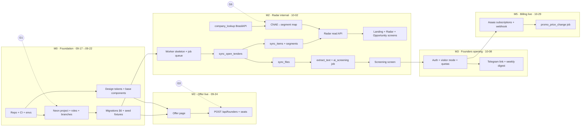

# LicitaQui · Development Plan

> **Claims:** a card that exists because the product already promised something
> has a row in [`CLAIMS.md`](CLAIMS.md) as well — currently **D8**, **E5**, **E6**,
> **B8** and **D11b**. The card says what to build; the register says what was
> promised, where it renders and when it comes due. Close the row with evidence
> per recipient, never with a deploy.

> Version 0.3 · 2026-09-17 · companion to `TECHNICAL_SPEC.md` (v0.4) and the viability study (v10)
> Team: **one developer (Sci) + Claude Code agents**, 40+ h/week. Dates follow the Phase 0 schedule in the study.

---

## 1. Are we ready to start?

**Yes — development can start today.** Architecture, data model, UI, brand, prices and the core logic (PNCP collection, AI reading with answer keys) already exist. What is missing is a short list of decisions, accounts and one real product gap. None blocks day 1, but each blocks a specific milestone, so each has a due date.

### 1.1 What we already have

| Area | Artifact | Status |
|---|---|---|
| Architecture, data model, API, cache, security | `TECHNICAL_SPEC.md` | ✅ ready |
| UI (9 mobile screens + 5 web boards + design system) | "Wireframes LicitaQui" canvas | ✅ approved |
| Brand (symbol, wordmark, PWA icons, bot avatar) | `Marca/assest/` | ✅ ready |
| Offer and Landing (copy + layout) | `paginas/oferta_fundadores.html`, `paginas/landing_radar.html` | ✅ preview, to port to Next.js |
| PNCP search, items, files, download, circuit breaker | `poc1_licitacoes.py` | ✅ validated on real data |
| Awards (winners) and discount bands | `poc3_resultados.py`, `poc3_categorias.py` | ✅ validated |
| Keyword/NCM segmentation (14 segments) + false positives | `poc1_licitacoes.py` | ✅ validated |
| AI screening (lite) and deep analysis, citation check, rules in code | `poc4_ia_edital.py` | ✅ 57/58 and 68/69 on answer keys |
| Evaluation harness + 3 answer keys | `poc4_avaliar.py`, `gabaritos/` | ✅ ready for CI |
| Prices, quotas, unit economics, Phase 0 gates | viability study v10 | ✅ decided |

### 1.2 Decisions and gaps (status on 09-17)

**Decided today:** Neon through the Vercel Marketplace, as a new project (new Vercel database resource) · EC2/Easypanel unchanged, no new cost · Resend test sender during development · WhatsApp via Evolution API and Telegram connected during development · Vercel URL for now (no domain) · GitHub/Vercel org `scintechn`, Sentry, OpenRouter and Asaas (sandbox + production) already exist · existing Telegram bot used temporarily · login by email link + Google · 5 screenings/month on Básico · visitor limit counted per device and per CNPJ · customer invoices (NF) decided later.

| # | Item | Type | Blocks | Status / default | Due |
|---|---|---|---|---|---|
| G1 | Neon via Vercel: Storage → Create database → Neon, **Free** plan, region closest to users and functions (São Paulo if offered, else N. Virginia; cannot be changed later); roles `app` and `migrator` | account | M0 foundation | ✅ decided · create | **09-18** |
| G2 | Email: Resend. **The sending domain is verified** (legal brief §1, 21/09), which was the one condition U1 gated magic-link sign-in on — so the gap is closed and the flag was never flipped | account | email to real users (magic link, welcome, opening) | ✅ domain verified. **Magic link is built and switched off**: see card U2 | **now** — without it, "I do not want a Google account" means "I cannot have an account" |
| G3 | Privacy policy + Terms of use, incl. LGPD consent and the **Promocional price-change clause** (R$ 26 → R$ 57 in month 7, 30-day notice) | legal | M1 Offer live | Open — no default | **09-23** |
| G4 | Accounts: new OpenRouter API key with spend cap; new Sentry projects (`licitaqui-web`, `licitaqui-worker`); Vercel project in `scintechn` (Pro); GitHub repo `scintechn/licitaqui`; Asaas sandbox keys in Vercel preview, production keys only in production | accounts | M0–M1 | Mostly ✅ (accounts exist) · create keys/projects | **09-19** |
| G5 | **Rotate** the Mercado Livre and SearchApi keys exposed in earlier sessions | security | before any production deploy | Open | **09-21** |
| G6 | **CNAE → segment map does not exist.** POCs classify *items* into 14 segments by NCM/keywords; nothing maps a company's CNAEs to those segments, so "Compatível / Verificar" cannot be computed yet | product gap | M2 Radar | Task B6 (seed table + review) | **10-01** |
| G7 | Spike: PNCP period endpoints (`/v1/contratacoes/publicacao`, `/atualizacao`) vs. the search API used in the POCs | technical | M2 sync design | ✅ **Resolved 09-17 — default overturned.** B2 builds on `/v1/contratacoes/atualizacao`, search sweep as fallback behind the §7.2 breaker. Rationale and measurements: `docs/adr/0001-pncp-incremental-sync-endpoint.md` | done |
| G8 | Spike: BrasilAPI CNPJ (fields, rate limits, failure rate) | technical | M2 CNPJ entry | ✅ **Resolved 09-17.** Use BrasilAPI; keep manual CNAE entry as a tested fallback, not a rescue. 45 real supplier CNPJs, 0 failures, 0.52 s median, CNAE 45/45. Rate limit **unmeasured** (the burst hit Vercel's edge cache) → keep lookups single-threaded. `docs/adr/0002-cnpj-lookup-via-brasilapi.md` | done |
| G9 | Telegram (existing bot, temporary) and WhatsApp (**Evolution API** on Easypanel): connected during development. A Telegram bot has a single webhook URL, so check the bot is not serving another system when connecting it | integration | M1 WhatsApp welcome, M3 Telegram linking | ✅ decided · tasks E1, E2 | E2 by 09-26 · E1 by 10-07 |
| G10 | Message texts: founders welcome, founders opening (email + WhatsApp), Telegram `/start` flow, weekly digest, 30-day price notice, payment confirmation | content | M1, M3, M5 | Open — task E0: Claude drafts, Sci approves | **10-05** |
| G11 | Screens not in the canvas: magic-link sent, error/"PNCP unavailable", cancel subscription, `/admin` (gates, founders list, concierge digest builder) | design | M3–M5 | Build from design-system components without a new canvas round | as built |
| G12 | Asaas production: company data, bank account, webhook URL (Vercel URL), production API key | account | M5 billing live | ✅ account exists · configure | **10-20** |
| G13 | Customer invoices (NF) | legal/tax | not blocking Phase 0 | Later, with the accountant; no invoice promise in the product | — |
| G14 | Stay inside Neon Free (0.5 GB, 100 CU-hours): worker polls every 2 min + `/wake`, files in S3, usage shown in `/admin` with 80% alerts | technical | none (no cost change expected) | ✅ built into A2, B1, O1 | ongoing |

---

## 2. How one person + Claude Code runs parallel work

1. **Contracts first.** Parallel agents only work if they share fixed contracts: the DB schema (migrations), the job table, and TypeScript types for API responses. Milestone M0 delivers these before any feature work.
2. **One stream = one git worktree = one Claude Code agent.** Each agent gets a task card (section 5) with inputs, acceptance criteria and the files it owns. Agents never edit files owned by another stream in the same cycle.
3. **Max 3 agents at a time.** The bottleneck is your review, not code generation. Queue the rest.
4. **Trunk-based, small PRs.** Every PR: CI green (lint, types, tests), preview deploy checked on a phone, merged the same day. No long-lived branches.
5. **Shared fixtures.** The 3 answer-key tenders (`gabaritos/`) plus 20 cached PNCP responses become the seed data for local dev, tests and previews, so web work never waits for the worker.
6. **You own:** decisions (section 1.2), reviews, production deploys, secrets, anything with money or legal text, and the non-dev track (influencers, interviews, concierge).

### Suggested `CLAUDE.md` for the repo

```markdown
# LicitaQui — agent guide
- Read docs/TECHNICAL_SPEC.md and docs/DEVELOPMENT_PLAN.md before any task. The task card is the scope; do not widen it.
- Code, identifiers, tables, commits: English. User-facing copy: Brazilian Portuguese in apps/web/messages/pt-BR.json.
- Never read PNCP/BrasilAPI/OpenRouter inside a web request; enqueue a job (spec §3).
- Never commit secrets. Use .env.example. Never log CPF, emails or tokens.
- Every change: tests for new logic, `pnpm lint && pnpm typecheck && pnpm test` (web) or `ruff && pytest` (worker) green.
- Schema changes only via db/migrations, in their own PR.
- AI prompt or extraction changes must run `worker/evaluation` and report the score diff.
- Design: use tokens from apps/web/styles/tokens.css (Ivory/Graphite/Blue, Archivo/IBM Plex). Brand name is always "LicitaQui".
```

---

## 3. Critical path and dependencies


```mermaid
flowchart LR
  subgraph M0["M0 · Foundation · 09-17→09-22"]
    A1[Repo + CI + envs] --> A2[Neon project + roles + branches]
    A2 --> A3[Migrations §6 + seed fixtures]
    A1 --> D1[Design tokens + base components]
  end
  subgraph M1["M1 · Offer live · 09-24"]
    D2[Offer page] --> F1[POST /api/founders + seats]
  end
  subgraph M2["M2 · Radar internal · 10-02"]
    B1[Worker skeleton + job queue] --> B2[sync_open_tenders]
    B2 --> B3[sync_items + segments]
    B2 --> B4[sync_files]
    B5[company_lookup BrasilAPI] --> B6[CNAE→segment map]
    B3 --> R1[Radar read API]
    B6 --> R1
    R1 --> D3[Landing + Radar + Opportunity screens]
    B4 --> C1[extract_text + ai_screening job]
    C1 --> D4[Screening screen]
  end
  subgraph M3["M3 · Founders opening · 10-08"]
    U1[Auth + visitor mode + quotas] --> E1[Telegram link + weekly digest]
  end
  subgraph M5["M5 · Billing live · 10-29"]
    P1[Asaas subscriptions + webhook] --> P2[promo_price_change job]
  end
  A3 --> D2
  A3 --> B1
  D1 --> D2
  D4 --> U1
  U1 --> P1
  G1((G1)) -.-> A2
  G3((G3)) -.-> F1
  G6((G6)) -.-> B6
```

**Critical path (anything late here moves 10-08):** A1 → A2 → A3 → B1 → B2 → B3 + B6 → R1 → D3 → C1 → D4 → U1 → E1.

**Safe to run in parallel with the critical path:** design tokens/components (D1), Offer page (D2/F1), BrasilAPI + CNAE map (B5/B6), AI job port (C1, against fixtures), email/Telegram texts (G10), `/admin` events (O1), and — from October — the awards backfill (B8), which needs weeks of collection before the Essencial price bands are meaningful.

---

## 4. Milestones

| Milestone | Date | Ships | Exit criteria |
|---|---|---|---|
| **M0 Foundation** | Tue 09-22 | Monorepo, CI, Vercel preview + prod on the `vercel.app` URL, Neon project with `main`/`dev` and preview branches, all migrations from spec §6, seed fixtures, design tokens | `pnpm dev` runs locally against the Neon `dev` branch with seeded tenders; a PR gets a preview URL with its own Neon branch; point-in-time restore tested on a branch |
| **M1 Offer live** | Thu 09-24 | Founders page on the Vercel URL, seat counter (25 sold, 17 open), consent, on-screen confirmation, events `offer_viewed`/`founder_signed_up`; WhatsApp welcome via Evolution API by 09-26 (E2) | seat race test passes at the open cap; privacy policy linked; signup lands in DB; welcome delivered to opted-in founders |
| **M2 Radar (internal)** | Fri 10-02 | Worker in production syncing open tenders every 30 min; CNPJ → CNAE → segments; Landing, Radar (Compatível/Verificar/Palavra-chave), Opportunity, AI Screening (visitor, 2 free) | Real CNPJs return plausible lists; screening of the 3 answer-key tenders scores ≥ 95% in CI; no request waits on PNCP |
| **M3 Founders opening** | Thu 10-08, 19:00 | Opening notice by WhatsApp (Evolution API); accounts (Google **and** magic link — the domain is verified, so **U2** turns it on; without it there is no account for anyone who refuses Google), visitor 3-day/2-screening limits, files unlocked with account, Telegram linking (**E3** — the journey is a launch blocker: linking silently fails for anyone who already has a chat with the bot), weekly digest job, `/admin` gate dashboard | Founders receive access email; Telegram `/start` links in one tap; quotas enforced server-side |
| **M4 Public Landing** | Tue 10-13 | Hardening: rate limits, error states, SEO for public pages, PWA install, uptime monitors | Load test (100 concurrent visitors) without errors; Lighthouse mobile ≥ 90 |
| **M5 Billing live** | Thu 10-29 (sandbox done 10-23) | Asaas subscriptions (Promocional R$ 57, Essencial R$ 75) on sandbox then production, checkout link, idempotent webhook, `promo_ends_on` + 30-day notice + automatic change to R$ 75, 1-click cancel, **every billing message ours** (F4): reminder 3 days before each charge, payment-failed and suspension notices — Asaas customer notifications stay off | Full sandbox cycle incl. repeated webhooks and price change simulated with a clock override; exactly one reminder per charge cycle and none for a cancelled subscription; subscription link sent to the founders |
| **M6 Gate 0** | Fri 11-06 | Numbers from `/admin` | See study: ≥ 150 founders signed up, ≥ 300 CNPJs, ≥ 100 Telegram, ≥ 6/20 concierge paying, ≥ 15/25 seats paid, ≥ 50% digest opens |
| **v1 Essencial** | build 11-09 → 01-08 · release **Mon 2027-01-11** | Winning price band by state, target purchase price + margin calculator, daily alerts (10 keywords + CNAE), ME/EPP and value filters, deep analysis with quota, billing: plan management and invoices list (the 3-day charge reminder ships earlier, in M5 — task F4) | Gate 1: ≥ 15 paying Essencial-equivalents, month-1 churn < 10% |
| **v2 Pro** | build 01-11 → 02-26 · release **Mon 2027-03-01** | Competitors (name, CNPJ), market price (SearchApi), opportunity score, WhatsApp alerts + triggers, OCR | Gate 2: ≥ 25% of base on Pro, AI cost ≤ R$ 11 per Pro user |

---

## 5. Task cards (Phase 0)

Legend — **Stream**: A Platform · B Data/worker · C AI · D Web · E Messaging · F Billing · O Ops/admin · S Sci only.
**Size** is agent-days of focused work including your review. **∥** = can run in parallel with the other ∥ tasks of the same week.

### Week 0–1 · 09-17 → 09-24 (M0, M1)

| ID | Stream | Task | Depends on | ∥ | Size | Acceptance criteria |
|---|---|---|---|---|---|---|
| S1 | S | Close G1 (EC2 region → Neon project), G4, G5, G9; start G2 and G3 | — | ∥ | — | Neon project in the right region; new keys created; old keys revoked |
| A1 | A | Repo `scintechn/licitaqui`: monorepo (`apps/web`, `worker`, `db`, `docs`), pnpm, ruff, CI workflows, `.env.example`, `CLAUDE.md`, secret scanning; Vercel project (Root Directory `apps/web`), Sentry DSNs | — | ∥ | 1 | CI green on an empty PR; preview deploy URL on `vercel.app` |
| A2 | A | Neon via Vercel Storage: database `licitaqui` (region per G1, Free plan), roles `app`/`migrator`, extensions (`unaccent`, `pg_trgm`, `citext`); `DATABASE_URL` in Vercel, `DATABASE_URL_UNPOOLED` in Easypanel and GitHub secrets; preview branching + GitHub Action deleting the branch on PR close (or one shared `preview` branch); `dev` branch; weekly `pg_dump` to S3 job stub | G1 | | 0.5 | Preview deploy uses a preview branch that disappears when the PR closes; restore of a test table on a branch works |
| A3 | A | Migrations for spec §6.1–6.3 (tenders, items, files, awards, companies, visitors, users, plan_limits, usage, ai_analyses, telegram_links, alerts, subscriptions incl. `promo_ends_on`, founders_list, jobs, events) + seed from `gabaritos/` and 20 cached PNCP responses | A2 | | 1.5 | `db:migrate` + `db:seed` idempotent; seed shows 20 tenders with items |
| D1 | D | Tailwind tokens from the design system, fonts (Archivo with width axis, IBM Plex), base components (Button, Field, Status, Tag, Card, AppBar, locked block, analyzing/empty states), logo component | A1 | ∥ | 1.5 | Storybook-like `/dev/components` page matches the canvas Design System board |
| D2 | D | Port Offer page to Next.js (`/fundadores`), static + ISR, remove preview banner | D1 | | 1 | Matches `paginas/oferta_fundadores.html` on 390 px and 1280 px |
| F1 | D | `POST /api/founders` (Zod, rate limit, seat assignment in a transaction), `GET /api/founders/seats`, confirmation screen with seat number, enqueue WhatsApp welcome (E2), events | A3, D2, G3 | | 1 | Concurrency test: 60 parallel signups → seats 1..48 unique, 12 on waitlist |
| O1 | O | `events` writer + `/admin` shell (auth by allowlist), founders table view, Neon usage card (storage, CU-hours, 80% alert) | A3 | ∥ | 0.5 | Sci can see signups and export CSV; usage card shows real numbers |
| E2 | E | WhatsApp via Evolution API: worker client, `send_whatsapp` job (opt-in only, ≈ 1 message / 20–30 s, retries, delivery log, "SAIR" opt-out), founders welcome template; `/admin` button for the opening broadcast | B1 (or a minimal job runner), E0 welcome text | ∥ | 1 | Welcome reaches 3 test numbers; opt-out stops further messages; no message without consent |
| S2 | S | Approve Offer copy; start influencer outreach and community posts once live | M1 | ∥ | — | — |

### Week 1–2 · 09-21 → 10-02 (M2)

> **B17 and B18 gate this milestone's exit criteria, though their rows sit in the
> Week 4–6 table.** M2 exits on *"real CNPJs return plausible lists"*, and the Radar
> holds 44% of the editais PNCP calls open (#140). A list missing 37 editais that close
> within three days is not plausible, so B17 is an M2 blocker and not an M4/M5 task —
> resolving the priority question #140 left open. Their rows are left where they are;
> the dates in them are correct.

| ID | Stream | Task | Depends on | ∥ | Size | Acceptance criteria |
|---|---|---|---|---|---|---|
| B0 | B | Spikes G7 (PNCP period endpoints) and G8 (BrasilAPI) with a short written result in `docs/adr/` | — | ∥ | 0.5 | ADR with recommendation and measured error rates |
| B1 | B | Worker skeleton: Dockerfile, psycopg, job consumer (`FOR UPDATE SKIP LOCKED`, idle poll every 2 min), authenticated `POST /wake`, scheduler, retries/backoff, circuit breaker, health endpoint, Sentry; deploy to Easypanel via GHCR | A3 | | 1.5 | Two consumers never run the same job; failing job retries 4× then `failed`; Neon compute suspends when idle; `/wake` picks a priority-1 job in < 5 s |
| B2 | B | `sync_open_tenders` ported from POC 1 (search by state × modality, upsert, change detection by `pncp_updated_at`) | B1, B0 | | 1.5 | Full SP sweep < 30 min; rerun creates 0 duplicates |
| B3 | B | `sync_items` + segments + false positives + ME/EPP summary + favored-treatment rule | B2 | ∥ | 1 | Unit tests reproduce POC 1 classification on fixtures |
| B4 | B | `sync_files` (list only; download on demand) | B2 | ∥ | 0.5 | Amendment adds a file and invalidates text/screening |
| B5 | B | `company_lookup` (BrasilAPI, 30-day cache, failure → manual CNAE flag) | B1, B0 | ∥ | 0.5 | 50 real CNPJs; failures surface the manual path |
| B6 | B | **CNAE → segment map (G6):** table `cnae_segments(cnae, segment, fit: compatible\|check)`; seed by Claude from the CNAE list (IBGE) against the 14 segments; Sci reviews the top 150 CNAEs used by MEI/ME retail and services | B5 | ∥ | 1.5 | 20 hand-picked CNPJs (papelaria, limpeza, TI, hospitalar…) classified as expected |
| C1 | C | ~~**Built — this is the `ai_screening` that produces every triagem in production; the card was never marked.** D26 depends on it and is therefore not blocked.~~ Port POC 4 to `worker/licitaqui/ai_tender.py`: `extract_text`, page selection, lite prompt v2, citation check, rules; `ai_screening` job; cost logging; `evaluate-ai.yml` in CI | B1 (fixtures OK before B4) | ∥ | 2 | CI evaluation on 3 answer keys ≥ 95%; scanned PDF → `no_text`, no AI call |
| R1 | D | Read APIs: `POST /api/radar/cnpj`, `GET /api/radar/tenders`, `GET /api/tenders/:id`, `POST /api/tenders/:id/screening`, `GET /api/jobs/:id`; `readOrEnqueue()` with TTLs | A3, B3, B6 | | 1.5 | Contract tests on seed data; stale data served + refresh job enqueued |
| D3 | D | Landing (`/`), Radar, Opportunity screens (canvas 01–03) on seed data first, then real data | D1, R1 | | 2 | Visual match on 390 px; empty and analyzing states work |
| D4 | D | Screening screen (canvas 04) + locked price block (05) + visitor banner | D3, C1 | | 1 | Screening of a real tender renders with page references |
| D5 | D | **Canvas 09, the menu — designed, never carded, never built.** `docs/design/wireframes/Menu.dc.html` has existed since the design set was drawn and `grep -in 'menu\|navega\|hamburg' docs/DEVELOPMENT_PLAN.md` returns **nothing**: not a "later" left in a comment like `short_title`, but a whole screen that never became a task. `AppBar` takes `leading`, `title`, `actions` and renders nothing else — there is no drawer, no nav, no plan strip. **The cost is not cosmetic.** A signed-in person today cannot see, from any screen they actually use, what plan they are on, how many triagens are left this month, how many alerts they get, or even that they are signed in: that state lives only on `/conta`, which nothing links to from the Radar except a bare person icon. Canvas 09 puts all of it where people look — `PRINCIPAL` (Radar · Alertas · Minha empresa · Plano e pagamento), `CONTA` (Perfil · Ajuda), and a footer card reading `Plano Básico · 3 de 5 triagens usadas no mês · 1 alerta semanal` over a progress bar with `Conhecer o Essencial →`. The numbers are already computable — `readLimit` + `countUsage` per `quota.ts`, the same pair the triagem screen uses. **Sci asked to bring this forward (2026-09-24), ahead of the rest of the founders-page work, because it is the fix for a real gap rather than a polish item.** Watch three things the rest of the repo has already been bitten by: the drawer is a modal surface, so the dialog acceptance criteria written for B16 (focus trap, focus restoration, Escape, background inertness, scroll position restored on close) apply here **first** and should be built once and shared; the plan strip must render for a visitor as well, saying what a visitor has rather than nothing; and `components/tabs.tsx`'s `role="tablist"` problem is a warning about half-implemented ARIA patterns, not a precedent to copy | — | ∥ | 1 | The drawer opens from every app screen, keyboard and screen-reader complete against B16's dialog criteria; the footer card shows plan, triagens used of the limit, and alert cadence, for a signed-in user **and** for a visitor; every number comes from `plan_limits` rather than a literal; nothing in it is a second copy of a string that already exists in `pt-BR.json` |
| D6 | D | ~~**Cadence half done 2026-09-29**, and the entitlement half was already done — `plan_limits` now carries `alert · week · 1` for all four plans, verified against the database, so the menu correctly reads *"1 alerta semanal"*. `plans.essential.feature2` moved from *"Avisos diários"* to *"Avisos semanais"*, Sci's decision over building a daily job. **What is left is not this card**: the same sentence promises 10 keywords and the product delivers one — **E18**. Original card:~~ **`/fundadores` sells daily Telegram alerts that do not exist and that no plan entitles.** The page says *"toda semana no Básico, **todo dia no Essencial**"*. The scheduler holds exactly one digest — `ScheduleEntry(kind="weekly_digest", daily_at="07:00", weekday=0)`, Monday only — and there is no daily job of any kind in `worker/licitaqui/`. Worse, `plan_limits` carries an `alert` row for **`basico` alone** (`('basico','alert','week',1)`), and `readLimit`'s own comment says *"No row: the plan does not include the feature. Not 'unlimited'."* — so an Essencial subscriber resolves to **zero** alerts **in the web**. **Correction, 2026-09-24 — the original card overstated this and the migration records why:** the worker reads the same absence the *other* way. `telegram_alerts.py:50-57` treats a missing cap as **uncapped** for the weekly digest, deliberately, "because reading a missing row as zero would silence every founder on `promocional` on opening week", and logs `plan has no alert limit` so the gap stays visible. So **no paid subscriber has ever been silenced** — what broke is that the *web* displays zero, which canvas 09's plan strip printed as "sem alertas neste plano" the moment `FEATURES.alert` gave it a row to read. **And the page was not inventing the cadence.** §10 line 382 defines a `daily_alerts` job (every day 07:00 BRT, Essencial) and line 455 gives Essencial "daily, 10 keywords + CNAE" — marked **new**, listed under a later phase at line 570, while Phase 0's scope at line 563 is "Telegram linking, **weekly alert**. Founders opening 10-08". So `/fundadores` was describing the roadmap while selling Phase 0 access. CDC art. 30 still binds an advertised feature, which is why the copy moves to what a founder actually receives on 08/10 — not because the claim was invented. Two halves, and the copy half is the urgent one: (a) the sentence must describe what exists — drafted for Sci 2026-09-24, and it is his under legal brief §5; (b) `plan_limits` needs `alert` rows for `promocional`, `essencial` and `pro` whatever the cadence turns out to be, or a paid subscriber silently gets nothing. Do **not** ship a daily digest to satisfy the sentence without deciding the cadence deliberately: a daily message is a different product promise from a weekly one, and §7.1 wrote the weekly one on purpose | — | ∥ | 0.5 | The page describes the cadence the scheduler actually runs; `plan_limits` has an `alert` row for every paid plan; a test reads the page's cadence claim against `plan_limits` rather than against a literal, so the two cannot drift again |
| D7 | D | **"Acesso antes de todos" points at the wrong feature.** `/fundadores` says *"Você usa o Radar **antes da abertura pública**"* — but the Radar is public right now at `/radar`, with no account, two free triagens and a three-day window. Whatever a founder is buying, early access to the Radar is not it. **Sci, 2026-09-24: the real prime feature is the price range — the band the winners actually closed at, and the maximum to pay a supplier to keep a margin.** That is `Preco.dc.html` / `price-view.tsx`, it is Essencial, and today it renders entirely as `LockedValue` bars. So the benefit the page should name is the one the founder price unlocks, not a screen anyone can already open. Copy is Sci's (§5); draft supplied 2026-09-24. Note the related finding from the persona walkthrough: the price screen promises three numbers in its intro and shows none of them, with the one genuinely useful thing — the papel A4 worked example — below both locked cards | D6 | ∥ | 0.25 | No sentence on `/fundadores` offers early access to something already public; the founder benefit names the price range; the claim matches what Essencial actually unlocks |
| D8 | D | **Two promises on `/fundadores` with no machinery: "cancela em 1 clique" and "aviso 3 dias antes de cada cobrança".** Both sit in the comparison table as differentiators against competitors charging from R$ 397/mês. Neither exists: there is no cancel flow under `apps/web/app/conta`, no billing-reminder job kind in the worker, and no scheduler entry for one. **Sci, 2026-09-24: not built yet, and it belongs in the next phase, before the paid moment starts.** So this is a build-before-the-date item rather than a live falsehood — billing does not open until 08/10 — but the page is taking sign-ups on those two sentences today, and CDC art. 30 binds from the moment the claim is published, not from the moment money moves. The cancel path is also the other half of a promise already made in `billing.cancel.body` ("Sua conta volta para o plano Básico"), which describes a flow nothing implements. Sequence it with F-stream billing, not after it | F2 | | 1 | Cancelling is one action from `/conta`, with no confirmation maze, and moves the account to Básico exactly as `billing.cancel.body` says; a reminder reaches the subscriber three days before each charge; both are live before the first real charge, not before the first sign-up  **Escalated 2026-09-25.** The founders welcome e-mail was promoted from draft to approved that day and says *"Sem fidelidade. Você cancela quando quiser, em um clique."* Sci's decision: the one-click cancel is in the plan to be developed, so the claim stays. That makes this card a **hard dependency on 08/10** rather than a tidy-up — an e-mail cannot be corrected after it is delivered, and billing opens on the same date the claim comes due. The sibling promise, *"aviso 3 dias antes de cada cobrança"*, has the same shape and the same date. |
| E0 | E | Draft all email, WhatsApp and Telegram texts (G10) in `messages/pt-BR.json` and `worker/templates/` (welcome and opening first) | — | ∥ | 0.5 | Sci approves |
| D9 | D | **Three `foundersPage.ruler.*` strings no longer render, and only Sci can delete them.** The price example on `/fundadores` was a bar with four marks on a R$ 10 – R$ 40 scale; it is now a chain of four labelled steps, because at 390px the green "still profitable" zone measured **47px of 308** and `R$ 14,60` — the number the product exists to produce — was set at 16px against a competitor's 34px. The chain renders `tender`, `winner`, `retail` and `maxPurchase` with their values, and the verdict keeps `verdictLead`/`verdictBody`. What it has no place for is the three strings that described the *ruler*: **`alt`** ("Régua de preço: …", the `aria-label` of a `role="img"` that no longer exists — the chain is real text and reads in order without it), and **`scaleStart`** / **`scaleEnd`** ("R$ 10" and "R$ 40", the endpoints of an axis that is gone). They are left in the catalogue deliberately: copy on this page is the founder's under the legal brief (§5), and deleting a string is not a rendering change. This is the same shape as `radar.list.changeCompany` — approved copy rendered nowhere — so it gets a card rather than a sentence in a comment. Nothing is broken while they sit there; the cost is a catalogue that overstates what ships | — | ∥ | 0.1 | Sci confirms the three strings are no longer wanted and they leave `pt-BR.json`, or says to keep them and the reason is recorded here |
| D10 | D | **(a) is delivered** by `feat/founders-layout` (the commit *"say whose price each column holds when the table stops being one"*): the `<thead>` goes to `display:none` below 560px and the two inline labels lose `aria-hidden`, so each value is announced with the name of its column; asserted by a journey at 390px that reads the accessibility tree, not the markup. **(b) and (c) remain open.** **Three accessibility defects in the brand panel shipped by PR #99, found by review afterwards.** All three are on `main` now; the founders-structure PR (#101) touches none of them, which is why they are a card and not a fix there. **(a) The comparison table loses its column headers below 559px.** `page.tsx` sets `display:block` on `table`/`tbody`/`tr`/`td` to stack it, which strips the implicit table roles in every major browser, so the `<th scope="col">` ↔ `<td>` association does not survive — and the visible substitutes that replace them are `aria-hidden`. Measured in Chromium at 390px. A screen-reader user at phone width therefore hears *"Preço de entrada / a partir de R$ 397/mês / R$ 26/mês"* with **nothing saying which is the competitor and which is ours**, on the block whose entire purpose is that comparison, on a page taking money. It is a regression: before #99 the table kept its semantics at every width. The guarding test asserts only that the two stacking classes are present — the classes that *cause* it — so it cannot fail for this. Fix: explicit `role="table"/"rowgroup"/"row"/"cell"/"columnheader"` on the stacked elements, or drop `aria-hidden` from the inline labels so they carry the association. **(b) Three contrast justifications name pairs nothing paints.** Recomputed with the formula `styles/contrast.test.ts` uses: the comment says the graphite faint tier is "3.22:1" on the panel (it is **5.51:1**) and that `blue-on-ink` is "2.71:1 and invisible" (it is **5.69:1** — *higher* than the 5.06:1 replacement). Those two figures are the `#2457d6` arithmetic from a different background. And `--color-icon-on-brand` is annotated `5.06:1`, which is against the panel, while the icon is painted on `brand-raised`, where it measures **3.82:1** — exactly the mistake `contrast.test.ts`'s own header exists to prevent. The swap is still right on the numbers; the recorded reasons are wrong. **(c) `contrast.test.ts` never saw this ramp.** `PAIRS` still guards `on-ink`/`on-ink-muted` against `ink`, which nothing paints any more, and none of the four live `on-brand*` pairs — nor `icon-on-brand` on `brand-raised` — is in any test. Also worth a decision, not a default: the global focus ring is `--color-blue`, which was 2.91:1 on the old graphite panel and is **1.87:1** on `brand-panel`, and the panel's CTA is the only focusable thing on it | — | ∥ | 0.5 | The stacked comparison table announces which column each value belongs to, verified with a screen reader at 390px; every contrast figure in a comment or token annotation names the surface the colour is actually painted on; `contrast.test.ts` guards the four `on-brand*` pairs and `icon-on-brand` on `brand-raised`; the focus ring on the brand panel is measured and either changed or accepted in writing |
| D11 | D | **The Landing's example goes stale on 30/09.** *(Scope changed 2026-09-24: `ExampleRadar` was removed from `/fundadores` when the hero took the product shot, so this is now the Landing's alone — `app/(public)/page.tsx:241`. The date is unchanged.)* **The example goes stale eight days before the founders page's own opening.** `lib/radar/landing-example.ts` freezes `EXAMPLE_NOW` at 2026-09-17 and all three tenders close on **2026-09-30** (BRT), so every card renders `13 dias` and `Proposta até 30/09 · 08:30` permanently. From **01/10** the hero of the page taking founder sign-ups shows three tenders whose stated deadline has passed, each under a countdown — and the founders list opens to the product on 08/10, so the whole final week runs in that state. Pre-existing `ExampleRadar` behaviour, and the caption does disclose *como estavam em 17/09/2026* (verified rendered and visible at every width); PR #101 promoted it into the hero of the conversion page and this PR removed it from there again, so the exposure is back to the Landing only — where it is still the first product a visitor sees. Refreeze the example on later tenders, or pick ones already closed so the caption and the cards agree. **Has a hard date: do it before 30/09.** *(Done 2026-09-24, `fix/landing-example-stale`, and by neither of those two routes — both re-date the defect or need database credentials nobody in that session had. The third answer: **the example's facts stay frozen and its clock stops being one.** `EXAMPLE_NOW` is deleted, the panel renders against the real clock at build and at every revalidation, and the card's own gate — `mayShowUrgency`, §2.2 rule 6, already shipped — drops the countdown and relabels the line *"Data anterior 30/09"* once that card's session hour has passed — at the first revalidation after it, so up to ten minutes later on a busy page and longer on a quiet one (`revalidate = 600`, stale-while-revalidate), where the frozen clock was permanent. Real days count down until 30/09; after it the panel is three dated examples that no longer claim to be open, which is what the caption has always said. **No new copy**: `card.previousDeadline` already existed for exactly this. Re-freezing on a later constant now fails a test instead of shipping: `app/(public)/example-radar.test.tsx` renders the whole Landing at five moved clocks — 24/09, 29/09 23:00 BRT, 30/09 08:00 BRT, 01/10/2026 and 01/01/2030 — and the acceptance criterion is checked at the clock it names rather than waited for. **Not done, and Sci's:** refreshing *which* editais the example shows. That needs real PNCP rows and would move three approved strings (`landing.alerts.items`, `landing.opportunity.tender`/`.deadlineValue`) that name these same three tenders at 30/09 — see D11b.)* | D10 | ∥ | 0.5 | On 01/10 the `/fundadores` hero shows no tender whose stated proposal deadline has passed while a countdown says days remain — and, since this card's own scope note moves `ExampleRadar` off that page, the same of `/`, checked at a moved clock rather than waited for |
| D12 | D | **The page now makes the same claims three times, and the trust row drops half of two approved sentences.** `hero.promises` (four bullets) → the new `Trust` row (the same first three, longer bodies) → `Pillars` (all four again) — the first two are both within the first screen and a half at 900px. Worse than the repetition: `Trust` renders `item.title` + `item.body` and **omits `item.plan`**, so the first product claims a visitor meets carry no plan attribution — the AI reading loses **`Básico com limite`** and the price band loses **`Essencial`**. A founder is not over-promised (the offer is "tudo do Essencial"), but the page is public and the strings are approved copy under the legal brief, so dropping half of a sentence is a copy decision, not a rendering one. Nothing asserts either presence or absence. **Sci decides** which of the two sections carries these sentences and whether the plan tag travels with them; §5 means the wording itself is his either way. | D10 | ∥ | 0.25 | Each approved pillar sentence appears once on the page, with whatever plan attribution Sci decides, and a test holds it there |
| D13 | D | **`/fundadores` layout pass — five sections, against an approved design draft.** Layout only; no user-facing string written, changed or moved between sections, and `messages/pt-BR.json` untouched. `SectionHead` gains an opt-in `aside` (heading left at ~45%, the section's supporting material right, one column below 900px) with the 720px stack unchanged as the default. `Pain` becomes a numbered `<ol>` with an icon per item and `01/02/03` in mono, and its two market figures move into the heading's second column. `Pillars` becomes one bordered band with hairline dividers instead of four cards, keeping all four items and their plan labels. `Timeline` gets the icon box, the numeral and `arrowRight` between consecutive steps (decorative, absent below 900px); `clock` and `link` added to `icon.tsx`. `FounderValue` raises the price benefit to `--text-stat`, gives the rest check glyphs and moves the full-width CTA under the offer. **The draft's dark green is not taken** — green is `success` in this product — and no type token is added or changed: `--text-section` stays 26→38px and only the measure narrows. | D2, D9, D12 | | 1 | No string added, removed or relocated (asserted by diffing the rendered catalogue references against the base). `scrollWidth == clientWidth` at 390, 440, 560, 700, 900 and 1280 with nothing crossing either edge. The pillars band draws the right dividers at all three tiers, asserted from computed style at 390/700/1280 — the 560–899 tier is where the first attempt was wrong. Keyboard focus reaches the panel's CTA; the FAQ accordion and the skip link still work. **Open for Sci:** the draft shows `R$ 57` struck through under the price and `founderValue` has no standalone string for it (the R$ 57 is inside `benefits[0].body`), so it was not built — it needs a catalogue decision, not a layout one. |
| D14 | D | **Approved copy that stopped rendering when `/fundadores` took the draft's shape — none of it deleted, because §5 makes the wording Sci's.** Seven keys, by path. **(a) `foundersPage.pillars.title`** — *"Da busca à proposta, com a conta feita."* — was the `<h2>` of the four-card *O que você vai usar* section. That section is gone: its four claims are the band under the hero, which carries no heading of its own because it sits above the page's first `<h2>` (an `<h3>` per cell would take the outline from `h1` straight to `h3`). `pillars.label` still renders, in the header's anchor nav, and `#tool` now points at the band. **(b) `foundersPage.pillars.items[0..3].title`** — *Encontrar*, *Entender*, *Ofertar com lucro*, *Antes do prazo* — the band titles each cell with `hero.promises[i]` instead, which is the descriptive line the draft shows (*"Editais compatíveis com o seu CNAE"*) against a bare verb. Their bodies and plan labels do still render, in that band. Note that *Encontrar* and *Entender* reappear on the page from **`pain.items[0..1].title`**, which Sci rewrote the same day: the strings are on screen, the `pillars` keys are not. **(c) `foundersPage.pain.facts[0..1]`** (value + label) **and `foundersPage.pain.source`** — the heading's second column now holds `pain.standfirst`, which Sci wrote for that position. **`R$ 272,6 bi` was the page's only statement of market size and it is sourced**; after this it appears nowhere. The competitor anchor is not lost — `R$ 397/mês` survives in `founderValue.comparisonRows` (*"Preço de entrada · a partir de R$ 397/mês"*), rendered in the offer panel; `pain.source` names both provenances, so if the figures come back the source line comes with them. Nothing here is a rendering bug: each string is intact in `messages/pt-BR.json` and a decision is owed on each — delete, or give it another home. **(d) Added 2026-09-24, from the founders finish pass — eight more keys, same shape.** **`foundersPage.hero.promises[0..3]`**: the band used to title each cell with these and take only the body from `pillars.items[i]`. Sci rewrote `pillars.items[0..3]` into four shorter title/body pairs that day, so the band now takes both halves from one array and these four descriptive lines (*"Editais compatíveis com o seu CNAE"*, *"Triagem do edital por IA, com a página"*, *"Faixa em que os vencedores fecharam na sua região"*, *"Alertas no Telegram antes do prazo"*) render nowhere. A test in `page.test.tsx` asserts exactly that, so the day one is rendered again this card is re-read rather than forgotten. **`foundersPage.pillars.items[0..3].plan`** — *Básico*, *Básico com limite*, *Essencial*, *Básico e Essencial* — stopped being drawn on Sci's instruction the same day. Note what that costs, because it is the half of card D12 that was argued the other way three days ago: the page no longer says anywhere in the band which paid plan each capability belongs to, so the AI reading loses *"Básico com limite"* and the price band loses *"Essencial"*. `founderValue.comparisonRows` still names the plan the offer is; the per-capability attribution is gone. That is Sci's call and it is recorded here, not reversed. **(e) Three keys in the `ruler` namespace, found by a review of the finish pass and belonging on this card rather than on a new one:** **`foundersPage.ruler.alt`** (the `role="img"` description of the price ruler that `PriceChain` replaced), **`foundersPage.ruler.scaleStart`** (*R$ 10*) and **`foundersPage.ruler.scaleEnd`** (*R$ 40*) — the old bar's axis ends. They were orphaned by the price-chain commit earlier on this branch and missed when this card was extended; the same PR edits `ruler.label`, so the namespace was open in front of us. **And `ruler.label` itself is now a different problem, not an orphan:** Sci shortened it from *"Exemplo real · papel sulfite A4, por resma"* to *"Exemplo real"* on 2026-09-24, and that suffix was the only thing on `/fundadores` naming the commodity its four figures describe. After the edit `≈ R$ 36`, `≈ R$ 20`, `≈ R$ 29` and `R$ 14,60` sit under *"Medianas de 8 editais encerrados"* with nothing saying what was bought — `papel A4` survives only in `radar.landing.opportunity.body`, `radar.price.example` and `radar.price.exampleLead`, all other pages. Not a false claim, so not a blocker, but it is unattributed figures on the page taking money, in the section that already carried a CDC art. 30 finding three days earlier. Sci decides: restore the suffix, write a caption, or accept it. `lib/messages.test.ts`'s alert-cadence guard used to borrow `pain.title` as its live proof that the `DAILY` sweep is narrow; it now states that directly (`DAILY.test('Alertas todo dia no Essencial')`), so no test depends on the wording of a sentence Sci may edit again. | D13 | | 0.25 | Each of the seven keys is either deleted from `messages/pt-BR.json` or rendered somewhere a reader reaches, and a test holds whichever Sci chooses. The market-size figure, if it returns, returns with `pain.source` |

### Week 3 · 10-05 → 10-08 (M3)

| ID | Stream | Task | Depends on | ∥ | Size | Acceptance criteria |
|---|---|---|---|---|---|---|
| U1 | D | Auth.js (Google; magic link behind a flag until G2), visitor cookie + CNPJ counting for the 3-day/2-screening rules, `plan_limits` (Básico 5/month) + `usage` checks, files unlocked with account | D4 | | 2 | Quota tests (visitor, Básico) pass; incognito + same CNPJ still limited |
| U2 | D | **Launch blocker.** Turn on magic-link sign-in. U1 built it and gated it behind `AUTH_MAGIC_LINK` because G2 had not verified a sending domain; brief §1 records the domain as verified on 21/09, so the gate outlived its reason and nobody noticed. Until it is on, someone who will not use a Google account **cannot create one at all** — `/conta/criar` offers Google or nothing. Mostly configuration, but not only: confirm in the Resend dashboard that the domain really is verified (the repo's key is send-only and cannot list domains, so this cannot be checked from code), set `AUTH_MAGIC_LINK=1`, `RESEND_API_KEY` and `AUTH_EMAIL_FROM=noreply@licitaquiapp.com.br` in Vercel Production, redeploy, then walk a real sign-in from an address that is **not** the Resend account owner — the test sender silently drops everyone else, which is the failure this card exists to rule out. Reply-to is `contato@` per brief §1 | U1, G2 | ∥ | 0.5 | A person with no Google account signs in from a real inbox that is not the account owner's; the link is single-use and expires; `/conta/criar` offers both methods; a bounce is visible somewhere other than Resend's dashboard |
| E1 | E | Telegram (existing bot, G9): webhook with secret, `/start <token>` linking, weekly digest job (up to 3 compatible tenders + screening link) | U1, B3, B6 | ∥ | 1.5 | Link in one tap from phone; digest renders for 5 test users |
| E3 | E/D | **Launch blocker.** The account → Telegram linking journey, end to end. Observed on production 22/09: the token was minted and the user was sent to the bot, but `telegram_links.chat_id` stayed null and no `telegram_linked` event was written — the `/start` never reached the webhook. **Suspected cause, to confirm first:** `t.me/<bot>?start=<token>` only auto-sends the payload for a *first-ever* conversation; a chat that already has history just opens, so anyone who has touched the bot before silently fails. Scope: handle the returning-chat case; a waiting state on `/conta/alertas` that knows the link is pending; a visible failure path instead of silence; a manual fallback (show the token to paste); and decide whether a confirmation reaches the user anywhere other than Telegram — today the only confirmation is *in* Telegram, which is the wrong channel when Telegram is what failed. **Also the CNPJ detour:** `rememberUserCnpj` is the only way a CNPJ ever reaches an account and it fires as a side effect of a Radar search, so setting up alerts means leaving the account, using a different feature and coming back. Ask for it where it is needed. And it only ever fills a `null` — deliberately, because "changing a company is an account setting, not a side effect of one search" — but that setting does not exist, so the first company you happen to search is permanent | E1, U1 | | 1.5 | A user who already has a chat with the bot can link; `/conta/alertas` shows pending, linked and failed distinctly; a link that never completes is recoverable without support; `telegram_links.chat_id` and a `telegram_linked` event both land; alerts can be set up without leaving the account area; and the CNPJ on an account can be changed |
| O2 | O | `/admin` gate dashboard (spec §14 queries) + concierge digest builder (pick tenders per founder, send via bot) | O1, E1 | ∥ | 1 | All 6 gate numbers visible; digest sent to a test chat |
| S3 | S | Founders opening email/WhatsApp at 19:00 on 10-08; pick 20 concierge users; interviews | M3 | ∥ | — | — |
| E4 | E | **Launch blocker. The founders welcome is queued, runs, and sends nothing — and every signal says it worked.** Observed on production 2026-09-24: Sci signed up with his own details and received no WhatsApp and no e-mail. Nothing is broken in the sense of erroring. F1 enqueues `send_whatsapp` keyed `founders:<id>` inside the seat transaction; `handlers.py:47` imports `whatsapp.py` so the kind **is** registered; `WORKER_JOB_KINDS` unset means the container claims every kind. What stops it is the kill switch: `evolution.send_text` returns a dry run unless `WHATSAPP_DELIVERY` is the exact word `send`, and on that path the job runs all four consent gates, renders the message, writes a **`whatsapp.dry_run`** event and finishes **`done`**. So `jobs` shows success, the delivery log has a row, and no socket was ever opened — a dry-run founders week and a delivered one are distinguishable only by an event *name*. The switch is off **deliberately**: `worker/README.md` records that the only Evolution instance on the server is `flowdeski-scn-real-estate`, another product, so turning it on today would send LicitaQui's founders welcome from that product's WhatsApp number. **So this card is not "set a variable".** It is: stand up a LicitaQui Evolution instance, set `EVOLUTION_API_URL` / `EVOLUTION_API_KEY` / `EVOLUTION_INSTANCE`, verify one message to Sci's own number, *then* `WHATSAPP_DELIVERY=send`. Note two things when doing it: enabling the switch is **not retroactive** — the already-`done` jobs never run again, so every founder who signed up before it must be re-enqueued (`jobs_dedupe` is partial, `where status in ('queued','running')`, so re-inserting the same `(kind, key)` is allowed); and a prior `whatsapp.dry_run` does **not** block the later real send, because `_already_sent` matches only `whatsapp.sent`. Finally flip `WHATSAPP_WELCOME_IS_DELIVERED` in `apps/web/app/(public)/fundadores/signup-form.tsx` back to `true`, which restores `founders.confirmation.nextWhatsapp` to the confirmation — it is suppressed today because the sentence is past tense on a page taking money (CDC art. 30) | E2 | | 0.5 | A real WhatsApp message from a LicitaQui number reaches a founder who signed up before the switch was turned on; `events` holds `whatsapp.sent` and not `whatsapp.dry_run`; the confirmation says so again and `fundadores.spec.ts` asserts the sentence is present rather than absent; `/admin` can tell a dry-run week from a delivered one without reading SQL |
| E5 | E | **Card text was stale, corrected 2026-09-29.** It claimed `grep -rn 'founders-opening' worker/licitaqui apps/web/lib` returns nothing. It returns plenty: `whatsapp.py` carries the whole opening broadcast — `BROADCAST_JOB_KIND`, the registered handler, `enqueue_opening_broadcast`, `broadcast_at()` converting 19:00 BRT to UTC — merged in `3db95b0`, `14be1dd`, `26a8c9b`, with the production row already queued (CLAIMS.md:60). **The sender exists.** What had nothing behind it was this card's *second* criterion, a dry run before the date, and that is what the E5 lane built: `worker/scripts/preview_founders_opening.py`, read-only, sharing `check_gates()` with the real send so the rehearsal cannot drift from it. Two defects fixed on the way — a founder with an undialable number read as *would send*, and `scheduled_broadcast` could report a dead row beside a live one because `jobs_dedupe` is a **partial** unique index. Still open and now **E20**: nothing alarms if the queued row disappears. Original card:~~ **Launch blocker, 08/10. The founders welcome promises a message that nothing will send.** The WhatsApp delivered to Sci on 2026-09-24 at 21:51 BRT says, verbatim: *"Agora você não precisa fazer nada. No dia 8 de outubro de 2026 eu mando aqui o link de acesso."* That is a dated commitment, already in the hands of a real recipient, and **there is no sender behind it.** `worker/templates/whatsapp/founders-opening.md` exists; `grep -rn 'founders-opening' worker/licitaqui apps/web/lib` returns **nothing**, and the worker's own live log lists five scheduler entries — `sync_open_tenders`, `sync_awards`, `sweep_titles`, `weekly_digest`, `sweep_tender_values` — none of which is this. So the template is the sixth recorded instance of the shape `CLAUDE.md` names: an artefact with no code path, except this one has already been promised to someone. The same sentence renders on `/fundadores` as `founders.confirmation.nextOpening` and is in the terms as the access commitment, so it binds under CDC art. 30 three times over. **Needs:** a job kind that renders `founders-opening` for every seated founder, a scheduler entry or a one-off dated run at 08/10 19:00 BRT, and the same `whatsapp.sent` verification E4 established — plus a decision on what a **waitlisted** person receives that day, which no template covers. Do not discover this on the morning of the 8th | E4 | → | 0.5 | Every seated founder receives the access link on 08/10, verified by a `whatsapp.sent` event per recipient rather than by a job status; a dry run of the whole send is possible before the date |
| E12 | E | **`email/founders-opening.md`'s own front matter says "Pairs with whatsapp/founders-opening" — nothing pairs them.** Found reviewing E5/E6 (2026-09-25): `whatsapp.founders_opening_broadcast` (E5's sweep) fans out one `send_whatsapp` per seated founder on 08/10; nothing fans out a matching `send_email`. The e-mail template exists, is `status: approved`, and is blocked today only by the shared footer partial (see E6) — once that is fixed, the WhatsApp opening message ships on 08/10 and the e-mail with the identical promise does not, silently, unless this card also lands. Same shape `CLAUDE.md` names five other instances of: a template with no code path, this time with a comment claiming one exists. **Needs:** either extend `founders_opening_broadcast` to enqueue both kinds per seated founder (mirroring how F1's signup transaction already queues both `send_whatsapp` and `send_email` together), or a second sweep; either way, one `email.sent`/`email.dry_run` event per recipient, the same verification E4/E5 established. Depends on the footer TODO being resolved first (E6) or this ships dry-run-only until then | E5, E6 | ∥ | 0.25 | Every seated founder who consented gets the opening e-mail on 08/10, verified per recipient by an `email.*` delivery event; a dry run of the whole send is possible before the date |
| E6 | E | **The founders e-mail needs content and a caller, not a transport — the transport already works.** Sci, 2026-09-24: *"I already received an email when I create an account."* He is right, and this card's first version was wrong to say there was no sender. `apps/web/lib/auth/magic-link-email.ts` talks to **Resend's REST API directly** from the web app (Auth.js's `sendVerificationRequest` hook), the sending domain is live, and the magic link arrives. What misled me is that the *worker* has no mail transport beside `whatsapp.py` and `telegram.py`, and `worker/templates/email/founders-*.md` sit next to the WhatsApp templates as though the worker were meant to send them — it is not, and nothing renders them. **So the work is: the founders e-mail content, and a decision about where it is sent from.** Two options with different costs: send from the **web app** at signup time, reusing the Resend call the magic link already makes (simplest, but it happens inside the request and a Resend failure is then in the signup's path); or give the **worker** a mail transport and enqueue it beside `send_whatsapp` (matches §3's rule that a web request never calls a third party, and inherits the `*.sent` event discipline E4 established). The second is the one the architecture asks for. **The copy is Sci's under legal brief §5** — `consent.founders` promises *"por e-mail e WhatsApp"*, so the words in the e-mail are his to write, and the templates in `worker/templates/email/` should be treated as drafts until he says otherwise. Relates to **E5**: if the 08/10 access link is WhatsApp-only, anyone who replies SAIR loses the thing they paid for with no second channel | E4 | ∥ | 0.5 | A founder receives the e-mail the consent promises, verified per recipient by a delivery event rather than by a job status; the channel the consent names and the channels that exist are the same set |
| E7 | E | **Launch blocker, overdue. `/fundadores` promises founders a weekly Telegram digest they cannot receive.** `timeline.steps[2]` says *"Resumo toda segunda — até 3 editais que combinam com você, já triados, no Telegram"* and `founderValue.benefits[1].body` repeats it. `telegram_alerts.py`'s `ELIGIBLE_SQL` requires a `users` row, a `telegram_links` row with `chat_id` and `linked_at`, **and** an `alerts` row with `channel='telegram'`, `frequency='weekly'`, active. A founder has submitted a public form: they have none of the three, and `founders_list` is read nowhere in that file. Nothing in the funnel asks them to link Telegram. **The first Monday this describes is 28/09 07:00 BRT** — it is the only claim already overdue rather than due on 08/10. Either a path from `founders_list` into the digest (which needs an account and a link, i.e. a funnel step nobody has designed) or the sentence changes. Copy is Sci's | E5 | → | 0.5 | A founder either receives the Monday digest, verified by a delivery event per recipient, or the page does not promise it |
| E8 | E | **Launch blocker, 08/10. The subscription link is promised and there is no payment integration.** `foundersPage.signup.note` — *"Quando o plano abrir, você recebe o link de assinatura"* — plus `faq.columns[0][0]`, `account.screen.founderNote`, and `radar.landing.plans.essentialPaymentNote` naming *"o checkout seguro do Asaas"*. There is **no Asaas code** in `apps/web` or `worker/licitaqui`, no write path to `subscriptions` (the table exists; its only reader is the admin gate query), and the whole `billing.*` string tree renders nowhere. **Distinct from E5**: `founders-opening.md` carries `link_acesso`, not a payment link, so E5 can be fully satisfied and this sentence still be false on the day | E5 | ∥ | 2 | A founder receives a working subscription link on 08/10, or the copy does not promise one |
| E9 | E | ~~**Done 2026-09-29** — shipped in #151 and #152; the copy half closed in this PR (`radar.price.intro` drops *"o preço de mercado"*, which `plan_limits` grants to `pro` alone behind a permanent lock, so it was shown to nobody; `radar.landing.opportunity.body` and `plans.locked.priceBand` now carry the *"nos editais em que já temos dados de vencedores"* condition Sci approved on 28/09 for the other two sites). Remainder is **E16** (browser spec), **E17** (the sub-centavo ceiling string, approved 29/09) and **B21** (the index). Original card:~~ **Phase 1 of the price band: build it, gate it on confidence, and show nothing where the data cannot carry it.** Sci's decision, 2026-09-28: *"This promise is the main goal of the application, and we have the data… only show the information when we have more 90% of sure… Im ok for items we dont have the correct information."* So the promise stays and becomes **conditional at the item level** — it is true wherever it appears because it only appears where it is backed.

**Measured before designing it** (2026-09-28, 200 random items from open editais): comparables are found by segment + unit + description similarity, and the funnel is `segment only 57 429 pairs → + unit 4 065 → + similarity ≥0.3 186`. Two findings. **`unit` is not normalised** — `Unidade`, `UNIDADE`, `UN`, `UND`, `unidade` are the same unit and match none of each other, which alone discards 93% of candidates; normalising is inside this card. **Product identity is the real constraint, not award volume**: after normalising, **7% of items reach ≥3 comparables, 5% reach ≥5, and 1% pass ≥5 with a tight spread**. Two councils buying the same printer describe it completely differently, and `ncm` — which would settle it — is **7.4% populated**. Raising that is **C3**, not this card.

**So phase 1 ships mostly blank and that is the point.** ~1% of items show a band today, and the figure rises on its own as `sync_awards` accumulates (931 tenders so far, days not months). What must not happen is a band shown where it is not earned. **The gate is a stated rule, not a claimed probability** — see C4: "90% sure" cannot be asserted without a back-test, and asserting it would be the exact defect `CLAIMS.md` collects. Until C4 measures it, the rule is spelled out (≥ N comparables, inter-quartile spread within X of the median, awards no older than Y) and the screen says what it is rather than naming a confidence.

~~**The 08/10 half of B8: `timeline.steps[3]` promises the price math on opening day.**~~ The original diagnosis still holds and is the rest of the work: *"Saiba quanto pagar para manter sua margem"*, added 2026-09-25. Not a data-depth question: `price-view.tsx:217-227` renders the band, the market price and the ceiling as `LockedValue` **unconditionally** — no plan check, no awards check, no prop, no branch, so a paying subscriber sees exactly what an anonymous visitor sees. `TenderDetail` has no field to carry a band, nothing in `apps/web` reads the `awards` table, `radar.price.ceilingLabel` and `radar.price.inputsLabel` render nowhere, and there is no margin input although `radar.price.maxNote` promises *"a margem que você escolher"* | B8 | → | 1.5 | **Sci chose the first branch: the band ships, gated.** A founder opening an edital on 08/10 sees a real band and a real ceiling **wherever the rule passes**, and sees neither — with no locked bar implying one is being withheld — wherever it does not; `unit` is normalised and the normalisation is tested against the real spellings in `tender_items` (`Unidade`/`UNIDADE`/`UN`/`UND`); the gate is one function with the rule in its docstring and a test per branch; `radar.price.ceilingLabel` and `radar.price.inputsLabel` render or are deleted; a margin input exists or `maxNote` stops promising *"a margem que você escolher"*; the screen carries the framing from brief §2.2 (*"estimativa a partir dos dados do edital"*, the ceiling labelled and its inputs visible); **no screen states a confidence percentage until C4 has measured one**; and the coverage figure — what share of open items show a band — is recorded in `docs/STATUS.md` on the day it ships, so C3's effect is measurable against it |
| E10 | E | **`deep_analysis` is sold on the public landing and implemented nowhere.** `plans.essential.feature4` — *"10 análises completas por mês, com trechos citados do edital"* — renders on `/`. The feature has `plan_limits` rows (`0002`, 10/month for essencial) and a name in `quota.ts`'s constants map, and **nothing else in the repository reads it**: no route, no handler, no worker job. `plans.pro.*` is fenced by *"Ainda não está à venda"*; `essencial` is not. Due when Essencial goes on sale rather than 08/10 — Sci, 2026-09-25 | — | ∥ | 2 | The feature exists and is metered, or the plan card does not sell it |
| E11 | E | **The 30-day price-change notice is a contractual obligation with no job behind it.** Six copy sites promise *"avisamos por e-mail 30 dias antes"*, and so do the terms (`termos-de-uso.md:71, :138, :200`) and `faq-cobranca.md:30`. The template `price-change-30-days.md` is `status: draft`, and its own front matter reads: *"Legal obligation. Job `promo_price_change`, 30 days before `promo_ends_on`. The value may **NEVER** change before this email is confirmed as sent."* That job is not a registered kind, has no scheduler entry, and there is no mail sender. **It is a gate on revenue recorded only in a template's front matter** — which is why it needs a card now and not a discovery in March | E6 | ∥ | 0.5 | Every founder is e-mailed 30 days before the first price change, verified per recipient, before any price changes |
| E13 | E | **The founders e-mail unsubscribe is a `mailto:`, not a link.** `partial-footer` promises *"Para parar de receber, use {{link_preferencias}}"*, and `email.py` binds that to `mailto:contato@licitaquiapp.com.br?subject=SAIR` — the e-mail counterpart of the *"responda SAIR"* the WhatsApp templates end with. That is a real revocation route a founder can use, and LGPD art. 8 §5 asks that withdrawing consent be as easy as giving it, not that it be one click. **What it is not is the screen the sentence implies.** `telegram_alerts.py` binds the same placeholder to the alerts screen, which requires a session; a founder has no account, so pointing there would put a link they cannot open under a sentence promising they can stop. The proper answer is a tokenised page — `/preferencias?token=…`, resolved against a column on `founders_list`, no login — which is a route **and a migration**, so it is its own PR and not a binding fix. Until it exists, every unsubscribe arrives as an e-mail somebody has to action by hand, which is fine at the current seat count and is not fine later | E6 | ∥ | 0.5 | A founder can stop receiving from the footer link without an account and without anyone reading an inbox; the revocation is recorded against their row; `contact_consent` is what the sender re-checks, so a revoked founder is skipped with a delivery event naming why |
| H3 | H | ~~**Done 2026-10-01 — by removing Neon from CI entirely, which was the better answer.** Both workflows now run `postgres:18` as a service container (`db/ci_databases.py` creates and migrates every database from `db/migrations` on each run), so no CI job touches the production endpoint. Measured on the same suite, same tests: `integration` **38 min → 1 min**, `ci-web` ~3 min → **1 min**. The workflow's own diagnosis was right — *"1.8 s each against Neon in sa-east-1 where a round trip is ~200 ms"* — it was never the tests. It also **restores safety that had been traded away**: integration stopped running on pull requests because it was slow and expensive, and now runs on every PR for zero Neon compute. **The 16 databases are still on Neon and are no longer read by anything** — see B31 for dropping them.~~ Original card: **The 15 test databases share production's compute, so CI wakes the live endpoint.** Verified 2026-09-27: all 18 DSNs resolve to the single Neon endpoint `ep-flat-firefly-acai77cp` — `neondb` and `licitaqui_test*` alike, one branch, one compute. **This is the exact topology `TECHNICAL_SPEC.md:181` rejected** ("same compute; the other app can never scale to zero while LicitaQui runs — ❌"); the test databases are that other app. It cost nothing while the idle poll kept the compute awake 24/7, and it **started costing the day that was fixed** (#134): each integration run now wakes production's endpoint for ~28 minutes that it would otherwise have slept through. At ~22 runs/week after the PR→nightly change that is roughly **2.5 CU-hrs/week**. The fix is a Neon branch for CI — copy-on-write, so storage is nearly free — but it means recreating 15 databases and re-entering **16 GitHub secrets**, each a chance to break CI in a way that looks like a test failure. **Deliberately deferred past 08/10** on that risk, not on the merit. Also a real coupling worth naming: a hung or runaway test competes with the live site for one compute **Costed 2026-09-30, and it is no longer only tidiness.** The compute those 17 databases share is billed at **6,96 CU-h/day** and is awake **61% of the day** (B28). Every CI run therefore wakes **production's** endpoint and holds it for the run plus a **five-minute tail that cannot be shortened** — 300 s is the floor on Launch, verified by API refusal at 60/90/120/180/240 s. B22 made this worse on purpose and correctly: the 12 web database suites now run on **every pull request**, so the number of CI-driven wakes on the production endpoint went up by design. Separating them is now a cost change with a number attached, not housekeeping. Launch allows 100 projects, so a dedicated test project is available; it needs its own DSNs in the GitHub secrets and in `.env.local`, which is Sci's to do. **Prepared 2026-09-30: `worker/scripts/move_test_databases.py`.** Plan-only by default; `--create-project` makes a `licitaqui-tests` project in `aws-sa-east-1` with its own 300 s suspend, `--project-id <id> --commit` creates the databases in it. It **refuses to run against the production project id** and **never touches the existing databases** — a bad DSN is then a red CI run against an empty database, not lost fixtures. Dropping the originals is a separate, later act, once CI has been green against the new project for a few days. The DSNs are written to `.env.test-project.local` (gitignored) rather than printed: twenty-one connection strings in terminal scrollback is how they reach a paste buffer or a screenshot. **The list is read from `pg_database`, not written down**, and that is deliberate, because the names have already drifted: **21** `TEST_DATABASE_URL*` variables are read by code, CI sets **15**, and there are **16** databases. `D4`, `EV`, `IG`, `PNCP` and `R2` have no database of their own and silently fall back to `TEST_DATABASE_URL`; `U1` has a database and no CI secret. A constant here would have been wrong the first time somebody added a suite, and wrong silently — which is B25's shape. **Left to Sci**: creating the project, filling the DSNs and setting the secrets. | — | ∥ | 1 | `licitaqui_test*` resolve to a different `ep-` than `neondb`; a full CI run leaves production's endpoint suspended throughout; the 16 secrets are rotated in one sitting and a deliberate PR proves the suite still runs |
| H4 | H | **Nothing deletes the Neon branch a Vercel preview creates.** `TECHNICAL_SPEC.md:193` specifies it — *"cleanup follows Vercel's deployment retention (can take months) … add a GitHub Action that deletes the branch when the PR closes, or disable per-deployment branching"* — and it was never built: `.github/workflows/` has six files and none mentions a Neon branch. 134 PRs have closed since. **Whether this is costing anything is unverified**, and that is the first task: the Neon console's Branches list says in one screen whether orphans have piled up, and Free allows ten. If they have, the choice is the cleanup action or turning per-deployment branching off in the Vercel integration and using one shared `preview` branch, which is what `migrate.yml:5-7` assumes anyway ("Neon preview branches are not wired up yet"). Found while investigating the 2026-09-27 cost spike; **not on the critical path for 08/10** | — | ∥ | 0.5 | The Branches list holds no orphaned preview branch older than its PR; whichever mechanism is chosen is documented in `db/README.md` so the next person does not rediscover the gap |
| E14 | E | **`queue.enqueue` is the one real per-row write loop left, and it is not urgent.** Audited 2026-09-27 while investigating the Neon bill. Everything else is already batched: `tenders`, `tender_items`, `tender_files` and `awards` all go through `cur.executemany`, and `tenders.py:399` even harvests `returning=True` through `nextset()` — the docstring puts it at ~4 vs ~250 tenders/s against Neon sa-east-1. `ai_analyses` has nothing to batch at all, because one job is one analysis by design. **`queue.enqueue` (`queue.py:82`) is one INSERT + one `fetchone` per job**, and five sweeps call it in a loop: `sync_tenders._enqueue_followups` (up to **400** per 200-tender flush, twice per changed tender), `tender_value.enqueue_refreshes` (**400** per half-hourly sweep), `title_tender.enqueue_pending` (**500** hourly), `sync_awards` (200 nightly), `telegram_alerts.weekly_digest` (one per user). **Explicitly not a cost fix** — the compute runs at 0.02 of 0.25 vCPU, so round trips are not what the bill is made of; this is throughput, and it is carded so the finding is not lost rather than because it is due. The constraint on any rewrite: the partial unique index means `on conflict (kind, key) where status in ('queued','running') do nothing`, and **every caller counts which rows were rejected**, so a multi-row version must `returning kind, key` and the caller must diff against its input rather than count rows. Copy `tenders.py:399`'s `executemany(..., returning=True)` + `nextset()` loop rather than inventing a placeholder builder; the repo has no `unnest` insert helper and no `COPY` anywhere. **Do not start this without a measurement attached** | — | ∥ | 0.5 | A sweep that enqueues 500 jobs issues a bounded number of statements instead of 500; the dedupe count each caller reports is identical to today's, proven against the real database; `sweep_titles` wall time measured before and after |
| D15 | D | **A WhatsApp share on the founders confirmation.** The confirmation now carries a copy-the-link control behind `founders.confirmation.share` (it previously asked the reader to tell another business owner and offered no mechanism at all — the sixth instance of the shape named in `CLAUDE.md`). A WhatsApp share was deliberately **not** built with it, because it needs two strings the catalogue does not have: a control label, and a message body written **to the person receiving it**. `founders.confirmation.share` is addressed to the reader ("Conhece outro dono de empresa pequena…?"), so reusing it as the outgoing message would put approved words in a context they were not approved for, and `common.*` has no share label — only `copy`/`copied`, which is what the copy control uses. **The wording is Sci's** (legal brief §5): he writes the label and the one-line message, they go in `pt-BR.json`, and the control is a `wa.me/?text=` link beside the existing copy button. Worth doing before 08/10 — the confirmation is the one moment a founder is pleased and holding their phone | — | ∥ | 0.25 | Sci approved both strings and they live in `pt-BR.json`; the link opens WhatsApp with the message and the `/fundadores` address already in it; the copy control still works beside it; asserted in `fundadores.spec.ts` at 390px |
| D16 | D | **`viewport.interactiveWidget = 'resizes-content'` in `app/layout.tsx`.** One line, and it is the Android half of the keyboard problem the founders dialog fixed by hand on 2026-09-24: with it, an Android keyboard resizes the *layout* viewport, so `100dvh` and every `position: fixed` panel in the product shrink to what is left above the keyboard without any JavaScript. The dialog now reads `window.visualViewport` itself (`components/sheet.tsx`), which is the only thing that works on **iOS** — where the keyboard resizes neither the layout viewport nor `dvh` — so this is not a replacement for that code; it is the cheaper, browser-native half, and having both is how the two platforms end up behaving alike. **Deliberately not done in the dialog PR**: `layout.tsx` is the root layout of every screen, `interactiveWidget` changes how *every* fixed element on Android behaves (the Radar filter sheet, the app bar, any future action bar), and a site-wide change has no business riding along with a fix scoped to one dialog. Confirmed present in Next 16.3.5's `Viewport` type, so it is a one-line typed change, not a meta tag written by hand | — | ∥ | 0.25 | `interactiveWidget` is set in `app/layout.tsx`; on a real Android handset the founders dialog **and** one other fixed panel keep their submit above the keyboard; nothing on iOS regresses (the `visualViewport` path still runs); a browser test pins the value, since nothing else can |
| D17 | D | **The signup sheet forgets what was typed whenever it closes**, and after 2026-09-24 Back is one of the ways to close it. `SignupForm` is unmounted by `Sheet` (which returns `null` when closed), so name, e-mail, WhatsApp and the two consent boxes are gone on re-open — Escape and the close button have always done this, and the Back fix made the gesture people actually use on a phone behave the same way rather than leaving the page. The **confirmation** is already safe: it was lifted into `SignupSheet` in the same PR, so a finished signup survives a close. What is not decided is whether a *half-filled* form should: it is either "lift the field values too" (state in `SignupSheet`, same shape as `done`) or "ask before discarding", and the second writes new user-facing copy, which is **Sci's** (legal brief §5). Worth costing against the funnel before 08/10: the sheet is the only place on the page where anything is typed | — | ∥ | 0.5 | Somebody who closes the sheet with three fields filled and re-opens it finds them still filled, or is asked before losing them in wording Sci approved; asserted at 390px in `fundadores.spec.ts` for each way out — Escape, the close button, the scrim and Back |
| D11b | D | **The Landing's example is dated 17/09/2026, and only Sci can refresh it.** D11 removed the *false* part — the frozen countdown — and the panel is honest at every instant from now on: after 30/09/2026 the three cards read *"Data anterior 30/09"* under the caption *como estavam em 17/09/2026*. What it cannot do is make them recent. Refreshing the example needs two things this lane had neither of: **real PNCP rows** (the caption says *editais reais*, so inventing a later deadline on a real control number would make it false, and `.env.local` is deny-listed to agents — no database credentials), and **Sci's copy approval**, because the same three tenders are named in approved strings the panel does not own: `radar.landing.alerts.items` ("Baterias e pilhas · Campinas/SP — encerra 30/09", "Materiais hospitalares", "Sistema web SaaS") and `radar.landing.opportunity.tender`/`.deadlineValue` ("Baterias e pilhas · Campinas/SP", "30/09"). Change the panel alone and the page shows live editais above a Telegram example and an Oportunidade card still quoting the old three — two worlds on one page, which is worse than one dated one. So this is a content task, not a code one: pick three current editais from the database with their answer keys, and approve the three strings that move with them. **And one claim D11 did not reach, found by review:** two sections below the panel quote the *same* Baterias e pilhas edital with its window still open and no clock at all — `radar.landing.opportunity.deadlineLabel`/`.deadlineValue`/`.deadlineNote` render "Proposta até · 30/09 · 08:30" as a `Figure` (`sections.tsx`), and `alerts.items[0].note` says "encerra 30/09". From 30/09/2026 08:30 BRT the hero says *"Data anterior 30/09"* about the tender the Oportunidade card still says is open. Both are approved strings whose label/value/note split has no honest substitute among the strings that exist (`card.previousDeadline` is one sentence, not a three-part figure), and both are dated by `opportunity.source` (*"como estava em {data}"*) and by "exemplo" — so this is a weaker exposure than the countdown D11 removed, not a false countdown. It is **not** nothing, though: fix it with the editais, or ask Sci for a relabelled figure. Not a launch blocker. | D11 | ∥ | 0.5 | The panel, the Telegram example and the Oportunidade card name the same editais, with a deadline that has not passed, and every figure is traceable to a PNCP response |
| D18 | D | **The founders page prints two different seat counts in one line.** `signup-form.tsx:482` renders `` `${seatsLeftLabel(taken)} · ${copy.seatsNote}` `` — the first from `FOUNDER_SEATS` (**17**, the open lot), the second from `{$vagas}` (**25**, the contractual total), so a visitor reads *"Restam 17 vagas · Depois das 25 vagas, o Essencial custa R$ 75 por mês desde o início."* The sold-out state says it twice over: *"As 17 vagas acabaram"* (line 649) beside `waitlist.body`'s *"As 25 vagas de fundador acabaram"*. **Thirteen catalogue strings carry `{$vagas}` and every one renders 25**; there is no `{$vagasAbertas}` token. Seven of them are read as availability (`offer.title`, `hero.badge`, `signup.seatsGroup`, `founderValue.cta`, `final.title`, `radar.landing.founders`, `meta.description`), four are genuinely contractual and must stay 25 (`offer.why`, `plans.promo.badge`, and the two FAQ answers), and two are ambiguous because they are the price cliff sitting next to the live counter (`signup.seatsNote`, `waitlist.body`). **Recommended resolution: print no number in the availability strings** — the live counter already tells the truth and updates itself, and choosing 17 would mean opening lot 2 needs a copy change *and* a cap change, i.e. a deploy, which is exactly what `seatsOpenDefault`'s design note exists to prevent. **Copy is Sci's**: this card carries the defect and the options, not the wording. | — | ∥ | 0.5 | No screen shows two different seat totals at once, asserted by a test that renders the signup form with a live count and fails on a second distinct number; the sold-out state quotes one figure; opening lot 2 changes one `app_settings` row and no catalogue string; wording approved by Sci |
| O6 | O | **Ten comments in `lib/founders/` still say 48 after the 48→25 change.** Behaviour is correct — every path reads `FOUNDER_SEATS` — but the prose around it is stale and one line is now actively misleading: `seat-count.test.ts:13` reads *"`17` was well below 48"* when 17 **is** the cap. `product.test.ts` keys on copy and legal files, so code comments are outside every guard, which is why this survived the change that renamed everything else. **`SEAT_LOCK = { namespace: 19537, key: 48 }` in `signup.ts:65` is an advisory-lock coordinate, not a seat count, and must not be touched** — a blanket `\b48\b` replacement over this tree already corrupted string literals inside test names once. | — | ∥ | 0.25 | No comment in `apps/web/lib/founders/` states a seat count that disagrees with `docs/product.json`; `SEAT_LOCK.key` unchanged; the full web suite green and the diff touches no executable line |
| B19 | B | **A `false` that a consulta read never actually contradicted.** `0009` drops the default, which fixes every row written from now on. It deliberately backfills nothing, and the measurement behind that decision leaves one question open. Of the 7 418 rows holding `false` on 2026-09-28, **5 508 carry a `tender_value:` marker** — consulta was read for them — **3** do not, and 1 907 have consulta-shaped `raw`. So a blanket backfill is actively wrong: keying on `raw ? 'valorTotalEstimado'` looks like the discriminator and is not one, because `tender_value.py:85-95` deliberately *"writes the four columns it came for and leaves `raw` alone"*, so `raw` records which sweep **ingested** a row, never whether consulta later answered. That key would have nulled 5 508 resolved rows. **What is still unknown:** `tender_value.py:295` merges with `coalesce(%(confidential_budget)s, confidential_budget)`, so a consulta read that returned *no* sigiloso field leaves the legacy `false` standing untouched. The marker proves consulta was read; it does not prove consulta answered **this** question. How many of the 5 508 are in that position is unmeasured and cannot be measured from the column — it needs the marker payloads. Until then those rows hold a positive claim that the budget is public, made on no evidence. **Nobody sees it today** — `headline.ts:147` branches on truthiness, so `false` and NULL both render *"Valor não informado"* — which is why this is a card and not a hotfix; it bites the first reader that treats `false` as evidence, which is the reader B13 exists to make possible. | B13 | ∥ | 0.5 | The number of `false` rows whose `tender_value:` marker shows consulta returned no sigiloso field is measured and written down; those rows are set to NULL and no others are touched; a rerun changes 0 rows; the 1 907 consulta-shaped rows and every row carrying an answered marker are provably untouched, asserted rather than eyeballed |
| B20 | B | **A partition narrower than UF × modality, if one is ever needed.** B17 sweeps the open set partitioned by UF, splitting a UF by modality past 60% of PNCP's 10 000-record window, and **raises** `PartitionTooLarge` if a single modality slice is still over — because past the window PNCP does not error, it silently stops answering, and a sweep that discovers the limit by reaching it has already returned an incomplete set. Nothing narrower exists, so today that raise stops the whole cycle. **It cannot fire on current data**: measured 2026-09-28 the largest UF is SP at 5 227 (52% of the window) and its largest modality is Pregão Eletrônico at 3 909. **B18 is what makes it reachable** — Credenciamento adds 11 811 open editais nationally, a 46% increase on the corpus, concentrated in the same big states. This card is the next split (by month of `data_publicacao_pncp`, which the index sorts on, or by município for the two or three UFs that need it) **and** the decision about what a cycle does when one partition is unsweepable: today it loses the other 26 UFs, and sweeping what fits while recording `complete: false` is probably the better trade for a launch blocker. Carded rather than left in the exception message, which named B18 — a card whose own acceptance says the partitions *still clear* the window, so it does not own this. | B17, B18 | ∥ | 1 | `PartitionTooLarge` names a partitioning this repo can actually perform; a cycle with one unsweepable partition still sweeps every other and records `complete: false` with that partition named; the largest partition under B18's modality set is measured and written down |
| E15 | E | **The Telegram digest prints the raw objeto, and `short_title` exists for every row it sends.** Sci, 2026-09-28, on the real Monday digest: *"we received the message on Telegram with the Tenders related to the CNPJ, however, the title were not optimize"*. `telegram_alerts.py:433` selects `t.object` and `:677` passes it to the template as `objeto`; `short_title` is never joined. The three editais in that message were **380, 171 and 143 characters**, and all three already had a good AI title stored — 55, 70 and 60 characters (*"Aquisição de dispositivos de retenção infantil veicular"* for the 380-char one). Across the table the gap is structural, not anecdotal: **objeto averages 210 characters, `short_title` 52**. **This is the same column and the same defect shape CLAUDE.md already records** — `tenders.short_title`, 8 712 rows read by no screen for days. It is now read by the Radar and not by the digest, which is worse in one specific way: the **weekly digest is the free plan's one message of the week**, so the surface with the worst formatting is the only one a Básico user ever sees, and it lands on a phone where a 380-character paragraph is most of the screen. **The fix is a join, not new work** — `coalesce(t.short_title, t.object)`, with the fallback genuinely needed: a tender ingested minutes before the digest may not be titled yet (`sweep_titles` is hourly, capped at 500). Check the e-mail and WhatsApp senders for the same omission in the same PR rather than finding it a third time. **Not cosmetic for the 08/10 opening**: `founders-welcome` and the queued opening message both carry tender lists. Two smaller things visible in the same screenshot and deliberately **not** in scope: PNCP's own typo (*"Mulhereres"*), which we render faithfully and should, and ALL-CAPS objetos, which `short_title` already normalises as a side effect of this fix | — | ∥ | 0.5 | The digest renders `short_title` where one exists and the objeto only where it does not; a tender with a 380-character objeto and a 55-character title renders the title, asserted on that exact row; the e-mail and WhatsApp tender lists are checked and either fixed or shown already correct; no message renders a title longer than `MAX_TITLE_CHARS`; the template's placeholder name says which of the two it is |
| E16 | E | **The price screen's only interactive control has no browser test, and vitest cannot give it one.** E9's worst defect was that the margin field held a number: `Number('')` is `0` and finite, so clearing the field snapped the margin to zero and the headline jumped to the full median under a label reading *"Teto para manter a margem que você informou"* — a wrong figure substituted for a blank one, and backspace-then-retype was impossible. It is fixed (`margin-ceiling.tsx` holds raw text; `parseMargin` answers `null`; the value commits on blur) and **`parseMargin` is unit-tested**, but the *component* is not, because `vitest.config.mts` sets `environment: 'node'` — there is no DOM, nothing mounts, `useEffect` never runs, and no test in this repo can type into that input, blur it, or read what the card renders afterwards. The same blindness covers `price-screen.tsx`'s `loaded` key and both error paths. `apps/web/e2e/` has eight Playwright specs and **not one of them opens an edital's price screen**; `grep` for `preco`, `margem` or `band` across `e2e/` matches only a CSS class in `fundadores.spec.ts`. This is CLAUDE.md §4b's rule turned on E9 itself — *"the test exercised the unit, not the path"* — and the path in question is the one the whole card exists to deliver on 08/10. Needs a seeded edital whose item clears the band gate, which B23's fixture work is the natural place to produce | E9, B23 | → | 0.5 | A Playwright spec opens a real edital's price screen as an entitled account and asserts: the band and ceiling render; clearing the margin field shows `marginBlank` (*"Informe a margem"*, approved 2026-09-29) with no orphaned `R$`, rather than the full median; typing `30` and blurring moves the ceiling to 70% of the median; an out-of-range entry restores the default on blur; and an unentitled visitor on the same item sees the upsell while an entitled one does not |
| D19 | D | **The Radar header says "sem CNAE lido" while the list beside it groups 62 editais by that company's CNAE.** Found by Sci, 2026-09-28, on `/radar?q=saas`: *"I didnt enter my CNPJ, so how those tenders can be compatible with a null CNPJ?"* — the right question. Two causes, and they compound. **(1) `app/radar/page.tsx:37` passes `company={null}` as a literal**, so `CompanyLine` computes `cnaes = company ? company.segments.length : 0` → 0 → *"sem CNAE lido"* **always**, whatever the visitor actually has. **(2) The list does not use that null**: `GET /api/radar/tenders` resolves the CNPJ as `params.cnpj ?? visitor.cnpj` — **from the visitor cookie** — then reads the company, splits its segments with `segmentsByFit` and groups on them. So the header and the list answer from different sources and the header is the one that is wrong. **Why it is a claim and not only a bug:** the selected tab renders `radar.list.tabHelp.compatible` = *"seu CNAE atende"* directly beneath a line saying no CNAE was read. A user cannot tell which to believe, and the one that is false is the one asserting a match — the same shape `CLAIMS.md` exists for. Note the counter is also mislabelled independently of this: `cnaeCount` renders *"N CNAEs"* but counts **segments**, which are derived from the CNAE and are a different number. **Not a grouping bug** — `labels([])` correctly yields `array[]::text[]` and `&&` against it is false, so a genuinely company-less visitor groups everything as `keyword`; that path is right and should stay. Decide also what the header should say when a cookie CNPJ is driving the list but no company has been read yet, which is a real state and currently renders as a confident falsehood | — | ∥ | 0.5 | The header reports the company the list is actually grouping by, from one source; with no company at all it says so and every tender lands in `keyword`; with a cookie CNPJ it names that company; `cnaeCount` counts what its string says it counts, or the string changes; a test renders the header and the tab help together and fails if one claims a CNAE match while the other reports none |
| D20 | D | ~~**Done 2026-09-29.** One `components/app-shell.tsx`, rendered by `app/radar/layout.tsx` and `app/conta/layout.tsx` — Sci's choice over an `app/(app)/` route group, which would have meant moving two directories nine days before the opening. Mobile first: the drawer is unchanged (`Sheet`, focus trap, Escape, scroll lock) and the rail is `hidden lg:block` beside the content, in the layout flow, so it cannot dim what it describes. The summary is read **on the server** by `readShellSummary()` and arrives as a prop, so the plan and the remaining triagens are right on first paint instead of after a `/api/conta/resumo` round trip. `radar-screen.tsx` no longer owns the drawer or that fetch. `/conta` gained the trigger it never had, via `useAppMenu()` — the state lives with the drawer in the shell and the button lives in each screen's own `AppBar`, which are siblings. **Two things this turned up.** `PlanStrip` showed "Carregando…" for a null summary, honest while the drawer fetched and a permanent lie once the read is server-side and `null` can only mean *it threw*; the strip is now absent and the links still work. And the account layout wraps **signed-in routes only**, because `/conta/criar` is the sign-in page and a rail of gated links is the opposite of what belongs there. `app-shell.test.tsx` asserts the *reachable path* rather than the component — all 1 306 tests passed before it existed, which said nothing about whether either route could reach a menu; mutation-checked by deleting `/conta`'s trigger. Original card:~~ **The app has no shell: the plan strip is a drawer, on some routes, and nothing says you are signed in.** `menu-view.tsx` (D5) already renders everything the design asks for — plan name, `"3 de 5 triagens usadas no mês"`, alerts per week, upgrade link — all from `plan_limits`, never from literals. Three things are wrong with *where* it lives. **(1) It is a modal drawer with a scrim**, which is right on a phone and wrong at 1440px, where it dims the page it is describing; Sci, 2026-09-29: *"the side panel didnt should block the main page"*. **(2) It is not on every route.** There is one `app/layout.tsx` and the drawer is wired per screen, so a signed-in person loses it as they move. **(3) Nothing shows a signed-in state at all** — the header is a bell, a person glyph and a hamburger whether or not you have an account, so the only way to learn your plan is to open something. **Mobile first** (Sci, 2026-09-29): the drawer is the primary form and already exists; the desktop rail is the enhancement above it, in the layout flow rather than over it, at `lg` and up. A route group — `app/(app)/layout.tsx` over `radar` and `conta` — gives it to every signed-in screen once. Public routes keep the marketing header: a rail offering *"Ver planos"* on the page whose job is selling plans would be absurd. **Needs no new service and no mock**: `lib/account/summary.ts` already returns the real `AccountSummary`, which is why this can run beside the backend lane without touching a file it touches. **Do not auto-open the panel after sign-in** — that is a workaround for it being invisible, and a persistent rail removes the problem it solves | D5 | ∥ | 1 | The strip is reachable from every signed-in route without opening anything at `lg` and up, and from one tap below it; the desktop rail never overlays or dims the content; a signed-in person can see their plan and remaining triagens without clicking; the drawer keeps its focus trap, Escape and scroll lock (`components/sheet.tsx`); public routes are unchanged; every number still comes from `plan_limits` via `AccountSummary`; and a Playwright spec asserts the rail at desktop width and the drawer at phone width, because `environment: 'node'` cannot |
| D21 | D | **Signed in, the Landing still says "Entrar".** `licitaquiapp.com.br` renders the marketing header for everybody, so a person with a live session is invited to sign in again and has, in Sci's words, *"no clue if I still logged"*. D20 deliberately left public routes alone — a rail offering *"Ver planos"* on the page whose job is selling plans would be absurd — but the button is a different question from the rail. The fix is one server read, the same `readShellSummary()` the shell already uses, and one conditional label: **"Ir para o Radar"** when a session exists, *"Entrar"* when it does not. Wording approved by Sci 2026-09-29. Applies to `/`, `/planos` and `/fundadores`, which share that header. Nothing else about the marketing chrome changes, and a visitor sees exactly what they see today | D20 | ∥ | 0.3 | The header names the session it can see, on all three public pages; a signed-out visitor is unchanged; the read is server-side so the label is right on first paint rather than after hydration; and a test asserts both states, because the only thing that would catch this is a test that renders the header **with** a session and there is none today |
| D22 | D | **Sci's decision, 2026-09-29: split into real pages.** `/conta/empresa` (CNPJ and trocar empresa) and `/conta/plano` (plano, triagens, vaga de fundador) become their own routes; `/conta` keeps the profile — e-mail and sair. Every menu entry then leads somewhere different, which is what a menu is for, and `/conta/plano` is the natural home for billing when Asaas lands. The alternatives were collapsing the menu to one "Conta" entry, which stops advertising that billing exists just as founders start paying, and leaving it, which ships the confusion on opening day. **Three menu labels, one page.** "Minha empresa", "Plano e pagamento" and "Perfil" all point at `/conta`, because those sections have no routes of their own. That is why marking the current item by `href` lit all three at once the moment D20 put the menu on `/conta` — fixed there by giving each item an `id`, which makes exactly one markable but does not make the other two go anywhere different. A reader who taps "Plano e pagamento" expecting billing lands on a page whose heading is "Sua conta", and the two tabs are indistinguishable. Either the sections become real destinations — `/conta/empresa`, `/conta/plano` — or the menu stops offering three doors into one room. **Not urgent for 08/10** and listed so the `id` workaround is not mistaken for the answer | D20 | ∥ | 0.5 | Each nav entry leads somewhere that differs from the others, or the menu has as many entries as it has destinations; `currentItem` needs no special case for a tie; and the choice between splitting the page and collapsing the menu is made deliberately rather than by whichever is easier |
| D23 | D | ~~**Done 2026-09-29.**~~ Storage, data layer, endpoint, section and the *Favoritar* control. **And it turned up a sixth instance of the pattern**: the edital screen carried an `AppBarActionLink` labelled *"Seguir edital"* (`radar.opportunity.follow`) pointing at `ALERTS_HREF` — the alerts **preferences** page. Alerts are weekly, keyword- and CNAE-based, and know nothing about the tender on screen, so that control could not follow this edital and never did. D23's own survey missed it because it grepped *acompanhar* and *favorit*, and this one says *seguir*. The slot now holds the control that keeps the promise; the string stays in the catalogue for whoever decides what should link to the alerts screen from here. **Nothing failed when I replaced it** — the whole suite passed before and after, because nothing asserted that a label and its destination agree, which is now `favourite-button.test.tsx`'s job and is mutation-checked. Remaining: the same control on the **Radar card**, which is its own placement question and is not blocking. Original card:~~ **Storage, data layer, endpoint and section done 2026-09-29; the *Favoritar* control itself is what remains.** `0011_favourites` is applied to production. `lib/favourites/store.ts` holds mark, unmark, toggle, `isFavourite` and `listFavourites` — **no `countFavourites`, deliberately**, because the badge and the section must be one read and a second query is a second answer free to disagree. `POST|GET /api/tenders/:id/favorito` toggles and reads; it is the **only Radar route that refuses a visitor outright** (401), because a favourite is keyed on `users.id` and there is nowhere to put one otherwise. `/conta/favoritos` renders the list newest-first with the nav badge beside it, and zero draws no badge. **The rule the card asks for is now guarded rather than merely written**: deleting the shell's `listFavourites` call left all 22 tests passing while the badge silently vanished, so `one-query.test.ts` asserts the count is derived from the list and that no separate counting function exists — both mutation-checked. **What is left**: the *Favoritar* button on the opportunity screen and the Radar card, which is what actually creates the rows. Copy drafted and awaiting Sci: `radar.favourites.{added,title,intro,emptyTitle,emptyBody,signedOut}` — *Favoritar* and *Favoritos* are his from 29/09; the rest are mine. Original card:~~ **Sci's decision, 2026-09-29: the tender gesture is "Favoritar" and the section is "Favoritos".** *Acompanhar* stays with the competitor feature it already names in `Concorrentes.dc.html`, so `Alertas.dc.html`'s approved *"quando quem você acompanha ganha"* keeps meaning what it says and no approved sentence has to be rewritten. **Favourites: a section for the tenders a person marked to follow.** **Card corrected 2026-09-29 — the first version got its central fact wrong.** It said *"the Radar already has an Acompanhar control on the opportunity screen and the Radar list… so the gesture exists in the design and the destination does not"*, and told whoever picked it up to check whether that control persists anything. **It does not exist.** Verified: no `Acompanhar` string in `pt-BR.json` — the only two `acompanh*` matches are unrelated prose — no follow or favourite table in any migration, and no `Acompanhando` anywhere in `apps/web`. I had read Sci's mockup as if it were the shipped product, which is the same mistake as the stale E5 brief, on the same day. **What does exist in the design is a different feature.** `Concorrentes.dc.html` has an *Acompanhar* button for following a **competitor company**, and `Alertas.dc.html` promises *"Aviso 48 h antes e quando quem você acompanha ganha"* — following a rival, not a tender. Sci's request is tenders: *"when the user marked a tenders as Favorite and we have this section with all followers Tenders"*. **So this is built from nothing**, and the two senses of *acompanhar* need different words before either ships, or the copy collides on the same screen. Needs a table, so a migration and its own PR | D20 | → | 2 | The two meanings have distinct strings in `pt-BR.json`, decided before anything renders; marking a tender persists per account and is idempotent; the section lists exactly what was marked, newest first, and survives a sign-out; the nav count comes from the **same query** as the list rather than a second one that can disagree; and unmarking removes it from both without a reload | Sci, 2026-09-29: *"I plan to have another section 'Favorites' when the user marked a tenders as Favorite and we have this section with all followers Tenders"*. The Radar already has an *Acompanhar* control on the opportunity screen and the Radar list, and canvas 01 shows an **"Acompanhando"** nav entry with a count — so the gesture exists in the design and the destination does not. **Check before building**: whether *Acompanhar* writes anything today, or is one more approved control that fires nowhere, which this repo has shipped five times. If it does not persist, that is the first half of this card and the list is the second. A nav entry with a count also needs a number that is read rather than assumed | D20 | → | 1.5 | *Acompanhar* persists per account and is idempotent; the section lists exactly what was marked, newest first, and survives a sign-out and back; the nav count comes from the same query as the list rather than a second one that can disagree; and unmarking removes it from both without a page reload |
| C3 | C | **A canonical product key per item, because free text is why the band is blank.** E9 measured the constraint: same-segment candidates are plentiful (~574 per item) and description similarity collapses them to ~2, so **1% of open items can be priced**. The cause is that PNCP item descriptions are written by each órgão in its own words — *"CADEIRA GIRATORIA COM BRACOS"* and *"Cadeira de escritório giratória, com apoio de braço"* are the same product and share almost no trigrams. `ncm` would settle it and is **7.4% populated** (31 367 of 421 202 items), so it cannot be the key. **The fix is extraction, the same shape as `short_title`**: one AI call per item producing a normalised product key — noun phrase, material, capacity, unit — stored beside the item and matched exactly. **The cost is the decision, not the code**: 421 202 items at the ~R$ 0.0001 per call `title_tender` measures is ~R$ 42 one-off, but the throughput matters more than the money — `sweep_titles` drains 500/hour, so the full corpus is **35 days** at that cadence, and a dedicated sweep needs its own rate and its own budget line. **Measure on a sample first** and record the number before the full run — B18's card already requires that discipline and B17's did not, which is why this says so. Start with the items that can pay for themselves: awarded items (6 094) and items on currently-open editais, not the whole history **2026-09-30: C3 is now load-bearing for the band existing at all, not for it being good.** The trigram matcher was pricing a cast-iron desk punch from cadernos and a *compatível* toner from *original* cartridges — measured over 103 open items, the median share of comparables that were even the same product was **0%**. `lib/radar/product-key.ts` now requires the same product and the same grade, which is correct and costs nearly all the remaining coverage: over one 400-item sample across every segment the items keeping any comparable fell **62 → 14**, and the bands were **0 → 0**, because a band is already rare enough that 400 items find none either way. A canonical product key is what brings the number back; until it exists the feature is true and almost never renders. | E9 | ∥ | 2 | A sample of ≥ 500 items is keyed, the cost per item and the projected total are recorded in `docs/STATUS.md` **before** any full run; two items a person judges to be the same product receive the same key, asserted on a hand-built set; the share of open items reaching ≥ 5 comparables is re-measured against E9's 5% baseline and the improvement stated as a number; no full-corpus run happens without that number in front of Sci |
| C4 | C | **Measure the band's accuracy before any screen claims one.** Sci asked for *"more 90% of sure"*; that number cannot currently be produced, only asserted — there is no model and no back-test, and asserting it would be precisely the defect `CLAIMS.md` exists to collect. **It is measurable, and cheaply**, because the answer is already in the table: take editais that have **already closed and been awarded**, compute the band from awards that existed **before** that award date, and compare the prediction to what actually won. That is a real hit rate — *"the winning price fell inside the band in N% of cases"* — over a held-out set rather than a number chosen because it sounds confident. **Design notes that decide whether the figure means anything:** the comparable set must exclude the tender being predicted and anything awarded after it, or the measurement leaks the answer into itself; report by segment, because 6 segments carry awards and 5 carry none, and a national average would hide that; and report coverage beside accuracy, since a rule that fires on 1% of items and is right every time is a different product from one that fires on 40% and is right four times in five. Only once this exists may a percentage appear on screen, and the screen must say what it is a percentage **of** | E9 | ∥ | 1 | A back-test over closed awarded editais reports hit rate and coverage per segment, with the comparable set provably excluding the target tender and any award dated after it — asserted by a test, not by inspection; the figure is written into `docs/STATUS.md` with its date and sample size; `docs/CLAIMS.md` gains a row for any percentage that reaches a user-facing screen; and E9's gate thresholds are re-tuned against the result rather than left at their initial guess |
| O7 | O | **Every `apps/web` database test is dead, and nothing says so.** Measured 2026-09-28: `TEST_DATABASE_URL`, `_D3`, `_R1` and `_B2` hold **0 tenders**; `_B3` holds 80, all with `proposals_close_at` in the past. So `d3.db.test.ts` and `radar.db.test.ts` fail locally — `openTenderStats` correctly returns `null` when no tender is open, and the assertions expect a number. **And CI never runs them**: `ci-web.yml`'s header states the workflow *"must stay green on a fork PR and on a repository with zero Actions secrets configured"*, so `testDatabaseUrl()` finds nothing and every `*.db.test.ts` suite skips. The result is a set of tests that fail on the machine where they run and skip on the machine that gates merges — the worst of both, and invisible from either side. **This is the exact blind spot the worker already closed**: `ci-worker.yml` has a "fail fast if the test databases are not configured" step whose comment reads *"a missing secret makes these tests skip rather than fail, which is the blind spot this job exists to close"*. The web has no equivalent. **Three things to decide, and they are separable**: whether the web test databases get seeded (and by what — `db/seed.py` exists and its fixtures have simply aged out, so a re-seed with relative dates may be the whole fix); whether `ci-web` gains a database job with the secrets, which would also have caught this; and whether a suite that cannot find its database should skip or fail. **Not discovered by a failure** — found while running the full web suite for E9, which is itself the point: nothing reported this, it had to be noticed | — | ∥ | 1 | Running `pnpm vitest run` in `apps/web` on a developer machine either passes or fails for a reason that is about the code; a suite whose database is unreachable says so loudly rather than skipping silently; if the databases are seeded, the fixtures use dates relative to `now()` so they cannot age out again; and the decision about `ci-web` and secrets is written down whichever way it goes |
| F5 | F | **Do this first of the three (Sci, 2026-09-29): one answer to "what does this plan include".** **The price band's entitlement lives in code, and every other entitlement lives in the database.** E9 gates the band on `hasPriceBand(plan)` — a frozen list in `lib/radar/quota.ts` naming `promocional`, `essencial`, `pro`. Everything else a plan includes is a `plan_limits` row, seeded by `0002_plan_limits.sql`, *precisely so a plan change is one UPDATE rather than a deploy* — the same argument the founders' seat cap makes. A band is a **capability, not a quota**, so it has no natural `quantity` and `readLimit` would invent a number to compare against; `plan_limits` would need either a null-quantity convention or a companion table. **Why it shipped in code anyway**: a schema change is its own PR (CLAUDE.md) and 08/10 was ten days out when E9 landed. The cost is small and specific — changing who gets a band is a deploy, and the one place a person would look to find out (the `plan_limits` seed) does not mention it. Decide the convention for capability-shaped entitlements, then move it. **Done 2026-10-01 in #200 (migration) and #201 (code).** **No convention had to be decided** — `quantity` already carries one, documented at `readLimit` and on `Limit.quantity`: *`null` is unlimited, `0` is "the plan does not include this"*. A capability is a feature that is only ever one of those two, so `quantity !== 0` is the whole rule and there is no companion table. **Every plan gets a row, including `0` for `visitor` and `basico`**, and that is the load-bearing decision: absence is the one thing this table cannot currently say unambiguously — the web reads a missing row as zero and the worker reads the same absence as *uncapped* (`telegram_alerts.py`: *"reading a missing row as 'zero' … would silence every founder on promocional on opening week"*), both deliberately, and **F6 exists to settle which wins**. Leaning on absence would have baked one side of that into a new feature a week before launch. The criterion *"demonstrated by changing it"* is a database test that flips `quantity` in both directions with no deploy, and a second test **asserts the deployment order itself**: once `0012` is applied every real plan must carry a row, and until it is there must be none, so a half-applied state fails rather than silently denying the band to a paying founder. `PRICE_BAND_PLANS` is deleted, not merely unused. The band route's test now stubs `plan_limits` as a table rather than stubbing `hasPriceBand`, so what is under test is still *does this plan include the band* | E9 | ∥ | 0.5 | `plan_limits` (or its companion) carries the band entitlement and `hasPriceBand` reads it; the constant in `quota.ts` is gone, not merely unused; changing which plans include the band requires no deploy, demonstrated by changing it; the null-quantity convention is written down wherever `readLimit` documents itself |
| F6 | F | **Nothing asserts that the code reads the source of truth it already has.** Every defect found on 2026-09-29 was this shape, and none of them was a missing source: `/conta` rendered `MAX_SEAT` (48, a database CHECK bound) as the number of seats on sale while `product.json` said 25 and the landing banner said 17; `clampPreferences` read `plan_limits`' keyword **count** as a boolean (`limits.keywords !== 0`) and kept one of the ten Essencial is granted (**E18**); `hasPriceBand` froze the band's entitlement into a list in `quota.ts` while every other entitlement is a row (**F5**); and the web read a missing `plan_limits` row as **zero** while the worker read the same absence as **uncapped**, which is why the menu said *"sem alertas neste plano"* to subscribers the worker was happily messaging. **`product.json` does not work because it is a file — it works because of `product.test.ts`**, which fails when any `R$` anywhere in the repo is neither a plan price nor explicitly classified. It caught two things in one afternoon that review had not: an unclassified `R$ 0,01`, and a second live copy of the *"preço de mercado"* promise on `/fundadores`. The file is inert; the guard is the mechanism. So this card is the guards, not a file, and it is **first** because it is the only part that pays off before 08/10 | — | ∥ | 1 | A test asserts the alerts form offers as many keyword fields as `plan_limits` grants, and fails if the two drift; a test asserts no `plan_limits` feature is also hardcoded as a list or a boolean in application code; **one** documented rule for a missing row, asserted identically in `lib/telegram/quota.ts` and `worker/licitaqui/telegram_alerts.py`, so web and worker can never again disagree about the same absence; and each guard is mutation-checked by breaking the thing it guards |
| F7 | F | **The thresholds that decide whether a founder sees a price at all are four numbers nobody outside the code can see.** `MIN_SAMPLE = 5`, `MAX_SPREAD = 0.5`, `MAX_AGE_MONTHS = 18` (`price-band.ts`) and `SIMILARITY_FLOOR = 0.3` (`comparables.ts`) are the whole confidence gate — the promise the product rests on, per Sci: *"This promise is the main goal of the application"*. They are product decisions, they are the reason coverage is ~1% rather than 40%, and changing one is a deploy. Same category, elsewhere: `MAX_COMPARABLES = 200`, `VISITOR_DAYS_FALLBACK = 3`, `MAX_KEYWORD_CHARS = 60`, and two `RATE_LIMIT` literals (6/60 s on signup, 120/60 s on the band). **What this card is not:** a home for entitlements. Those belong in `plan_limits`, deliberately — *"precisely so a plan change is one row rather than a deploy"* — and a JSON competing with that table would be a **third** answer to "what does this plan include", which is the disease rather than the cure. Sci's instinct, 2026-09-29, was right about the category and the file is the narrow form of it: per-product decisions that are not per-plan. **Ships after F6 or not at all**, because a rules file without a guard proving the code reads it is simply a fourth number | F6 | → | 0.5 | `docs/rules.json` holds the thresholds above and nothing that `plan_limits` could hold; each constant is derived from it rather than duplicated; a guard fails when application code declares a threshold the file does not name — mutation-checked by adding one; and the confidence gate's four numbers are readable, and changeable, without opening a `.ts` file |
| B21 | B | **The price band's comparables query has no index and is measured at 412 ms.** `comparablesForItem` joins `tender_items` on segment and canonical unit, then filters and orders by `similarity(description, description)` — **twice per candidate row** — across 421 202 items with no `gin (description gin_trgm_ops)` index. Measured 2026-09-28 on production over 8 random open items: **median 412 ms, worst 2 715 ms**, per item view. Two things make that worse than it sounds. **It is paid by everyone**: E9 computes the band *before* consulting the plan, on Sci's decision, so that `locked` only ever means a number really exists — which is right, and means an anonymous visitor's item view costs 412 ms of database. **And the route is `force-dynamic` with `PRIVATE_NO_STORE`**, so nothing is reused: at the route's own 120/min rate limit a single IP can hold the compute busy indefinitely, on a database whose whole cost model (#134) depends on being allowed to sleep. **The index could not be measured** — `create index` needs the `migrator` role, so the improvement is unquantified and the first step of this card is to quantify it on a branch rather than assume. If it is not enough, the second lever is caching: awards land on a daily sweep, so a few minutes of reuse costs nothing in freshness, and the response now carries `entitled`, so it must be private-cached per viewer and never shared. **Schema change, so its own PR** (CLAUDE.md) | E9 | ∥ | 0.5 | An `explain (analyze, buffers)` before and after is recorded in `docs/STATUS.md`; the median band request is under 150 ms on production data; the worst case over a 20-item sample is stated rather than hoped; and if caching is added, a response carrying `entitled: true` can never be served to a caller entitled to nothing |
| B22 | B | ~~**The web's database suites have never run in CI.**~~ **Done 2026-09-29.** `ci-web.yml` now passes `TEST_DATABASE_URL` and the five per-task secrets the suites name, plus `REQUIRE_TEST_DATABASE`, which is `'1'` only when the secrets exist — so a fork's pull request still skips and everything else fails. The list is **derived from the suites** in `lib/db/database-suites.test.ts` rather than hardcoded in the workflow, so a new suite whose secret nobody added fails by name; verified by adding one, which failed with *"lib/radar/__mutation.db.test.ts would skip: none of TEST_DATABASE_URL_NOBODY_WIRED is set"*. `vitest.config.mts` also gained `testTimeout: 30_000` — measured, two of the d3 tests were within a few hundred milliseconds of the 5 s default and were passing on timing. Result: **80 files, 1 298 tests, 0 skipped**, where before twelve suites never ran. Original diagnosis: `ci-web.yml` runs `pnpm test` with no `TEST_DATABASE_URL*` in its environment, and `lib/db/test-url.ts` is built to make that skip rather than fail — "how CI runs (no secrets on a fork's pull request)". The result is that **twelve** `.db.test.ts` suites are silently absent from every pull request: `radar`, `d3`, `screening`, `pagination`, `plan-limits`, `quota-spent`, `rate-limit`, `u1`, `admin`, `e1`, `e3` and **`founders/signup`**. That last one is not a coincidence: CLAUDE.md §4b records "a 500 on the founders signup shipped hours earlier by the change meant to fix that exact path", with "every one had a green suite" — and this is why the suite was green. `ci-worker.yml` already does it correctly, passing eight per-task secrets at lines 165-171, so the pattern exists and only the web workflow lacks it. A skip that reports success is the same defect as a query that returns nothing and is read as an absence. The guard is the harder half: the job must **fail** when a suite it expected to run skipped, or the next missing secret is invisible again | — | ∥ | 0.5 | `ci-web.yml` passes each `TEST_DATABASE_URL_*` that an `apps/web` `.db.test.ts` asks for; a run with a secret removed **fails** rather than skipping; the count of executed database suites is asserted, not assumed; and removing a suite's secret is shown to turn the job red before the fix is called done |
| B23 | B | ~~**The seeded PNCP fixtures expire with the calendar.**~~ **Done 2026-09-29.** `loadFixtures()` shifts every `dataEncerramentoProposta` and `dataAberturaProposta` by `now() − CAPTURED_AT` (2026-09-17), in the payload as well as the column, so each fixture keeps the open/closed character it had at capture: **seven open, nine closed, four without a deadline, permanently**. `fixture-dates.test.ts` asserts that under a fake clock at capture, on the day main went red, on 08/10, six months on and three years on; removing the re-dating fails four of its eight tests. The suites no longer index blindly — `radar.db.test.ts` asserts it has the five open fixtures it destructures, and `d3.db.test.ts` **seeds its own baseline** instead of inheriting an open tender it never created. The timezone test was rewritten to assert the rule rather than a literal instant, so it cannot be a hostage of the calendar either. Original diagnosis: `loadFixtures()` reads 20 captured PNCP payloads from `db/seed/fixtures/pncp` and the suites split them by `dataEncerramentoProposta > now()`. That date is **fixed in the payload** and now is not, so the open set shrinks every day. Measured 2026-09-28 15:35 BRT: **3 of 20 are still open**, and **four expired that same morning** (08:30–09:00 BRT) — which is when `main` went red. `radar.db.test.ts:613` takes `openTenders.slice(2)` and destructures three fixtures from it, so with three open it reads index 3 as `undefined` and throws; `d3.db.test.ts` fails one level up, because its `openTenderStats` baseline is taken before it inserts anything and the committed fixtures are no longer open, so the count is legitimately 0 and the function correctly answers `null`. **This gets worse on a known schedule**: one more fixture expires 2026-09-30 and another 2026-10-01, leaving **one**. `radar.db.test.ts:351` asserts `openTenders.length > 2` inside the `GET /api/radar/tenders` `beforeAll`, so that whole block goes red on **30/09**; the blocks that index `openTenders[1]` follow on **01/10**. Both dates fall before the 08/10 opening. It is invisible today only because B22 means CI never runs it. The fix is to stop storing absolute deadlines: rewrite `closeAt` to an offset from `now()` at seed time, so a fixture captured as "open" stays open, and assert the open count the suite needs rather than slicing blindly into it | B22 | ∥ | 0.5 | The radar and d3 database suites are green on a machine with the env files, and stay green when the system clock is moved six months forward; no assertion indexes into `openTenders` without first asserting its length; and a fixture's open/closed character is a property of the fixture rather than of the date it is run |
| B24 | B | ~~**Done 2026-10-01 — by removing Neon from CI entirely, which was the better answer.** Both workflows now run `postgres:18` as a service container (`db/ci_databases.py` creates and migrates every database from `db/migrations` on each run), so no CI job touches the production endpoint. Measured on the same suite, same tests: `integration` **38 min → 1 min**, `ci-web` ~3 min → **1 min**. The workflow's own diagnosis was right — *"1.8 s each against Neon in sa-east-1 where a round trip is ~200 ms"* — it was never the tests. It also **restores safety that had been traded away**: integration stopped running on pull requests because it was slow and expensive, and now runs on every PR for zero Neon compute. **The 16 databases are still on Neon and are no longer read by anything** — see B31 for dropping them.~~ Original card: **Five database suites share one database, and two of them cannot survive running twice at once.** `u1`, `pagination`, `quota-spent`, `rate-limit` and `founders/signup` have no per-task secret, so they fall through `?? testDatabaseUrl()` onto the shared `TEST_DATABASE_URL`. Three scope their rows by a per-run id. **Two do not.** `rate-limit.db.test.ts` deletes `bucket like 'rl-db-test:%'` in `beforeEach`, keyed on a **per-task constant** — the shape CLAUDE.md names verbatim: *"a task-scoped prefix looks isolated and is not"*. `founders/signup.db.test.ts` asserts a **global** `select count(*) from founders_list` is 0, seven times, and its `DOMAIN` is a literal shared by every run. Two runs on one database delete each other's rows mid-test, and the failure message names the wrong cause — *"is TEST_DATABASE_URL pointing at a real database?"*. This was harmless while the suites only ever ran on one laptop, one at a time; **B22 is what makes two runs concurrent**, and it shipped with the `quality` job serialised repo-wide (`concurrency: ci-web-shared-database`, queued not cancelled) precisely so this could not bite before it was fixed. That serialisation is the stopgap and it costs wall-clock on every pull request. The sharp irony to record: `founders/signup` is the suite B22 singles out as the one that never ran, and it is one of the two that cannot run twice. **Seat numbers in `founders_list` are globally sequential**, so re-prefixing is not enough for it — the seat assertions assume an empty table, which is a property of the database and not of the run. That is the argument for giving it its own, rather than for scoping it. **Two more things measured while wiring B22, both in this suite.** Its 60-parallel test sets `DATABASE_POOL_MAX=60` and opens sixty connections at once; run repeatedly against the free-tier Neon it starts answering `500 server_error` — so it is not only sharing a database, it is the heaviest thing on it, and CI will run it on every pull request touching `apps/web/**`. And its burst test was **flaky by construction**: `rate-limit.ts` uses a tumbling window aligned to the wall clock (`Math.floor(now / windowMs) * windowMs`) and the test fires eight sequential requests expecting the last two to be refused, so a burst straddling a minute boundary resets the counter. Failure probability is `burst duration / 60 s`, measured at 11–16 s — **about one run in four**. Fixed here by starting only when the window has room, but it is the same root cause: a suite whose correctness depends on what else is happening | B22 | ∥ | 0.5 | `rate-limit` and `founders/signup` each own their data — their own `TEST_DATABASE_URL_*` (needs Sci: a Neon branch and a repository secret each) or a per-run scope that the seat assertions actually survive; the `quality` job's repo-wide `concurrency` group is **removed** in the same PR and two pull requests are shown running at once without interfering; and no suite asserts on a global `count(*)` of a table another run can write to |
| B25 | B | ~~**Done 2026-10-01 — by removing Neon from CI entirely, which was the better answer.** Both workflows now run `postgres:18` as a service container (`db/ci_databases.py` creates and migrates every database from `db/migrations` on each run), so no CI job touches the production endpoint. Measured on the same suite, same tests: `integration` **38 min → 1 min**, `ci-web` ~3 min → **1 min**. The workflow's own diagnosis was right — *"1.8 s each against Neon in sa-east-1 where a round trip is ~200 ms"* — it was never the tests. It also **restores safety that had been traded away**: integration stopped running on pull requests because it was slow and expensive, and now runs on every PR for zero Neon compute. **The 16 databases are still on Neon and are no longer read by anything** — see B31 for dropping them.~~ Original card: **The test databases had drifted three to six migrations behind `db/migrations`, and nothing noticed.** Found on 2026-09-29 while building E18: `alerts.keywords` did not exist in `TEST_DATABASE_URL_E1`, and applying `db/migrate.py` to each configured test database reported *3, 4, 5, 5, 5, 5 and 6 applied* — so every one of them was stale, not just for the new column. **B22 is what makes this matter.** Until 29/09 those suites had never run in CI at all; now they run on every pull request, against databases whose schema nothing keeps current. A suite that passes against a stale schema is worse than one that skips, because it reports success about a shape production does not have — and the failure it will eventually produce names a column, not a missing migration. `migrate.yml` applies migrations to Neon `main` on push and knows nothing about the test databases. The fix is either to migrate them in the same job, or to have `database-suites.test.ts` assert that each one's `schema_migrations` matches `db/migrations/` and fail by name when it does not. **Asserting is the better half**: migrating silently would hide the drift again, and the point of B22's guard is that a skip, a stale schema and a pass must not look alike | B22 | ∥ | 0.5 | Every configured test database is verified current against `db/migrations/` before the suites run; a database one migration behind fails with the migration's name rather than with a column error; the check is mutation-tested by rolling one back; and whether CI migrates them or merely refuses to run is decided deliberately rather than by whichever is easier |
| B26 | B | **Nothing may bulk-download PNCP's PDFs, and today only a convention stops it.** Measured 2026-09-29: `tender_files` lists **90 762** documents and exactly **28** have ever been fetched — 0,03 %. `sync_files` is list-only by design (its own docstring: *"**List only.** No PDF is downloaded here"*), and the download lives *inside* `ai_screening`, which is enqueued only when a person presses the button. 15 screening jobs have ever run and they pulled 1,9 files each, averaging 58 pages. The bill is bounded by *editais somebody actually read*, not by the catalogue, and `ai_analyses` has no `user_id` (§3.2), so a hundred subscribers opening the same edital cost one download and one model call. **The exposure is one line of config.** The `extract_text` job kind exists, is registered, and has run **zero** times — it is the warm-the-cache path. A single `ScheduleEntry` for it in `scheduler.py` turns 28 downloads into 90 762, plus S3 and extraction, and nothing in the repo would fail: no test asserts that the schedule contains no downloading kind, and the job would look like it was working. Sci, 2026-09-29: *"if we download every file the cost will be huuuuge"* — confirmed and to be contained. **Not a refactor.** The architecture is already right; what is missing is the tripwire that keeps it right. A guard asserting `SCHEDULE` holds no kind that downloads, and a named list of the kinds that may, so adding one is a deliberate edit to a test rather than an accident in a config. Worth pairing with a cheap counter — files fetched per day — so the first sign of this going wrong is a number and not an invoice | — | ∥ | 0.3 | A test fails if `extract_text` (or any other downloading kind) is added to `scheduler.SCHEDULE`, and the test names why rather than pinning a list length; the downloading kinds are enumerated in one place that the guard reads; `sync_files` staying list-only is asserted rather than left to its docstring; and the guard is mutation-checked by adding the entry and confirming red, with the mutation asserted to have applied |
| B27 | B | **The spec, the admin card and the code all describe a Neon plan we are not on — and the card would cry wolf because of it.** Read from Neon's API 2026-09-29: the project's `subscription_type` is **`launch_v3`**, not Free. **Correction, 2026-09-30 — the first version of this card invented Launch's allowances and they do not exist.** Sci's Neon billing page: Launch, managed by Vercel, *"Free limits are removed"*, storage priced **usage-based at $0,35/GB-month** and instant restore at $0,20/GB-month. There is **no 10 GB ceiling and no 300 CU-hour ceiling** — I had assumed standard Neon Launch quotas and stated 17% and 28% as if measured. They were not. What is measured: storage **1,69 GB ≈ $0,59/month**, compute **19,3 CU-h over 7,0 days**, and the organisation's spend for the period 22/09–01/10 is **$7,86 against Sci's own $10 notification threshold — 79% of the only real threshold here**. Scale-to-zero at 5 min and an autoscale ceiling of 16 CU (the endpoint is capped at 8) both confirmed. `history_retention_seconds` is **21 600 (6 h)** against a 7-day default, which is already tuned and is why billed storage ≈ logical storage. Autosuspend reads `suspend_timeout_seconds: 0`, which is Neon's *use the default* (300 s), and it is working. **Neon cost is healthy. Three documents say otherwise.** **(1) `apps/web/lib/admin/neon.ts` hardcodes Free**: `FREE_STORAGE_BYTES = 500_000_000` and `FREE_COMPUTE_HOURS = 100`. At 1,69 GB the card renders **338% and a red alert** on a project at 17% — a false alarm on the one screen whose entire purpose is warning before Neon stops the database, and the spec is blunt that a wrong number here is worse than a missing one. **(2) `readNeonUsage()` returns `not_configured` unconditionally** — it never calls its own `neonApiConfigured()`, and **both `NEON_API_KEY` and `NEON_PROJECT_ID` are already set**, so the card says *not configured* with the credentials sitting there. Wiring them is a job writing the consumption figures somewhere this function reads; §3 still forbids the fetch inside a web request. **(3) `TECHNICAL_SPEC.md` §5.1 is stale.** It says *"start on the **Free** plan (0.5 GB storage and 100 CU-hours)"*, budgets the whole *Staying inside Free* section against 100 CU-h, and warns that Free fails **writes** at 0.5 GB — an outage that did happen on 2026-09-22. None of that is our situation now, and a spec that describes the wrong plan is how the code came to hardcode the wrong limits. §5.1 also says *"Test databases go in their own Neon project"*; **they are not** — all 16 `licitaqui_test_*` databases sit on the production endpoint, so CI writes land in production's storage and its 6 h history. That is H3's territory and stays there. **(4) And therefore the card's whole design is wrong, not just its constants.** `usage-card.tsx` renders every row as *value* **de** *limit* · *percent*, with a bar and an *80% do limite* tag, and §5.1 specifies *"an alert at 80% of each limit"*. **Under usage-based pricing there is no limit to be 80% of.** Swapping 0.5 GB for 10 GB would have hardcoded a second fiction — which is exactly what the first draft of this card did. A usage-based plan has a **cost**, not a ceiling. Minimum honest fix: `Measured.limit` becomes nullable, and a metric with no limit renders as a figure with no ratio, no bar and no alert. The open question, and it is a product decision rather than a tidy-up: whether the card should instead show **spend** — storage GB × $0,35, CU-hours, and the month against the $10 notification threshold Sci already set — which is the one number that can actually cross a line. Neon already e-mails that alert, so the card duplicating it badly is worse than the card not claiming to. **Plan confirmed by Sci 2026-09-30** (*"so yes, Paid plan"*), so §5.1 may be rewritten; the card's design still needs his answer | O1 | ∥ | 0.5 | The card names the plan the project is on and never prints a percentage of a limit that does not exist; no row shows an alert derived from an invented ceiling; the configured API credentials are read by a job and surfaced, or the card names precisely what is missing and why; §5.1 states Launch and its real pricing rather than Free's quotas, and stops specifying an 80%-of-limit alert it cannot compute; and a test fails if a metric renders a ratio without a limit |
| B28 | B | **The compute is awake 61% of the day, and almost none of that is Postgres doing anything.** Measured from Neon's own System-operations log, 2026-09-30 02:07→10:06: **19 wake cycles in 8 h → ~57/day**, awake **4,87 h of 8 h (61%)**, per cycle min 6 · avg 15 · max 32 min. The console reports **57,08 CU-h since 22/09 = 6,96 CU-h/day** at an implied 0,48 CU. *(Neon's API `compute_time_seconds` says 19,25 CU-h and has not moved in 24 h — it is stale; trust the console.)* **The queries are not the cost.** `Monitoring → Query performance` for the same period: `update jobs … for update skip locked` **13 584 calls / 22 s total**, `insert into tenders` 10 000 calls / 16 s, the whole board totalling well under a minute of query time against **14,6 h/day awake**. **The cause is `consumer.drain()`.** It opens **one connection for the entire drain** — `with self.connect() as conn:` — and holds it across every job in the loop, including each job's PNCP HTTP call, which is seconds while its SQL is 1,7 ms. The endpoint therefore stays awake for the wall-clock duration of the batch, not for the work. **Two fixes that look obvious and are not.** *Closing the connection between jobs* makes it **worse**: Neon bills a **five-minute** tail after the last connection closes and **300 s is the floor on Launch** — 60/90/120/180/240 s were all refused with *"suspend interval is too short for your plan"* — so 10 000 short connections would be 10 000 tails. *Batching claim → close → fetch → reopen → write* buys nothing either, because any activity inside five minutes keeps the endpoint up regardless. **The only lever is elapsed drain time**, and `DEFAULT_CONCURRENCY = 1` (`config.py:98`) is why it is long: one consumer thread, measured at **15–24 jobs/min**, so the 10 758-job backlog after the 30/09 outage is an ~8-hour drain and ~8 hours of billed compute. Raising it compresses each cycle's work into a shorter awake window — the same jobs, fewer hours. **The cost of raising it is PNCP pressure**, and `pncp-arquivos`/`pncp-itens` already trip; the breakers and throttles are the safety net and must be watched rather than assumed. Second lever, larger and slower: **fewer follow-up jobs** — 3 830 `refresh_tender_value`, 3 427 `sync_files`, 3 325 `sync_items` queued at once | — | ∥ | 0.5 | Awake hours per day are **measured before and after** from the System-operations log, not estimated; concurrency is a named constant with the trade-off written beside it and is overridable by env without a deploy; `pncp-*` breaker-open counts are compared across the change and do not rise; and a test fails if the consumer is made to open a connection per job, because the five-minute floor makes that the expensive shape |
| B30 | B | ~~**Done 2026-09-30.**~~ *"Triagem disponível a qualquer hora"* is now a number instead of an opinion. The worker records one `job_claim_latency` event per **priority-1** claim — `consumer._record_wait`, bounded to user-waiting work because a row per claim across every kind would be an insert per job and that day's backlog was 10 758 of them. The wait is computed **in SQL** (`now() - created_at` in the claim's `returning`), not from the container's clock: `CLAUDE.md`'s clocks rule exists because on 2026-09-23 a worker was declared stalled for an hour on exactly that mistake and it was six minutes. `/admin` shows p95, median and worst over 7 days and turns red above 30 s. **`samples: 0` renders as *"ninguém pediu"*, never as a dash** — an absent measurement reading as a good one is the shape this whole card was rebuilt to avoid, and it is mutation-checked. A test pins `Consumer.USER_WAITING_PRIORITY` against `PRIORITY_USER_WAITING` in `apps/web/lib/jobs/index.ts`, because if the two drift this silently measures the wrong population. Original card:~~ **The promise has no number.** On 2026-09-30 two `ai_screening` jobs sat queued **24 minutes** while somebody watched *"a triagem está demorando mais que o normal"*. Nothing was red: the worker was healthy, the queue was draining, every suite passed. The wake was not being sent (B29) and the only thing that noticed was Sci looking at a spinner. Sci, 2026-09-30: *"Do not brake the User experience. The user could request the triage anytime, and this must be available."* That is goal 2 of two, and it had no instrument | B29 | ∥ | 0.3 | p95 queued→claimed for priority-1 is on `/admin` and goes red on its own; an empty window is distinguishable from a fast one; the measurement takes both sides from the database clock; and recording it can never fail a job |
| B31 | B | **Drop the 16 `licitaqui_test*` databases from the production Neon project.** Nothing reads them: since 2026-10-01 both workflows run against a `postgres:18` service container (H3), and the DSN secrets are no longer referenced by any job. They are the last trace of the per-task isolation scheme that `conftest.py` describes in one line — *"B5 has its own isolated database so two tasks' suites cannot collide"* — which was scaffolding for several agents working in parallel, never an architecture requirement. **Deliberately not done on 01/10.** The saving is **~170 MB ≈ US$ 0,06/month**: the money was always the compute and that is already banked, so this is cleanup against a non-zero risk, seven days before `/fundadores` opens. Waiting also lets anything that still reads those DSNs fail loudly first — **Sci's `.env.local` still points at them**, so local database tests break the moment they go. **Before dropping**: confirm no CI job references `secrets.TEST_DATABASE_URL*`, confirm Sci has a local answer (a container, or he keeps using Neon locally), then drop and remove the GitHub secrets. Irreversible, so it is a deliberate act and not a tidy-up | H3 | ∥ | 0.2 | No workflow and no committed file reads a `TEST_DATABASE_URL*` secret; Sci has confirmed how his local database tests connect; the databases and the secrets are both removed, not one of the two; and `/admin`'s storage figure drops by roughly 170 MB, which is how we will know it happened |
| B32 | B | **Nothing enqueues `sync_tender_awards`, so the price base stopped growing on 2026-09-29 and nobody noticed for two days.** Measured 2026-10-01: **0 queued**, 0 done in 24 h, last success **2026-09-29 07:27 UTC**, 943 done in total against 916 failed. Every recorded failure is `CircuitOpen: circuit 'pncp-resultados' is open`, and underneath the breaker the real errors are PNCP's — `HTTP 503`, `ReadTimeout`, `RemoteProtocolError: Server disconnected`. **The breaker did its job; the queue simply stopped being fed.** A 25-edital probe on 2026-10-01 15:28 UTC returned **25 of 25 with zero failures**, so the endpoint is serving and the gap is ours, not PNCP's. This is the supply side of the whole price band — every band that exists comes from an `awards` row — so a feed that dies silently is the product's proposition dying silently. **What is missing is the enqueuer, not the handler**: `sync_tender_awards` works (B8 built it, the probe proves it) and `sync_awards.py` has the follow-up machinery; what no scheduled job does is notice that a tender has closed with items flagged `has_award` and no `awards` row. **Do not fix this by widening the breaker or shortening its reset** — the breaker is the only thing that stopped 916 failing jobs from becoming a hammering, and B17's lesson is that an endpoint refusing us looks exactly like one that is down. **Alarm on `0 done in 24 h`, never on `0 queued`**: a feed that never enqueues also never fails, which is precisely why this was invisible. Note the queue interaction, measured the same day: awards run at `AWARDS_PRIORITY = 9`, the lowest, so a backlog drains behind every other job at that level — right for a job no user waits on, and it means a bulk catch-up is a trickle rather than a run | B8 | ∥ | 0.5 | A scheduled job enqueues `sync_tender_awards` for closed tenders with a known winner and no award row, and a test proves it enqueues when that condition holds and nothing when it does not; the `events` trail or `/admin` shows awards fetched in the last 24 h, so a second silent stop is visible within a day; the breaker's thresholds are unchanged, and a test asserts that a run with the breaker open neither widens it nor loses the backlog |
| B33 | B | **The awards backlog: 1 835 closed editais whose winner we know and whose price we never fetched.** Found 2026-10-01 while answering *"why is the band almost always empty"*. The answer is supply, not matching: the whole priced corpus was **6 277 award rows over 970 editais**, against **19 341** closed ones. **Measured, not projected** — a 25-edital SP probe returned 25/25 with zero failures, 124 rows, **4.96 per edital**, and one pass exhausted each tender (124 items flagged `has_award`, 124 rows; the 50-per-tender cap never bit). **The scope is smaller than it first looks and the first estimate was wrong by 10×**: 18 414 closed editais have no award row, but only **1 835** contain an item flagged `has_award`. **And a single state under-projects the yield**: Sci chose to run half the backlog stratified across states rather than one state, and the measured yield rose from 4.96 (SP only) to **~8.7 rows per edital** once CE, MG and RS were in the sample — a one-state projection would have been ~40% low. **2.4× is worth having and is not a transformation**: even at the higher yield, ~15 000 priced items against 430 275 open ones is thin, and the product-identity gate correctly refuses most matches. So the run is cheap and the **re-measurement after it is the point** — that number is what should decide whether **C3** earns two days, which is what C3's own card demands before any full run. Depends on **B32**, or the backlog simply rebuilds | B32 | ∥ | 0.5 | The backlog is fetched and the awards corpus re-counted in `docs/STATUS.md` before and after, with the **yield per edital by state** so the next backfill is predictable rather than guessed; the share of open items reaching ≥ 5 comparables is re-measured against E9's 5% baseline **with the product-identity gate in place** and stated as a number; no conclusion about C3 is drawn without that number in front of Sci |
| E17 | E | **`marginBlank` is the right sentence for one of the two ways the ceiling goes missing.** `margin-ceiling.tsx` renders *"Informe a margem"* whenever `money === null`, and `money` is null for two unrelated reasons. **(1)** `parseMargin` answered null — the field is empty or unparseable. The copy is right. **(2)** The margin *was* informed and `moneyExactNonZero` refused the result because it rounds to `R$ 0,00` — which the file's own comment two lines above says is reachable rather than theoretical: median R$ 0,40 at 99%, and 376 OK awards sit under R$ 1,00. In that second case the screen tells a reader to do the thing they just did, under *"Seu preço máximo de compra"*, with no gesture that clears it. The previous string was wrong here too — *"não informado"* blamed PNCP for it — so this is a new wrongness, not a regression, but it is one. **The branch cannot be unit-tested**: `MarginCeiling` initialises the field to `'20'`, so a server render never reaches `money === null`, and `environment: 'node'` means no interaction test can; invert the ternary and the suite stays green. So this rides with **E16**'s browser spec. **Needs Sci**: a second user-facing sentence, to say the ceiling is below what can be shown | E9, E16 | → | 0.2 | The two causes render different sentences; the second is approved by Sci rather than invented; and E16's spec asserts both — a cleared field showing `marginBlank`, and a 99% margin on a low-value band showing the other one |
| E18 | E | **Essencial is sold with 10 keywords and delivers one, which is exactly what Básico delivers.** `0002_plan_limits` grants `essencial` and `promocional` `keywords · total · 10`; Básico gets 1. The product ignores the number. **Web**: `Preferences.keyword` is `string \| null`, `alerts-view.tsx` renders a single field gated only on `limits.keywords === 0`, and `clampPreferences` reads the limit as a **boolean** — `keyword && limits.keywords !== 0` — so it never slices to N. **Worker**: `telegram_alerts.py` selects `a.value as keyword`, unpacks one, and the match arm ORs a single `%(keyword)s` against `websearch_to_tsquery`. So an Essencial subscriber's digest is indistinguishable from a Básico one, and the alert row on the plans card differentiates nothing — twelve days before founders are charged for it. **Correction, 2026-09-29, after reading the application rather than the schema: this needs a migration.** The card first said it did not, reasoning from `alerts` having a `kind`/`value` shape that looks like one row per alert. The *application* does not use it that way. `saveAlert` updates **one** row per user (`channel='telegram' and frequency='weekly'`), `readLinkStatus` selects it with `limit 1`, and the worker's `RECIPIENT_SQL` does the same — and that single row also carries `states`, `active` and the `id` that `alert_deliveries` logs against. Spreading keywords across N rows would therefore duplicate `states` and `active` N times, make pause/resume an N-row update, and leave `alert_deliveries` with no obvious `alert_id`. **So: one row, keywords as an array.** `db/migrations/0010_alert_keywords.sql` adds `alerts.keywords text[]` and backfills it from `value`, which keeps pause, states and delivery logging exactly as they are and confines the change to the read path. Its own PR, per CLAUDE.md, and **applying it to Neon `main` needs Sci**. Found by Sci using his own Essencial account, 2026-09-29, not by a test — nothing asserts that the configurable count matches `plan_limits`, which is why it survived D6's pass. Sci chose to build it rather than weaken the sentence, so `plans.essential.feature2` keeps *"10 palavras-chave"* and the CLAIMS row stays open until this lands | D6 | ∥ | 1.5 | A person on Essencial can save up to 10 keywords and a person on Básico exactly 1, both read from `plan_limits` rather than from a literal; a hand-made POST with 11 is clamped server-side; the digest matches **any** of the saved keywords and says which one matched; the previously saved keywords all render in the form; and a test asserts the number of fields the form offers against `plan_limits`, so the two cannot drift again |
| E19 | E | ~~**Done 2026-09-29 in #164.** Sci ruled that 25 is the number and every 48 is wrong. Fixed: the opening e-mail's line 33, the **waitlist subject line** and its WhatsApp twin (neither of which was in the original list — a new guard found them), `lib/admin/gates.ts`'s `of: 48` and `targetOf: 48`, which were **executable** rather than prose, plus the spec, the design README and `docs/CLAIMS.md` itself. `test_no_template_states_a_seat_count_of_its_own` is the guard; its first regex rejected a sentence-ending period, so it passed with the defect restored until mutation-checking said otherwise. The schema half is **E21**. Original card:~~ **The opening e-mail contradicts itself in the same message, and would send that way on 08/10.** `worker/templates/email/founders-opening.md:14` renders *"A LicitaQui está no ar para os {{vagas}} fundadores"*, and `{{vagas}}` is `FOUNDER_SEATS_TOTAL` = **25** (`product.py:43`, "contractual total, terms §6"). Nineteen lines later, line 33 hardcodes **48**: *"é para isso que existem os 48"*. One founder, one e-mail, two numbers. Worse for anyone seated 26–48 — the database allows 1–48 (`0001_initial.sql`) while the terms sell 25, so the message contradicts the contract it arrives under. **This is the third leak of 48 found on 2026-09-29**: `/conta` rendered `MAX_SEAT` as the seat count, `docs/CLAIMS.md:73` says "once all 48 are taken", and now this. They share one cause — D18 could not do a blanket replacement of `48` because it would have corrupted `SEAT_LOCK = { namespace: 19537, key: 48 }`, so every site was excluded by hand and these were missed. Found by the E5 lane rendering the real body, not by a test; no guard reads a **template** against `product.json`, which is the gap (**F6** is the general form). **Sci's decision and Sci's sentence** — legal brief §5 forbids anyone else writing it | — | → | 0.3 | The e-mail names one number, and it is the one the terms sell; a guard reads `worker/templates/**` against `docs/product.json` the way `product.test.ts` already reads `apps/web`, and fails on a literal that is neither a product fact nor classified; and `MAX_SEAT` is unreachable from any rendered string |
| E20 | E | **Nothing notices if the 08/10 broadcast row disappears.** The dated send is a single `jobs` row placed by a human running `worker/scripts/schedule_founders_opening.py` — per `docs/CLAIMS.md:60` it is queued now, id 103288, `run_after` 2026-10-08 22:00 UTC = 19:00 BRT. No selfcheck, preflight or scheduler entry asserts it still exists. If it is swept, failed, or deleted, the first anybody learns is that 08/10 passed in silence, and the WhatsApp already in founders' hands says *"No dia 8 de outubro de 2026 eu mando aqui o link de acesso"*. `preview_founders_opening.py` reports it, but only when a human runs the script. Raised by the E5 lane, which built that preview | E5 | ∥ | 0.3 | Something the worker runs on its own asserts the dated row is queued and alarms while there is still time to re-place it; the check names the date it is looking for rather than assuming today's; and it is proven by deleting the row in a test database and watching it fire |
| E21 | E | **`founder_seat` and `founders_list.seat` are still bounded `1..48` in the database, and `MAX_SEAT` mirrors that.** Sci ruled 2026-09-29 that **25 is the number and every 48 is wrong**. The sweep fixed everything a person can read — the opening e-mail, the waitlist **subject line**, the admin Gate 0 denominator (`of: 48`, which was executable rather than prose), the spec, the design README and `docs/CLAIMS.md` itself. The schema is what is left: `0001_initial.sql:167` and `:316` both `check (… between 1 and 48)`, and `apps/web/lib/auth/founder-seat.ts:43` exists only to mirror them. **Not urgent, not cosmetic.** Nothing can reach seat 26 today — `FOUNDER_SEATS` is `seatsOpenDefault` = 17 and `seatsTaken` clamps — so the bound is unreachable rather than wrong in effect. But it is a number the database would accept and the contract would not. The reason it survived D18 is on record: a blanket `\b48\b` replacement over this tree corrupted string literals once, so every site has been excluded by hand ever since, which is how four of them stayed until a guard went looking. **Migration, therefore its own PR**, and Sci for the Neon `main` run. Decide deliberately rather than by symmetry — a bound of 25 makes D18's second lot (17 + 8) a second migration | — | ∥ | 0.3 | The column bound and `docs/product.json` agree, or the plan records why they do not; `MAX_SEAT` is derived from the product fact or deleted; `SEAT_LOCK.key` is untouched; and no rendered string can reach either number |
| E22 | E | **The screen holds three kinds of evidence and shows one, so 10 of every 11 items that have a past winner say *"ainda sem dados"*.** Measured 2026-10-01, after the awards backfill took the priced corpus from 5 408 to **23 448** items: of 600 open items, **11.17% have at least one past winner of the same product**, 4.83% have two or more, 3.33% have three or more — and **0.67% show a band**, because `priceBand` returns `null` below `MIN_SAMPLE = 5` and the count is thrown away. The screen cannot tell *"one winner"* from *"nothing"*, so it says nothing to **94% of the items it has evidence for**. **The ladder** (Sci, 2026-10-01): ≥5 editais with a tight spread → the band and the preço-alvo, unchanged; 2–4 → the count and the individual results, never called a band and never a target price; exactly 1 → that single result; 0 → the sentence that explains the bar. **The thin rungs must show *what* was matched**, and that is not decoration: `MIN_SAMPLE` and `MAX_SPREAD` were what caught a wrong match — five editais outvote one caderno — and at a single edital **nothing** checks the product-identity heuristic, so a bad match is shown unopposed and looks more authoritative for being one clean number. The top rung earns the right to hide its sources because the spread did the judging; the thin rungs borrow the reader's judgement instead, by printing the matched description beside the price. **Free taste, Sci's ruling 2026-10-01, and the line is raw evidence free / computation paid**: the matched past results — count, descriptions, individual values — are free at every rung, and the **band (quartiles) and the preço-alvo stay Essencial**. Drawn that way the ladder is monotonic; *"free below 5, locked at 5"* would show a non-subscriber **less** at four editais than at three, which is the inversion this wording avoids. `locked` therefore carries the evidence too. Copy approved by Sci: *"Mostramos a faixa quando encontramos pelo menos 5 editais encerrados com o mesmo produto. Neste item encontramos N."* — ICU plural, wording his to adjust in place. **No `{low, high}` range, decided 2026-10-01 after review of the data layer**, for three reasons that arrived together: its extremes could be *invisible* (`samples` is capped at 4 and sorted newest-first, and an undated award sorts last, so the row driving the low was routinely the one the cap dropped — a reader was shown *"R$ 1,00 – R$ 210,00 · 5 editais"* with the R$ 1,00 absent from every result under it); it inherited **none** of `MAX_SPREAD`, so the caderno-beside-notebook mismatch that `priceBand` refuses outright got drawn as a span anyway; and together with the four sampled values it **reconstructed the paid band exactly** (verified: 5 editais, oldest cheapest → `samples ∪ range` is the whole per-edital set, and `priceBand` over it returns the real low/median/high to the cent). The printed results carry the span instead, where every number has an edital and a description beside it. **Open, Sci's call (see `TO_VALIDATE.md`): what the locked rung may send.** Even without the range, four raw per-edital values at ≥5 editais determine two of the band's three figures and bracket the third, so *raw evidence free* and *the band is paid* cannot both hold at the top rung. The two coherent answers are to accept that the band is effectively free wherever it exists (and sell the preço-alvo and the margin calculator, which stay genuinely unreconstructible), or to send the count and the descriptions but not the values once the band exists — an inversion, but one confined to the **0.67%** of items that reach it, and in the ordinary paywall direction | E9 | ∥ | 1 | A thin rung renders the matched description beside every value, and a test proves a single-edital item never renders a range, a median or a preço-alvo; the band and the preço-alvo are absent for a plan without the entitlement while the evidence is present, asserted for both an entitled and an unentitled caller; no rung shows a non-subscriber less than a weaker rung would; `CLAIMS.md` row 85 is updated, because the claim becomes three claims |
| D24 | D | **Half (1) done 2026-09-29, and it took two PRs because the first one only moved the defect.** #173 unlocked the tab and pointed it at `tenderHref(tenderId, search, 'files')`. Sci clicked *Documentos* on production the same evening, signed in on Essencial, and got **Itens** — on a tender with three real annexes in `tender_files`, every one with a URL. The padlock was gone and the acceptance below — *"reaches the annexes from the triagem"* — was still not met. `?tab=files` **was** read, by the `useState` initialiser on `opportunity-screen.tsx`; one render later the loader's `setTab('items')`, there so that moving to a different tender does not keep the previous one's open tab, ran on **mount**, where there is no previous tender, and discarded it. The parameter was correct for exactly one frame. Fixed by **removing** the reset. The first attempt kept it behind a `tabOwner` ref that fired only when the id changed — **dead code**: an independent review of the diff showed the branch can never execute. `id` is the `[...id]` catch-all segment, and the App Router keys that subtree by a cache key containing the segment value (`create-router-cache-key.js`, used as the React key at `layout-router.js:673`), so a different tender **remounts** the screen and `useState` re-reads the new URL. The router was already doing the resetting. Shipping the ref would have left a guard whose stated purpose nothing can trigger — the `locked_block_clicked` shape, inside the PR written about that shape. The only behaviour that actually changes is the **retry** path: `attempt` re-runs the effect, and the reader is no longer thrown off Documentos by it. **No unit test could have caught this and none did**: `vitest.config.mts` is `environment: 'node'`, so `useEffect` never runs in that suite — a test that renders the screen reads the initial state, sees `'files'` and passes while the browser shows `'items'`. The whole class of *an effect undoes what the first render decided* is invisible there by construction. The only existing test touching `?tab=files` asserted **the href the screening screen draws**; nobody asserted that following it arrived anywhere, which is CLAUDE.md's standing pattern one more time. Guard is `e2e/journeys/documentos.spec.ts` (three tests, all three mutation-checked red against the restored bug and the mutation asserted to apply). **Half (2) done 2026-09-29 — the menu is now reachable from all three tender screens.** `opportunity-view.tsx`, `screening-view.tsx` and `price-view.tsx` each render `<MenuTrigger />` in their own `AppBar`, matching `account-chrome.tsx` rather than inventing a second placement. **Above `lg` this was invisible**: `app/radar/layout.tsx` already wrapped every Radar route in `AppShell`, so the rail was there — which is why Sci, on a desktop, saw a sidebar on the edital and the gap survived. Below `lg` the rail is `hidden` and the drawer is the menu's only form, so opening an edital on a phone took the menu away and left *Voltar* as the only way out. No `lg:hidden` wrapper: `/conta` ships the trigger unconditionally and two behaviours would be worse than one redundant button — if it should hide above `lg`, that is one change in `MenuTrigger` covering all five screens. Guard is `e2e/journeys/menu-on-tender-screens.spec.ts`, whose project viewport is **390px** — below `lg`, where the rail is gone. It asks the only question worth asking (*can a person on a phone open the menu from this screen*) by **opening it**, because `environment: 'node'` cannot click a button or open a drawer, and a unit test could only assert the trigger appears in some tree — which is exactly the assertion that passed throughout #93 while the button was unreachable. Mutation-checked by replacing all three `<MenuTrigger />` with an empty fragment: 3 of 4 red, the fourth being the *renders nothing outside a shell* case, which correctly did not move. **Card closed.** Original card: **The app shell's guarantees stop at the tender, and a paying subscriber is the person who finds out.** Both halves were found by Sci walking his own journey on his own plan, and both are in screens `app-shell.test.tsx` never asks about. **(1) The Documentos tab is locked for everybody.** `screening-view.tsx:290-295` builds it with `icon: 'locked'` and `href: accountHref(tenderHref(...))`, which resolves to `/conta/criar` (`routes.ts:77`). `ScreeningTabs` takes no viewer, no plan and no files — **the padlock is unconditional**. So an Essencial subscriber who already has the annexes on the Edital screen, because `GET /api/tenders/:id` sets `withFiles: hasAccount(viewer)`, is shown a padlock on the triagem and sent to create the account he is signed into. Two screens, one user, opposite answers. The view already holds the answer twice over: `visitor === null` means signed in, and `tender.files !== null` is the signal §8 actually gates on — the Opportunity screen's own `Files` block reads exactly that, so the fix is to ask the same question rather than to invent a plan check. The docstring at `screening-view.tsx:271` is where the reasoning went wrong — *"on this screen the files are not merely locked, they are somewhere else entirely"* is true of a visitor, and was written as though a visitor were the only reader. **(2) The three tender screens have no menu at all.** `useAppMenu` and `MenuTrigger` render in `radar-screen.tsx` and `account-view.tsx` and nowhere else; `opportunity-view.tsx:572`, `screening-view.tsx:436` and `price-view.tsx:161` each draw their own `AppBar` with a back link and a bell or a plan tag, and `AppBar` renders nothing by default (`app-bar.tsx:33`). D20 shipped on 2026-09-29 with *"reachable from every signed-in route … from one tap below it"* in its acceptance, and the three screens a person spends the most time on were never asked. Sci's journey note: *"Humburger menu should be able to access"*. **This is D20's own warning arriving one screen along.** Its card narrates #93 — the drawer, its API, its view and its tests all shipped and the button did not, because `menu-view.test.tsx` renders the component and never asks whether anything can reach it. `app-shell.test.tsx` cured that by asserting the reachable path; it asserts two routes and there are five. **One card and not two**, because both fixes land in `screening-view.tsx` and two lanes editing it in parallel is the collision `CLAUDE.md` names. **Out of scope:** the floating action bar and its "Itens e arquivos" secondary (Sci's remaining journey notes) — that is a new component and its own card, and this one must not grow into it | D20 | ∥ | 0.5 | A signed-in user on any plan that includes the files reaches the annexes from the triagem without passing `/conta/criar`; a visitor still sees the padlock and still lands on the signup; the switch reads the same signal §8 gates on (`tender.files`), never a plan name; all three tender screens render the drawer trigger below `lg` and keep the rail above it; and the tests assert the **reachable path** on each of the three screens rather than the component — `environment: 'node'` cannot open a drawer, so the trigger half extends D20's Playwright spec to a tender URL. Every fix mutation-checked with the mutation asserted to apply |
| D25 | D | **Parts (1) and (5) shipped 2026-09-30 — do not rebuild them.** **(1) Objeto** trimmed with a `<details>` and *"Ler tudo"* (#183), on Sci's ruling: position and full width kept, the `renders expanded, with no "ler mais" toggle to pay for` guard **inverted, not deleted**, `trimObject` and never `line-clamp`. **(5) Price screen** (#182): the *Exemplo real (papel A4)* block and its three keys gone, the default item is now the first with `hasAward` — Sci landed on item 2 of two and met *"ainda sem dados de vencedores"* on a screen called *Até quanto ofertar* — and the `(1)(2)` pager is a named list, the chips having been `min-h-8` under the 44px `--spacing-touch`. **(3) and (4) shipped 2026-09-30 in #193 — do not rebuild them.** The bar is `components/action-bar.tsx` on all three tender screens: edital (always), triagem (only once the reading is on screen), preço (only when the band is locked, which is the only next action there). Favoritar is deliberately not in it — it has a home beside the menu in the top bar. **The second slot is *"Itens e Documentos"*, not *"Itens e Arquivos"*:** Sci ruled the first wording on 2026-09-30 and re-ruled it the same day, because the tabs on that screen already say *Documentos* and a third word for one thing on one screen is how a vocabulary drifts. Two other strings, both from words already on these screens: `radar.screening.barPrice` is the preço screen's own h1 without its question mark, and `common.tender` is the one word *"Edital"* both back-slots use. **(4) needed no new copy at all** — `plans.quota.visitorLeft` and `plans.quota.basicLeft` were approved long ago and **rendered in zero files**, this repo's named defect; they render now, under the button, from the summary `app/radar/layout.tsx` already reads once per route. It says nothing rather than something adjacent: no count on an unlimited plan, silence for a metered plan with no sentence of its own, and the exhausted state left to `radar.screening.quotaTitle`, because both `=0` branches name a literal 5 or 2 and B27 is what printing a limit from memory costs. **The card says a *fixed* bottom bar and the shipped bar is `sticky`, deliberately.** The first version was fixed plus a `BAR_CLEARANCE` padding constant — and **no such constant exists**: measured on the built page the bar is **69px to 144px** tall depending on whether there is a caption (+23.5px), whether the primary's label wraps (it does at 360px and below, +32px) and the width itself (+12.5px at 320px). `pb-28` is 112px, so a returning signed-in reader on a 360px Android had the last 12.5px of the page under the bar, and 32px at 320px. A bigger number only moves the width at which it is wrong, so the **shape** changed instead (§4d): a sticky element stays in the flow and reserves exactly its own height, whatever that is, so clipping becomes impossible rather than merely unlikely. **Three defects the review caught with every check green**, and the first is why: the browser test named *"the last row is not behind the bar"* measured `main li` last — the last **item**, not the last content, which sits 286px further down in the `mt-auto` block below `<Record>`. It had 286px of slack against a 90px bar and stayed green with the clearance set to `pb-0`. The unit test beside it imported `BAR_CLEARANCE` and asserted `main` contained it, which passes for every possible value. Second: the preço bar's slot said *"Edital"* and went to the **triagem** — `backHref` there is `screeningHref` — and its test checked the word and never the href. Third: `env(safe-area-inset-bottom)` padded nothing, because no `viewportFit: 'cover'` exists in the app, and its comment described a protection the product does not have; removed, and if `cover` is ever wanted the inset belongs in the same change. **Revised 2026-09-30 in #198, after Sci saw it on a 440px frame.** *"Ver sua triagem"** (shortened from *"Ver a triagem que você pediu"* on Sci's ruling, 2026-09-30, because it wrapped to two lines in the action bar at 440px; **the possessive is the point** — it is what says "already yours, no second charge", which is why "Triagem por IA" was rejected)*** wrapped to two lines in the bar and is now **"Ver sua triagem"** — half the characters, and it keeps the possessive that carries *"already yours, no second charge"*, which is the whole reason that label exists. Sci then made the larger call: *"the CTA is at the bottom so this CTA is not more necessary… both CTA jump to the same location, and the button at the bottom is the primary cta."* So **`lg:hidden` is gone from the bar and the in-page buttons are deleted** — on the edital screen and on the preço screen, where the same *"Ver plano Essencial"* was drawn twice. Dropping the breakpoint is only safe because the bar is `sticky`: a fixed bar had no correct left edge beside a rail whose width is `localStorage`, and a sticky one is laid out by the column. **That also closes the a11y item this card was carrying** — there is no longer a pair of links with one accessible name, so the missing `<nav>` label is moot and the four journey specs that had to scope to `main` are plain again. The **AI notice moved to the foot of the reading** at Sci's instruction (*"the disclaimer is [necessary], can be at the footer of this page"*); the test that pinned it above the button is rewritten to pin what still holds. **One thing to confirm, and it is Sci's**: legal brief §2.2 rule 5 says the notice appears on every result screen, and it does — but it no longer sits beside the action, and the action is now always on screen, so a reader can press it without having scrolled to the sentence. Whether the rule also means *before acting* has not been answered. The cost line (`screeningCost` / `screeningCostReady`) followed the action into the bar rather than being deleted with the button it lived under — it is one of the five strings this repo names as its own defect and it is not going back to rendering nowhere; the bar shows it when the next press spends a triagem and the remaining count when it does not. The count is still passed on the edital screen alone, because the triagem and preço primaries spend no triagem. **Still open, and restored here because #198 deleted the whole sentence when it had fixed only half of it** (the B26/B27 lesson, one PR later): the bar is a bare `<div>` **outside every landmark** — its ancestry is `div → div → div → body` — and now that the in-page button is gone it is the screen's *only* call to action, so for a landmark-navigating reader the primary action is in no region at all, at every width. That is worse than before, not better. A labelled `<nav>` fixes it and **the label is a sentence only Sci can approve**; the alternative, moving the bar inside `<main>`, would cap it at `max-w-[960px]` and change a layout that is measured and correct. Also unrecorded until now: the bar is in the flow, so it permanently takes **92.5px** of every desktop viewport, and a page that previously fit can now scroll. **Two more the review found and #198 did not change, named rather than silently left:** the triagem screen still has *two* links to the preço screen — the `LockedBlock` and the bar's primary — which is what Sci asked for (*"could be like ad"*: the block sells, the bar acts) and is not the strict-mode duplication the edital screen had, because the accessible names differ; and on the preço screen `showPlanCta === false` hides the whole bar including its second slot, so an entitled subscriber's only way back is the AppBar's *"Voltar"*, which on that screen goes to the triagem and not to the edital. **(2) is the only part still blocked** — it needs **F5** for the entitlement and a `CLAIMS.md` sentence from Sci, since it puts a price on a screen that never carried one. **Agreed order, 2026-09-30:** D30 → D25 (3)+(4) → F5 → D25 (2) → D26 → D27, with **D27 as the cut line** if 08/10 presses: the preço-alvo block is the product's proposition and is reachable today only by spending a triagem, while the two-state block is a retention story for people who have already paid. D26 is Python and D25 is TypeScript and they share no files, so they parallelise — **provided D26's `contract.ts` type is defined first**, which is what stops D27 waiting two days for the worker. Original card: **The decision is below the fold, and the number that drives it costs a triagem to reach.** Sci's journey, 2026-09-29, and canvas 11 (`11 · Radar mobile`). Five parts, one piece, because they are the same reading order and three of them land in `opportunity-view.tsx`. **(1) Objeto trimmed with a disclosure.** Sci's ruling 2026-09-29: keep it where it is, 3–4 lines, "ler tudo". This preserves two earlier rulings and **reverses a third**: position (*"The Objeto should be right after the box with the price"*) and full width (2026-09-22, *"why does the Objeto text not take the entire width like the table above?"*) both stand; `renders expanded, with no "ler mais" toggle to pay for` does not. **Invert that test, never delete it** — a deleted guard on this component is how the block's position was silently reverted once already — and note its assertion is a literal `/ler mais/i`, so "ler tudo" would pass a guard written to stop exactly this. Use `trimObject` (real truncation, the 0.6 word-boundary rule), **not** `line-clamp`, which the same test forbids and which leaves the whole string in the accessibility tree. **(2) The preço-alvo block on the Edital screen**, unlocked where the plan includes the band and locked-with-shape where it does not (`LockedBlock` + `LockedValue` already draw it; `price-view.tsx` already renders that exact shape). **Rendered only where a band exists for at least one item** — measured coverage is ~1% of open items, and a lock over an empty box converts a founder into a refund. **This is a new user-facing promise on a screen that never carried a price: it needs its `docs/CLAIMS.md` row in the same PR.** It is also the expensive half — `opportunity-screen.tsx` never calls `getBand` and `page.tsx` reads `readPriceBandEntitlement()` only inside `PricePane`, so this adds a trigram join to the most-visited screen in the product. **(3) A fixed bottom action bar, `lg:hidden`.** `sheet.tsx` already reserves `z-40` for it below the drawer's `z-50`, and the whole app has one other `z-`. Two slots, primary = the next action with the verb changing by state. Every tender screen's `main` is `pb-10`, too little for a ~72px bar, so all three need the padding; the items list is what will clip. At `lg` the rail is **in the layout flow** with a width that is localStorage state (56/264px), so no fixed offset is correct — the bar does not render there and the CTA stays where it is. **(4) The remaining triagem count as a caption under the button, never inside its label** — a primary action that is also a status readout resizes under itself and cannot be translated. `AccountSummary.screenings` is already a full `QuotaView` read server-side once per route by `app/radar/layout.tsx`; `AppMenuContext` publishes `{open}` alone, so this is ~5 lines. **Do not call `readShell()` again in `page.tsx`** — a session read outside the Suspense boundary costs the whole page on a cold Neon. The server fallback renders the bar without the count and fills in; that is correct, not a bug. **(5) The price screen**, Sci's journey note: drop *"Exemplo real (papel A4)"* (delete its keys too, or card them — a string nothing renders is this repo's named defect), item with a published winner first (`TenderItemView.hasAward` already exists, so the ordering is free — **and that was wrong, measured 2026-09-30: `has_award` is the item's *own* award, so it is `true` for 1 358 of 414 594 items on open editais (0.33%) and for **zero** items on every edital Sci has looked at. `chooseItem` therefore falls through to `items[0]` on every open tender, which is the defect this part was written to fix. See **D33**), and the `(1)(2)` pager becomes a vertical list — the chips are `min-h-8`, under the 44px `--spacing-touch`. **Names and status only: no per-item reference figures.** The band is fetched one item at a time because it costs a trigram join; an inline list of N items with figures is N round trips or a new endpoint, and neither is in this card. **Out of scope, named so this does not grow:** the two-state compatibility block and the meter (**D26**, **D27**), the copy fixes (**D28**), the 900px/1024px breakpoint (**D29**), and everything in the P3 list Sci has not yet validated | F5 | | 3 | Objeto renders trimmed with a working disclosure, full width, directly under the deadline card, and the inverted test names the new rule; the preço-alvo block renders unlocked, locked, **or not at all**, and a tender with no band for any item shows no block in any plan; a `CLAIMS.md` row covers the new price promise; the bar is present at **every** width — it was `lg:hidden` while it was `fixed`, and #198 removed both the positioning and the breakpoint — and each tender screen offers its action **once**, no tender screen clips its last row behind it, and its buttons clear 44px at 390px; the count renders as a caption and the server fallback degrades without it; the price screen shows the winner-bearing item first with the others as a list and no figures, and `radar.price.example`/`exampleLead` are deleted or carded. Playwright covers the bar, the clipping and the disclosure, because `environment: 'node'` cannot. Every fix mutation-checked with the mutation asserted to apply |
| D28 | D | **Seven sentences on the tender and triagem screens, four of them reversions to strings the product already ships.** From Sci's journey and the five reviews of canvas 11, 2026-09-29. **Copy is Sci's under legal brief §5 — this card proposes, he rules, and nothing renders before he has.** Two need no ruling at all because the string exists and the board dropped it: **`radar.screening.verdict.scoreLabel` = *"Nota da triagem"*** must be restored beside the score (a bare *"4 de 10"* under a heading reading *"Difícil"* has no polarity, and the scale runs 10 = *"Boa para empresa pequena"*), and **`radar.screening.pageUnverified` = *"A página citada não confere: procure no edital inteiro"*** already marks a failing citation **per row** — so the board's aggregate *"6 de 7 páginas citadas conferem"* should go: a reader who cannot tell which of the seven failed discounts all seven, including the page the blocker depends on. Five need Sci. **(a)** The first-time CTA: canvas 11 screen 1 is titled *antes da triagem* and its button reads *"Ver sua triagem"** (shortened from *"Ver a triagem que você pediu"* on Sci's ruling, 2026-09-30, because it wrapped to two lines in the action bar at 440px; **the possessive is the point** — it is what says "already yours, no second charge", which is why "Triagem por IA" was rejected)*** — the returning-user variant, on the screen where nothing was requested. **(b)** The verdict chip that contradicts its own row: *"Favorecido"* sits above body text reading *"Preâmbulo indica NÃO; mapa de riscos aponta impugnação provável"*. Chips are scanned and body text is read second or not at all, so the scannable layer and the careful layer give opposite answers — on a screen whose value is having read the fine print. When two parts of one document disagree the chip must carry the disagreement rather than resolve it. **(c)** *"3 de 4 conferidos"*: *conferido* means *someone checked and it is right*, which applied to the reader's own company slides into *"I was checked and I passed"* — the sentence legal brief §2.2 forbids. Name the actor, and raise the existing *"Isto vem dos dados do PNCP"* note **above** the counter rather than below it. **(d)** *"Preço-alvo · item 1"*: the reader never chose item 1, and the rule that picks it (the item with a published winner) is real but invisible — label it by the reason, not the ordinal. **(e)** The pairing ruling under pressure: framing ruling 3 says *preço-alvo* never appears alone and is always paired with *"o máximo a pagar ao fornecedor para manter a sua margem"*. The ruling holds and the board honours it, but the figure is 30px and the clause is 12px. **Two independent reviews, one from anchoring and one from the market's own lexicon, called this the most dangerous string in the product** — the second because *"preço máximo"* and *"teto"* already mean **the government's ceiling** in this market, the reference price the *buyer* published, which is the opposite of ours. Sci's call whether the clause gets weight, a different noun, or both. **Out of scope:** any string introduced by D25, D26 or D27, which carry their own; and the market review's broader vocabulary findings (*análise*/*leitura* over *triagem*, *valor alvo*, *limite de lance*), which belong with `TO_VALIDATE.md` #10 and not here | — | ∥ | 0.5 | Every changed string is Sci's wording verbatim; `scoreLabel` renders beside every score and no bare *"N de 10"* survives; citation failure is marked on the row that failed and no aggregate ratio renders; the first-time and returning CTAs each render only in their own state; a contradicted verdict renders as contested rather than resolved; and `lib/product.test.ts` plus `lib/claims.test.ts` stay green |
| D29 | D | ~~**Between 1024px and ~1164px the tender's two-column block is drawn in 760px.**~~ **Done 2026-09-30 in #177.** The columns are a container query at 860px, which is the old threshold restated rather than a new one: `main` is `max-w-[960px] px-gutter`, so at the old 900px viewport its content box was 900 − 2×20 = 860. Phone and tablet behaviour is unchanged; only the case the viewport query could not see moves. The `@container` is on the block and **not** on `main`, deliberately — `container-type: inline-size` also makes an element a containing block for `fixed` descendants, and D25 proposes a fixed bottom bar, so putting it on `main` would have broken D25 later without anything saying so. **The unit test could not have caught this and a green suite would have shipped it**: `renderToStaticMarkup` has no layout, so `opportunity-view.test.tsx` can pin the *mechanism* (a container, a container query, no viewport query) and never the *result*. The widths are asserted in a browser instead — `e2e/journeys/tender-columns.spec.ts`, at 390, 1023, 1024, 1164, 1440 and 1024 again with the rail collapsed. Mutation-checked three ways, each mutation asserted to apply and each restore byte-identical by `md5`: reverting to the viewport query reddens **the two 1024px browser tests and only those** — the other four pass under both queries, because that is exactly where the two agree. The order guard's marker was **updated, never deleted**. Original card: **Between 1024px and ~1164px the tender's two-column block is drawn in 760px.** Found 2026-09-29 while reviewing canvas 11; nothing on the board caused it. The compatibility/Operação grid switches to two columns at `min-[900px]` — a **viewport** query — while the desktop rail appears at `lg` (1024px) and takes **264px** out of the content width (`app-shell.tsx`; the width is localStorage state, 56px collapsed or 264px). So the first 140px above `lg` render two columns inside roughly 760px of usable width, each column ~360px, on a block whose own comment sets a 40px column gap for a layout it assumes is wide. The two numbers were chosen in different cards and neither knew about the other: `min-[900px]` predates the rail, which D20 shipped on 2026-09-29. Either make it a container query, so the block responds to the space it is actually given rather than to the window, or move the breakpoint to `min-[1180px]`. The container query is the better answer and is the reason to prefer it over a magic number: the rail can also be **collapsed to 56px**, and a viewport query cannot see that either | — | ∥ | 0.25 | At every width from 900px to 1440px, with the rail expanded and collapsed, the block is two columns only where each column has room for its content; a test pins the rule so the next person changing either number cannot silently reintroduce the overlap |
| D31 | D | **On the triagem, *Documentos* is not a tab — it is a link to another page, and it lands you at the top of it.** Sci, 2026-09-30, on production: *"when I open Documentos I kind of get sent back to the previous view, and I need to scroll to see the attachment. Why can't we have this list after clicking the Documentos tab — so simple — like we see the Exigências information below it."* `Resumo` and `Exigências` are `TabPanel`s and behave as a reader expects; `files` is special-cased out of the `ScreeningTab` union (`'summary' \| 'requirements'`) and carries an `href` to `tenderHref(tenderId, search, 'files')`, so the click is a navigation to the Edital screen with `?tab=files` — a different page, scrolled to the top, with the annexes far below the fold. **The reason given for it is false.** The docstring says *"this screen never held them"*; `screening-screen.tsx:121` calls `getTender(id)` and passes the tender into the view, and `GET /api/tenders/:id` returns `files` for any caller with an account. The files have been on this screen the whole time. **This is D24 half 1's second miss, and the same shape as its first**: #173 unlocked the tab and pointed it somewhere, Sci clicked it and arrived at Itens, #175 fixed the destination — and nobody asked whether it should be a destination at all. The fix is to stop making it one. `Files({ tender })` in `opportunity-view.tsx` already renders all three states — `files === null` is the visitor's `LockedBlock`, `[]` is the empty state, otherwise the list — so making `files` a real tab that renders it needs no new data, no new copy and no plan check: the visitor's lock falls out of the same component, which is also what stops the two screens ever disagreeing about one viewer again | D24 | ∥ | 0.5 | Clicking *Documentos* on the triagem renders the annexes **in place**, under the tab strip, with no navigation and no scrolling; a visitor still sees the locked block there rather than being bounced; the file list is the same component the Edital screen draws, not a second one; and a browser test asserts the URL does not change on that click, because a string assertion cannot see a navigation |

### Week 4–6 · 10-12 → 10-29 (M4, M5)

> **B8 and B17 are due 08/10, which is before this window opens.** Both carry a
> row in `docs/CLAIMS.md` dated 08/10 — B17 twice — and this table starts 10-12.
> Their rows are left here because moving them would rewrite the milestone they
> belong to; what is wrong is the schedule, not the cards. Either they are pulled
> into Week 3, or the claims they answer are re-dated and the copy that makes them
> comes down until they land. **That is Sci's call and it is the last one before
> the opening.** F3 sits here for the same reason and was already flagged in #137.

| ID | Stream | Task | Depends on | ∥ | Size | Acceptance criteria |
|---|---|---|---|---|---|---|
| H1 | A/D | Hardening for public launch: rate limits, error/PNCP-down states, SEO metadata, PWA manifest + icons from `Marca/assest/`, uptime monitors, load test | M3 | ∥ | 1.5 | Exit criteria of M4 |
| H2 | A/D | **The `Content-Security-Policy` shipped 2026-09-25 is deliberately partial — `script-src`/`style-src`/`connect-src`/`img-src` are unset, not restricted.** `next.config.ts`'s `SECURITY_HEADERS` closes the audit's clickjacking and MIME-sniffing findings (`X-Frame-Options`, `frame-ancestors`, `X-Content-Type-Options`, HSTS, `Permissions-Policy`) plus the CSP directives that cannot interact with a script (`object-src`, `base-uri`, `form-action`), but leaves script execution unrestricted because GTM (container GTM-5V6M75R7) can inject further inline scripts for whatever tags are configured inside it in Google's UI, which nothing in this repository enumerates — a strict `script-src` would allow or silently break those tags with no diff to review. This card is that follow-up: audit what is actually configured inside the GTM container, then either thread a nonce through `app/layout.tsx`'s bootstrap `<Script>` (GTM's documented mechanism) and into whatever GTM template needs one, or hash-allowlist the known-static scripts — verified against a real deploy with GTM's own preview mode, not just a local build, since a broken tag would not show up in `pnpm build` | H1 | ∥ | 0.5 | `script-src`, `style-src`, `connect-src` and `img-src` are each either explicit and non-empty or the card records why one stays open; GTM's preview mode confirms every currently-configured tag still fires against the new policy; the four directives H2 was blocked on either land or are named individually as still open, not folded into a generic "harden CSP further" |
| B8 | B | ~~`sync_awards` + awards backfill for concierge segments (starts collecting data for v1 price bands)~~ — **measured 2026-09-28 and the collecting half is done.** `awards` holds **6 094 rows** against an acceptance criterion of ≥ 5k; `sync_awards` is registered, scheduled daily at 03:00 BRT, and has run. **CPF masking verified on the real table**: all 6 094 `supplier_doc` values are 14 characters (CNPJ), the single `person_type = PF` row is masked, and **0 rows carry an 11-digit run anywhere in `raw`** — so no unmasked CPF survives in the payload either, which is the half of spec §12 that is easy to miss. **What looked like a defect and is not:** 328 of 1 259 `sync_tender_awards` jobs sit in `failed`, 322 of them `CircuitOpen: circuit 'pncp-resultados' is open`. That is a historical scar from a PNCP outage, not data loss — **261 of those 326 tenders (80%) already hold awards**, re-probed by a later sweep, and **0 award jobs have failed in the last 24 hours**. The design is why: `mark_probed` sits after the `try` and `CircuitOpen` re-raises, so a tender that dies on the breaker never gets its 168-hour cooldown marker, stays selected by `PENDING_TENDERS_SQL`, and resumes for free on the `not exists` predicate with every item already fetched kept. Recorded here so nobody re-investigates it: the `failed` rows are **queue noise, not lost editais**. The one real cost is that a real failure is now hard to see among 322 breaker failures — `BREAKER_RESET_SECONDS` is 900 while the first two backoffs are 120 + 480, so a job meeting an open circuit burns three of four attempts waiting on it. That is a queue-wide property, not a B8 one, and it belongs to whoever next touches `consumer.py`. **What is left of this card is not in this card**: the winning-band presentation and the framing rules below are **E9**, whose own text calls itself *"the 08/10 half of B8"*. B8 itself is done unless the acceptance criteria below disagree | B3 | ∥ | 1.5 | ≥ 5k awarded items stored; CPF masked on write. **Framing rule 3 (brief §2.2):** the moment the winning band unlocks and real figures appear, every price on screen carries "estimativa a partir dos dados do edital" and the ceiling is labelled "teto para manter a margem que você informou", with its inputs visible. Locked bars are why this is not yet a defect |
| B9 | B | **Tender status as a first-class state** (see `TENDER_STATUS_AND_WATCH.md` §3). Store `situacao_id`, `situacao_nome`, `situacao_changed_at` on `tenders`; banner above the title when `situacao_id != 1`; suppress every urgency element (no "último dia", no countdown, no "ainda dá tempo"); status chip in the badge row and in the Radar list; non-Divulgada tenders sort below; same banner on AI result screens | B3, D3 | | 1 | The HUPE-RJ suspended tender renders with the banner and **zero** urgency copy; a Divulgada tender is unchanged; copy approved by Sci |
| B10 | B | **`watch_tender` diff job + change alerts** (see `TENDER_STATUS_AND_WATCH.md` §4). Table `tender_watches`; daily refresh, twice daily in the last 3 days before `dataEncerramentoProposta`; diff status, `dataEncerramentoProposta` and the file list (match by **title**, not `tipoDocumento`); one alert per change signature | B9, E1 | | 2 | Replaying the HUPE-RJ fixture 1 → 4 fires exactly one "edital suspenso" alert; replaying it twice fires none; a date change and a new "retificação" file each fire once; muted watch stays silent |
| B11 | B | **`CircuitOpen` must not burn a job's attempts.** Observed 2026-09-23: 59 `sync_tender_awards` jobs `failed` with `CircuitOpen: circuit 'pncp-resultados' is open` — dequeued, failed and charged one of their four attempts each **without a request ever leaving the process**. The breaker raises *before* the call, so `attempts` records an attempt that never happened, and a long enough PNCP outage exhausts a job permanently for a reason that has nothing to do with that job — the same shape as the 404 bug in #54: a transient condition made terminal. Fix in the consumer's error handling, not the claim statement: treat `CircuitOpen` as a **deferral** — re-queue without incrementing `attempts`, and set `run_after` from **the breaker's own reset clock** (the health endpoint already reports `retry_in_s`), not the generic 2/8/30 ladder. The `run_after` half is not optional: skipping only the increment leaves `next_backoff(attempts)` stuck on its first tier, so the job wakes every 2 minutes for the whole outage — ~90 pointless `UPDATE`s over three hours instead of ~12, which §14.1 says to design out. **Not** deferring the dequeue by kind: a kind→breaker map does not exist and is not clean (`sync_items` reads `pncp-itens` *and* reaches `pncp-consulta` via `absence.py`), and refusing to dequeue blocks work that would have succeeded — circuits are per-endpoint, job kinds are not. **Caveat to build in:** free deferral trades a visible wrong state for an invisible one, so record the deferral count and fail the job after a generous threshold (many hours of continuous deferral, not 4 attempts). The goal is "PNCP's weather must not kill a job", not "never give up" | B2 | ∥ | 0.5 | A job deferred by an open circuit keeps its `attempts`; its `run_after` matches the breaker's reset rather than the ladder; a three-hour simulated outage produces ~12 wake-ups, not ~90; a job deferred past the threshold fails visibly with the deferral count in `jobs.error` |
| B12 | B | **Breaker policy: count failures in a window, not consecutively** (ADR-0001 re-measurement). Measured 2026-09-22 over 50 minute-spaced probes of `/api/consulta`: **31×200, 3×502, 1×503, 15×timeout — 62% success, failing in runs of two to four minutes**. The ADR describes PNCP as *down* or *degraded*; neither fits. The run structure is the load-bearing part, not the percentage: a consecutive-failure breaker trips on a run of two, so a service that is **mostly up** trips it repeatedly, and a 15-minute reset means one bad minute costs fifteen good ones. On 2026-09-23 at 07:48 that had five of seven breakers open or half-open against endpoints answering most requests, stalling `sync_items` and `sync_files` for hours. The consequence worth stating plainly: **a 62%-success service can be less available to us than a 40%-success one**, if the first fails in runs and the second fails independently — which two-mode framing structurally cannot express. Evaluate a windowed policy (failures per N requests or per T seconds) against the recorded probe data before changing production, and add *flapping* to ADR-0001 as a third failure mode with its own response | B11 | | 1 | The recorded 50-probe trace is replayed against both policies and the window policy keeps the endpoint usable where the consecutive policy does not; ADR-0001 documents the third mode; no change ships without that replay |
| B13 | B | **`confidential_budget` must be able to say "we do not know".** The column is `boolean default false`, but `tenders._confidential()` deliberately returns `None` when PNCP sent neither `orcamentoSigilosoCodigo` nor `orcamentoSigiloso` — its own comment reads *"absence of evidence is not 'public'"*. **The schema collapses unknown into not-confidential before anything reads it**, so no screen can tell the two apart however carefully it is written. ~~Every search-sourced row is affected: measured 2026-09-23, **108 tenders hold `estimated_value = 0` and 0 of them have `confidential_budget = true`**~~ — **that measurement expired.** Re-measured 2026-09-28 against production: `NULL` **21 031**, `false` 7 417, `true` **514**; among rows with `estimated_value = 0`, 510 NULL / 172 false / **118 true**. Unknown is the majority value and `true` is written 514 times, so the collapse this card described is not happening — #65's consulta upgrade closed it and nobody re-measured. **NULL was also already allowed**, so "allow NULL" was never a change. What remains, and what 0009 does, is narrower and still real: the `default false` answers an *omitted* column with a positive claim that the budget is public. No production writer omits it today; four integration fixtures do, and B17 adds an ingest path fed by the search index, which does not carry the sigiloso fields at all, while PNCP's consulta detail answers `orcamentoSigilosoCodigo: 3` for at least one of them. Same shape as the `refund_reason` CHECK in migration 0004: careful code undone by a schema default. Drop the default and allow NULL, then let #65's consulta upgrade write the real value; the three-state UI shipped in #72 already renders NULL correctly as "Valor não informado", so this only unlocks the truthful **"Valor sigiloso"** where PNCP actually said so. Backfill is not needed — the upgrade job resolves each row when it next reads it | B2 | ∥ | 0.5 | **Narrowed 2026-09-28 to what `0009` actually changes** — three of the four clauses below were already true before this card was started, and one was never tested here. `confidential_budget` has **no default**, so an insert that omits the column stores NULL rather than false, asserted by a test that performs that insert (not by reading `information_schema`); the column still accepts all three states; no reader changes behaviour, which is a negative result and was traced rather than assumed. ~~nullable~~ (already was, 21 031 NULLs in production), ~~a search-ingested tender stores NULL~~ (already did — `from_search` leaves the dataclass at `None`), ~~code 2/3 stores true and renders "Valor sigiloso"; code 1 stores false~~ (already covered by `test_tenders_mapping.py:167` and `test_tender_value.py:140-148`; the rendering clause is not tested by this card at all) |
| B14 | D | **The searched CNPJ leaves the product in the URL.** `/radar/edital/…?cnpj=36955612000185&q=papel` is a real address and GA4 sends `page_location` verbatim, so since 2026-09-23 Google receives the CNPJ and the keyword of every visitor. §3 of our own privacy policy calls an MEI's CNPJ personal data *"porque costuma conter o nome da pessoa"*, and §7 promises we never send the CNPJ to the model — we were sending it somewhere else instead. **Storing and leaking are different problems and only the second is in scope here.** `visitors.cnpj` is load-bearing: `windowStartedAt` (`visitor.ts:177`) runs the 3-day free window per CNPJ, not per device, so dropping the column makes the free tier unlimited to anyone who clears cookies. It is disclosed (§4a), has a legal basis (§5, legítimo interesse) and expires in 30 days (§11). What is *not* justified is the value reaching a third party, the browser history and every `Referer`. **Step one is a GTM `page_location` override stripping `cnpj` and `q` — no deploy, five minutes, and it is what makes the policy's two "não enviamos ao Google" sentences true.** Step two, only if Sci still wants the address bar clean afterwards: an opaque search id. Cost it honestly before building — the server needs the real CNPJ, so a hash needs a mapping table that stores it anyway (zero storage gain), every existing link breaks, and it touches `listKey`, the code that produced #75 | — | ∥ | 0.5 | GA4 receives no `cnpj` or `q` parameter, verified on a live page view; the two policy sentences are true; the opaque-id option is costed in writing before any code |
| B15 | D | **A FAQ entry for what we do with the searched CNPJ.** Sci's own instinct, 2026-09-23: *"some users could be afraid of inserting their CNPJ."* The answer must not be the reassuring one — we **do** keep it, §4(a) says so, and CDC art. 30 makes a published claim binding, so *"não coletamos o CNPJ da busca"* would be false. The true version is stronger anyway: kept up to 30 days, only to apply the 3-day limit for people without an account, never sold, never used for advertising, **and never sent to the AI** — which §7 already promises and nobody reading the search box knows. Draft written 2026-09-23; **the wording is Sci's** (legal brief §5). Place it in the FAQ and consider one line near the search box, where the hesitation actually happens | B14 | ∥ | 0.25 | The FAQ answers what is kept, for how long, why, and what is never done with it; every sentence is true against `visitors.cnpj` and the retention table; Sci approved the wording |
| B16 | D | **The quota wall is the highest-intent moment in the funnel and it leaks.** Someone who leaves the landing costs nothing — they proved no intent. Someone who searched, got compatible editais, opened one, read the public data and asked for the triagem has made five correct choices in a row and proved the product fits them: if conversion does not happen here it does not happen. **Diagnosed 2026-09-24 before building, and the premise was half wrong — write the fix against this, not against the assumption.** The quota path is *not* a dead click: the API answers **402 `quota_exceeded`** with the quota payload, `screening-screen.tsx` branches to `{kind:'quota'}`, and `screening-view.tsx` renders "Suas triagens acabaram / Sem conta são 2 triagens. Crie a conta grátis para ler 5 editais por mês." over a CTA carrying `?next=<triagem url>` — covered by a passing journey (`screening.spec.ts:188`). **The real dead end is `visitor_expired`**: the 403 has no branch of its own and falls to `default:` (`screening-view.tsx:396`), which renders a *generic error title* above text that says "Crie a conta grátis para continuar" beside a button that says "Abrir o edital" — the sentence and the button contradict each other, and the quota branch two cases above it already does this right. **And requirement 5 is already built:** `ScreeningScreen`'s `useEffect` POSTs on mount, so returning after sign-in re-runs the triagem by itself — which means the promise sentence *"a triagem começa assim que você entrar"* may ship (brief §2.1) **once the `?next=` round-trip is verified end to end**, and #77 found a redirect defect in exactly this area, so verify rather than assume. **What is actually missing, in order:** (a) give `visitor_expired` its own branch with the quota branch's shape; (b) the wall appears **over** the tender rather than replacing it — `StateCard` today takes the page and she loses what she was reading; (c) show a **slice of the real triagem** with the rest locked — proof of something on the other side beats any benefit list, and note the API returns 402 with **no result at all**, so this needs a server answer first, not a CSS blur; (d) keep **"Ver no PNCP · registro oficial"** on the wall — the honest escape, and it reinforces that we are the reading of the data and not its owner; (e) fire **`locked_block_clicked`** — it is in the closed catalogue (`lib/events/index.ts:45`) and fired **nowhere** — with `reason` and the tender id, plus a counterpart when the post-sign-in triagem runs, or the highest-intent step in the product has no numbers during founders week. **Copy is drafted and waits on Sci (brief §5).** Vocabulary decided 2026-09-24: the product says **triagens**, not leituras — the wall is the worst place to introduce a second word for the same thing. Three agents (persona walkthrough, UX architecture, accessibility) were run over the same funnel on 2026-09-24; fold their findings in before building (b) | — | ∥ | 1 | `visitor_expired` renders a wall, never a generic error; the wall overlays the tender and the tender is still visible and reachable behind it; a slice of a real triagem is on screen with the rest locked; "Ver no PNCP" is present; `locked_block_clicked` fires with reason and tender id, and a counterpart event fires when the triagem runs after sign-in; the `?next=` round-trip is verified end to end on production before the promise sentence ships |
| B17 | B | **Due before the founders opening 08/10, not M5. The Radar holds 44% of the editais it promises.** Measured 2026-09-27 against PNCP for `q=saas, status=recebendo_proposta`: PNCP returns 137, we return 57. Of the 81 we miss, **76 are not in `tenders` at all** (404 on `/api/tenders/:id`), and **none of them is past due — 37 close within 3 days** (BRT). The cause is that `/v1/contratacoes/atualizacao` is a **change feed**, not an inventory: **54 of the 72 in-scope misses were never updated after publication** (median gap publication→last update: 0 days), so their `dataAtualizacaoGlobal` never re-entered the 30-minute window. Every tender we hold was last updated 09-21…09-25; every one we miss, 09-24 or earlier. `iter_publicacao` exists but is called only by `backfill_awards.py` — **tender ingestion has no publication-date or open-state path at all**. Nationally the gap is ~13.3k rows held against ~25.9k open in modalities 6/8/4 (18 073 Pregão Eletrônico + 3 790 Dispensa + 4 073 Concorrência). **Fix: a second sweep keyed on what is open, not on what changed.** `PncpClient.iter_search` already defaults to `status='recebendo_proposta'`, so the sweep is `iter_search(modalities=(6,8,4), uf=…)` → `from_search` → `upsert_tenders` → follow-ups + `refresh_tender_value` (which already exists to fill the three columns the search index omits). Run it with **no `stop_at`** — completeness is the point, not incrementality — and give it **its own watermark scope**; it must not touch `/atualizacao`'s, which stays the change feed for amendments, suspensions and new items. This does **not** overturn ADR-0001: it adds a sweep answering a question the ADR never asked, and makes ingestion self-healing after the outages B12 measured. **Partition by UF, mandatory:** `SEARCH_WINDOW_CAP` is 10 000 records at `SEARCH_PAGE_SIZE` 500, and the national open set exceeds it. Worst UF measured 2026-09-27 is **SP at 6 291** — inside the cap with 37% headroom, which is not enough to leave unguarded, so the job must read `total` from page 1 and sub-partition by modality above a threshold rather than silently truncating at page 20 (the current code only logs a warning). ~~**It also multiplies B13:** every row this sweep writes is search-sourced, so it arrives with `confidential_budget` unknown, and until B13 lands the column's `default false` publishes "orçamento público" about each one — which is why B13 is a dependency and not a neighbour.~~ **Checked 2026-09-28 and withdrawn: B13 is not a blocker for this card.** The route this card specifies is `iter_search → from_search → upsert_tenders`, and `UPSERT_SQL` **names** `confidential_budget` (`tenders.py:289`) while `from_search` leaves the dataclass at `None` (`tenders.py:229`) — so every row B17 writes already stores NULL, and the default cannot reach one of them. B13 remains worth doing (it closes the shape for *future* writers, which is why it ships first anyway) but it does not gate this card, and the `B13` dependency below is kept only so the two are read together. **Prerequisite, in this card and not a follow-up: `search` must be written at upsert.** `tenders.py:UPSERT_SQL` never touches the column; `items.py:373` writes it only from `roll_up`, only inside `sync_items`. Two open tenders with **SAAS in the objeto** are in production right now and match nothing — `45699626000176-1-000463/2026` ("CONTRATAÇÃO DE SOLUÇÃO SAAS DE GESTÃO GEOESPACIAL…", closes 05/10) and `04876389000194-1-000044/2026` — both `itemCount: 0`, and `q=geoespacial` returns neither. Without this fix B17 is self-defeating: every row the new sweep writes arrives item-less and therefore invisible to the search it exists to feed. Use the **same object+items expression** as `items.py`, never `to_tsvector(object)` alone, or each sweep pass would narrow the vector of a tender that already has items — and the expression is already duplicated in `items.py` and `db/seed.py`, so make it one shared definition rather than a third copy **Measured 2026-09-29/30, materially better, and the closure test is now runnable.** The reconcile cycle at 07:37 UTC reported `complete: True, coverage: 1.0, records: 25817 = expected` — the first non-`partial` run. The table holds **25 164 open** editais across **all 27 states**; depth is behind the headline at 77,3% with items, 76,3% with files, 64,4% with segments, because 34 569 jobs failed `CircuitOpen` on `pncp-itens`/`pncp-arquivos` and nothing re-drives what the breaker skipped. **None of that closes this card**: the acceptance names the `q=saas` comparison (≥95%, baseline 57 of 137 = 41,6%), and totals could improve while the `dataAtualizacaoGlobal` keying that caused the 44% still misses the same rows. That comparison **cannot be run from Sci's laptop** — every `GET /api/search/` from Portugal on 29 and 30/09 answered `Connection reset by peer`, including the client's own known-good parameter shape, while the same endpoint served the worker (`sync_open_tenders`: 7 done at 10:35 UTC on 30/09, with the site apparently down). So it ships as a job: `coverage_check`, enqueued with `worker/scripts/check_coverage.py --commit` (dry run by default), writing an `events` row and **raising on an empty walk rather than recording a zero**. Run it and read `props.ratio` against `props.target`. | B2, B13 | | 1.5 | A reconcile cycle over all 27 UFs stores ≥ 95% of PNCP's `status=recebendo_proposta` set for modalities 6/8/4, measured by re-running the 2026-09-27 `saas` comparison and getting ≥ 122 of the 128 in-scope; no partition hits the 10 000 window (asserted, not logged); a rerun of the same cycle inserts 0 duplicates and leaves `updated_at` unmoved on unchanged rows; a tender ingested with zero items is findable by a word in its objeto — `45699626000176-1-000463/2026` returns for `q=geoespacial`; `/atualizacao`'s watermark is byte-identical before and after a reconcile cycle; the landing's "Hoje no Brasil" figure is within 5% of PNCP's own count for the same modalities |
| B18 | B/D | **Credenciamento (12) and Manifestação de Interesse (10) join the ingested set — and neither fits the Radar's deadline shape.** Sci's decision, 2026-09-27: `DEFAULT_MODALITIES` goes from `(6, 8, 4)` to `(6, 8, 4, 12, 10)`. In the `saas` comparison those two accounted for 8 of the 137 (6 Credenciamento, 2 Manifestação de Interesse). **Ingestion is the small half of this card; presentation is the large one.** Measured 2026-09-27: Credenciamento adds **11 811 open editais nationally — a 46% increase on the ~25.9k corpus**, so every per-tender follow-up is sized against it (`sync_items`, `sync_files`, and `title_tender`'s AI call, which is the one with a bill attached). Manifestação de Interesse adds **23**. **The deadline problem, measured over a 100-row sample: 98 of 100 open Credenciamentos end more than a year out** (examples: 2028-03-23, 2033-04-17). A credenciamento is a continuous call for accreditation, not a bid with a closing date, and the Radar sorts on `coalesce(proposals_close_at, 'infinity')` ascending — so 11 811 rows would land beneath every pregão, inflating the group counts above a list they never appear in. Worse, the urgency vocabulary B9 built ("último dia", countdown, "ainda dá tempo") and the card's "até quando dá para enviar a proposta" are false for a call open until 2033, and B9's suppression keys on **status**, not on shape, so none of it triggers. A Manifestação de Interesse has no proposal to submit at all — it is a call for market interest — so the copy is wrong for it in a second, different way. **What this card must decide before it ships, and the wording is Sci's (legal brief §5):** whether these are a fourth group, a filter, or a separate surface; what replaces "prazo" ("inscrições abertas"?); and whether `modality_id 10` needs `_MODALITY_NAMES` (it is absent from the map — only a fallback, since both ingest paths prefer PNCP's own `modalidadeNome`/`modalidade_licitacao_nome`, but the fallback is what a record missing the field would get). **Do not ship the ingestion half alone:** 11 811 rows carrying deadline copy that is wrong about every one of them is a larger claim defect than the coverage gap B17 closes | B17 | | 1.5 | `DEFAULT_MODALITIES` includes 12 and 10 and the reconcile sweep partitions still clear the 10 000 window (SP measured at 6 291 with the new set); `_MODALITY_NAMES` resolves both ids; a credenciamento renders with **zero** urgency copy and no countdown, whatever its `proposals_close_at`; a Manifestação de Interesse never says "envie a proposta"; group counts and list contents agree — no count includes rows the list will not show; the AI-titling cost of the added corpus is measured on a sample and recorded before the full sweep runs; copy approved by Sci |
| C2 | C | `ai_deep_analysis` job (deep prompt v3, fallback model) + quota; used by concierge first. **What separates it from the triagem is undecided — `TO_VALIDATE.md` #10 — and the answer changes this card's scope, so do not start it first.** Measured 2026-09-29 with the worker's own `documents.is_wanted` and `ai_tender.select_pages`, against a real tender (Dispensa 017/2026, máquinas de lavar): of **3 documents published the triagem reads 1** — `WANTED_TERMS` is `("edital", "termo de referencia")`, so the aviso and the autorização are skipped — and of that document's **36 pages it reads 24**, dropping p. 24 `ANEXO VI – MODELO DE PROPOSTA COMERCIAL (uso obrigatório por todas participantes)` and p. 34 `DECRETO Nº 167/2025 … Regulamenta o tratamento favorecido`, the decree behind the ME/EPP tick the triagem itself prints. **(A) Depth** is what the code already does and what the approved sentence already promises (`plans.essential.feature4`, *"com trechos citados do edital"*, singular): the same documents read whole at 320 000 characters instead of 60 000, every claim carrying a verbatim excerpt checked by `check_excerpt_citations` rather than a page number checked by `check_citations`. Under A this card ships as originally written. **(B) Breadth** is how Sci described it on 2026-09-29 — *"validate the tenders and all files that come with them"* — and **neither the code nor this card does it**: `documents.wanted_files` takes no mode, so both readings resolve the same list, capped at `MAX_DOCUMENTS = 8`. B means widening `WANTED_TERMS` and that cap, and editing a sentence live on `/`. Nothing is re-keyed either way — `files_hash` digests the file **list**, not the selection, and `ai_analyses` is unique on `(tender_id, mode, …)`. **True under both answers: the two features must not share a string.** `deep_analysis` has no CTA, no cost line and no quota label today; reusing the triagem's is exactly how `screeningCost` came to tell founders on an unlimited plan that every reading spent an allowance. The public sentence is already an open claim — `CLAIMS.md`, card **E10**, whose Due column says **08/10** while E10's own card says *"when Essencial goes on sale rather than 08/10"*; settle that here too, since `0002` grants `promocional` `deep_analysis month 10` and promocional is what is sold on 08/10 | C1, U1 | ∥ | 1 | Deep score ≥ 95% on answer keys; quota counted even when shared; **the document scope matches #10's answer and a test asserts it** — under A a deep run on a multi-document tender resolves the same list as the lite one, under B it resolves every active document up to the raised cap **and a lite run still does not**; and **no string is shared with the triagem**: the CTA, the cost line and the quota label are their own keys, each with a `CLAIMS.md` row if it renders before the job does |
| F2 | F | Asaas: customer + subscription creation, checkout link, webhook (idempotent), plan updates, 1-click cancel — sandbox keys in preview, production keys in production | U1, G12 (sandbox first) | | 2 | Sandbox: create → pay → repeat webhook → cancel, no double effects |
| F3 | F | **Due before 09/12/2026, not M5.** `promo_price_change` job: 30-day notice email, change value R$ 57 → R$ 75 on `promo_ends_on`, never before notice **Re-dated 2026-09-27:** the promo shortened from 6 months to 3, so the first R$ 75 charge for an 08/10 subscriber is 08/01/2027 and the notice is owed by **09/12/2026**. M5 is later than that, which would make a contractual promise (terms §6.4) arrive after the charge it is meant to warn about. The notice must also carry a retention offer — the jump is +32% (see the legal brief §2). | F2 | | 1 | Clock-override test covers notice, change and cancelled-before-change |
| F4 | F | `charge_reminder` + billing messages. Asaas customer notifications stay **off** (charged per message), so every billing message is ours: reminder **3 days before each charge** (date + amount), payment-failed notice, suspension notice. E-mail is the baseline channel; WhatsApp/Telegram only as extra when the user opted in. Needs `subscriptions.next_charge_on` kept in sync from the Asaas webhook and a `billing_reminders` table with a unique index on (subscription_id, due_on) | F2, E1, E2 | | 1 | Sandbox: exactly one reminder per charge cycle; shows R$ 57 after the promo change; nothing sent for a cancelled subscription; e-mail failure is logged and does not block the charge |
| S4 | S | Weekly concierge digests (10-13, 10-19, 10-26); send subscription link to the founders on 10-29 | O2, F2 | ∥ | — | — |

---

## 6. Weekly lanes (what runs at the same time)

Max 3 agents in parallel; Sci reviews and owns S-tasks.

| Week | Agent 1 (critical path) | Agent 2 | Agent 3 | Sci |
|---|---|---|---|---|
| 09-17 → 09-20 | A1 → A2 | D1 | E0 (welcome + opening texts) | G1 (create Neon via Vercel), G4, G5; start G3 |
| 09-21 → 09-27 | A3 → B1 | D2 → F1 → E2 | B0 → B5 | Approve Offer copy and welcome text; **Offer live 09-24**; connect Evolution API instance; outreach |
| 09-28 → 10-04 | B2 → B3 → R1 | B6 (CNAE map) | C1 (AI port) → D3 | Review CNAE map; interviews; approve G10 texts |
| 10-05 → 10-11 | D4 → U1 | E1 | O2 | **Founders opening 10-08**; choose 20 concierge |
| 10-12 → 10-18 | H1 | B8 (awards backfill) | C2 | **Public Landing 10-13**; 1st digest |
| 10-19 → 10-25 | F2 (sandbox by 10-23) | B8 cont. | Bug fixes from founders | 2nd digest; G12 |
| 10-26 → 11-01 | F3 → billing prod | v1 prep: price-band queries on awards | — | 3rd digest; **subscription link 10-29** |
| 11-02 → 11-06 | Stabilize | v1 backlog grooming | — | **Gate 0 on 11-06** |
| D26 | D | **The two-state compatibility block needs a checklist that exists nowhere. This card builds the object; D27 draws it.** Canvas 11 shows *"3 de 4 conferidos"* before the triagem and *"5 de 7 conferidos"* after — the only artefact in the product that shows a user what their triagem bought, and the best answer to *"what did my R$ 75 buy"*. It cannot be drawn today. **Before:** `reasons()` in `opportunity-view.tsx` emits a variable-length `string[]` of positives derived from `matchedSegments` and PNCP fields — no per-row verdict, no denominator, no page, no *unknown* state. **After:** `ScreeningModel` already carries `qualification`/`requirements` as `Finding[]` with `page` and `pageUnverified`, plus `blockers`, `score` and `citations {citations, verified, rate}` — so the page references and the score are already produced, on the screening screen. **What is missing is the join**: "3 de 4" and "5 de 7" must be *the same checklist seen twice*, and no such object exists in the worker, the API or `contract.ts`. This card is data only, no UI. Three rules it must encode. **A fixed set of requirement keys** (CNAE, regime ME/EPP, prazo, atestado técnico, capital mínimo, amostra, consórcio, entrega/local…), so the denominator is defensible rather than invented per tender. **Three states, not two** — `ok`, `blocker`, and an explicit `unknown` for what neither source can answer; the board's own prose concedes the third (*"o que daqui não dá para saber: sua regularidade fiscal e o que a comissão vai decidir"*), and a two-colour meter buries it. **Provenance per row** — `pncp` or `ai`, because a fact read from a structured field and a finding read out of a PDF with a page citation are not the same kind of true, and one fraction over both asserts that they are. **Do not invent the locality check.** Canvas 11's amber row — *"Entrega no Rio de Janeiro/RJ. Veja se você atende essa praça"* — has nothing behind it: `comparablesForItem` has no UF predicate at all, which is why `CLAIMS.md` records *"na sua região"* being removed from two places. Either it is a real read of the edital's delivery clause, produced by the worker like any other finding, or it does not ship. AI prompt or extraction changes run `worker/evaluation` and report the score diff (CLAUDE.md). **Shipped 2026-10-01 in #199, with two of the three states.** `CHECKLIST_KEYS` is ten keys, fixed and ordered; three are answered by PNCP's structured fields before anybody pays and seven need the edital read — which is what a triagem buys, and what this block exists to show. **The denominator does not move**, Sci's ruling against canvas 11's *"3 de 4" → "5 de 7"*: a reader deciding whether to spend a triagem has to be able to see the seven rows that currently say nothing. `Finding.known` was added so an unanswered row cannot be counted as conferida by comparing a value against copy. The checklist ships on `TenderOk`, built **inside the statement that already reads the screening**, so the route pays no extra round trip and the client never receives an analysis it may not have paid for. **`entrega/local` does ship**, and that does not contradict this card: the worker already reads `entrega.local` with a page citation, and what the card warns against — *"na sua região"* — is a claim about the **price band**, whose query has no UF predicate at all. **The `blocker` state does not ship**: see **D35** for the nine live evaluation runs that measured what adding it costs. **There is no prompt change in this PR**, so the score diff to report is that the prompt is untouched. **The review before the PR found four defects with every check green, and two were about what the object says to people.** (1) Nothing kept the reading off the wire: `screeningAvailability` now returns the analysis, so `screening,` instead of the rebuilt `{ready, spent, metered}` ships the whole `ai_analyses.result` to the browser — **legal TypeScript** and green on 1 333 tests, and the route had no test file at all. It has one now, and the mutation reddens it. (2) The checklist was gated on neither `spent` nor the company. **It is now gated on `spent`, not `ready`** — §3.2 shares a reading and §10 allocates it per user, so a tender somebody else paid to read is unread here, and the page numbers in it were bought with their triagem. (3) **`cnae` could not say "checked, and no"**: an empty `matchedSegments` means either that no company was searched or that one was and does not cover this tender, which is the Radar's entire `keyword` group — so every reader arriving from Palavras-chave was told we had not checked a CNAE we had checked and rejected. (4) **`meEpp` was locked to PNCP, which is silent on 15 189 of 47 991 tenders (31.6%)**; where it says nothing the row now falls through to the reading, which does answer it and carries a page. Also: the four `currentAnalysis` subqueries became one lateral (no tiebreaker in that ordering, so in principle two columns could come from different rows; 6 shared buffers instead of 24), four assertions relaxed to `toMatchObject` were restored to `toEqual`, and the docstring claiming *"analysis is null exactly when ready is false"* was wrong — a `no_text` row is `ready` with no reading, and production has one | C1 | | 2 | One checklist object, typed in `contract.ts`, with a fixed key set and provenance per row — **built in the web route rather than in the worker**, because the *before* state has no worker output to be produced from and the route already holds both halves; **two of the three states**, `ok` and `unknown`, with `blocker` declared, unemitted and carded as D35 against a measured evaluation regression; the same object describes a tender before and after a screening, with the unread rows marked `unknown` rather than absent; no row is emitted for a condition nothing reads from the edital; the evaluation score diff is reported |
| D27 | D | **Draw the checklist, and replace the meter rather than fixing it.** Depends on D26's object. Canvas 11's meter falls from *"3 de 4 conferidos"* (75%) to *"5 de 7 conferidos"* (71%) at the moment the user spends a triagem: the denominator grows faster than the numerator, so the better-informed state looks worse. Three defects compound and none is a rendering bug. **It is not progress** — the user does no work between the two states, and a four-segment bar promises a task with an end. **It averages two epistemic classes** — checkable PNCP fields and findings read from a PDF whose own screen admits a 6-of-7 citation rate. **It has no third bucket** for the rows D26 marks `unknown`. **So: counts of exceptions, never a ratio.** Lead with the only number that changes a decision — *"1 exigência pode te barrar"* (with its page link) and *"1 coisa para você conferir"* — then the checked list, then coverage as a plain sourced sentence split by origin and never combined. A count can only rise as the product learns more, which is the behaviour the meter got backwards. **Two blocks, one component, two instances.** *"Por que este edital apareceu para você"* is a claim about the **matcher** — why this row is in your list, from structured fields, permanent. What the triagem finds is a claim about the **edital text** — probabilistic, page-cited, revisable. Mutating one heading between two meanings is how a reader concludes the first answer was wrong; so two headings, discriminated on D26's provenance field, with the PNCP block collapsing to one summary line above the AI block rather than disappearing. **Gate on `spent`, not `ready`.** §3.2 shares an analysis across users, so a tender someone else has read is still a first-time request for this viewer — the same distinction Sci already ruled on for the CTA label. `getScreening()` spends nothing, so reading it on the tender screen is free. The risk verdict on the badge row (*"Difícil para empresa pequena · 4/10"*) rides on the same gate and **must carry its label** — `radar.screening.verdict.scoreLabel` = *"Nota da triagem"* already ships and canvas 11 dropped it; a bare "4 de 10" under a heading reading *"Difícil"* has no polarity, and the scale is 10 = better. Signal the transition by **provenance, not animation**: *"Lido por IA em 29/09"* belongs as the AI block's header, not a footnote. An inline region that changes after a screening needs `aria-live="polite"` and a heading that takes focus — neither assertable under `environment: 'node'`, so Playwright or it is unverified **Blocked on D35 for its own lead sentence, 2026-10-01.** This card's first line is *"1 exigência pode te barrar"* — a count of `blocker` rows — and D26 ships a checklist that can never emit one, because joining a barrier to a row needs a prompt change that failed the evaluation gate. Drawn before D35, the headline reads *"0 exigências podem te barrar"* on every edital in the product: a sentence generated by a gap rather than by a reading, which is the exact shape `CLAIMS.md` exists for. **And the mirror of it:** D26's only numbers are `checked`/`total`, every docstring in it is justified by canvas 11's *"N de M conferidos"*, and this card forbids rendering a ratio. One of the two has to give, and it is a copy decision — see D28(c) on *conferido* sliding into *"I was checked and I passed"*. Measured through the real path over the 27 production readings: **median 8 of 10 after a triagem**, only 5 of 27 reach 10/10, and always 3 of 10 before one. | D26, D35 | | 2 | The block renders in both states from one component and two instances, with two headings and never one mutating heading; no ratio appears anywhere; exceptions lead; `unknown` rows are visible rather than buried; the after state is gated on `spent` and a tender read by somebody else still reads as first-time for this viewer; the score renders with *"Nota da triagem"*; a Playwright spec asserts the live region and the focus move |
| D30 | D | ~~**The Radar list grid asks the window the same question D29 just stopped the tender screen asking.**~~ **Done 2026-09-30 in #190, and corrected in #191 — read the correction, because #190 merged before the review came back.** `radar-view.tsx` is a `@container` wrapper with `@min-[860px]:grid-cols-2 @min-[1080px]:grid-cols-3`, and **both numbers are the old thresholds restated rather than new ones**: the list is `main` (`max-w-[1120px]`) inside `px-gutter`, so it measures `min(viewport − rail, 1120) − 40`; 860 is what that was at the old 900px breakpoint, where no rail exists yet, and 1080 is `main` at its cap — the width the old `min-[1280px]` query actually delivered in the one case it was right, the rail collapsed. Below `lg` the two rules are identical; **three bands move, and they are the three the window could not see**: 1024–1163 with the rail out (2 → **1**, the cards were ~355px), 1280–1383 with the rail out (3 → **2**, ~318px), and **1176–1279 with the rail collapsed (2 → 3)** — that last one the rule working rather than escaping it, since the column there really is 1080px, but it is the only place a card gets *narrower* than before (535 → 353px). The `@container` is on the list and **not** on the enclosing `px-gutter` div, for D29’s reason — `container-type: inline-size` also makes an element a containing block for `fixed` descendants and **D25 (3) adds a fixed bottom bar to these very screens**. **What #191 corrects, and why the sequence matters more than any of it.** #190 was merged while the §4b review was still reading the diff, so `main` carried the first version for a few minutes and a green suite was the only thing that had vouched for it. The review found four things. **(1)** The unit tests pinned almost nothing: they asked whether `@container` appeared *before* the grid in the output string with `<ul` somewhere between — a **substring** relation, not an ancestor one — so `@container` on the `px-gutter` div, on `<main>`, or on a **sibling** of the list all passed, and the first two change no width at all, so they passed the browser suite too. **The one decision this card exists to make was guarded by nothing.** The tests now assert the parent–child relation as markup and all four shapes redden. **(2)** A comment row read *"1024 with the rail collapsed — was one"*; the old viewport rule gave **two**. **(3)** A test comment claimed the old rule *"refused columns where there is room"* with no test at any such width; there is one now, 1200px collapsed, which is where the claim is true. **(4)** A `npx prettier --write` reformatted **1 300 lines** of two files into a quote-and-semicolon style no other file in `apps/web` uses — there is no Prettier config here, so lint never objected, and a 90%-noise diff defeats the review step itself. Reverted; the change is 157 lines. Which test does which, per §4c: the unit tests pin the *mechanism* (the container, **its placement**, both thresholds, and no viewport query in any spelling — `lg:` and `xl:` sailed through the first guard) and `e2e/journeys/radar-columns.spec.ts` pins the *result* at 390, 1023, 1024, 1160, 1180, 1280, 1380 and 1440, plus 1024 and 1200 with the rail collapsed. **No case sits on a threshold**: 1164 is the width at which the column is exactly 860.000px, and a test pinned there asserts only that a tie breaks the way it broke today. Mutation-checked with every restore byte-identical by `md5`: reverting the thresholds reddens 6 of the 10 browser cases and leaves green the 4 where the rules agree; each of the four container placements reddens the unit suite. Nothing for `CLAIMS.md`: no copy, no schema, no new promise. **The card’s claim to be "the only other instance" was wrong** — see **D32**. Original card: **The Radar list grid asks the window the same question D29 just stopped the tender screen asking.** Found 2026-09-30 while writing D29's rule into `CLAUDE.md` — testing the rule against the codebase is what turned it up, and it is the only other instance: every remaining `min-[Npx]:` under `app/radar/` and `app/conta/` is at **560px**, which is safe, because the rail does not exist below `lg` and by 1024px the content box (720px) has already cleared 560. `radar-view.tsx:710` is not: `grid-cols-1 … min-[900px]:grid-cols-2 min-[1280px]:grid-cols-3`, both above the 720px line, on a `main` of `max-w-[1120px]` sitting beside a 264px rail. So two columns fire when the window says 900 while the column has ~760, and three fire at 1280 with ~1016 — cards of ~330px on the screen a user spends the most time on. **Less severe than D29 and the same defect**: the block is sized by the window and drawn in the column. Fix is D29's, done twice: `@container` on a wrapper, `@min-[Npx]:` on the grid, thresholds derived from the content box and the arithmetic written in the comment. **These numbers are read from the source, not measured in a browser** — D29's own lesson is that `renderToStaticMarkup` cannot see a layout, so confirm the widths the way D29 did (`e2e/journeys/tender-columns.spec.ts` is the pattern, and the rail-collapsed case is the one a viewport query can never get right). Not a launch blocker: the product is mobile-first by Sci's 2026-09-29 ruling and this is desktop-only tightness, which is why it sits here and not in M3 | — | ∥ | 0.25 | The Radar list is two or three columns only where each card has room, at every width from 900px to 1440px with the rail expanded and collapsed; the thresholds are container queries with their arithmetic in the comment; and a browser test pins it, because a unit test cannot |
| D32 | D | **The Itens table swaps layouts at a viewport breakpoint too — D30 swept one spelling and missed it.** Found 2026-09-30 by the review of #190, which took D30’s claim to be *"the only other instance"* and checked it. D30 searched for `min-[Npx]:` and was right about every one of them — all at 560px under `app/radar/` and `app/conta/`, which is safe. It did not search the **named** breakpoints, and `tender-items.tsx:181` (`hidden overflow-x-auto md:block`) and `:246` (`md:hidden`) swap a five-column `<table>` for a stacked list at `md:` — **768px of window** — on a screen whose `main` is `max-w-[960px] px-gutter`, beside the same rail. The column is `min(viewport − rail, 960) − 40`, so from 1024px to about 1072px with the rail out the table is drawn in **720–767px**: narrower than the width it was keyed to. **Less severe than D29 and D30, and it must be measured before it is fixed** — `overflow-x-auto` means the table scrolls sideways rather than overflowing, and a five-column table may genuinely need more than 768px, in which case the answer is a *higher* container threshold and not the same number restated. That is the one place D30’s recipe does not transfer: restating a threshold is right only when the old number was the block’s real minimum, and nobody has measured this table’s. Not a launch blocker; desktop-only, and a 48px band | — | ∥ | 0.25 | The Itens table is a table only where its own column can hold one, at every width from 768px to 1440px with the rail expanded and collapsed; the threshold is a container query with its arithmetic in the comment and **with the measured minimum the table needs**, not the old 768 restated; a browser test pins it, because `environment: 'node'` cannot |
| D33 | D | **Nothing on a tender screen knows which items can be priced, and the flag that was used for it means something else.** Found 2026-09-30 when Sci asked why only two items of an edital had price history and the answer turned out to need a signal that does not exist. D25 (5) opens the preço screen on `items.find(i => i.hasAward)`, and E9's list of items shows them all undifferentiated; Sci's request is to **mark the ones with winners' data and put them first**. `hasAward` cannot do it: it is *this item's own* award, `true` for **0.33%** of items on open editais and **zero** on all six tenders Sci sent, so the ordering has always fallen through to `items[0]` and a marker built on it would mark nothing. The real signal is *"does `priceBand(comparablesForItem(...))` return non-null"*, and that is **412 ms median and 2 715 ms worst per item** (B21) — fifty-one items is not a page render. So it is a **precomputed per-item flag written by a job**, which belongs with B21's index and caching decision, and it is **worth nothing until C3**: after the product-identity gate the honest count today is ~0 priceable items, so the column would be empty on every screen. Sequence it after C3, and do not ship a marker before then — an empty column is the same defect as a wrong number, one shade quieter | C3, B21 | ∥ | 0.5 | Each item in the preço screen's list says whether a band exists for it, from a stored flag and not from a query per item; the screen opens on an item that has one; and when none has one the screen says so once instead of leaving the reader to click fifty-one times. A test proves the flag and the band agree, because a flag that disagrees with the screen is worse than no flag |
| D34 | D | **A 251-item list is not a list, and the two useful rows are somewhere in it.** Sci, 2026-10-01, on `77817476000144-1-000034/2026`: *"imagine the tender has more than 31 items… if the item has this range price, it should be visible in priority, if not, ok. But we need a new arrangement to view those items, expand/collapse. But scrolling 31 items is not the best practice."* The preço screen lists every item of the edital as equal rows — 251 on that tender, 91 on FIOCRUZ's — and the only way to find the ones with a price range is to open each one. **Two halves, and they ship independently.** The *arrangement* needs nothing new: a collapsed list that opens, a count, and a way to search within it, so a long edital stops being a scroll. The *priority* half — winner-bearing items first, marked — needs the per-item flag **D33** builds, and is worth nothing before **C3**, because after the product-identity gate the honest count of priceable items is ~0. **Ship the arrangement now and the ordering when the signal exists**; do not fake the ordering with `hasAward`, which is the item's *own* award and is `false` on every open edital — that mistake is already recorded on D25 (5) and D33. Note the product framing this came with, because it is the point of the whole screen: a past tender's winning prices are the baseline a newcomer reads a new tender against, and this list is where that baseline is found or lost | — | ∥ | 0.5 | A 251-item edital is navigable without scrolling it: the list collapses to a readable height, says how many items it holds, and opens on demand; the chosen item stays visible when it does; and the ordering hook is present but inert until D33 supplies the flag, with a test that proves it is inert rather than wrong |
| D35 | D | **The checklist's `blocker` state is declared and nothing emits it, because teaching the prompt to name a barrier's subject costs accuracy.** D26 ships `ok` and `unknown`; this is the third. Sci ruled 2026-10-01 that a row is barred **only** when the reading says so — a row that merely demands something is *answered*, not barred, because the fraction counts *conferidos* and not *passed* — and `bloqueadores_pequena_empresa` is `[{ponto, pagina}]`, free text joinable to no row. **Measured, nine live `python -m evaluation` runs on 2026-10-01, same model and session, R$ 0,07 total:** untouched the prompt scored **96,6 / 96,6 / 98,3** and never missed the 95% gate; with a `chave` enum inside the JSON skeleton **94,8 / 96,6 / 93,1** (2 of 3 below the gate); with a lighter `chave: null` plus short tokens in the instruction **81,0 / 96,6 / 96,6**. The baseline's *worst* run beats either variant's mean, so neither shipped. Two failures are constant in every run and are model drift rather than ours — *Sem amostra → nao_informado* and *ME/EPP: tratamento favorecido → sem_beneficio*. **Do not join a barrier to a row by its cited page**: several rows routinely cite the same page, so it would be a guess wearing a citation. What this needs is prompt work measured against the gate rather than asserted — more samples per variant than three, since the spread is wide, and a variant that does not lengthen the JSON skeleton the model reads as its schema. `checklist.test.ts` carries a **tripwire**: it asserts no row is ever `blocker`, so the gap cannot quietly become *"no edital has barriers"*. That test is meant to fail when this card lands | D26 | ∥ | 0.5 | A barrier names the condition it is about, and the checklist marks that row `blocker` while leaving a merely demanding row `ok`; `python -m evaluation --mode live` is reported with at least five runs per variant and the chosen one does not score below the untouched prompt's worst run; the tripwire in `checklist.test.ts` is inverted rather than deleted |
| D36 | D | **PNCP and the triagem disagree about ME/EPP on half the editais anyone has read, and both render.** Found 2026-10-01 by the review of D26, measured over the 27 lite readings in production: the structured `me_epp_summary` and the model's `beneficio_me_epp` **disagree 14 times in 27 (52%)** — nine where the model says *tratamento favorecido* and PNCP says *none*, three where the model says favoured and PNCP says *exclusive*, one *misto* against *none*, one *sem benefício* against *mixed*. The compatibility checklist prints PNCP's answer, and the triagem screen one tap away prints the model's; **a reader who opens both sees the product contradict itself**, which is D28's *"two parts of one document disagree"* with a number on it. D35's card already names *ME/EPP: tratamento favorecido → sem_beneficio* as constant model drift across every evaluation run, so part of this is the model and not the field. **This card is to decide which source is authoritative and say so on the screen** — not to silence one: PNCP is structured and free, the reading cites a page, and *"the órgão's form says X and the edital's text says Y"* may well be the most useful sentence the product can print about a tender. It is also the shape of the one defect class this repo has not yet had: not a wrong number, but two right ones. Note PNCP is **silent** on 31.6% of tenders (15 189 of 47 991), where D26 already falls through to the reading | D26 | ∥ | 0.5 | One answer about ME/EPP per tender, or two that are labelled as coming from different places and say so in words Sci approved; a test fixes the precedence; and the 52% disagreement is re-measured after, so the number in this card is a baseline and not a memory |

---

## 7. After Phase 0 (outline, detailed after Gate 0)

**v1 Essencial · 11-09 → 01-08 (8 weeks, release 2027-01-11)**
- Data: price bands (P25–P75 of winners by state and segment) from `awards`; target purchase price and margin calculator (POC `poc_margem_papel.py`).
- Alerts: `daily_alerts` (10 keywords + compatible CNAE), alert settings screen, filters (ME/EPP, max value, closing date).
- Web: Painel, Edital price/margin, Alertas boards from the canvas; deep analysis UI with quota counter.
- Billing: 3-day charge reminder, plan management, invoices list.
- Parallel lanes: (1) price bands + calculator, (2) alerts, (3) web boards. Holiday buffer: 12-21 → 01-01 reserved for fixes only.

**v2 Pro · 01-11 → 02-26 (7 weeks, release 2027-03-01)**
- Competitors (name, CNPJ, share, discounts), SearchApi market price with normalization, opportunity score, WhatsApp via Evolution API + triggers, OCR for scanned PDFs, new answer keys (construction, continuous services).

---

## 8. Cut lines if M3 (10-08) slips

Cut in this order, without touching the promise:
1. Magic link (keep Google login only) — already the default until a sending domain exists.
2. SSE (keep 3 s polling).
3. "Verificar" group in the Radar (show Compatível + Palavra-chave only).
4. PWA offline shell.
5. Deep analysis before billing (concierge does it manually with the POC script).

**Never cut:** LGPD consent and privacy policy, server-side quota checks, founders seat transaction, webhook idempotency, backups, the "confira no edital" disclaimer on AI output.

---

## 9. Definition of done (every task)

- Acceptance criteria in the task card met and demonstrated on a preview URL (phone for UI tasks).
- Tests for new logic; CI green; no new Sentry errors in preview.
- Copy in `pt-BR.json`, brand spelled "LicitaQui".
- No secrets or personal data in code, logs or fixtures (CPF masked).
- Docs updated when behavior differs from `TECHNICAL_SPEC.md` (and the spec updated in the same PR).
